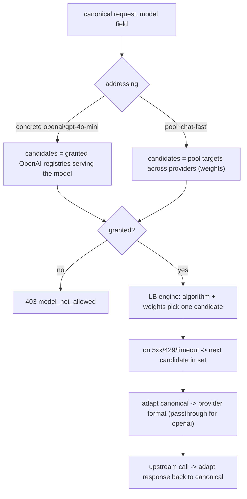
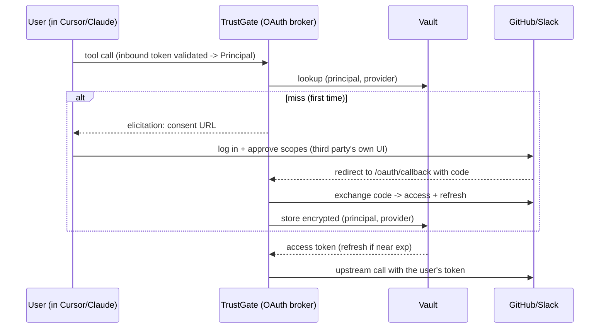

# Roles & Consumer Access

**Product:** TrustGate (Agent Gateway)
**Feature:** Reusable **Roles** (grant bundles across LLM providers/models and MCP servers/tools) bound to Consumers; inline upstream binding; request-time, model-addressed routing over a canonical OpenAI-compatible API; cross-provider load balancing via **Model Pools**. Authentication is decoupled; downstream per-user credential federation (OBO / vaulted OAuth) is captured as the future end-state.
**Status:** Draft
**Version:** 4.0 — supersedes v3.0

> Filename note: this file is historically `consumer-identity-federation-spec.md`. The scope changed across versions: identity federation is **decoupled** (§3) and the feature is now Roles + Consumer access + routing. The legacy filename is kept to preserve history.

---

## 0. What changed from v3

v3 introduced Roles + decoupled auth. v4 folds in the routing/auth detail worked out since:

- **Cross-provider load balancing via Model Pools (§4, §5).** The `provider/model` addressing of v3 only balanced *within* one provider. v4 adds a logical **Model Pool** (alias → multiple provider/model targets + weights) so `model: "chat-fast"` balances across providers. Both addressing modes are supported: concrete `provider/model` and logical pool name.
- **Authentication reference (Appendix A).** Who issues which token, how TrustGate validates a JWT (JWKS, no secret needed), Okta vs Entra specifics, and how claims are read. This is the decoupled/Phase-2 layer, captured for completeness.
- **Downstream credential modes (§7).** v1 downstream stays none/static. The enterprise end-state — **OBO** (Entra exchange) and **forwarded/vaulted OAuth** (GitHub/Slack) — is documented with the new **Vault** entity, OAuth broker endpoints, and a Connections page. This is epic Phase 4 and remains out of the v1 build.

---

## 1. Concepts

### Role — the one authorization primitive

A reusable, gateway-scoped grant bundle spanning both resource kinds.

```go
// pkg/domain/role/ (new)
type Role struct {
    ID        ids.RoleID
    GatewayID ids.GatewayID
    Name      string
    LLM  []LLMGrant   // grants for LLM providers/models or Model Pools
    MCP  []MCPGrant   // grants for MCP servers/tools (MCP half rides epic Phase 2)
    Active bool
}

type LLMGrant struct {
    Provider string   // e.g. "openai" — matches Registry.Provider; or "" when PoolID set
    Models   []string // explicit model names, or ["*"] for all of that provider's models
    PoolID   *ids.ModelPoolID // optional: grant a logical Model Pool instead of a concrete provider
}

type MCPGrant struct {
    ServerID ids.RegistryID // an MCP backend (epic Phase 2 backend.Type=MCP)
    Tools    []string       // explicit tool names, or ["*"] for the whole server
}
```

### Two ways a Consumer gets access

1. **Bind a Role** — `consumer.role_ids []ids.RoleID`. Reusable across consumers; edit once, applies everywhere.
2. **Inline upstream bind** — configure an upstream directly on the Consumer. **Sugar that materializes a shared `Registry` under the hood** (one routing/health/LB/fallback path) and adds an equivalent grant.

**Consumer effective grants** = `union(bound roles) ∪ inline binds`. Grants are **additive (most-permissive wins)**; there is no deny mechanism in this iteration.

---

## 2. Mapping to the current codebase

| New concept | Generalizes / reuses |
|---|---|
| `LLMGrant` (provider + models) | `Consumer.model_policies` (`map[RegistryID]{allowed, default}`) promoted to a reusable, `provider/model`-addressed grant |
| `Model Pool` (alias → targets) | the consumer registry pool + `algorithm`/`weights`/`fallback`, extracted into a reusable, named, cross-provider entity |
| `MCPGrant` (server + tools) | the epic's virtual-MCP **toolkit** (`{backend, tool, expose_as}`), as a grant rather than a static composition |
| Inline upstream bind | today's `consumer_registry` attach + `model_policies`, with the `Registry` auto-created |
| Canonical inbound + `provider/model` routing | the existing provider **adapters** (`pkg/infra/providers/adapter/`) and `X-Provider` hinting — the model string replaces the header as the routing key |
| LB among candidates | the existing forwarder **LB / weights / fallback** (`pkg/app/proxy/forwarder.go`) — unchanged engine, new candidate set |

Net new: the `Role` aggregate, the `ModelPool` aggregate, the grant-resolution step, and the model-string router. The MCP half additionally depends on the epic's MCP backend entity + tool introspection (Phase 2).

---

## 3. Authentication is decoupled

Authentication is a separate, existing concern, **not** changed by this spec (detail in Appendix A):

- A Consumer lists accepted auth methods via `auth_ids` (`api_key` / `oauth2` / `mtls`). SSO is an `oauth2` method (real OIDC/JWKS validation is epic Phase 1).
- Auth answers **"may this caller reach this Consumer."** Roles answer **"what can requests through this Consumer access."**
- **All authenticated callers through a Consumer share the same effective grants.** No per-caller differentiation in this iteration (deferred, §11). Practically: to give two teams different access, use two Consumers.

---

## 4. Request-time resolution & routing

### LLM — two addressing modes

Inbound is a **canonical OpenAI-compatible** payload. The `model` field resolves a **candidate set** of registries; the existing LB engine then picks one. Two forms:

- **Concrete** `"<provider>/<model>"` (e.g. `openai/gpt-4o-mini`) → candidates = granted registries of that provider serving that model. LB is **intra-provider** (e.g. two OpenAI accounts/regions); fallback stays within that provider. The caller pinned the provider.
- **Logical pool** `"<pool-name>"` (e.g. `chat-fast`) → candidates = the Model Pool's targets, which may **span providers**. LB + weights + fallback operate **across providers**. This is where cross-provider balancing lives.



The LB engine in `forwarder.go` is unchanged; only the **candidate set computation** changes — from "all registries in the consumer pool" to "registries matching the resolved model target."

### MCP (rides epic Phase 2)

- `tools/list` returns the **union of granted tools** across the Consumer's effective MCP grants.
- `tools/call` resolves the called tool to its **owning server** and routes only there.
- **Tool-name collisions** across servers (granted by different roles) are resolved by **auto-prefixing `{server}_{tool}`** (mirroring the epic toolkit). `MCPGrant` has no `expose_as`; explicit aliasing is deferred.

---

## 5. Model Pool (cross-provider routing)

A first-class, reusable logical model. Separates **physical upstream (Registry)** from **logical routing target (Model Pool)** from **authorization (Role)**.

```go
// pkg/domain/modelpool/ (new)
type ModelPool struct {
    ID        ids.ModelPoolID
    GatewayID ids.GatewayID
    Name      string          // the public/logical model name, e.g. "chat-fast"
    Targets   []PoolTarget    // cross-provider fan-out
    Algorithm string          // round-robin | weighted | least-connections | random | semantic
    Fallback  *Fallback       // failover policy for this pool
}

type PoolTarget struct {
    Provider string // or RegistryID
    Model    string // the provider-native model name, e.g. "gpt-4o-mini" / "claude-haiku"
    Weight   int
}
```

- Registries stay **physical** (provider + `TargetAuth` + health). A Pool references provider/model targets with per-target weights and owns `algorithm`/`fallback`.
- The Consumer's existing `algorithm`/`weights`/`fallback` remain the **defaults** for concrete addressing and when no pool is named.
- Roles grant pools (`LLMGrant.PoolID`) and/or concrete providers — both forms coexist.
- **Decision (recommended, to confirm):** adopt Model Pool as its own entity rather than overloading Role (keeps Role = pure authorization) or the Consumer (can't map a logical name to *different* model names per provider). Matches the proven `model alias → deployments` pattern (LiteLLM/Portkey). Naming TBD with Design (`Model Pool` / `Virtual Model` / logical `Model`).

---

## 6. UI

### Roles (new management surface)
List + create/edit panel: **LLM grants** (provider rows with model multi-select, or a Model Pool reference) and **MCP grants** (server rows with tool multi-select via admin tool-introspection). Columns: NAME · LLM summary · MCP summary · STATUS.

### Model Pools (new)
List + create/edit: logical name, cross-provider targets with weights, algorithm, fallback. Surfaces the alias used in the `model` field.

### Consumer — Access area
- **Roles:** bind/unbind existing Roles.
- **Inline upstream:** add an upstream directly (materializes a `Registry` + grant).
- **Effective access** read-out: resolved union of providers/models/pools and servers/tools.
The existing Routing/Model-policies tabs fold into this Access area.

### Model addressing
Canonical `model` is `provider/model` (concrete) or `pool-name` (logical). Playground (`playground-view.tsx`) and docs show both.

### Connections (future — §7)
A page listing each user's linked third-party accounts (GitHub/Slack) with connect/revoke. Only needed when the forwarded downstream mode lands (Phase 4).

---

## 7. Downstream credential modes

How TrustGate authenticates to the **upstream** when serving a request. The inbound caller credential never reaches the upstream unchanged unless audiences match.

### v1 (in scope)
- **none** — public upstream, no `Authorization`.
- **static** — the gateway's own shared credential (Registry `TargetAuth`), e.g. the upstream OpenAI key. No end-user identity reaches upstream.

### Future (epic Phase 4 — out of v1 build)

Per-user identity to the upstream, on a spectrum of fidelity:

- **passthrough** — re-inject the inbound JWT. Only valid when the upstream shares the same `aud` (anti-pattern otherwise; not usable for SSO tokens whose `aud` is the gateway).
- **exchange / OBO (Entra)** — the IdP mints a downstream token preserving the user (`oid`), re-targeting `aud` to the resource (e.g. Graph). Used when the downstream trusts the corporate IdP. Token is **cacheable/re-derivable** from the inbound token; no durable store needed.
- **exchange (Okta, RFC 8693)** — equivalent token exchange for Okta-trusting downstreams.
- **impersonation / delegation** — TrustGate's own STS mints the token (gateway as issuer); upstream trusts TrustGate's JWKS.
- **forwarded / vaulted (GitHub, Slack, …)** — third parties **not** in the corp IdP trust domain. The **user consents once** via the third party's own OAuth; tokens are stored in a durable encrypted **Vault** and injected on every call.

### OBO flow (Entra → Graph), summary

Inbound token `T1` (`aud = gateway`) → gateway calls Entra `grant_type=jwt-bearer`, `requested_token_use=on_behalf_of`, `assertion=T1`, `scope=graph/.default` → `T2` (`aud = Graph`, same `oid`, `azp = gateway`) → call upstream with `T2`. Requires `T1.aud = gateway` (guaranteed by the Phase 3 OAuth challenge). Cache `T2` keyed by `(oid, resource, gateway)`.

### Forwarded/vaulted flow (GitHub/Slack), summary



**Who authenticates:** the **user** authenticates with the third party (their own account). TrustGate is only the OAuth **client** (admin-registered `client_id`/`secret`); it cannot log in as the user. First use is interactive (consent); afterwards TrustGate uses the vaulted token silently (auto-refresh) until refresh fails / consent revoked / scopes change.

### Vault entity (Phase 4)

```go
// pkg/domain/vault/ (new) — durable, encrypted, per (gateway, principal, provider)
type VaultedCredential struct {
    ID           ids.VaultID
    GatewayID    ids.GatewayID  // the tenant boundary (Gateway = tenant)
    PrincipalSub string         // user's oid/sub
    Provider     string         // "github" | "slack" | ...
    AccountRef   string         // linked account, for display
    AccessToken  Secret         // encrypted at rest
    RefreshToken Secret         // encrypted at rest — irreplaceable (consent-derived)
    Scopes       []string
    ExpiresAt    time.Time
    CreatedAt, UpdatedAt time.Time
}
```

- **Durable, not a cache:** unlike OBO tokens (re-mintable from `T1`), forwarded refresh tokens come from one-time user consent and cannot be re-derived — losing them forces re-consent. Hence a persistent encrypted store, distinct from admin-managed `Auth`/`TargetAuth`.
- **Security:** encrypted at rest via KMS/secret manager; strict `(gateway, principal)` isolation (a leak is cross-user account takeover); revoke = delete row (+ provider revoke).
- **Supporting surface:** OAuth broker endpoints `/oauth/connect/{provider}` (302 to the third party) and `/oauth/callback/{provider}` (exchange + store + confirmation page), plus the Connections page (§6). The login/consent UI is always the third party's — TrustGate builds no login forms.

---

## 8. Dependencies & sequencing

- **LLM half ships on today's stack.** Roles (LLM grants), Model Pools, inline binds, canonical payload, `provider/model` + pool routing, and adapter translation build on existing registry/forwarder/adapter code. No MCP plane required.
- **Authentication (SSO/JWT validation)** = epic **Phase 1** (Appendix A). Today only API keys are validated at runtime.
- **MCP half** = epic **Phase 2** (MCP backend entity + tool introspection + data plane).
- **Downstream per-user credentials (OBO/vault)** = epic **Phases 3-4**; out of the v1 build.

Suggested slices: (1) `Role` + `consumer_role` + bind UI + grant resolution (LLM); (2) `ModelPool` + the model-string router + canonical-payload contract; (3) inline-bind sugar; (4) MCP grants on Phase 2; (5) downstream OBO + Vault on Phases 3-4.

---

## 9. Open decisions

1. **Model Pool entity (§5)** — confirm adopting it as a first-class entity (recommended) vs on Role vs on Consumer.
2. **Provider addressing** — `openai/` = provider type (LB among the consumer's `openai` registries — recommended) vs a specific named registry. Confirmed: **both** concrete and pool addressing are supported.
3. **Bare model strings** — is the `provider/`/pool prefix mandatory, or does a bare `gpt-4o-mini` resolve via a per-consumer default? Recommend prefix-optional with a default.
4. **Roles / Model Pools surface placement** — top-level nav vs tabs under Auth.
5. **Inline bind vs Role overlap** — recommend treating inline as "create-and-bind a Role" under the hood for one mental model.
6. **Canonical surface scope** — chat completions only, or also embeddings/responses? And keep a **native passthrough** escape hatch (today's `X-Provider`) so provider-native features aren't lost to lossy translation.

---

## 10. Scope exclusions (this iteration)

- **Per-user / claim-based authorization** (old Identity Mappings) — deferred (§11).
- **Consumer kind, Groups gate, per-user sessions, Simulate access** — removed.
- **Downstream per-user credentials** (passthrough/OBO/impersonation/forwarded-vault), the **Vault**, OAuth broker, Connections page — documented (§7) but **out of the v1 build** (epic Phases 3-4).
- **MCP grant aliasing (`expose_as`)** — collisions auto-prefixed; explicit aliasing deferred.

---

## 11. Future notes

- **Re-introducing identity federation.** Per-user access returns as a thin **claim → Role binding** resolved from the authenticated `Principal`, layered onto the Consumer's base grants — the only new piece on top of Roles. Keeps "the user's role decides access" reachable without committing now.
- **Roles / Model Pools as extraction units.** Reusable, caller-decoupled, gateway-scoped — clean to lift into a future identity/authorization product.

---

## Appendix A — Authentication reference (decoupled; epic Phase 1)

### Who creates which token

| Credential | Created by | TrustGate role |
|---|---|---|
| API key (`X-AG-API-Key`, `ag_...`) | **TrustGate** (admin generates; stores only the hash) | issuer + validator |
| SSO / OAuth2 Bearer (JWT) | **corporate IdP** (Okta/Entra/Auth0) | **validator only** |
| mTLS client cert | a **CA** | validator |
| Admin/dashboard JWT (HS256) | **TrustGate admin plane** (control plane) | issuer + validator |

For an app backend calling the LLM gateway: inbound is typically the **TrustGate-issued API key**, or an **IdP-issued M2M token** (client-credentials) if the Consumer's auth is `oauth2`. The upstream provider key (`sk-...`) is created by the **provider** and stored on the Registry; the app never sees it.

### Validating a JWT — no secret needed

Okta/Entra sign with **RS256 (asymmetric)**. TrustGate validates with the IdP's **public** key from JWKS — no shared secret. The `client_secret` lives in the *app* (to obtain the token), not in TrustGate. A secret is only needed for **opaque-token introspection** (RFC 7662), where TrustGate authenticates its call to the IdP's introspection endpoint.

Validation steps: fetch key by `kid` from cached JWKS (refresh on unknown `kid`) → verify signature + `alg` allowlist → check `iss`, `aud` (any of configured), `exp`/`nbf` (+leeway) → check `required_scopes` → build `Principal`. Returns three states — Absent / Invalid / Valid — to enforce **anti-downgrade** (present-but-invalid → 401, never fall through to a weaker method).

### Okta vs Entra specifics (per-IdP claim mappers)

| Concern | Okta | Entra |
|---|---|---|
| Issuer | fixed org/AS URL | `login.microsoftonline.com/{tid}/v2.0` — embeds tenant; multi-tenant uses an issuer *pattern* |
| Audience | `api://...` | `api://{app-id-uri}` or app client-ID GUID |
| Subject | `sub` | prefer **`oid`** (+ `tid`) |
| Delegated scopes | `scp` (array) | `scp` (**space-delimited string**) |
| M2M (client creds) | scopes in `scp` | **no `scp`** — app permissions in **`roles`** |
| Groups | names (if mapped) | **GUIDs**, with overage indirection |

Downstream of validation, everything (Role resolution, routing, adapters) keys off the resolved `Principal`, so it is **IdP-agnostic** — the quirks live in per-IdP mappers, not the core validator.

### Reading claims

A JWT is `header.payload.signature`; the payload is base64url JSON — the claims. After validation they are a map (`sub`/`oid`, `scp`/`roles`, `groups`, `email`, `exp`, …). Claims are readable by anyone (signed, not encrypted), so they are only trusted **after** signature/`iss`/`aud`/`exp` validation. The decoded claims are what the future claim→Role layer and trace attribution ("Acting as") consume — decoded claims only, never the raw token.
```
