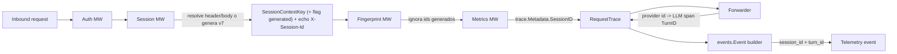

# RUN-275 — Identificador canónico de conversación cross-provider (`session_id`)

> ADR / resultado del spike. Fases 1, 2 y 3 implementadas en AgentGateway.
> Issue: [RUN-275](https://linear.app/neuraltrust/issue/RUN-275/spike-conversation-id-cross-provider) · Parent: RUN-279 · Relacionadas: [RUN-320](https://linear.app/neuraltrust/issue/RUN-320) (implementación), [RUN-287](https://linear.app/neuraltrust/issue/RUN-287) (session store).

## 1. Qué pide la issue

- Mapear el id nativo de turno/sesión de cada provider (OpenAI `response.id` + `previous_response_id`, handles de Anthropic, history tokens de Gemini, sesiones de Bedrock Converse, etc.) a un `conversation_id` canónico que sobreviva entre providers, para que trazas, sesiones y analítica conversacional cuadren independientemente del backend que sirvió la llamada.
- Decidir dónde se genera el id (cliente vs gateway vs derivado del provider) y cómo se propaga aguas abajo (cache, métricas, telemetría, tracing).
- Documentar trade-offs (privacidad, replay, retención, colisión cross-tenant).
- Entregables: ADR/design note + lista de follow-ups. Fuera de scope: la implementación (es un spike).

## 2. Decisión

**El identificador canónico es `session_id`.** Se descarta `conversation_id` como concepto separado: era redundante con el `session_id` que ya circulaba por `trace.Metadata` y la telemetría. Se añade un segundo campo, **`turn_id`**, para el id nativo por respuesta de cada provider.

- **`session_id`** — clave estable y cross-provider para agrupar una conversación multi-turno. La **posee/genera el gateway**, nunca se deriva del provider, por eso sobrevive a cambios de provider/backend/región.
- **`turn_id`** — id por respuesta del provider para un turno concreto (OpenAI Chat `chatcmpl-*`, OpenAI Responses `resp_*`, Anthropic `msg_*`, Gemini `responseId`, …). Observabilidad/debug + base para la continuación nativa (Fase 3).

> Nota de naming: esto **supersede** el planteamiento original de la issue (`conversation_id`). El campo canónico en todo el sistema es `session_id`.

## 3. Dónde se genera (estrategia híbrida)

1. **Aportado por el cliente** vía header (configurable por gateway en `SessionConfig.HeaderName`, **default `X-Session-Id`**) o body param (`SessionConfig.BodyParamName`).
2. Si no llega ninguno, el gateway **genera un UUIDv7** (time-ordered) y lo devuelve en el header de respuesta **`X-Session-Id`** para que clientes cooperativos lo adopten en el siguiente turno.
3. La resolución está **activa por defecto**. `SessionConfig.Enabled = false` es el opt-out del operador (ni se resuelve ni se genera ni se hace echo).

El orden de middlewares (`Auth -> Session -> FingerPrint -> Metrics`, en `pkg/container/modules/server_proxy.go`) garantiza que el valor sellado por Session es visible para Fingerprint, Metrics y el forwarder sin reordenar nada.

## 4. Propagación

- El **session middleware** sella `session_id` en `c.Locals` y en el `context.Context` (`infracontext.SessionContextKey`) y, si fue generado, marca `SessionGeneratedContextKey`.
- **Metrics MW** lee `SessionContextKey` y lo pone en `trace.Metadata.SessionID`.
- El **builder** vuelca `trace.Metadata.SessionID` al evento `session_id`.
- El **`turn_id`** se captura de la respuesta canónica del provider:
  - Síncrono: `providerInvoker.Invoke` decodifica `CanonicalResponse.ID` → `ProviderResponse.ResponseID` → `forwarder.recordSpan` lo fija en `span.LLM.TurnID`.
  - Streaming: el `streamObserver` llama a `RequestTrace.ObserveLLMTurnID(chunk.ID)` (el id llega en el chunk de cierre / primero).
  - El builder vuelca `served.TurnID` al evento `turn_id`.
- Métricas/analítica agrupan por **`(gateway_id, session_id)`**.

## 5. Trade-offs

- **Privacidad/retención:** `session_id` es un UUID opaco, sin PII. La retención/TTL la gestionará el session store (RUN-287); para puro agrupado en métricas no hace falta store.
- **Colisión cross-tenant:** se evita namespaciando toda clave/lookup con `gateway_id` (clave del store `session:{gatewayID}:{sessionID}`; agrupado por `(gateway_id, session_id)`).
- **Replay/forgery:** un `session_id` aportado por el cliente se usa **solo para agrupar**, nunca para auth. Los ids **generados por el gateway se excluyen del fingerprint** para no convertir cada request anónimo en único (lo que rompería el tracking de clientes anónimos). Los ids aportados por el cliente sí alimentan el fingerprint, como antes.
- **Continuación de provider:** mapear `session_id → último turn_id` habilita `previous_response_id` (OpenAI Responses) y equivalentes; diferido a Fase 3 (RUN-320), requiere el store (RUN-287).
- **Cambio de comportamiento:** gateways sin `SessionConfig` pasan a resolver/generar `session_id` por defecto (antes estaba off). El opt-out es `Enabled=false`. No requiere migración de BD (`SessionConfig` se persiste como JSON en el gateway).

## 6. Qué se ha implementado (Fase 1)

| Área | Fichero | Cambio |
|---|---|---|
| Context key | `pkg/infra/context/context_keys.go` | `SessionGeneratedContextKey` |
| Resolución | `pkg/api/middleware/session.go` | default-on, header default `X-Session-Id`, UUIDv7 + echo, flag generated |
| Fingerprint | `pkg/infra/fingerprint/tracker.go` | excluye ids generados por el gateway |
| Evento | `pkg/infra/metrics/events/event.go` | quita `conversation_id`, añade `turn_id` |
| Builder | `pkg/app/metrics/builder.go` | quita lookup de `X-Conversation-Id`; `session_id` desde metadata; `turn_id` desde span |
| Trace | `pkg/infra/trace/span.go`, `trace.go` | `LLMAttrs.TurnID`, `SetTurnID`, `RequestTrace.ObserveLLMTurnID` |
| Provider | `pkg/app/proxy/provider.go` | `decodeResponseMeta` devuelve `ID`; `ProviderResponse.ResponseID`; observer de stream captura `chunk.ID` |
| Forwarder | `pkg/app/proxy/forwarder.go` | `recordSpan` fija `span.LLM.TurnID` (path síncrono) |
| Tests | `session_test.go`, `builder_test.go`, `tracker_test.go`, `forwarder_test.go`, `provider_stream_test.go` | cobertura de resolución, generación+echo, exclusión de fingerprint, `turn_id` sync+stream |

### 6.1 Fase 2 — Session store (RUN-287)

| Área | Fichero | Cambio |
|---|---|---|
| Dominio | `pkg/domain/session/{session.go,repository.go}` | entidad `Session` (last_turn_id, provider, model, TTL) + `Repository` |
| Infra | `pkg/infra/repository/session/repository.go` | repo Redis directo (no usa el cache local, alta cardinalidad), clave `session:{gatewayID}:{sessionID}`, TTL por entrada |
| App | `pkg/app/session/service.go` | `Store` (`Record` best-effort + `LastTurnID`), TTL configurable, opt-out |
| Config | `pkg/config/config.go` | `SessionStore{Enabled,TTL}` (`SESSION_STORE_ENABLED`, `SESSION_STORE_TTL`, default on / 1h) |
| DI | `pkg/container/modules/session.go` | provee repo + service + `Store` |
| Recording | `pkg/app/proxy/forwarder.go` | persiste `session -> turn_id` tras éxito (sync en `finalize*`, stream al terminar el stream) |
| Tests | `repository_test.go` (miniredis: roundtrip, namespacing, TTL/eviction), `service_test.go` | |

### 6.2 Fase 3 — Continuación nativa (RUN-320)

| Área | Fichero | Cambio |
|---|---|---|
| Request ctx | `pkg/infra/context/request_context.go` | `PreviousResponseID` |
| Stamp | `pkg/app/proxy/forwarder.go` | `stampContinuation` resuelve el último `turn_id` y lo pone en el request |
| Inyección | `pkg/app/proxy/provider.go` | `injectPreviousResponseID`: solo formato OpenAI Responses, solo ids `resp_*`, nunca pisa un valor del cliente |
| Tests | `provider_continuation_internal_test.go`, forwarder (`StampsContinuation`) | |

Guardia de correctness: la continuación solo se aplica si (a) el formato destino es OpenAI Responses y (b) el `turn_id` guardado tiene forma `resp_*`. Así un id de otro provider (`chatcmpl-*`, `msg_*`) nunca se thread-ea por error a un request incompatible.

## 7. Notas operativas

- **TTL / eviction:** cada entrada se escribe con `EXPIRE` (default 1h, `SESSION_STORE_TTL`); Redis hace la eviction. El store es Redis directo para no inflar el cache en proceso con claves de alta cardinalidad.
- **Best-effort:** `Record` nunca rompe un request (errores a `debug`, contexto desacoplado + timeout). `LastTurnID` devuelve `""` ante miss/error.
- **Opt-out:** `SESSION_STORE_ENABLED=false` desactiva recording y continuación (el resolver devuelve `""`, no se inyecta nada).

## 8. Tabla de ids nativos por provider (referencia para `turn_id`)

| Provider / formato | Campo respuesta (id de turno) | Continuación nativa |
|---|---|---|
| OpenAI Chat Completions | `id` (`chatcmpl-*`) | no (stateless) |
| OpenAI Responses | `id` (`resp_*`) | `previous_response_id` |
| Anthropic Messages | `id` (`msg_*`) | no (reenvía historial) |
| Gemini | `responseId` | no (reenvía `contents`) |
| Bedrock Converse | id de respuesta / sesión | sesiones Converse |

Todos exponen `CanonicalResponse.ID` / `CanonicalStreamChunk.ID` en la capa `adapter`, que es de donde se extrae el `turn_id`.
