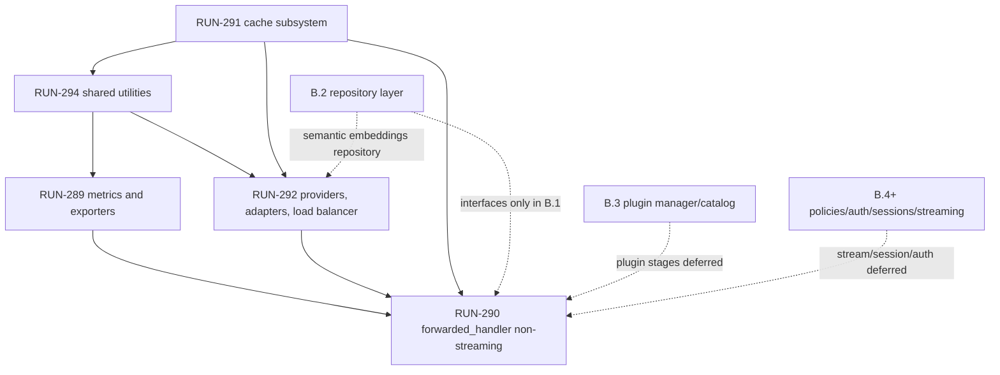

# RUN-280 Explore: Port Reusable TrustGate Components

## Executive Summary

RUN-280 should proceed as a phased B.1 port that preserves TrustGate semantics while introducing thin AgentGateway adapters for logging, env config, DI wiring, and package boundaries. The largest risk is not algorithmic change; it is dependency drag from TrustGate hot-path code into AgentGateway's current B.0 skeleton, especially plugin/repository/session/streaming references that belong to later B.x slices.

Source reviewed:

- AgentGateway conventions: `.agents/AGENT.md`, `go.mod`, `cmd/agentgateway/main.go`, `pkg/config/config.go`, `pkg/container/modules/*`, `pkg/server/*`, `pkg/server/router/proxy_router.go`, `pkg/api/middleware/*`.
- TrustGate sources listed in RUN-289, RUN-290, RUN-291, RUN-292, RUN-294, plus `pkg/infra/prometheus/` and `pkg/infra/auditlogs/` because they were explicitly called out as possible shared utilities.
- No builds or tests were run.

## Sub-Issue Summary Table

Approximate LoC is from `wc -l` on the listed TrustGate Go files. Counts include tests where they are part of the source path inventory; notes call out production-only pressure where relevant.

| RUN | Origin TrustGate paths | Target AgentGateway paths | Approx. files / LoC | Key dependencies | Notes / anomalies |
|---|---|---|---:|---|---|
| RUN-289 | `pkg/infra/metrics/`, `pkg/infra/metrics/metric_events/`, `pkg/infra/telemetry/{kafka,trustlens,detection}` | `pkg/api/middleware/metrics.go`, `pkg/infra/metrics/`, `pkg/infra/telemetry/`, `pkg/container/modules/telemetry.go`, possibly `pkg/infra/prometheus/` | 15 files / ~1,960 LoC; production subset ~11 files / ~1,420 LoC | `logrus`, TrustGate app/domain telemetry interfaces, `types`, `fingerprint`, `prometheus/client_golang`, Confluent Kafka, `event-schemas`, plugin decision types | TrustLens and detection exporters do exist. Kafka and TrustLens are natural B.1 metrics/exporter scope; detection exporter depends on plugin decisions and `event-schemas`, so confirm whether it is in B.1 or deferred with plugin manager work. |
| RUN-290 | `pkg/handlers/http/forwarded_handler.go`, `pkg/handlers/http/helpers/*`, `pkg/handlers/http/request/*`, `pkg/handlers/http/response/*` | `pkg/api/handler/http/forwarded_handler.go`, `pkg/api/handler/http/request/`, `pkg/api/handler/http/response/`, `pkg/server/router/proxy_router.go`, shared support in `pkg/infra/httpx/` | 20 files / ~2,960 LoC; core handler is 1 file / 1,077 LoC | Fiber, `fasthttp`, cache, metrics, load balancer, providers/adapters, auth helpers, TLS helpers, plugin manager, app rule/upstream finders, domain upstream/types, prometheus, usage extraction | Non-streaming is in scope, but current handler interleaves streaming channels, plugin stages, metrics, provider adaptation, TLS/proxy handling, and error passthrough. Streaming, plugin manager/catalog, auth/session policies, and repository resolution create B.3/B.4/B.2 pressure. |
| RUN-291 | `pkg/infra/cache/`, `pkg/infra/cache/{channel,event,subscriber}` | `pkg/infra/cache/`, `pkg/container/modules/cache.go`, `pkg/config/config.go` Redis section | 22 production files / ~1,150 LoC; 23 files if the mock is counted | `go-redis/redis/v8`, `logrus`, domain `apikey` and `upstream`, Redis pub/sub, reflection event registry, RediSearch vector index commands | AgentGateway already has `RedisConfig` but no TLS flag yet. Domain-specific cache methods (`GetApiKey`, `GetUpstream`) should not force concrete infra imports into `pkg/domain` or `pkg/app`; interfaces should be consumed from app/domain later. |
| RUN-292 | `pkg/infra/providers/{anthropic,azure,bedrock,google,mistral,openai,vertex}`, `pkg/infra/providers/adapter/`, `pkg/infra/providers/factory/`, `pkg/infra/loadbalancer/` | `pkg/infra/providers/`, `pkg/infra/providers/adapter/`, `pkg/infra/loadbalancer/`, `pkg/infra/embedding/`, `pkg/container/modules/backend.go` or a dedicated providers module | 50 files / ~11,550 LoC; adapters are the largest slice | AWS SDK v2, Azure SDK, `mapstructure`, net/http, `fasthttp`, provider DTOs, domain upstream errors, embedding repository/service locator, Redis-backed health state | This blows past the 400 changed-line review budget by itself. Semantic load balancing requires embedding repository support, which is B.2/repository-shaped unless introduced behind an interface. Streaming methods exist on provider clients but should remain dormant for B.1. |
| RUN-294 | `pkg/infra/fingerprint/`, `pkg/infra/crypto/`, `pkg/infra/embedding/factory`, `pkg/infra/httpx`, `pkg/infra/prometheus`, `pkg/infra/auditlogs` | `pkg/infra/fingerprint/`, `pkg/infra/crypto/`, `pkg/infra/embedding/`, `pkg/infra/httpx/`, `pkg/infra/prometheus/`, optional `pkg/infra/auditlogs/` | 22 files / ~3,370 LoC across reviewed utilities; excludes generated mocks not read | Redis, Fiber, `fasthttp`, `brotli`, `zstd`, Prometheus, `audit-sdk-go`, `logrus`, TrustGate `common`, TrustGate `types`, plugin/context helpers | RUN-294 has an archivedAt anomaly while still treated as in scope. `audit-sdk-go` glue exists in `pkg/infra/auditlogs`, but it is admin/control-plane audit oriented and not obviously hot-path B.1. `httpx` includes streaming helpers; split non-streaming/decompression/client pieces from streaming pieces. |

## Dependency Graph and Natural Order

Natural implementation order:

1. RUN-294 minimal shared utilities needed by other slices: `crypto`, non-streaming `httpx` client/decompression, `prometheus` if metrics use it, and pure fingerprint ID helpers before Fiber/Redis tracker pieces.
2. RUN-291 cache core: Redis client, TLS/env mapping, TTL maps, pub/sub event interfaces, and invalidation subscribers.
3. RUN-289 metrics/exporters: collector, metric events, worker, Kafka exporter, then decide TrustLens/detection exporter inclusion.
4. RUN-292 providers/adapters/load balancer in smaller reviewable slices: adapters first, provider clients second, load balancer strategies third, semantic strategy last if B.2 dependencies are available.
5. RUN-290 forwarded handler non-streaming after its collaborators exist, with streaming/plugin/session/auth seams kept out of B.1 behavior where possible.

## Affected Areas Map

AgentGateway directories aligned to `.agents/AGENT.md`:

| AgentGateway area | Expected B.1 pressure | Boundary assessment |
|---|---|---|
| `pkg/api/handler/http/` | New `forwarded_handler` plus request/response DTOs used by the proxy route. | Valid Fiber boundary. Keep handler orchestration here; avoid moving proxy logic into `pkg/domain` or `pkg/app`. |
| `pkg/api/middleware/` | Metrics middleware can attach a collector to Fiber locals; existing middleware pattern returns `fiber.Handler`. | Valid API boundary. Use `slog` attrs, not `logrus`, and register only in proxy transport unless admin needs it. |
| `pkg/server/router/` | Proxy router must route catch-all traffic to forwarded handler after health probes. | Valid server boundary. Do not let provider/cache details leak into router constructors. |
| `pkg/infra/cache/` | Redis client, TTL map, pub/sub listener/publisher, index creator. | Correct location. Cache package may import config/common errors; domain-specific serialization should be isolated or moved behind later app/domain interfaces. |
| `pkg/infra/metrics/` and `pkg/infra/telemetry/` | Collector, worker, metric event types, exporter locator, Kafka-based exporters. | Correct location. Worker lifecycle should be owned by DI/server shutdown, not background goroutines without a stop path. |
| `pkg/infra/providers/` and `pkg/infra/loadbalancer/` | Provider clients, canonical adapters, provider locator, strategies. | Correct location. Semantic load balancer creates repository pressure; keep repository as an injected interface and avoid concrete `pgx`/DB imports here. |
| `pkg/infra/httpx/`, `pkg/infra/crypto/`, `pkg/infra/fingerprint/`, `pkg/infra/prometheus/` | Shared utilities that other infra packages consume. | Correct location. `fingerprint/tracker.go` imports Fiber and Redis, so it is middleware/infra-adjacent, not a pure domain utility. |
| `pkg/config/` | Env-only additions for Redis TLS, Kafka exporter topics, metrics toggles, upstream timeouts, encryption key, provider defaults if needed. | Must remain env-only. No Viper/YAML config should be ported. |
| `pkg/container/modules/*` | Wire cache, telemetry, providers/backend, metrics middleware, proxy handler. | Correct DI location. Preserve one module per context and named proxy/admin transports. |
| `pkg/domain/` | May need pure value objects later for gateway/upstream/rule/provider DTOs. | Do not import infra, Fiber, Redis, provider SDKs, or `pgx`. Any pressure here is a design blocker for propose/design. |
| `pkg/app/` | May need use-case interfaces for upstream/rule lookup in RUN-290. | Keep infra-free. If B.1 needs app interfaces before B.2 repositories exist, define narrow consumed interfaces and supply temporary infra adapters only in `pkg/infra`/DI. |

Pressure to flag: TrustGate's `forwarded_handler` currently imports app services, domain structs, infra packages, plugin manager, metrics, providers, TLS/auth helpers, and `types` directly. A literal package copy would drag too much into `pkg/api/handler/http`; the port should preserve semantics but use AgentGateway boundaries and thin adapters.

## Cross-Stack Adapter Inventory

| Concern | TrustGate origin | AgentGateway convention | B.1 adapter action |
|---|---|---|---|
| Logging | Heavy `github.com/sirupsen/logrus` usage across metrics, cache, load balancer, embeddings, providers, audit logs, handler helpers. | `log/slog` via `pkg/infra/logger`, named attrs. | Replace constructor dependencies with `*slog.Logger` and translate `WithField(s)` calls to named attrs. Avoid carrying `logrus` into AgentGateway unless explicitly accepted as a temporary shim. |
| Config | TrustGate `config.Config` includes nested upstream/plugin/Kafka/metrics/TLS/audit config and uses non-env patterns in the wider repo. Provider options use `mapstructure`. | Env-only `pkg/config.LoadConfig`; `.env` loaded by `godotenv`; no YAML/TOML/JSON config. | Add only env fields needed by B.1: Redis TLS/DB, Kafka settings, metrics toggles, upstream timeouts/error passthrough, encryption key. Keep per-target provider options as request/domain data, not process config. |
| Database | TrustGate repository/migration paths use `gorm` and GORM migrations. Reviewed B.1 paths touch GORM only indirectly through app/domain lookup interfaces and semantic embedding repository. | `pgx/v5`, in-code migrations, repository layer deferred to B.2. | Do not port GORM or migrations for B.1. Define narrow interfaces for upstream/rule/embedding lookup and wire real `pgx` implementations in B.2. Semantic load balancing may need to wait or use an interface with no concrete DB dependency. |
| CLI | TrustGate `cmd/gateway/main.go` uses argv server selection; no B.1 source path requires Cobra. | `./agentgateway admin|proxy`, simple `os.Args`. | No Cobra adapter needed. Keep argv/no CLI framework. |
| HTTP server/client | TrustGate hot path uses Fiber + `fasthttp`, plus net/http for streams/provider clients. | AgentGateway already uses Fiber v2 and tuned `fasthttp` server settings. | Reuse non-streaming `fasthttp` behavior and `httpx` decompression/client utilities. Defer stream response handling except where method signatures require compatibility. |
| Prometheus/exporters | TrustGate has `pkg/infra/prometheus/prometheus.go` with global registry and toggles; metrics worker also exports through Kafka, TrustLens, detection. | No current Prometheus dependency in AgentGateway `go.mod`. | Decide whether B.1 includes Prometheus endpoint/registry or only internal collection/export. If ported, add env toggles and avoid global default gatherer side effects unless intentional. |
| Kafka | TrustGate uses Confluent Kafka producer through `KafkaBase`. | AgentGateway has `KafkaConfig` placeholder only. | Port producer lifecycle into `pkg/infra/telemetry`, wire shutdown in DI/server lifecycle, and add env config for brokers/topic/security if needed. |
| Redis | TrustGate uses `go-redis/redis/v8`; AgentGateway currently has only Redis env fields, no dependency. | Infra cache module stub exists. | Add Redis client in `pkg/infra/cache`; extend env config for TLS and connection options; preserve pub/sub reconnect semantics. |
| Provider SDKs | TrustGate provider clients require AWS SDK v2, Azure SDK, `mapstructure`, `event-schemas` for detection exporter, and net/http client pools. | AgentGateway currently has no provider SDK dependencies. | Port in thin slices to keep PRs reviewable; consider separate provider dependency PRs. |
| Audit SDK | TrustGate `pkg/infra/auditlogs/service.go` uses `github.com/NeuralTrust/audit-sdk-go` and Fiber locals. | No audit module in AgentGateway B.0; audit service/test harness are out of scope per RUN-280 context. | Treat as discovered but likely out of B.1 unless RUN-294 explicitly needs audit glue. It is not needed for proxy hot-path non-streaming forwarding. |
| Common helpers/types | TrustGate code relies on `pkg/common` context keys/header constants, `pkg/types` request/response/upstream/exporter DTOs, domain upstream errors, usage extraction, TLS/auth helpers. | AgentGateway has only `pkg/common/errors`; domain/app are not yet populated. | Identify the minimum DTO/constants/error set to port before handler work. Keep DTOs near their owning boundary; avoid a broad `types` dump if it would become a new shared dumping ground. |

## Approaches Comparison

| Approach | Description | Effort | Risk | Blast radius | PR budget impact | Reversibility | B.2 readiness |
|---|---|---|---|---|---|---|---|
| A. Big-bang per sub-issue | Port each RUN as a single PR with its TrustGate package set and compatibility edits. | Medium per RUN, high overall | High | Large package/dependency churn, especially RUN-292 and RUN-290. | RUN-292 alone is ~11.5k LoC and RUN-290 support is ~3k LoC, far above the 400 changed-line soft cap. | Low; hard to isolate regressions. | Mixed; likely imports B.2 repository pressure prematurely. |
| B. Phased port with adapter shims | Port reusable components in dependency order with thin `slog`, env config, DI, and interface adapters. Keep semantic behavior but split reviewable slices. | Medium-high | Medium-low | Controlled by package and dependency layer. | Best fit: each provider/adapter/cache/metrics slice can be split toward the 400-line review budget, though some adapter files are individually large. | High; shims can be removed as B.2/B.3 land. | Strong; narrow interfaces can be implemented by B.2 repositories later. |
| C. Refactor-as-you-port | Rewrite components into ideal AgentGateway architecture while porting behavior. | High | High | Touches behavior and structure at the same time. | Unpredictable; likely many large PRs. | Medium-low; behavior diffs are harder to identify. | Potentially strong, but violates B.1's "no semantic changes" goal. |

Recommendation: choose Approach B. It best satisfies RUN-280's "proven components, no semantic changes" goal while respecting AgentGateway's B.0 conventions and the team's 400 changed-line review budget.

## Open Questions Before Propose / Design

- Metrics exporter scope mismatch: RUN-289 names metrics middleware plus Kafka telemetry, while the parent mentions TrustLens and detection exporters. TrustLens and detection exporters exist; should B.1 include both, only Kafka/TrustLens, or defer detection because it depends on plugin decision semantics and `event-schemas`?
- RUN-294 anomaly: RUN-294 is archived while still in the B.1 scope list. Should the proposal explicitly treat it as active due to parent RUN-280, or should a Linear cleanup happen outside this no-Linear explore phase?
- Prometheus scope: Is B.1 expected to expose/register Prometheus metrics, or only preserve internal collector/exporter behavior for later endpoint work?
- Audit SDK scope: `audit-sdk-go` glue exists under `pkg/infra/auditlogs`, but audit service/test harness is listed out of scope for B.3. Should RUN-294 exclude audit glue from B.1 despite the parent note?
- Handler boundaries: Should RUN-290 introduce temporary narrow interfaces for rule/upstream lookup until B.2 repositories exist, or should forwarded handler wait until B.2 provides concrete app services?
- Provider streaming signatures: Provider clients expose streaming methods, but streaming is out of B.1. Should B.1 keep interfaces with streaming methods for source compatibility or split non-streaming interfaces now?
- Semantic load balancer: It depends on an embedding repository and embedding service locator. Is semantic strategy in B.1, or should only round-robin/random/weighted/least-connections land until B.2 repository support exists?
- Redis TLS: TrustGate supports a boolean TLS mode with insecure skip verify. What exact AgentGateway env names and TLS posture should B.1 use?
- DTO strategy: Should AgentGateway port TrustGate's broad `pkg/types` equivalents, or define smaller DTOs under `pkg/domain`/`pkg/api/handler/http`/`pkg/infra` to avoid a long-lived shared bucket?

## Recommended Next Step

Run `sdd-propose` for `run-280-port-reusable-components` using Approach B: phased ports with adapter shims, explicit out-of-scope guards for streaming/plugins/repositories, and a proposal-level split plan that keeps each PR reviewable. The proposal should resolve the exporter scope mismatch and RUN-294 archivedAt anomaly before design starts.
