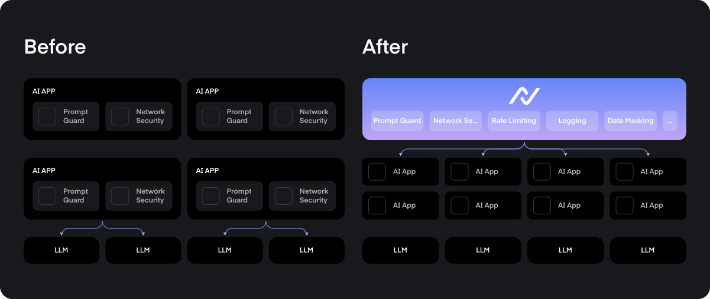

# TrustGate

<div align="center">



*A powerful, AI Gateway designed from scratch for AI*

[](https://pkg.go.dev/github.com/NeuralTrust/TrustGate@v0.1.0)
[](https://goreportcard.com/report/github.com/NeuralTrust/TrustGate)
[](LICENSE)
[](https://hub.docker.com/r/neuraltrust/trustgate)
[](https://github.com/NeuralTrust/TrustGate/actions/workflows/ci.yml)
[](https://github.com/NeuralTrust/TrustGate/actions/workflows/security.yml)


[Documentation](https://docs.neuraltrust.ai) |
[Quick Start](https://docs.neuraltrust.ai/trustgate/getting-started/hello-gateway) |
[Community](https://join.slack.com/t/neuraltrustcommunity/shared_invite/zt-2xl47cag6-_HFNpltIULnA3wh4R6AqBg)

</div>

## ✨ Features

- 🚀 **High Performance**: Built in Go for maximum efficiency and minimal latency
- 🌍 **Multi-Provider**: Multiple LLM provider support
- 🤖 **AI-Ready**: Optimized for AI model providers (OpenAI, Anthropic, etc.)
- 🔄 **Fallback Ready**: Built-in model fallback capabilities
- 🔄 **Load Balancing**: Advanced algorithms including round-robin, weighted round-robin, and IP hash
- 🔒 **Security**: Built-in authentication, rate limiting, and token management
- 🔌 **Plugin System**: Extensible architecture for custom functionality
- ⚡ **Real-time Config**: Dynamic configuration without restarts
- ☁️ **Cloud Agnostic**: Deploy anywhere with cloud-agnostic architecture


## 🚀 Quick Start

### Using Docker Compose

```bash
# Clone the repository
git clone https://github.com/NeuralTrust/TrustGate.git
cd TrustGate

# Clone env
cp .env.example .env

# Start the services
docker compose -f docker-compose.prod.yaml up -d
```

### Using Kubernetes

```bash
Coming soon
```

### Local Development

```bash
# Start dependencies
docker compose up -d redis postgres

# Run the servers
./scripts/run_local.sh
```

### Run Unit Tests

```
make test
```

### Run Functional Tests

```
make test-functional
```

## 🏗️ Architecture

TrustGate consists of two main components:

1. **Admin API** (Port 8080)
   - Gateway management
   - Configuration management
   - API key management
   - Plugin configuration

2. **Proxy API** (Port 8081)
   - Request routing
   - Load balancing
   - Plugin execution

## 📊 Monitoring

TrustGate provides comprehensive monitoring through Prometheus metrics:

```yaml
# config.yaml
metrics:
  enabled: true                # Enable metrics collection
  enable_latency: true        # Basic latency metrics
  enable_upstream: true       # Upstream latency tracking
  enable_connections: true    # Connection tracking
  enable_per_route: true     # Per-route metrics
```

### Key Metrics
- `trustgate_requests_total` - Request counts by gateway, method, and status
- `trustgate_latency_ms` - Overall request processing time
- `trustgate_detailed_latency_ms` - Granular latency by service/route
- `trustgate_upstream_latency_ms` - Upstream service latency
- `trustgate_connections` - Active connection tracking

### Prometheus Configuration
```yaml
scrape_configs:
  - job_name: 'trustgate'
    static_configs:
      - targets: ['localhost:9090']
```

For detailed metrics documentation, dashboards, and advanced queries, see our [Monitoring Guide](https://docs.neuraltrust.ai/trustgate/observability/metrics).

## 🤝 Contributing

We love contributions! Please see our [Contributing Guide](CONTRIBUTING.md) for details.

1. Fork the repository
2. Create your feature branch
3. Commit your changes
4. Push to the branch
5. Open a Pull Request

## 📜 License

TrustGate is licensed under the Apache License 2.0 - see the [LICENSE](LICENSE) file for details.

## 🌟 Star History

[](https://star-history.com/#NeuralTrust/TrustGate&Date)

## 📫 Community & Support

- [Documentation](https://docs.neuraltrust.ai)
- [Slack Community](https://join.slack.com/t/neuraltrustcommunity/shared_invite/zt-2xl47cag6-_HFNpltIULnA3wh4R6AqBg)
- [GitHub Issues](https://github.com/NeuralTrust/TrustGate/issues)
- [Twitter](https://twitter.com/neuraltrust)
- [Blog](https://neuraltrust.ai/en/resources/blog)


<div align="center">
Made with ❤️ by <a href="https://neuraltrust.ai">NeuralTrust</a>
</div>
