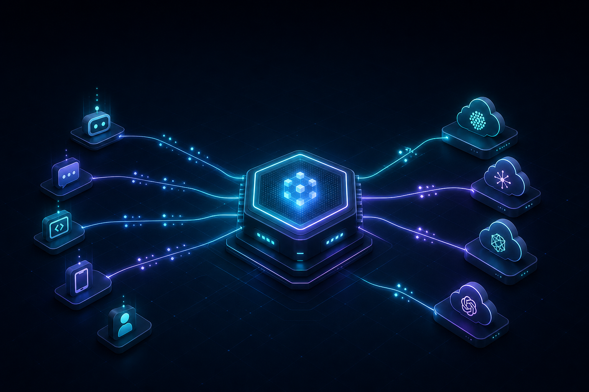
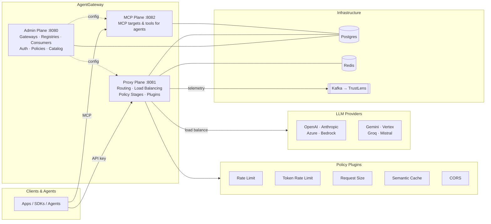

# AgentGateway

<div align="center">



*The high-performance data-plane gateway for LLM and agent traffic — built from scratch in Go*

[](https://pkg.go.dev/github.com/NeuralTrust/AgentGateway)
[](https://goreportcard.com/report/github.com/NeuralTrust/AgentGateway)
[](go.mod)
[](LICENSE)
[](https://hub.docker.com/r/neuraltrust/agentgateway)
[](https://github.com/NeuralTrust/AgentGateway/actions/workflows/ci.yml)
[](https://github.com/NeuralTrust/AgentGateway/actions/workflows/release.yml)

[Documentation](https://docs.neuraltrust.ai) &nbsp;|&nbsp;
[Quick Start](#-quick-start) &nbsp;|&nbsp;
[Architecture](#%EF%B8%8F-architecture) &nbsp;|&nbsp;
[Community](https://join.slack.com/t/neuraltrustcommunity/shared_invite/zt-2xl47cag6-_HFNpltIULnA3wh4R6AqBg)

</div>

---

## ✨ Features

- 🚀 **High Performance** — Built in Go on top of [Fiber](https://gofiber.io), tuned for low latency and high concurrency.
- 🌍 **Multi-Provider** — First-class adapters for OpenAI, Anthropic, Azure OpenAI, AWS Bedrock, Google Gemini, Vertex AI, Groq and Mistral.
- 🧭 **Smart Routing & Load Balancing** — Round-robin, weighted round-robin and IP-hash strategies with health checks and fallback targets.
- 🔌 **Plugin System** — Policy stages with built-in plugins: rate limiting, token rate limiting, request size guard, semantic cache and CORS.
- 🧠 **Semantic Cache** — Embedding-based response caching to cut cost and latency on repeated prompts.
- 🔒 **Security & Multi-Tenancy** — Per-gateway consumers, API-key auth, and policies scoped globally or per consumer.
- 📊 **Observability** — Built-in metrics, request telemetry streamed to Kafka and optional [TrustLens](https://neuraltrust.ai) integration.
- ⚙️ **Two Independent Planes** — Admin and Proxy run as separate processes so you can scale them independently.
- ☁️ **Cloud Agnostic** — Single static binary, Docker image and Kubernetes manifests. Deploy anywhere.

## 🚀 Quick Start

### Using Docker Compose

```bash
# Clone the repository
git clone https://github.com/NeuralTrust/AgentGateway.git
cd AgentGateway

# Copy the env template and adjust as needed
cp .env.example .env

# One command to bring up everything (Postgres, Redis, Kafka, Zookeeper) + admin, proxy & mcp
make up

# Tail the logs / tear everything down
make logs
make down
```

Then hit the health probes:

```bash
curl localhost:8080/healthz       # admin
curl localhost:8081/healthz       # proxy
curl localhost:8082/healthz       # mcp
curl localhost:8080/__/version    # build info (version, commit, build date)
```

> The image is pinned to `linux/amd64` because `confluent-kafka-go` only bundles
> an amd64 `librdkafka`; on Apple Silicon the build runs under emulation out of the box.

### Local Development

Run the infra in Docker and the binary on your machine so you can attach a debugger:

```bash
# 1. Boot the local dev infra (Postgres, Redis, Kafka, Zookeeper)
make compose-up

# 2a. Run admin + proxy together in a single process (simplest, single-node)
make run-all        # applies migrations, starts admin on :8080 and proxy on :8081

# 2b. ...or run each plane in its own terminal (closer to production)
make run-admin      # terminal 1 — applies migrations, starts admin on :8080
make run-proxy      # terminal 2 — applies migrations, starts proxy on :8081
make run-mcp        # terminal 3 — (optional) starts the MCP server on :8082

# 3. Stop the infra (add -v to wipe volumes)
make compose-down
```

### Using Kubernetes

Manifests live under [`k8s/`](k8s).

```bash
kubectl apply -k k8s/
```

### Run Tests

```bash
make test            # unit tests
make test-race       # unit tests with the race detector
make test-cover      # unit tests with coverage profile
make test-functional # functional tests against a real admin server
```

## 🧪 Your first request

The **Admin** plane (`:8080`) configures gateways, providers and consumers; the
**Proxy** plane (`:8081`) serves OpenAI-compatible traffic. The proxy resolves
the gateway from the `X-AG-Gateway-Slug` header and the consumer from its
`X-AG-API-Key`. End-to-end, from zero to a forwarded completion:

```bash
make up   # admin :8080, proxy :8081 + Postgres/Redis/Kafka

ADMIN="http://localhost:8080"
PROXY="http://localhost:8081"
TOKEN="$ADMIN_TOKEN"   # admin JWT, see "Admin token" below

# 1. Create a gateway (slug becomes its host/subdomain)
GW=$(curl -s -X POST "$ADMIN/v1/gateways" \
  -H "Authorization: Bearer $TOKEN" -H "Content-Type: application/json" \
  -d '{"name":"My Gateway","slug":"demo"}')
GW_ID=$(echo "$GW" | jq -r .id); GW_SLUG=$(echo "$GW" | jq -r .slug)

# 2. Register an upstream LLM provider (OpenAI here)
REG=$(curl -s -X POST "$ADMIN/v1/gateways/$GW_ID/registries" \
  -H "Authorization: Bearer $TOKEN" -H "Content-Type: application/json" \
  -d '{"name":"openai-primary","provider":"openai",
       "auth":{"type":"api_key","api_key":{"api_key":"'"$OPENAI_API_KEY"'"}}}')
REG_ID=$(echo "$REG" | jq -r .id)

# 3. Create a consumer bound to that registry
CON=$(curl -s -X POST "$ADMIN/v1/gateways/$GW_ID/consumers" \
  -H "Authorization: Bearer $TOKEN" -H "Content-Type: application/json" \
  -d '{"name":"my-app","registries":[{"id":"'"$REG_ID"'"}]}')
CON_ID=$(echo "$CON" | jq -r .id); CON_SLUG=$(echo "$CON" | jq -r .slug)

# 4. Mint a consumer API key (returned in cleartext once)
AUTH=$(curl -s -X POST "$ADMIN/v1/gateways/$GW_ID/auths" \
  -H "Authorization: Bearer $TOKEN" -H "Content-Type: application/json" \
  -d '{"name":"my-app-key","type":"api_key"}')
AUTH_ID=$(echo "$AUTH" | jq -r .id); API_KEY=$(echo "$AUTH" | jq -r .api_key)

# 5. Attach the key to the consumer
curl -s -X POST "$ADMIN/v1/gateways/$GW_ID/consumers/$CON_ID/auths/$AUTH_ID" \
  -H "Authorization: Bearer $TOKEN"

# 6. Call the proxy (OpenAI-compatible)
curl -s -X POST "$PROXY/$CON_SLUG/v1/chat/completions" \
  -H "X-AG-Gateway-Slug: $GW_SLUG" -H "X-AG-API-Key: $API_KEY" \
  -H "Content-Type: application/json" \
  -d '{"model":"gpt-4o-mini","messages":[{"role":"user","content":"Hello!"}]}'
```

From an application, point any OpenAI SDK at the proxy — no client changes beyond
the base URL and two headers:

```python
from openai import OpenAI

client = OpenAI(
    base_url="http://localhost:8081/my-app",  # /{consumer_slug}
    api_key="unused",                          # the provider key lives in the gateway
    default_headers={
        "X-AG-Gateway-Slug": "demo",
        "X-AG-API-Key": "<consumer api key>",
    },
)

resp = client.chat.completions.create(
    model="gpt-4o-mini",
    messages=[{"role": "user", "content": "Hello!"}],
)
print(resp.choices[0].message.content)
```

Other entrypoints follow the same `/{consumer_slug}/...` shape: `/v1/messages`
(Anthropic format) and `/v1/responses` (OpenAI Responses format).

### Admin token

The Admin API expects a JWT (HS256) signed with `SERVER_SECRET_KEY` from your
`.env`. Mint a short-lived one for local use:

```bash
export SERVER_SECRET_KEY="$(grep ^SERVER_SECRET_KEY .env | cut -d= -f2-)"
export ADMIN_TOKEN=$(python3 - <<'PY'
import jwt, os, time
secret = os.environ["SERVER_SECRET_KEY"]
print(jwt.encode({"sub": "admin", "iat": int(time.time()), "exp": int(time.time()) + 3600}, secret, algorithm="HS256"))
PY
)
```

## 🏗️ Architecture

AgentGateway ships a **single binary** that boots **one** HTTP server, selected by `argv[1]`
(default: `proxy`). In production each pod runs one container with the appropriate argument,
so the **Admin**, **Proxy** and **MCP** planes scale independently.

```bash
./trustgate              # → proxy (default)
./trustgate proxy        # → proxy
./trustgate admin        # → admin
./trustgate mcp          # → mcp (Model Context Protocol server)
./trustgate run          # → admin + proxy together in one process (single-node)
```


```mermaid
flowchart LR
    subgraph Clients["Clients & Agents"]
        APP["Apps / SDKs / Agents"]
    end

    subgraph AG["AgentGateway"]
        direction TB
        ADMIN["Admin Plane :8080\nGateways · Registries · Consumers\nAuth · Policies · Catalog"]
        PROXY["Proxy Plane :8081\nRouting · Load Balancing\nPolicy Stages · Plugins"]
        MCP["MCP Plane :8082\nMCP targets & tools for agents"]
    end

    subgraph Plugins["Policy Plugins"]
        RL["Rate Limit"]
        TRL["Token Rate Limit"]
        RS["Request Size"]
        SC["Semantic Cache"]
        CORS["CORS"]
    end

    subgraph Providers["LLM Providers"]
        P1["OpenAI · Anthropic\nAzure · Bedrock"]
        P2["Gemini · Vertex\nGroq · Mistral"]
    end

    subgraph Infra["Infrastructure"]
        PG[("Postgres")]
        RD[("Redis")]
        KFK[["Kafka → TrustLens"]]
    end

    APP -->|API key| PROXY
    APP -->|MCP| MCP
    PROXY --> Plugins
    PROXY -->|load balance| Providers
    ADMIN -. config .-> PROXY
    ADMIN -. config .-> MCP
    ADMIN --- PG
    PROXY --- PG
    PROXY --- RD
    MCP --- PG
    PROXY -->|telemetry| KFK
```

### Request lifecycle

1. A client calls the **Proxy** with a consumer API key.
2. The gateway resolves the consumer, gateway config and applicable **policies**.
3. Policy **stages** run their **plugins** (rate limit, token rate limit, request size, semantic cache, CORS).
4. The **load balancer** picks a healthy upstream target (round-robin / weighted / IP-hash) with fallback.
5. The request is forwarded to the selected **provider adapter** (OpenAI, Anthropic, Bedrock, …), streaming when supported.
6. The response is returned, the semantic cache is populated, and **telemetry** is emitted to Kafka.

### Planes

| Plane | Port | Responsibilities |
|-------|------|------------------|
| **Admin** | `8080` | Gateway, registry, consumer, auth, policy and catalog management. Applies DB migrations. |
| **Proxy** | `8081` | Request routing, load balancing, policy & plugin execution, provider forwarding, telemetry. |
| **MCP** | `8082` | Model Context Protocol server: exposes registered MCP targets and tools to agents. |

## 🔌 Plugins

Plugins run inside ordered **policy stages** and can execute sequentially or in parallel.

| Plugin | Description |
|--------|-------------|
| `ratelimit` | Per-consumer / per-gateway request rate limiting. |
| `tokenratelimit` | Token-based rate limiting for LLM cost control. |
| `requestsize` | Rejects requests above a configured body size. |
| `semanticcache` | Embedding-based response caching for repeated prompts. |
| `cors` | Cross-origin resource sharing for browser clients. |

## 🌍 Providers

| Provider | Provider | Provider | Provider |
|----------|----------|----------|----------|
| OpenAI | Anthropic | Azure OpenAI | AWS Bedrock |
| Google Gemini | Vertex AI | Groq | Mistral |

## ⚙️ Configuration

All configuration is read from **environment variables**. In development, copy `.env.example`
to `.env` and `godotenv` loads it automatically. Production deployments inject env vars directly
(Helm values, ECS task definitions, k8s ConfigMap + Secret).

```bash
# Server (HTTP listeners)
SERVER_ADMIN_PORT=8080
SERVER_PROXY_PORT=8081
SERVER_MCP_PORT=8082

# Database (Postgres via pgx/pgxpool)
DB_HOST=localhost
DB_PORT=5432
DB_NAME=agentgateway

# Redis & Kafka
REDIS_HOST=localhost
KAFKA_BROKERS=localhost:9092

# Telemetry & Metrics
TELEMETRY_ENABLED=true
TELEMETRY_KAFKA_TOPIC=agentgateway.requests
METRICS_ENABLED=true
```

See [`.env.example`](.env.example) for the full set with safe defaults.

### Migrations

Migrations are **in-code Go files** under `pkg/infra/database/migrations/`. Each file is named
`<unix_timestamp>_<snake_name>.go` and registers itself via `database.RegisterMigration` in its
`init()`. The `pgx`-backed runner commits each migration's DDL plus its `migration_version` row in
a single transaction, applying any pending migrations automatically on boot.

## 📚 API Docs

The Admin API is fully annotated and ships Swagger 2.0 and OpenAPI 3 specs:

```bash
make swagger   # generate docs/swagger.{json,yaml} + docs.go
make openapi   # convert to docs/openapi.json (OpenAPI 3)
make docs      # regenerate everything
```

Specs live under [`docs/`](docs) (`swagger.json`, `swagger.yaml`, `openapi.json`).

## 🗂️ Repository layout

```
cmd/trustgate/         # entry point (single binary: proxy | admin | mcp | run)
pkg/version/           # ldflag-fed build info
pkg/config/            # env-only config loader (.env via godotenv in dev)
pkg/domain/            # domain entities, value objects and port interfaces
pkg/app/               # application services (use cases)
pkg/infra/providers/   # provider adapters (openai, anthropic, bedrock, …)
pkg/infra/plugins/     # policy plugins (ratelimit, semanticcache, …)
pkg/infra/loadbalancer/# routing strategies + health checks
pkg/infra/database/    # pgxpool + in-code Go migrations registry
pkg/infra/telemetry/   # Kafka + TrustLens telemetry
pkg/api/handler/http/  # per-route HTTP handlers
pkg/server/            # Server interface + admin / proxy routers
pkg/container/         # dig DI container + one module per context
```

## 🤝 Contributing

We love contributions! To get started:

1. Fork the repository
2. Create your feature branch (`git checkout -b feat/my-feature`)
3. Run `make lint && make test` before committing
4. Push to your branch and open a Pull Request

## 📜 License

AgentGateway is licensed under the Apache License 2.0 — see the [LICENSE](LICENSE) file for details.

## 📫 Community & Support

- [Documentation](https://docs.neuraltrust.ai)
- [Slack Community](https://join.slack.com/t/neuraltrustcommunity/shared_invite/zt-2xl47cag6-_HFNpltIULnA3wh4R6AqBg)
- [GitHub Issues](https://github.com/NeuralTrust/AgentGateway/issues)
- [Twitter](https://twitter.com/neuraltrust)
- [Blog](https://neuraltrust.ai/en/resources/blog)

<div align="center">
Made with ❤️ by <a href="https://neuraltrust.ai">NeuralTrust</a>
</div>
