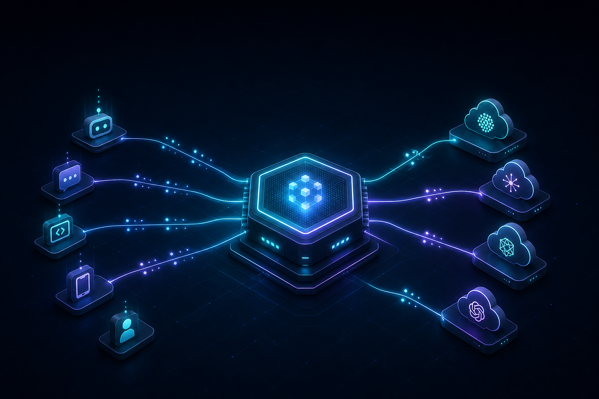
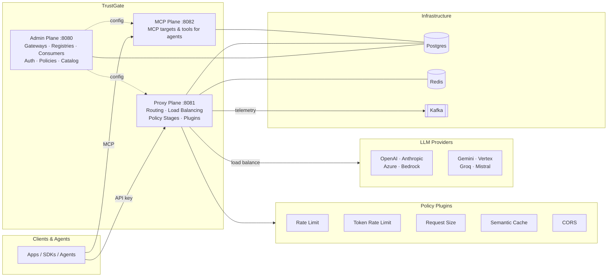

# TrustGate

<div align="center">



**A security-first LLM and AI Agent gateway built in Go.**

Route, govern, and observe all LLM and MCP traffic through a single control point.

[](https://pkg.go.dev/github.com/NeuralTrust/TrustGate)
[](https://goreportcard.com/report/github.com/NeuralTrust/TrustGate)
[](go.mod)
[](LICENSE)
[](https://hub.docker.com/r/neuraltrust/trustgate)
[](https://github.com/NeuralTrust/TrustGate/actions/workflows/ci.yml)
[](https://github.com/NeuralTrust/TrustGate/actions/workflows/release.yml)

[Documentation](https://docs.neuraltrust.ai) &nbsp;|&nbsp;
[Quick Start](#-60-second-quick-start) &nbsp;|&nbsp;
[Examples](examples/) &nbsp;|&nbsp;
[Architecture](#%EF%B8%8F-architecture) &nbsp;|&nbsp;
[Community](https://join.slack.com/t/neuraltrustcommunity/shared_invite/zt-2xl47cag6-_HFNpltIULnA3wh4R6AqBg)

</div>

---

## Why TrustGate?

TrustGate is purpose-built for teams that need **enterprise-grade governance** over their LLM and agent traffic — not just routing and observability.

| | TrustGate | LiteLLM | Portkey | Helicone |
|---|:---:|:---:|:---:|:---:|
| **Security & Governance** | Per-consumer auth, policy stages, rate limiting | Basic API key proxy | API key management | Logging-focused |
| **MCP Aggregation Plane** | Native MCP gateway for AI agents (Cursor, Claude, etc.) | — | — | — |
| **Multi-Provider Routing** | 9+ providers, weighted load balancing, fallback | Multi-provider | Multi-provider | Proxy layer |
| **Deployment** | Single Go binary, no runtime deps | Python + Redis | SaaS / self-host | SaaS / self-host |

**TrustGate differentiators:**

1. **Security-first architecture** — API-key auth, per-consumer policies, plugin stages (rate limit, token rate limit, request size, semantic cache) that run before traffic hits providers.
2. **MCP aggregation plane** — A dedicated `:8082` plane that aggregates upstream MCP servers, so AI agents connect to one gateway instead of many tools. See the [MCP testing guide](docs/mcp/testing-guide.md).
3. **Single static binary** — No Python, no Node, no runtime dependencies. Deploy anywhere: Docker, Kubernetes, bare metal.

---

## 60-Second Quick Start

### Option A: One-line install (recommended)

```bash
curl -fsSL https://raw.githubusercontent.com/NeuralTrust/TrustGate/main/scripts/install.sh | bash
```

This clones the repo, seeds `.env`, and starts the full stack. When Go is installed, it also builds the `trustgate` CLI.

### Option B: Docker Compose

```bash
git clone https://github.com/NeuralTrust/TrustGate.git && cd TrustGate
cp .env.example .env
make up
```

### Verify it's running

```bash
curl localhost:8080/healthz   # Admin plane
curl localhost:8081/healthz   # Proxy plane
curl localhost:8082/healthz   # MCP plane
```

### Your first chat completion

Once running, make a request through the proxy (full setup in [examples/curl-first-request/](examples/curl-first-request/)):

```bash
# Assumes you've created a gateway, registry, and consumer (see examples/)
curl -X POST "http://localhost:8081/my-app/v1/chat/completions" \
  -H "X-AG-Gateway-Slug: demo" \
  -H "X-AG-API-Key: $CONSUMER_API_KEY" \
  -H "Content-Type: application/json" \
  -d '{"model":"gpt-4o-mini","messages":[{"role":"user","content":"Hello!"}]}'

# 7. Embeddings (OpenAI, Azure OpenAI, Mistral, Vertex, Bedrock Titan, openai_compatible, Cohere)
curl -s -X POST "$PROXY/$CON_SLUG/v1/embeddings" \
  -H "X-AG-Gateway-Slug: $GW_SLUG" -H "X-AG-API-Key: $API_KEY" \
  -H "Content-Type: application/json" \
  -d '{"model":"text-embedding-3-small","input":["Hello from TrustGate"]}'
```

OpenAI-shaped clients always call `POST /{consumer}/v1/embeddings`. OpenAI, Azure, Mistral, and custom `openai_compatible` registries forward that payload to the upstream embeddings URL. Vertex uses Gemini `:embedContent` / `:batchEmbedContents`, and Bedrock Titan embed uses `InvokeModel` with `{inputText}`. A Cohere registry accepts the same OpenAI-shaped request and adapts it to Cohere `/v2/embed`:

```bash
curl -s -X POST "$PROXY/$CON_SLUG/v1/embeddings" \
  -H "X-AG-Gateway-Slug: $GW_SLUG" -H "X-AG-API-Key: $API_KEY" \
  -H "Content-Type: application/json" \
  -d '{"model":"embed-english-v3.0","input":["Hello from TrustGate"]}'
```

Or use any OpenAI SDK — see [examples/openai-sdk/](examples/openai-sdk/).

---

## Features

- **High Performance** — Built in Go on [Fiber](https://gofiber.io), tuned for low latency and high concurrency.
- **Multi-Provider** — OpenAI, Anthropic, Azure OpenAI, AWS Bedrock, Google Gemini, Vertex AI, Groq, Mistral, DeepSeek.
- **Smart Routing** — Round-robin, weighted, IP-hash strategies with health checks and fallback targets.
- **Plugin System** — Rate limiting, token rate limiting, request size guard, semantic cache, CORS.
- **Semantic Cache** — Embedding-based response caching for repeated prompts.
- **Multi-Tenancy** — Per-gateway consumers, API-key auth, scoped policies.
- **Observability** — Built-in metrics, OpenTelemetry (OTLP) export. See [Telemetry Configuration](#observability).
- **Independent Planes** — Admin (`:8080`), Proxy (`:8081`), MCP (`:8082`) scale separately.

---

## Architecture

TrustGate ships a **single binary** that boots one HTTP server per plane:

```bash
./trustgate              # proxy (default)
./trustgate admin        # admin
./trustgate mcp          # MCP server
./trustgate run          # admin + proxy together (single-node)
```


```mermaid
flowchart LR
    subgraph Clients["Clients & Agents"]
        APP["Apps / SDKs / Agents"]
    end

    subgraph AG["TrustGate"]
        direction TB
        ADMIN["Admin Plane :8080\nGateways · Registries · Consumers\nAuth · Policies · Catalog"]
        PROXY["Proxy Plane :8081\nRouting · Load Balancing\nPolicy Stages · Plugins"]
        MCP["MCP Plane :8082\nMCP targets & tools for agents"]
    end

    subgraph Plugins["Policy Plugins"]
        RL["Rate Limit"]
        TRL["Token Rate Limit"]
        RS["Request Size"]
        SC["Semantic Cache"]
        CORS["CORS"]
    end

    subgraph Providers["LLM Providers"]
        P1["OpenAI · Anthropic\nAzure · Bedrock"]
        P2["Gemini · Vertex\nGroq · Mistral"]
    end

    subgraph Infra["Infrastructure"]
        PG[("Postgres")]
        RD[("Redis")]
        KFK[["Kafka"]]
    end

    APP -->|API key| PROXY
    APP -->|MCP| MCP
    PROXY --> Plugins
    PROXY -->|load balance| Providers
    ADMIN -. config .-> PROXY
    ADMIN -. config .-> MCP
    ADMIN --- PG
    PROXY --- PG
    PROXY --- RD
    MCP --- PG
    PROXY -->|telemetry| KFK
```

| Plane | Port | Responsibilities |
|-------|------|------------------|
| **Admin** | `8080` | Gateway, registry, consumer, auth, policy management. DB migrations. |
| **Proxy** | `8081` | Request routing, load balancing, plugin execution, provider forwarding. |
| **MCP** | `8082` | Model Context Protocol server for AI agents. See [MCP Guide](docs/mcp/testing-guide.md). |

---

## MCP Plane for AI Agents

TrustGate's MCP plane (`:8082`) lets AI agents like **Cursor** and **Claude** connect to multiple MCP tool servers through a single gateway. Configure once, use everywhere.

```json
// Cursor mcp.json example
{
  "mcpServers": {
    "trustgate": {
      "url": "http://localhost:8082/agent-client/mcp",
      "headers": {
        "X-AG-API-Key": "<consumer api key>"
      }
    }
  }
}
```

See [examples/mcp-cursor/](examples/mcp-cursor/) for setup instructions and [docs/mcp/testing-guide.md](docs/mcp/testing-guide.md) for the full guide.

---

## Providers

| | | | |
|----------|----------|----------|----------|
| OpenAI | Anthropic | Azure OpenAI | AWS Bedrock |
| Google Gemini | Vertex AI | Groq | Mistral |
| DeepSeek | | | |

---

## Plugins

Plugins run in ordered **policy stages** (sequential or parallel):

| Plugin | Description |
|--------|-------------|
| `ratelimit` | Per-consumer/gateway request rate limiting |
| `tokenratelimit` | Token-based rate limiting for cost control |
| `requestsize` | Reject requests above a body size |
| `semanticcache` | Embedding-based response caching |
| `cors` | Cross-origin resource sharing |

---

## Configuration

All config is via **environment variables**. Copy `.env.example` to `.env` for development.

```bash
# Core ports
SERVER_ADMIN_PORT=8080
SERVER_PROXY_PORT=8081
SERVER_MCP_PORT=8082

# Infrastructure
DB_HOST=localhost
REDIS_HOST=localhost
KAFKA_BROKERS=localhost:9092
```

See [`.env.example`](.env.example) for all options.

---

## Observability

TrustGate emits request telemetry to [OpenTelemetry](https://opentelemetry.io) collectors. Configure per-gateway OTLP exporters:

```json
{
  "telemetry": {
    "exporters": [{
      "name": "otlp",
      "settings": {
        "endpoint": "collector:4317",
        "protocol": "grpc"
      }
    }]
  }
}
```

Full telemetry configuration, including default exporters and the OTLP contract, is documented in:
- [`docs/telemetry/otlp-metadata-contract.md`](docs/telemetry/otlp-metadata-contract.md)
- [`docs/pricing.md`](docs/pricing.md) — per-request `cost.total_usd` resolution (catalog, registry overrides, LLM Budget)
- [`config/telemetry.example.yaml`](config/telemetry.example.yaml)

---

## Local Development

```bash
# Boot infra in Docker, run planes locally (for debugging)
make compose-up
make run-admin      # terminal 1
make run-proxy      # terminal 2
make run-mcp        # terminal 3 (optional)

# Tests
make test           # unit tests
make test-race      # with race detector
make test-functional # against real server
```

See [CONTRIBUTING.md](CONTRIBUTING.md) for the full development guide.

---

<details>
<summary><strong>Advanced: Full Admin API Setup</strong></summary>

The **Admin** plane (`:8080`) configures gateways, providers, and consumers. The **Proxy** (`:8081`) serves OpenAI-compatible traffic. End-to-end setup:

```bash
make up   # admin :8080, proxy :8081 + Postgres/Redis/Kafka

ADMIN="http://localhost:8080"
PROXY="http://localhost:8081"
TOKEN="$ADMIN_TOKEN"   # see "Admin token" below

# 1. Create a gateway
GW=$(curl -s -X POST "$ADMIN/v1/gateways" \
  -H "Authorization: Bearer $TOKEN" -H "Content-Type: application/json" \
  -d '{"name":"My Gateway","slug":"demo"}')
GW_ID=$(echo "$GW" | jq -r .id); GW_SLUG=$(echo "$GW" | jq -r .slug)

# 2. Register an upstream LLM provider
REG=$(curl -s -X POST "$ADMIN/v1/gateways/$GW_ID/registries" \
  -H "Authorization: Bearer $TOKEN" -H "Content-Type: application/json" \
  -d '{"name":"openai-primary","provider":"openai",
       "auth":{"type":"api_key","api_key":{"api_key":"'"$OPENAI_API_KEY"'"}}}')
REG_ID=$(echo "$REG" | jq -r .id)

# 3. Create a consumer bound to that registry
CON=$(curl -s -X POST "$ADMIN/v1/gateways/$GW_ID/consumers" \
  -H "Authorization: Bearer $TOKEN" -H "Content-Type: application/json" \
  -d '{"name":"my-app","registries":[{"id":"'"$REG_ID"'"}]}')
CON_ID=$(echo "$CON" | jq -r .id); CON_SLUG=$(echo "$CON" | jq -r .slug)

# 4. Mint a consumer API key
AUTH=$(curl -s -X POST "$ADMIN/v1/gateways/$GW_ID/auths" \
  -H "Authorization: Bearer $TOKEN" -H "Content-Type: application/json" \
  -d '{"name":"my-app-key","type":"api_key"}')
AUTH_ID=$(echo "$AUTH" | jq -r .id); API_KEY=$(echo "$AUTH" | jq -r .api_key)

# 5. Attach the key to the consumer
curl -s -X POST "$ADMIN/v1/gateways/$GW_ID/consumers/$CON_ID/auths/$AUTH_ID" \
  -H "Authorization: Bearer $TOKEN"

# 6. Call the proxy
curl -s -X POST "$PROXY/$CON_SLUG/v1/chat/completions" \
  -H "X-AG-Gateway-Slug: $GW_SLUG" -H "X-AG-API-Key: $API_KEY" \
  -H "Content-Type: application/json" \
  -d '{"model":"gpt-4o-mini","messages":[{"role":"user","content":"Hello!"}]}'
```

### Admin token

The Admin API expects a JWT (HS256) signed with `SERVER_SECRET_KEY`:

```bash
export SERVER_SECRET_KEY="$(grep ^SERVER_SECRET_KEY .env | cut -d= -f2-)"
export ADMIN_TOKEN=$(python3 - <<'PY'
import jwt, os, time
secret = os.environ["SERVER_SECRET_KEY"]
print(jwt.encode({"sub": "admin", "iat": int(time.time()), "exp": int(time.time()) + 3600}, secret, algorithm="HS256"))
PY
)
```

</details>

---

## Repository Layout

```
cmd/trustgate/         # entry point (single binary: proxy | admin | mcp | run)
pkg/domain/            # domain entities and port interfaces
pkg/app/               # application services (use cases)
pkg/infra/providers/   # provider adapters (openai, anthropic, bedrock, …)
pkg/infra/plugins/     # policy plugins
pkg/server/            # Server interface + routers
examples/              # runnable examples for common use cases
docs/                  # API specs, telemetry docs, MCP guide
```

---

## API Documentation

The Admin API ships Swagger 2.0 and OpenAPI 3 specs:

```bash
make swagger   # generate docs/swagger.{json,yaml}
make openapi   # convert to docs/openapi.json
```

---

## Contributing

We welcome contributions! See [CONTRIBUTING.md](CONTRIBUTING.md) for guidelines.

**Good first issues:** Check [`.github/GOOD_FIRST_ISSUES.md`](.github/GOOD_FIRST_ISSUES.md) for curated starter tasks.

**Examples:** Help us add more examples in [`examples/`](examples/).

---

## License

Apache License 2.0 — see [LICENSE](LICENSE).

---

## Community & Support

- [Documentation](https://docs.neuraltrust.ai)
- [Slack Community](https://join.slack.com/t/neuraltrustcommunity/shared_invite/zt-2xl47cag6-_HFNpltIULnA3wh4R6AqBg)
- [GitHub Issues](https://github.com/NeuralTrust/TrustGate/issues)
- [Twitter](https://twitter.com/neuraltrust)
- [Blog](https://neuraltrust.ai/en/resources/blog)

<div align="center">
Made with care by <a href="https://neuraltrust.ai">NeuralTrust</a>
</div>
