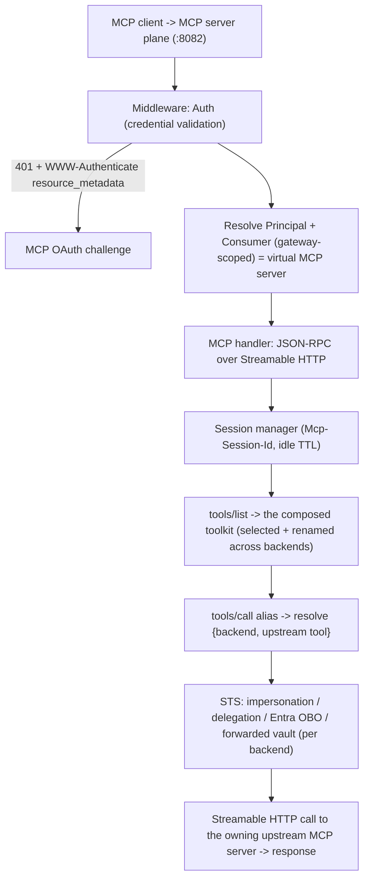
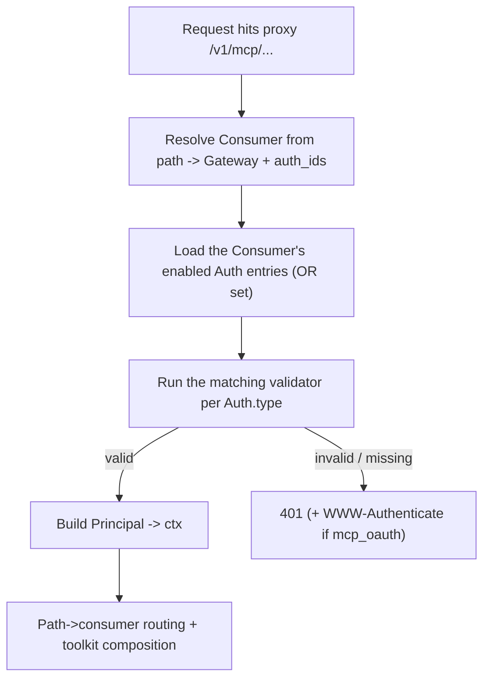
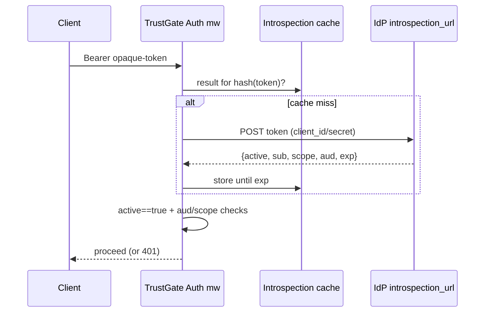
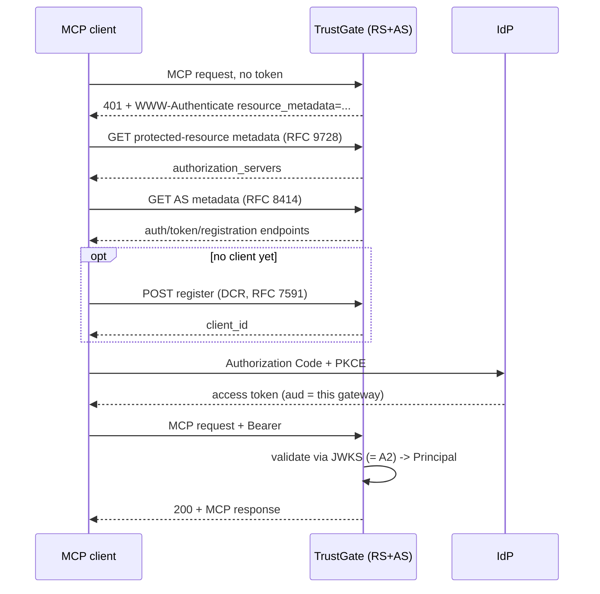
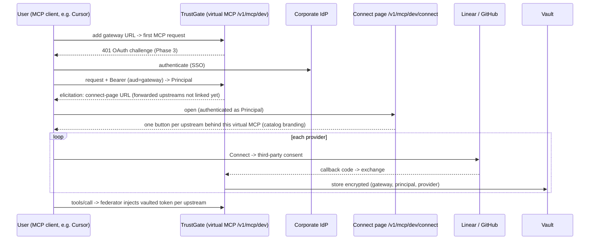
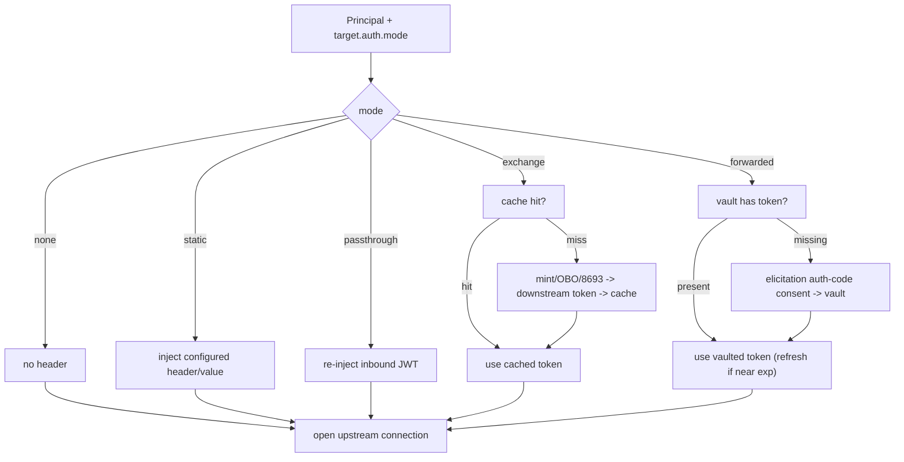

# TrustGate MCP Gateway + Enterprise Auth/Authz

## Context and grounding

TrustGate ([AgentGateway](/Users/victor/Code/neuraltrust/AgentGateway)) is a Go 1.26 hexagonal data plane (admin :8080 / proxy :8081). The LLM proxy hot path is real; the MCP surface is **schema-only** and the proxy auth is a **stub**:

- `consumer.Type` already has `LLM`/`MCP`/`A2A` ([pkg/domain/consumer/consumer.go](/Users/victor/Code/neuraltrust/AgentGateway/pkg/domain/consumer/consumer.go)) but there is no MCP protocol server.
- `auth.Type` models `api_key`/`oauth2`/`mtls` ([pkg/domain/auth/config.go](/Users/victor/Code/neuraltrust/AgentGateway/pkg/domain/auth/config.go)) but configs are admin-stored and never enforced on the proxy.
- `IdentityResolver` just trusts `X-Gateway-Id` ([pkg/api/middleware/auth.go](/Users/victor/Code/neuraltrust/AgentGateway/pkg/api/middleware/auth.go)). No RBAC; isolation is per-gateway, which is the intended tenant boundary (see "Tenancy model" below).
- Proxy entrypoint is a single catch-all `app.All("/v1/*", proxyHandler.Handle)` ([pkg/server/router/proxy_router.go](/Users/victor/Code/neuraltrust/AgentGateway/pkg/server/router/proxy_router.go)) routed through the LLM forwarder.
- Server selection is by `argv[1]` in [cmd/agentgateway/main.go](/Users/victor/Code/neuraltrust/AgentGateway/cmd/agentgateway/main.go) (`admin`/`proxy`, default proxy); `modules.All()` provides named `server.Server` instances (`name:"admin"`, `name:"proxy"`) wired in [pkg/container/modules/server_admin.go](/Users/victor/Code/neuraltrust/AgentGateway/pkg/container/modules/server_admin.go) / [server_proxy.go](/Users/victor/Code/neuraltrust/AgentGateway/pkg/container/modules/server_proxy.go).

The MCP Gateway is a **new third server plane** (`./agentgateway mcp` on its own port), not a branch of the proxy. It reuses existing seams: the `IdentityResolver`/Auth middleware, the `consumer` and `registry` aggregates, and the DI module pattern under `pkg/container/modules/`.

> Naming note: earlier drafts called the upstream aggregate `backend`. The codebase aggregate is **`registry`** (`pkg/domain/registry/`, `pkg/infra/repository/registry/`); this doc now uses `registry` for the entity and "upstream MCP server" for the remote server it points at.

## Competitive positioning (what we adopt / where we differentiate)

- **agentgateway** (Rust): MCP federation + CEL authz + MCP OAuth RS/AS with IdP adapters. We mirror its MCP OAuth/IdP-adapter story but deliberately skip a policy engine - authorization is the auth + toolkit-composition model instead of CEL.
- **docker/mcp-gateway** (Go): single aggregated virtual MCP server, Bearer-only client auth, external policy. We adopt federation/prefixing; we go far beyond on inbound identity.
- **archestra** (TS): gateway as OAuth 2.1 AS/RS + ID-JAG / Entra OBO / RFC 8693 + RBAC + multi-tenancy. This is the closest blueprint for our enterprise auth scope; we re-implement the same capabilities natively in Go.
- **Solo Enterprise for agentgateway**: ships a built-in STS (RFC 8693) with impersonation / delegation / external-IdP exchange / elicitation patterns. We adopt this exact taxonomy in Phase 4.
- **Differentiator**: a dedicated MCP plane whose core unit is the **virtual MCP server** (a consumer-composed toolkit cherry-picking and renaming tools across many upstream MCP servers) + a first-class Security Token Service (TrustGate-as-issuer for impersonation/delegation, Entra OBO, credential-forwarding vault) + gateway-scoped isolation (Gateway = tenant) in a single Go codebase. Authorization stays simple (auth + toolkit), not a CEL/OPA policy engine.

## Target request flow



## Scope, protocol surface, and enterprise hardening

The headline goal is a **core MCP Gateway that is enterprise-ready**, not a maximal feature set. Enforcement-style features (rate limits, content guardrails, tool-level rules) are intentionally **deferred to the existing `policy` mechanism**, not rebuilt here.

- **Policies are a fast-follow, not core.** A `policy.Policy` is a named set of `Plugins` ([pkg/domain/policy/policy.go](/Users/victor/Code/neuraltrust/AgentGateway/pkg/domain/policy/policy.go)) already referenced by a consumer via `PolicyIDs`. MCP-specific enforcement (per-tool rate limit, argument guardrails, content inspection / tool-poisoning defenses) lands later as new MCP-aware `Plugins` on the MCP consumer - no new authorization subsystem. The core gateway just exposes the seam (`tools/call` runs through the consumer's policy chain) and ships with it empty.
- **MCP servers catalog is in scope; install governance is a fast-follow.** The curated, read-only **catalog of remote MCP servers** (Linear, GitHub, ...) ships in Phase 2 as a sibling of the existing LLM providers catalog (`/v1/providers-catalog`): same domain/service/handler pattern, exposed at `/v1/mcp-servers-catalog`, feeding the Registries MCP tab pick-list. What stays a fast-follow is the **governance** layer competitors ship around it (server presets, team-scoped catalogs, an install-request -> admin-approval workflow - cf. docker's catalog and archestra's `internal-mcp-catalog` + `mcp-server-installation-requests`), layered on the existing admin plane, not part of the core gateway.

- **MCP protocol surface for v1** (the federating handler must implement these correctly across multiplexed upstreams):
  - **In:** `initialize` (with protocol-version + capability negotiation), `tools/list` + `tools/call`, `resources/list` + `resources/read`, `prompts/list` + `prompts/get`, `ping`, and `notifications/*/list_changed` fan-out (upstream change -> invalidate discovery -> notify connected clients).
  - **Deferred:** `resources/subscribe` update streams, `notifications/progress` + cancellation, and `sampling/createMessage` (server->client LLM calls). Sampling especially reshapes the handler - it must route a server-originated request back to the originating client session - so it is explicitly out of v1.
  - **Version negotiation:** upstreams may speak different MCP protocol versions; the virtual server negotiates one version with the client and down-levels capabilities to the intersection of what its backends support.

- **Transport scope:** inbound and upstream are **remote Streamable HTTP**. We do **not** proxy local **stdio** upstreams in v1 (no subprocess runner). Decide inbound **legacy SSE** client compatibility explicitly (accept SSE clients for reach, or Streamable-HTTP-only for simplicity) - this is independent of the upstream transport choice.

- **`A2A` consumers are deferred.** `consumer.Type` includes `A2A` but it is out of scope for this work; only `MCP` (and the existing `LLM`) are addressed.

## Tenancy model - Gateway = tenant (no tenancy phase)

There is **no separate tenant concept**: the `Gateway` entity **is** the tenant boundary. One tenant = one gateway; consumers (virtual MCPs), registries, auths, and policies all live inside a gateway and already carry `gateway_id` — the isolation a tenancy layer would have added exists today.

- **No new domain, no migration.** No `tenant_id`/`team_id` columns; repos, finders, and admin handlers stay gateway-scoped as they are.
- **The `Principal`** (the authenticated subject — subject id, claims, scopes, auth method) is identity, not tenancy; it lands with inbound credential validation below. The Entra `tid` claim is the *IdP's* tenant and rides along as a claim (used for OBO authority), with no mapping to our model.
- **All per-user state is keyed by gateway**: vault rows, token caches, and session pins use `(gateway_id, principal, ...)`.
- **Future note (not built):** if multi-tenant SaaS arrives, the clean evolution is a thin `org -> gateways` mapping on the control plane; the data plane never needs tenant awareness because every request resolves to a gateway.

## Phase 1 - Inbound credential validation (replace the stub)

Turn `IdentityResolver` into a real credential chain producing a `Principal`.

- New `pkg/domain/identity/principal.go` describing the authenticated subject (subject id, claims, scopes, auth method, retained raw token).
- New `pkg/infra/auth/oidc/` (OIDC discovery + JWKS cache, RS/EC/Ed25519) and `pkg/infra/auth/introspection/` (RFC 7662). Reuse `auth.OAuth2Config` fields (`Issuer`, `JWKSURL`, `IntrospectionURL`, `Audiences`, `RequiredScopes`, `Algorithms`).
- Implement validators per `auth.Type`: API key (header/query/cookie -> consumer -> gateway), JWT/JWKS, introspection, and mTLS verification against `auth.MTLSConfig`.
- Replace `headerIdentityResolver` ([pkg/api/middleware/auth.go](/Users/victor/Code/neuraltrust/AgentGateway/pkg/api/middleware/auth.go)) with a resolver that validates credentials, builds the `Principal`, resolves gateway+consumer, and attaches both to context. Wire validation modes (Strict/Optional/Permissive).
- Multi-IdP: validators keyed by issuer; per-gateway `Auth` configs select trusted issuers. Cover Entra, Okta, Keycloak, Auth0, Google, generic OIDC via discovery URLs.

### Inbound auth flows (per Auth style)

All styles share one pre-step, then diverge only at validation; all converge on a `Principal` (`subject`, `claims`, `scopes`, `method`, retained `raw_token` for downstream OBO/exchange); the gateway is resolved from the consumer, never from the credential.

Shared pre-step:



- **A1 API key** - offline lookup. Extract key from `config.api_key.in`/`name`; hash + constant-time compare via a key->consumer index (the key can also resolve the consumer); Principal `method=api_key`, subject = key identity. No network, no expiry (admin-rotated). Weakest identity; for machine/partner traffic.
- **A2 Entra JWT (JWKS)** - signature verified locally against cached keys, no per-request IdP call. Parse `kid`/`alg` -> fetch `jwks_url` (cached, refresh on unknown kid) -> verify sig + `alg` in `allowed_algorithms` -> check `iss==issuer` (v2 issuer embeds `{tid}`; pin for single-tenant, validate pattern + read `tid` for multi-tenant), `aud` in `audiences`, `exp`/`nbf`/`iat` within skew, `required_scopes` subset. Principal: `sub=oid`, `tid` carried as a claim (IdP tenant, used for OBO authority), groups/roles, `scp`. Retain raw token for OBO.

```mermaid
sequenceDiagram
  participant C as Client
  participant GW as TrustGate Auth mw
  participant J as JWKS cache
  participant E as IdP jwks_url
  C->>GW: Bearer eyJ...
  GW->>GW: parse header -> kid, alg
  GW->>J: key for kid?
  alt cache miss / rotated
    J->>E: GET jwks_url
    E-->>J: keys
  end
  J-->>GW: public key
  GW->>GW: verify sig; alg/iss/aud/exp/scope checks
  GW->>GW: build Principal
  GW-->>C: proceed (or 401)
```

- **A3 Okta JWT** - A2 flow; `issuer` = Okta org or custom authorization server (different `iss`/`aud`); scopes in `scp`; groups only if a groups claim mapping is configured.
- **A4 Keycloak JWT** - A2 flow; `issuer` = realm URL; group/role claims live in `realm_access.roles` / `resource_access.<client>.roles`. Audience trap: Keycloak defaults to `aud: "account"` - operator must add an audience mapper so `aud` matches `audiences`.
- **A5 Auth0 / Google / generic OIDC** - A2 flow, discovered via `.well-known/openid-configuration`. Auth0 `aud` = API Identifier, permissions in `permissions`/`scope`. Google caveat: Google **access tokens are opaque** (only ID tokens are JWTs) -> validate Google access tokens via A6, not JWKS.
- **A6 Introspection (RFC 7662)** - for opaque/reference tokens. POST token to `introspection_url` with `client_id`/`client_secret`; require `active==true` + aud/scope; build Principal from returned claims. Cache by `hash(token)` until `exp` to avoid hammering the IdP. Trade-off: real-time revocation visibility vs an IdP network dependency.



- **A7 mTLS** - identity from the TLS layer. Direct termination (cert in conn state) or edge termination (cert via `X-Forwarded-Client-Cert` from Gateway API/Envoy/LB - trust anchored to the edge). Verify chain against `config.mtls.ca_cert` + validity (CRL/OCSP if configured); enforce CN/`allowed_common_names`, SAN DNS/`allowed_dns_names`, fingerprint/`allowed_fingerprints`. Principal `method=mtls`, subject = CN/SAN. Strongest workload identity; pair with `static`/`exchange` downstream.
- **A8 Multiple (OR)** - try validators in fixed precedence (mTLS -> JWT -> introspection -> API key); first valid Principal wins. Anti-downgrade rule: a credential present but invalid returns `401` immediately (no silent fall-through to a weaker method). No credential -> `401`/challenge.
- **A9 MCP OAuth 2.1 (RS+AS bootstrap)** - handshake that ends in an A2-style validation; served by Phase 3 `pkg/api/handler/http/oauth/`. After the client holds a token, every subsequent request is just A2/A6.



Summary: A1/A7 are offline + identity-only; A2-A5 are offline-after-JWKS; A6 is online-but-cached; A9 is A2 plus a one-time OAuth bootstrap.

## Phase 2 - MCP Gateway server (third plane) + virtual MCP toolkit composition

The MCP Gateway runs as its own server, and the unit it serves is a **virtual MCP server**: a `consumer` (Type=MCP) that composes a curated toolkit by selecting specific tools from one or more upstream MCP backends, optionally renaming each, exposed at the consumer's path. This is the headline feature.

> **Inline-first, Roles after.** The inline `consumer.toolkit` is the MCP mirror of the LLM plane's **inline upstream bind** ([consumer-identity-federation-spec.md](/Users/victor/Code/neuraltrust/AgentGateway/docs/design/consumer-identity-federation-spec.md) §1) — same mental model on both planes: configure access inline on the Consumer now; the reusable **Roles** layer (`MCPGrant` = the reusable form of a toolkit entry) is a **separate follow-on plan** (see "Implement after"). This epic ships inline-only.

New server plane (mirrors admin/proxy):

- Add `serverMCP = "mcp"` + an `argv[1]` branch and `runMCP` in [cmd/agentgateway/main.go](/Users/victor/Code/neuraltrust/AgentGateway/cmd/agentgateway/main.go) (start the MCP session reaper on boot, like the proxy's metrics worker).
- New `pkg/server/router/mcp_router.go` (health before middleware, then the MCP routes) and a new `pkg/container/modules/server_mcp.go` providing the `mcp` transport + router + `server.Server` (`name:"mcp"`), analogous to `server_proxy.go`. Reuse the Auth middleware chain.
- New `Server.MCPPort` config (e.g. :8082); new k8s Deployment/Service/HTTPRoute for the MCP plane so it scales independently.

Upstream connectivity:

- Extend the `registry` aggregate with an MCP target spec: a `registry.Type` discriminator (`LLM`/`MCP`) plus `MCPTarget{ URL, Transport=streamable-http, Headers, AuthRef, Resilience }`. Migration + repo updates under `pkg/infra/repository/registry/`.
- New `pkg/infra/mcp/client/` Streamable HTTP MCP client (JSON-RPC, `Mcp-Session-Id`, SSE response handling) and `pkg/infra/mcp/session/` session manager backed by a **shared store (Redis)**, not pod-local memory (see "Scaling and session state" below).
- **Backend resilience (enterprise table-stakes, matching agentgateway's `http/retry` + `http/outlierdetection` + `loadbalancer`):** per-backend connect/request **timeouts**, **retries with backoff** (idempotent ops only), **outlier detection / endpoint eviction** feeding the circuit breaker, **load balancing across upstream replicas** (compatible with the stateful session pin - balance only at session creation, then pin), and **backend TLS/mTLS** to the upstream. These live on `MCPTarget.Resilience` and are enforced by the MCP client; `failOpen`/`failClosed` remains the composition-level fallback.

Composition engine (the virtual MCP):

- New `consumer` composition spec `toolkit`: an ordered list of entries `{ registry_id, tool (upstream name), expose_as (alias, optional), enabled }` - the operator hand-picks tools across backends. Whole-server inclusion is shorthand (`{ registry_id, tool: "*" }`); `tool_allowlist` becomes a degenerate single-backend toolkit.
- New `pkg/app/mcp/` composer: connect to the referenced MCP backends, discover their capabilities, then build the virtual server from the `toolkit` - resolve each selected tool, apply `expose_as` rename (or auto-prefix `{server}_{tool}` on collision, matching the Roles spec), and synthesize one merged `initialize`/`tools`/`prompts`/`resources` view. `failClosed`/`failOpen` per backend. **Forward-compat:** the composer's input is "the Consumer's effective tool set" — in v1 computed from the inline `toolkit` only; the Roles plan later widens it to `union(role MCP grants) ∪ inline toolkit` with no engine change (select, rename/auto-prefix, failmode all stay).
- `tools/call` maps the exposed alias back to its `{backend, upstream tool}` and routes only to that backend (with that backend's Phase 4 downstream auth) - no broadcast.
- New `pkg/api/handler/http/mcp/` handler serving JSON-RPC over Streamable HTTP, wired into `mcp_router.go`. Implements the v1 surface from "Scope, protocol surface" - `initialize` (version + capability negotiation across heterogeneous backends), `tools`/`resources`/`prompts` list+invoke, `ping`, and `notifications/*/list_changed` fan-out.
- Authorization model: `tools/list` returns exactly the composed `toolkit`, and reachability is already gated by the Phase 1 inbound auth on the virtual server. No per-tool policy engine. `tools/call` runs through the consumer's existing `policy` chain (empty by default - MCP enforcement plugins are the fast-follow). Emit `SpanMCP` traces ([pkg/infra/trace/span.go](/Users/victor/Code/neuraltrust/AgentGateway/pkg/infra/trace/span.go)) for `tools/list`/`tools/call`.
- **Admin tool introspection** (composition UX): an admin-plane endpoint to connect to a backend and list its discoverable tools/resources/prompts, so operators (and the UI) can build a `toolkit` from a real pick-list instead of guessing names.
- **MCP servers catalog endpoint** (discovery UX): mirror the LLM providers catalog (`pkg/domain/catalog/` `Provider`/`Model`, `catalog.Service`, `/v1/providers-catalog`) with a curated catalog of **remote MCP servers**: new catalog entity `MCPServer{ Code, DisplayName, URL, Transport, AuthHint (none|static|oauth + default scopes), Metadata (icon, docs), Source }` + `mcp_servers_catalog` table (same migration/seed pattern as `providers_catalog`), `catalog.Service.ListMCPServers`, handler + admin route **`/v1/mcp-servers-catalog`**. Feeds the Registries -> MCP tab (the placeholder already exists in [registries-view.tsx](/Users/victor/Code/neuraltrust/AgentGateway/frontend/src/components/entities/registries-view.tsx): "MCP backends will appear here once they are available in the catalog") so creating an MCP registry starts from the catalog (Linear, GitHub, ...) instead of a blank URL; the entry's `AuthHint`/scopes prefill the registry's downstream auth mode and the Phase 4 broker scopes.
- **Config lifecycle**: a toolkit/backend change must invalidate the backend-keyed discovery cache and emit `notifications/tools/list_changed` to connected clients. Prefer event-driven invalidation over the existing TTL-only `dataFinder` (the stack already has Kafka), so changes propagate across replicas promptly; re-discover an upstream on reconnect after a `failOpen` skip.

### Scaling and session state

**Hard requirement: correctness must never depend on load-balancer stickiness or on a client/LB honoring the `Mcp-Session-Id` header.** Any MCP-plane replica must be able to serve any request. Stickiness, when present, is only a warm-connection performance optimization. This mirrors how the serious competitors scale: agentgateway encodes a self-describing session token (shared key, no store) and archestra keeps the inbound plane stateless plus a shared DB row for upstream session pinning ([archestra `mcp_http_sessions`](/Users/victor/Code/poc/archestra/platform/backend/src/database/schemas/mcp-http-session.ts)). docker/mcp-gateway, by contrast, is pod-local in-memory only and cannot scale - we explicitly avoid that.

The cardinality fact that drives this: the number of virtual MCPs (consumers) is just config (already an in-memory per-gateway TTL snapshot via [dataFinder](/Users/victor/Code/neuraltrust/AgentGateway/pkg/app/consumer/data_finder.go) + `cache.TTLMap`); the real cost is concurrent client sessions/streams (elastic - scale pods) and load fanning into a shared upstream MCP (the least-elastic tier - protect it).

Design:

- **Stateless inbound by default.** Serve `tools/call` as request/response JSON (`enableJsonResponse`-style), issuing no server-side session for the common case, so any replica handles any request. The server-issued `Mcp-Session-Id` is echoed by compliant clients automatically - we never require operator/user header configuration, and never require the LB to route on it for correctness.
- **Upstream session continuity in a shared store (Redis).** When an upstream needs session affinity, persist `{ connection_key -> upstream Mcp-Session-Id, pinned upstream endpoint }` in Redis (TTL + reaper), keyed by `(consumer, backend, principal[, conversation])`. Any pod resumes the same upstream session against the same upstream pod by reading Redis - no pod-local session map, no sticky dependency. (Optionally adopt agentgateway's self-encoded session token using the Phase 4 STS signing key to avoid even the store.)
- **Discovery cache keyed by backend, not by consumer.** Cache each upstream's `tools/list`/capabilities in Redis (TTL + refresh); 100 consumers fronting the same backend discover it once. The per-consumer `toolkit` (select/rename) is a cheap projection over the shared discovery.
- **Per-backend warm connection pool is a pod-local optimization** (LRU, idle TTL), capped per backend with a circuit breaker; a cold pod just re-opens from the shared session metadata. Never a correctness dependency.
- **SSE / server-push streams are the only pod-pinned resource.** They are bounded by a **per-pod stream cap** (shed with 503 so HPA adds pods instead of OOMing); only a live stream is pinned to its owning pod, and only for its duration.
- **Horizontal scale**: the MCP plane is its own Deployment with HPA; replicas are interchangeable. Sticky routing on `Mcp-Session-Id`, if configured at all, only improves warm-pool hit rate.
- **Scale on the right signal**: MCP load is connection-bound, not CPU-bound, so expose a concurrent-session/stream gauge and drive HPA on it (plus per-upstream health / circuit-breaker metrics), not CPU alone.

## Phase 3 - MCP OAuth 2.1 Resource Server + Authorization Server

- New `pkg/api/handler/http/oauth/`: serve `/.well-known/oauth-protected-resource` (RFC 9728) and `/.well-known/oauth-authorization-server` (RFC 8414); return `401` + `WWW-Authenticate: ... resource_metadata=...` on unauthenticated MCP requests.
- Dynamic Client Registration (RFC 7591) + PKCE; proxy/adapt authorization+token endpoints per IdP.
- IdP adapters (authorization-endpoint rewrites, metadata path differences, DCR CORS workarounds) for **Entra, Okta, Keycloak, Auth0/Google/OIDC**, mirroring agentgateway's `McpIDP` adapters.

## Phase 4 - Security Token Service (downstream credential federation)

Adopt the [Solo.io STS model](https://docs.solo.io/agentgateway/latest/security/token-exchange/): a built-in Security Token Service that solves the two credential challenges - crossing **identity-domain boundaries** (corp IdP token not accepted by GitHub/Databricks/Entra) and satisfying **trusted-authority / token-structure** constraints (downstream wants a specific issuer, or an `act` claim naming the agent). Built on **OAuth 2.0 Token Exchange (RFC 8693)** with four exchange patterns.

New building block - **TrustGate as a token issuer**: a signing key (from the secret store) plus a published JWKS for the STS issuer, so downstreams can trust `iss = TrustGate` for the mint-based patterns. This is the trust/audit anchor for the product.

New `pkg/app/identity/sts/` exposing an `Exchanger` seam with four patterns:

- **Impersonation** - STS mints a short-lived JWT, same `sub`, new `aud`; for downstreams that require a specific trusted issuer/audience. Issuer = TrustGate STS.
- **Delegation** - STS mints a JWT with the user's `sub` plus an `act` claim identifying the agent (RFC 8693 actor / **ID-JAG** for cross-domain agent grants). Enables downstream policies like "only `agent-v2` may act for `finance` users" and a full user->agent->tool audit chain. Issuer = TrustGate STS.
- **External IdP exchange** - delegate the exchange to the external IdP, i.e. **Microsoft Entra OBO** (`grant_type=jwt-bearer`, `requested_token_use=on_behalf_of`, client assertion via `private_key_jwt`) and equivalent Okta exchange. Issuer = external IdP. Authority derived from the caller's `tid`.
- **Elicitations / credential forwarding** - no token minted: orchestrate an OAuth auth-code flow with a third party (GitHub/Salesforce), store access+refresh tokens in an encrypted credential vault, refresh, and inject transparently. The agent never holds the credential.

Integration:

- Registry auth modes for MCP targets: `passthrough` (re-inject validated JWT), `exchange` (one of the four STS patterns), and `forwarded` (vaulted third-party token). Configured per `consumer`/target via the `auth` ref.
- The federator (`pkg/app/mcp/`) calls `Exchanger.Mint` (or vault lookup) just before opening each upstream Streamable HTTP connection, then sets `Authorization: Bearer {credential}`.
- Token/credential cache keyed by `(principal subject/oid, target resource, gateway)` with refresh before expiry; strict per-principal/per-gateway isolation (a leak here is cross-user escalation). Propagate IdP claims challenges (`interaction_required`) back to the client as `401` + `WWW-Authenticate` `claims`, reusing Phase 3 challenge machinery.
- Strategy inference from issuer hostname; explicit per-consumer override.

### Credential vault (forwarded mode)

The `forwarded` mode needs a **durable** store, not a cache: OBO/exchange tokens are re-derivable from the inbound token, but forwarded refresh tokens come from **one-time user consent** and cannot be re-minted — losing them forces re-consent. New `pkg/domain/vault/`:

```go
// durable, encrypted, per (gateway, principal, provider)
type VaultedCredential struct {
    ID           ids.VaultID
    GatewayID    ids.GatewayID  // the tenant boundary
    PrincipalSub string         // user's oid/sub
    Provider     string         // "github" | "slack" | ...
    AccountRef   string         // linked account, for display
    AccessToken  Secret         // encrypted at rest
    RefreshToken Secret         // encrypted at rest — irreplaceable (consent-derived)
    Scopes       []string
    ExpiresAt    time.Time
    CreatedAt, UpdatedAt time.Time
}
```

- **Security:** encrypted at rest via KMS/secret manager (per the Cross-cutting secret rules); strict `(gateway, principal)` isolation — a leak here is cross-user account takeover; revoke = delete row (+ provider-side revoke).
- **OAuth broker surface:** `/oauth/connect/{provider}` (302 to the third party's consent screen) and `/oauth/callback/{provider}` (code exchange + encrypted store + confirmation page). The login/consent UI is always the third party's — TrustGate builds no login forms; it is only the OAuth client (admin-registered `client_id`/`secret`).
- **End-user auth mini-UI (small frontend), scoped to the virtual MCP:** the page is derived from the **consumer's MCP gateway URL** (the virtual MCP the user added to their client, e.g. `/v1/mcp/dev` → `/v1/mcp/dev/connect`). After the user authenticates inbound with the **IdP** (Phase 3 challenge → `Principal`), the page enumerates the upstream MCP servers **behind that virtual MCP** whose registry auth mode is `forwarded` (resolved from the consumer's toolkit → registries), and renders **one connect button per upstream** (e.g. "Connect Linear", "Connect GitHub" — branding/scopes from the Phase 2 catalog entry) with per-provider status (connected as `AccountRef` / not connected). Each button runs `/oauth/connect/{provider}` → third-party consent → callback, and **every resulting token is stored in the Vault** keyed `(gateway_id, principal, provider)`. Two entry points: **onboarding** — on the first authenticated session, if any required provider is missing the gateway elicits this page's URL so the user links everything once; **lazy** — a later `tools/call` hitting a missing/revoked token elicits the same page filtered to that provider. Plus the post-callback confirmation page ("account connected — return to your MCP client") and the global **Connections page** (all linked accounts, connect/revoke).
- **Refresh concurrency:** providers that rotate refresh tokens on use require **single-flight refresh** per `(principal, provider)` — concurrent calls must not invalidate each other's token.

Connection-setup flow (per virtual MCP):



### Preconditions (which inbound credentials support which modes)

Per-user downstream modes require a **user identity inbound**: OBO/exchange needs a user JWT with `aud = gateway` (guaranteed by the Phase 3 OAuth challenge); `forwarded` needs a `Principal` to key the vault. Consequences:

- **api_key / M2M client-credentials consumers** carry no user identity → limited to `none`/`static`/`impersonation` (machine identity). No OBO, no vault.
- **`forwarded` is effectively MCP-plane-only:** the elicitation consent URL must be surfaced mid-call by an interactive MCP client (Cursor/Claude). A backend HTTP LLM call cannot be redirected through a consent flow.

### Downstream auth flows (per target mode)

Runs in the federator just before opening each upstream Streamable HTTP connection. The basic modes (none/static/passthrough) land in Phase 2; exchange/forwarded are the STS work here. All exchange/forwarded results are cached keyed by `(principal subject/oid, target resource, gateway)` and refreshed before expiry, with strict per-principal isolation.

- **B1 none** - connect with no `Authorization` header (public upstream).
- **B2 static** - inject the configured `header`/`value` (the gateway's own shared credential). No per-user identity reaches the upstream.
- **B3 passthrough** - re-inject the Principal's retained inbound JWT as `Authorization: Bearer`. Only works when the upstream trusts the *same* issuer and accepts the token's `aud`; if the inbound `aud` is the gateway, the upstream will reject it - that is the case for the exchange modes. **Guardrail:** unconstrained token passthrough is an MCP-spec anti-pattern (confused-deputy risk), so passthrough is allowed only when the upstream's expected audience is explicitly configured and matches the inbound `aud`; otherwise require an exchange mode.
- **B4 impersonation** - STS mints a JWT signed by TrustGate, same `sub`, `aud` = target. Upstream must be configured to trust TrustGate as issuer (our published JWKS).
- **B5 delegation** - STS mints a JWT with `sub` = user + `act` = agent (ID-JAG for cross-domain). Upstream audits/authorizes the full user->agent->tool chain.
- **B6 external IdP - Entra OBO** - POST to Entra token endpoint: `grant_type=jwt-bearer`, `requested_token_use=on_behalf_of`, `assertion` = inbound user token, `scope` = `resource/.default`, client auth via `private_key_jwt`; authority from the caller's `tid`. Requires the inbound token `aud` = the TrustGate Entra app (ties to Phase 3).
- **B7 external IdP - Okta** - RFC 8693 token exchange: `subject_token` = inbound token, `audience`/`resource` = target, client auth via `private_key_jwt`.
- **B8 forwarded / elicitation** - look up the vaulted third-party token for `(principal, provider)`; if absent, trigger the OAuth auth-code consent flow and store access+refresh; inject the stored token; refresh transparently. The agent never holds the credential.



Claims challenges from an IdP during exchange (`interaction_required`) propagate back to the client as `401` + `WWW-Authenticate` with the `claims` param (reusing Phase 3 machinery), never swallowed as a 500.

## Cross-cutting

- **Secret handling** (enterprise-critical): credentials (`api_key`, `client_secret`, mTLS keys, static upstream tokens, the STS signing key, vaulted third-party tokens) must be **referenced, not stored inline**, encrypted at rest, sourced from K8s secrets / an external secret manager, and never logged. The plaintext values in the appendix JSON are illustrative only - the real entities hold secret *references*.
- **Audit** (enterprise-critical): a tool-call audit trail (principal, gateway, virtual MCP, resolved `{backend, upstream tool}`, args summary, decision/outcome) plus admin-mutation log, for compliance.
- **Tests**: extend `tests/functional/` with MCP federation E2E (a mock remote MCP server), token-validation, and toolkit-composition tests (selection/rename/collision, fail mode); table-driven unit tests per new domain/app package per the Go rules.
- **Docs/config**: extend `.env.example`, OpenAPI/Swagger annotations, and README (currently says "B.0 scaffolding only").

## Implement after (post-epic follow-ons)

This epic ships with **inline-only** authorization (the `toolkit` on the Consumer). The following layer on afterwards, each with its dependency on an epic phase:

| Follow-on | What it is | Depends on |
|---|---|---|
| **Roles layer** (its own plan) | `Role` aggregate with `MCPGrant` + `LLMGrant`, `consumer.role_ids`; effective access = `union(roles) ∪ inline` (toolkit on MCP, upstream binds on LLM). Composer/engine unchanged — only the input widens. Admin tool-introspection (Phase 2) feeds the Roles UI tool pick-list. | Phase 2 |
| **Claim → Role binding** (identity federation, spec §11) | Per-user access: claims on the authenticated `Principal` resolve extra Roles at request time, layered onto the Consumer's base grants. | Phase 1 + Roles plan |
| **OBO / exchange downstream modes** | Per-user tokens to IdP-trusting upstreams; requires inbound user JWT with `aud = gateway`. | Phase 3 (challenge) + Phase 4 (STS) |
| **Vault + OAuth broker + Connections page** | `forwarded` mode for third parties outside the corp IdP trust domain (GitHub/Slack). | Phase 4 |
| **MCP policy plugins** | Per-tool rate limits, argument guardrails, content inspection as `Plugins` on the MCP consumer's policy chain (seam ships empty in Phase 2). | Phase 2 |
| **Catalog install governance** | Request/approve workflow, server presets, per-gateway catalogs — on top of the Phase 2 `/v1/mcp-servers-catalog` endpoint (which ships in the epic). | Phase 2 |
| **`expose_as` on Role grants** | Explicit aliasing at the grant level (v1: collisions auto-prefix `{server}_{tool}`). | Roles plan |

## Sequencing and review budget

Phases are dependency-ordered (1 -> 2 -> 3 -> 4). Each phase is well over the 400-line PR budget, so each ships as its own stacked/chained PR (often split further, e.g. Phase 2 into model+client / federator / handler-routing). Phase 1 unblocks everything; Phase 2 delivers the usable MCP gateway; Phases 3-4 complete the enterprise identity story.

## Appendix - Configuration examples (all combinations)

Every config below is the JSON body of a **create** call against one of the admin-plane entities. Each snippet is headed with `// <METHOD> <endpoint> -> <Entity>` so it is clear which entity it is. Field names on `auth` and `consumer` match the code today ([pkg/domain/auth/config.go](/Users/victor/Code/neuraltrust/AgentGateway/pkg/domain/auth/config.go), [pkg/domain/consumer/consumer.go](/Users/victor/Code/neuraltrust/AgentGateway/pkg/domain/consumer/consumer.go)); `consumer.toolkit` and `registry.mcp_target.*` are the proposed Phase 2-4 shapes.

### Entities and endpoints (how they link)

- **Gateway** - `POST /v1/gateways` - the runtime instance **and the tenant boundary** (one tenant = one gateway). Everything else carries its `gateway_id`.
- **Auth** - `POST /v1/auths` - *inbound* credential validation (`api_key`/`oauth2`/`mtls`). A Consumer references one or more by `auth_ids` (OR set).
- **Registry** - `POST /v1/registries` - an upstream target. For MCP: `type: "MCP"` + `mcp_target` (URL + *downstream* auth mode). A Consumer references them by `registry_ids` (>1 = federation).
- **Consumer** - `POST /v1/consumers` - for `type: "MCP"` this *is* the virtual MCP server (served on the MCP plane at `path`): it ties `auth_ids` + `registry_ids` + `policy_ids` and a `toolkit` (the composed selection of upstream tools) together.

Reference rule of thumb: inbound auth (`auth.config`) validates the *caller* and gates who reaches the virtual server; the `toolkit` defines which tools exist on it; downstream auth (`registry.mcp_target.auth.mode`) decides what credential reaches each *upstream*. There is no separate authorization-policy layer - auth + toolkit is the authorization model.

> IDs are UUID v7. The readable placeholders below (`auth_entra-oidc`, `reg_graph-mcp`, `cn_corp-graph`) stand in for the `id` returned by each create call; you wire real UUIDs into the referencing entity.

### A. Inbound auth styles (Auth entity)

A1. API key (header / query / cookie):

```json
// POST /v1/auths -> Auth
{ "gateway_id": "gw_01...", "name": "partner-key", "type": "api_key", "enabled": true,
  "config": { "api_key": { "key": "sk_live_...", "in": "header", "name": "Authorization" } } }
```

A2. Entra ID JWT (JWKS):

```json
// POST /v1/auths -> Auth
{ "gateway_id": "gw_01...", "name": "entra-oidc", "type": "oauth2", "enabled": true,
  "config": { "oauth2": {
    "issuer": "https://login.microsoftonline.com/{tid}/v2.0",
    "jwks_url": "https://login.microsoftonline.com/{tid}/discovery/v2.0/keys",
    "audiences": ["api://trustgate-gateway"], "required_scopes": ["mcp.invoke"],
    "allowed_algorithms": ["RS256"] } } }
```

A3. Okta JWT:

```json
// POST /v1/auths -> Auth
{ "gateway_id": "gw_01...", "name": "okta-oidc", "type": "oauth2", "enabled": true,
  "config": { "oauth2": {
    "issuer": "https://corp.okta.com/oauth2/default",
    "jwks_url": "https://corp.okta.com/oauth2/default/v1/keys",
    "audiences": ["api://trustgate"], "allowed_algorithms": ["RS256"] } } }
```

A4. Keycloak JWT (realm):

```json
// POST /v1/auths -> Auth
{ "gateway_id": "gw_01...", "name": "keycloak-oidc", "type": "oauth2", "enabled": true,
  "config": { "oauth2": {
    "issuer": "https://kc.corp/realms/agents",
    "jwks_url": "https://kc.corp/realms/agents/protocol/openid-connect/certs",
    "audiences": ["trustgate"], "allowed_algorithms": ["RS256"] } } }
```

A5. Auth0 / Google / generic OIDC - identical Auth entity, that provider's `issuer` + `jwks_url`:

```json
// POST /v1/auths -> Auth
{ "gateway_id": "gw_01...", "name": "auth0-oidc", "type": "oauth2", "enabled": true,
  "config": { "oauth2": {
    "issuer": "https://corp.us.auth0.com/",
    "jwks_url": "https://corp.us.auth0.com/.well-known/jwks.json",
    "audiences": ["https://trustgate.api"], "allowed_algorithms": ["RS256"] } } }
```

A6. Opaque token via introspection (RFC 7662) instead of JWKS:

```json
// POST /v1/auths -> Auth
{ "gateway_id": "gw_01...", "name": "introspect-oidc", "type": "oauth2", "enabled": true,
  "config": { "oauth2": {
    "issuer": "https://idp.corp", "introspection_url": "https://idp.corp/oauth2/introspect",
    "client_id": "trustgate", "client_secret": "...", "required_scopes": ["mcp.invoke"] } } }
```

A7. mTLS (client certificate):

```json
// POST /v1/auths -> Auth
{ "gateway_id": "gw_01...", "name": "partner-mtls", "type": "mtls", "enabled": true,
  "config": { "mtls": {
    "ca_cert": "-----BEGIN CERTIFICATE-----...",
    "allowed_common_names": ["partner-a.client"],
    "allowed_fingerprints": ["AB:CD:..."] } } }
```

A8. Multiple credentials accepted (API key OR JWT) - no new Auth entity; create A1 and A2, then list both on the Consumer: `"auth_ids": ["auth_partner-key", "auth_entra-oidc"]` (see D-section).

A9. MCP OAuth 2.1 (gateway as RS/AS, Phase 3) - reuses an `oauth2` Auth (e.g. A2); the challenge is turned on by the `mcp_oauth` block on the Consumer (see D6), which makes unauthenticated calls return `401` + `WWW-Authenticate: ... resource_metadata="https://gw/.well-known/oauth-protected-resource/v1/mcp/<id>"`.

### B. Downstream target auth (Registry entity, MCP)

Each is a full `type: "MCP"` Registry; only the `mcp_target.auth` block differs per mode.

B1. None (public upstream):

```json
// POST /v1/registries -> Registry
{ "gateway_id": "gw_01...", "name": "public-mcp", "type": "MCP",
  "mcp_target": { "url": "https://public.example/mcp", "transport": "streamable-http",
    "auth": { "mode": "none" } } }
```

B2. Static (gateway's own shared credential):

```json
// POST /v1/registries -> Registry
{ "gateway_id": "gw_01...", "name": "weather-mcp", "type": "MCP",
  "mcp_target": { "url": "https://weather.internal/mcp", "transport": "streamable-http",
    "auth": { "mode": "static", "header": "Authorization", "value": "Bearer upstream-token" } } }
```

B3. Passthrough (re-inject the validated inbound JWT):

```json
// POST /v1/registries -> Registry
{ "gateway_id": "gw_01...", "name": "internal-mcp", "type": "MCP",
  "mcp_target": { "url": "https://internal/mcp", "transport": "streamable-http",
    "auth": { "mode": "passthrough" } } }
```

B4. STS impersonation (mint, same `sub`, new `aud`, iss = TrustGate):

```json
// POST /v1/registries -> Registry
{ "gateway_id": "gw_01...", "name": "internal-mcp", "type": "MCP",
  "mcp_target": { "url": "https://internal/mcp", "transport": "streamable-http",
    "auth": { "mode": "exchange", "pattern": "impersonation", "audience": "internal-service" } } }
```

B5. STS delegation (mint with `act` = agent / ID-JAG):

```json
// POST /v1/registries -> Registry
{ "gateway_id": "gw_01...", "name": "finance-mcp", "type": "MCP",
  "mcp_target": { "url": "https://finance-tools.internal/mcp", "transport": "streamable-http",
    "auth": { "mode": "exchange", "pattern": "delegation",
      "audience": "finance-service", "actor": "trustgate-agent-v2" } } }
```

B6. External IdP exchange - Entra OBO:

```json
// POST /v1/registries -> Registry
{ "gateway_id": "gw_01...", "name": "graph-mcp", "type": "MCP",
  "mcp_target": { "url": "https://graph-tools.internal/mcp", "transport": "streamable-http",
    "auth": { "mode": "exchange", "pattern": "external_idp", "provider": "entra",
      "resource": "https://graph.microsoft.com/.default" } } }
```

B7. External IdP exchange - Okta (RFC 8693, `private_key_jwt`):

```json
// POST /v1/registries -> Registry
{ "gateway_id": "gw_01...", "name": "okta-downstream-mcp", "type": "MCP",
  "mcp_target": { "url": "https://downstream/mcp", "transport": "streamable-http",
    "auth": { "mode": "exchange", "pattern": "external_idp", "provider": "okta",
      "resource": "api://downstream" } } }
```

B8. Forwarded / elicitation (vaulted third-party OAuth, e.g. GitHub):

```json
// POST /v1/registries -> Registry
{ "gateway_id": "gw_01...", "name": "github-mcp", "type": "MCP",
  "mcp_target": { "url": "https://api.github.com/mcp", "transport": "streamable-http",
    "auth": { "mode": "forwarded", "provider": "github", "scopes": ["repo", "read:org"] } } }
```

### C. End-to-end combined consumers (Consumer entity)

Each scenario is the full ordered sequence of create calls; the `id` returned by each earlier call is wired into the Consumer at the end. Auth/Registry bodies are abbreviated (full shapes in A/B); the Consumer is shown in full. Authorization is just inbound auth (who reaches the server) + the `toolkit` (which tools exist) - no policy block.

C1. Public partner - API key (A1) + allowlist + static upstream (B2). The `tool_allowlist`/`toolkit` is the only tool gate:

```json
// 1) POST /v1/auths -> Auth        (api_key)         => id auth_partner-key
// 2) POST /v1/registries -> Registry  (MCP, auth.mode=static)  => id reg_weather-mcp
// 3) POST /v1/consumers -> Consumer
{ "gateway_id": "gw_01...", "name": "partner-weather", "type": "MCP", "path": "/v1/mcp/weather",
  "auth_ids": ["auth_partner-key"], "registry_ids": ["reg_weather-mcp"],
  "tool_allowlist": ["get_forecast", "get_current"] }
```

C2. Enterprise SSO - Entra JWT (A2) gates the endpoint, toolkit exposes two Graph tools, Entra OBO downstream (B6):

```json
// 1) POST /v1/auths -> Auth        (oauth2, Entra issuer/jwks)   => id auth_entra-oidc
// 2) POST /v1/registries -> Registry  (MCP, auth.mode=exchange, pattern=external_idp, provider=entra)  => id reg_graph-mcp
// 3) POST /v1/consumers -> Consumer
{ "gateway_id": "gw_01...", "name": "corp-graph", "type": "MCP", "path": "/v1/mcp/graph",
  "auth_ids": ["auth_entra-oidc"], "registry_ids": ["reg_graph-mcp"],
  "toolkit": [
    { "registry_id": "reg_graph-mcp", "tool": "list_messages", "enabled": true },
    { "registry_id": "reg_graph-mcp", "tool": "send_mail",     "enabled": true } ] }
```

C3. Virtual MCP toolkit - compose a curated server from tools cherry-picked across two upstreams, each renamed; delegation (B5) + forwarded vault (B8) downstream:

```json
// 1) reuse auth_entra-oidc (A2)
// 2) POST /v1/registries -> Registry  (MCP finance, auth.mode=exchange, pattern=delegation)  => id reg_finance-mcp
// 3) POST /v1/registries -> Registry  (MCP github,  auth.mode=forwarded, provider=github)    => id reg_github-mcp
// 4) POST /v1/consumers -> Consumer = virtual MCP server "dev-tools"
{ "gateway_id": "gw_01...", "name": "dev-tools", "type": "MCP", "path": "/v1/mcp/dev",
  "auth_ids": ["auth_entra-oidc"],
  "registry_ids": ["reg_finance-mcp", "reg_github-mcp"],
  "toolkit": [
    { "registry_id": "reg_finance-mcp", "tool": "post_journal", "expose_as": "book_entry", "enabled": true },
    { "registry_id": "reg_github-mcp",  "tool": "create_issue", "expose_as": "file_ticket", "enabled": true },
    { "registry_id": "reg_github-mcp",  "tool": "list_repos",   "enabled": true } ],
  "fail_mode": "failOpen" }
// tools/list on this virtual server exposes exactly: book_entry, file_ticket, github_list_repos
// a call to book_entry routes only to reg_finance-mcp (delegation token); file_ticket -> reg_github-mcp (vaulted token)
```

C4. mTLS partner (A7) + static upstream (B2):

```json
// 1) POST /v1/auths -> Auth        (mtls, ca_cert + allowlists)  => id auth_partner-mtls
// 2) POST /v1/registries -> Registry  (MCP, auth.mode=static)       => id reg_weather-mcp
// 3) POST /v1/consumers -> Consumer
{ "gateway_id": "gw_01...", "name": "partner-b", "type": "MCP", "path": "/v1/mcp/partner-b",
  "auth_ids": ["auth_partner-mtls"], "registry_ids": ["reg_weather-mcp"] }
```

C5. Tenant scoping = gateway scoping - there are no tenant fields; the `gateway_id` every entity already carries **is** the tenant boundary (one tenant = one gateway):

```json
// POST /v1/consumers -> Consumer   (gateway_id is the isolation boundary)
{ "gateway_id": "gw_01...",
  "name": "corp-graph", "type": "MCP", "path": "/v1/mcp/graph",
  "auth_ids": ["auth_entra-oidc"], "registry_ids": ["reg_graph-mcp"],
  "toolkit": [ { "registry_id": "reg_graph-mcp", "tool": "*", "enabled": true } ] }
```

C6. Zero-pre-shared-credential MCP OAuth 2.1 client (A9) + impersonation downstream (B4):

```json
// 1) reuse auth_entra-oidc (A2) as the trusted issuer for validation after the OAuth bootstrap
// 2) POST /v1/registries -> Registry  (MCP, auth.mode=exchange, pattern=impersonation)  => id reg_internal-mcp
// 3) POST /v1/consumers -> Consumer   (mcp_oauth turns on the RS/AS challenge)
{ "gateway_id": "gw_01...", "name": "public-mcp", "type": "MCP", "path": "/v1/mcp/public",
  "auth_ids": ["auth_entra-oidc"], "mcp_oauth": { "enabled": true, "dcr": true, "pkce": true },
  "registry_ids": ["reg_internal-mcp"] }
```

### Proposed field reference (to lock before implementation)

- **Registry** (`type: "MCP"`) `mcp_target`: `url`, `transport` (`streamable-http`), `headers` (map), `auth` { `mode`: none|static|passthrough|exchange|forwarded, plus mode-specific: `pattern` (impersonation|delegation|external_idp), `provider`, `resource`, `audience`, `actor`, `scopes`, `header`, `value` }, `resilience` { `connect_timeout`, `request_timeout`, `retries` { `max`, `backoff` }, `outlier_detection` { `consecutive_failures`, `eviction` }, `load_balancing` (replica endpoints + algorithm; balanced at session creation then pinned), `tls` { `ca_cert`, `client_cert`, `client_key` } }.
- **Consumer** additions: `toolkit[]` { `registry_id`, `tool` (upstream name or `"*"`), `expose_as` (alias, optional), `enabled` } - the virtual-MCP composition; `tool_allowlist` ([]string, shorthand single-backend toolkit); `fail_mode` (failClosed|failOpen); `mcp_oauth` { `enabled`, `dcr`, `pkce` }. No authorization-policy fields - the `toolkit` (plus the gating `auth_ids`) is the authorization model. **Later (Roles plan, not this epic):** `consumer.role_ids` joins these fields; a `Role.MCP` grant (`MCPGrant{ server, tools }`) is the reusable form of a toolkit entry, and effective access becomes `union(roles) ∪ inline toolkit`.