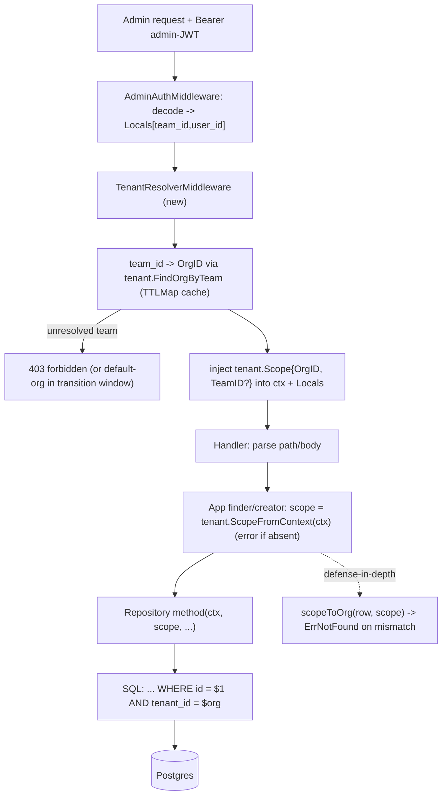

# Design: TrustGate MCP Gateway — Phase 1 (Multi-tenancy & Principal Foundation)

## Linked artifacts
- Epic plan: `.cursor/plans/trustgate_mcp_gateway_and_auth_016192dd.plan.md` (Phase 1 = `tenancy` todo)
- Exploration: none (designed directly against the code)
- **No Linear `ENG-###` supplied** — this doc is tracked in-repo. Create the ticket before
  implementation so the SDD memory contract / `/task-check` gate can run, then (optionally)
  mirror this file to `.cursor/sdd/<ENG-###>/design.md`.

> Scope note: this designs **only Phase 1** (tenant model, `identity.Principal` type, `tenant_id`
> migration, tenant-scoped admin repos/finders/handlers, tenant CRUD). MCP plane, real credential
> validation, OAuth, and STS are Phases 2–5 and appear here only as forward-compatibility constraints.

---

## Grounding (verified against the code, not assumed)

| Claim | Evidence |
|---|---|
| Admin JWT has **no `org` claim** — only `team_id`/`user_id`/`user_email` | `pkg/infra/auth/jwt/jwt_manager.go` `Claims` struct |
| `team_id` is set into Fiber `Locals` but **never used for scoping** | `pkg/api/middleware/admin_auth.go`; no readers found in repos/finders |
| Gateways are the top-level root and have **no owner/tenant column** | `admin_router.go` (`/v1/gateways/:gateway_id/...`), `migrations/...create_initial_schema.go` |
| Cross-scope guard precedent already exists | `pkg/app/consumer/finder.go` `scopeToGateway` → returns `ErrNotFound` |
| Repos are raw pgx over a shared pool, **mostly outside transactions** | `pkg/infra/repository/*/repository.go` use `r.conn.Pool.QueryRow/Query` directly |
| Migration idiom = Go `init()` + `database.Migration{ID,Name,Up,Down}`, `ADD COLUMN IF NOT EXISTS` + backfill | `migrations/20260603140000_add_auth_key_hash.go` |
| Typed IDs are generic `ids.ID[K Kind]` with a `Kind` union | `pkg/domain/ids/ids.go` |
| DI = `container.Provide(constructor)`, named server instances | `pkg/container/modules/server_admin.go`, `consumer.go` |

The most consequential finding: **today any valid admin token can read/write every gateway and its
children** — there is no tenant boundary at all. Phase 1 introduces it.

---

## Technical approach

Introduce **first-class tenant aggregates** (`Organization`, `Team`, `Membership`) in a new
`pkg/domain/tenant/` package, and a forward-looking **`identity.Principal`** in `pkg/domain/identity/`.
Add a denormalized, indexed, **`NOT NULL` `tenant_id` (org)** column plus an **optional nullable
`team_id`** to `gateways`, `consumers`, `backends`, `policies`, `auths`, with a default-org backfill
so existing rows survive.

Enforce isolation with **row-level `tenant_id` filtering at the repository layer, made mandatory by
signature** — every read/write/list method takes a `tenant.Scope` (or `OrgID`) argument and every SQL
statement carries `AND tenant_id = $org`. A new **tenant-resolver middleware** turns the admin JWT's
`team_id` into an `OrgID` (via the `Team→Org` mapping, cached) and injects a `tenant.Scope` into the
request `context.Context`. Defense-in-depth: the app-layer finders keep a `scopeToOrg` guard
(extending today's `scopeToGateway`), and a dedicated cross-tenant isolation test suite proves Org A
can never observe Org B.

`identity.Principal` is the **data-plane** authenticated subject (the MCP/proxy caller), distinct from
the admin JWT identity. Phase 1 only defines its shape and redaction behavior; Phase 2 populates it
from real validators, Phase 5 reads its retained raw token. Its `Tenant ids.OrgID` field is what ties
a data-plane request back to the Phase 1 `tenant_id` columns.

---

## Decisions

### D1 — Tenant is a first-class aggregate, not a claim-only string
- **Choice:** persist `Organization`/`Team`/`Membership` as aggregates with their own tables,
  repository, and CRUD.
- **Rejected:** *tenant-as-claim-only* — trust an `org` string in the JWT and stamp it onto rows with
  no tenant tables.
- **Rationale:** the plan explicitly requires Organization/Team/membership aggregates + CRUD; we need
  a stored `Team→Org` mapping (the token only carries `team_id`); FKs give referential integrity; and
  Phase 5's per-tenant credential isolation and future RBAC need real entities. A claim-only model has
  no place to resolve `team_id`→org and no integrity guarantees.

### D2 — Row-level `tenant_id` column, not schema/DB-per-tenant
- **Choice:** one shared schema; a denormalized `tenant_id` column on each scoped table, indexed.
- **Rejected:** schema-per-tenant or database-per-tenant.
- **Rationale:** the codebase has a single `pgxpool` and a linear migration list; per-tenant schemas
  would multiply every migration, require dynamic schema creation and connection routing, and fight
  the existing architecture. Row-level columns are the conventional fit and reuse the existing
  `gateway_id`-filtering pattern verbatim.

### D3 — Enforcement at the repository layer via a mandatory scope argument (not middleware-only, not DB RLS)
- **Choice:** every repo method requires a `tenant.Scope`/`OrgID` parameter; every query includes
  `AND tenant_id = $org`; a shared `scoped` predicate helper centralizes the clause; middleware
  resolves+injects the scope; app finders keep a `scopeToOrg` guard; an isolation test suite verifies it.
- **Rejected:**
  - *Middleware-only* — middleware can verify the path's gateway belongs to the org, but nested
    list/get still needs the repo to filter, and any direct repo call bypasses middleware. Necessary
    first gate, insufficient alone.
  - *Postgres RLS (`SET app.current_org` + policies)* — the repos issue `Pool.QueryRow` **outside**
    transactions over a shared pool, so a `SET LOCAL` GUC would either leak across pooled checkouts or
    force every single query into an explicit transaction. It also moves the security boundary into DB-role
    config, away from the hexagonal domain, and complicates migration/testing.
- **Rationale:** making `Scope` a required parameter means a developer adding a finder **cannot
  compile** without threading tenant scope — the forgotten-filter cross-tenant leak becomes a build
  error, not a silent prod incident. RLS is noted as an *optional* future defense-in-depth, not the
  primary mechanism.

### D4 — Resolve org from `team_id` (with optional direct `org` claim short-circuit)
- **Choice:** the tenant-resolver middleware maps `team_id → OrgID` via
  `tenant.Repository.FindOrgByTeam` (cached in a TTLMap); if a future token carries an explicit `org`
  claim, it short-circuits the lookup.
- **Rejected:** *require the control plane to add an `org` claim now* (hard dependency on an external
  token issuer change) and *make every handler do the lookup* (duplication, bypass risk).
- **Rationale:** the token contract today only has `team_id`; resolving through the `Team` aggregate
  keeps Phase 1 self-contained while staying compatible if `org` is added later.

### D5 — `Principal.rawToken` is unexported, redacted, request-scoped, never persisted
- **Choice:** store the raw token in an unexported field exposed via an explicit accessor; implement
  `MarshalJSON` and `slog.LogValue` to omit/redact it.
- **Rejected:** a plain exported `RawToken string`.
- **Rationale:** the cross-cutting secret rule ("referenced, not stored inline, never logged"). The
  Principal is transient (per request), so it is never written to the DB; redaction prevents accidental
  logging or JSON serialization while Phase 5 still gets the value through the accessor.

---

## Data flow



Three independent layers must all agree before a row is returned: middleware resolves the scope, the
repo query filters by it, and the app guard re-checks the loaded row. A bug in any one is caught by the
other two and by the isolation test suite.

---

## Interfaces / contracts

### IDs (`pkg/domain/ids/ids.go` — extend the `Kind` union)
```go
type Kind interface {
    GatewayKind | RegistryKind | ConsumerKind | PolicyKind | AuthKind |
        ProviderKind | ModelKind | OrgKind | TeamKind
}
type (
    OrgKind  struct{}
    TeamKind struct{}
)
type (
    OrgID  = ID[OrgKind]
    TeamID = ID[TeamKind]
)
```

### Tenant aggregates (`pkg/domain/tenant/`)
```go
// organization.go — the hard isolation boundary (a.k.a. tenant).
type Organization struct {
    ID        ids.OrgID
    Name      string
    Slug      string // url-safe unique handle
    Active    bool
    CreatedAt time.Time
    UpdatedAt time.Time
}

// team.go — a sub-group inside exactly one org.
type Team struct {
    ID        ids.TeamID
    OrgID     ids.OrgID
    Name      string
    CreatedAt time.Time
    UpdatedAt time.Time
}

// membership.go — who may administer what (light RBAC; forward-looking).
type Role string
const (
    RoleOwner  Role = "owner"
    RoleAdmin  Role = "admin"
    RoleMember Role = "member"
)
type Membership struct {
    OrgID  ids.OrgID
    TeamID *ids.TeamID // nil => org-level membership
    UserID string      // admin JWT user_id
    Role   Role
}

// scope.go — the value threaded through every scoped operation.
type Scope struct {
    OrgID  ids.OrgID
    TeamID *ids.TeamID // optional finer scope; nil = whole org
}
func (s Scope) Valid() bool { return !s.OrgID.IsNil() }
```

Each gets `New(...)`/`Rehydrate(...)`/`Validate()` and sentinel errors (`ErrInvalidName`,
`ErrNotFound`, `ErrSlugAlreadyExists`, `ErrInvalidOrgID`, …) mirroring `pkg/domain/consumer` and
`pkg/domain/gateway`.

### Tenant repository port (`pkg/domain/tenant/repository.go`)
```go
type Repository interface {
    // Organizations (the boundary itself is unscoped, but listing is admin-gated).
    SaveOrg(ctx context.Context, o *Organization) error
    UpdateOrg(ctx context.Context, o *Organization) error
    FindOrgByID(ctx context.Context, id ids.OrgID) (*Organization, error)
    ListOrgs(ctx context.Context, f ListFilter) ([]*Organization, int, error)
    DeleteOrg(ctx context.Context, id ids.OrgID) error

    // Teams — scoped to an org by construction.
    SaveTeam(ctx context.Context, t *Team) error
    FindTeamByID(ctx context.Context, scope Scope, id ids.TeamID) (*Team, error)
    ListTeams(ctx context.Context, scope Scope, f ListFilter) ([]*Team, int, error)
    DeleteTeam(ctx context.Context, scope Scope, id ids.TeamID) error

    // Resolution used by the tenant-resolver middleware.
    FindOrgByTeam(ctx context.Context, teamID ids.TeamID) (ids.OrgID, error)
}
```

### identity.Principal (`pkg/domain/identity/principal.go`) — defined now, populated in Phase 2
```go
type AuthMethod string
const (
    MethodAPIKey        AuthMethod = "api_key"
    MethodJWT           AuthMethod = "jwt"
    MethodIntrospection AuthMethod = "introspection"
    MethodMTLS          AuthMethod = "mtls"
)
func IsValidMethod(m AuthMethod) bool { /* exhaustive switch */ }

// Principal is the authenticated *data-plane* subject (MCP/proxy caller).
// Distinct from the admin-JWT identity used for Phase 1 admin scoping.
type Principal struct {
    Subject   string         // sub / oid / cert CN
    Tenant    ids.OrgID      // forward: derived from the resolved gateway/consumer tenant_id
    TeamID    *ids.TeamID
    Method    AuthMethod
    Scopes    []string
    Claims    map[string]any // raw IdP claims (groups, roles, tid, ...)
    ExpiresAt *time.Time
    rawToken  string         // Phase 5 OBO/exchange; redacted; never persisted/logged
}

func (p Principal) RawToken() string { return p.rawToken } // explicit, non-serialized accessor
func (p Principal) MarshalJSON() ([]byte, error)            // omits rawToken
func (p Principal) LogValue() slog.Value                    // redacts rawToken + Claims
func (p Principal) Validate() error
```

**Forward-feed:** Phase 2's `IdentityResolver` constructs the `Principal` from validators and attaches
it to context; Phase 5's `Exchanger` reads `RawToken()` (OBO/passthrough), `Subject` (impersonation
`sub`), `Claims["tid"]` (Entra authority), and keys its credential cache on `(Subject, target,
Tenant)` — `Tenant` is the same `OrgID` Phase 1 stamps onto rows, so cross-tenant token reuse is
structurally impossible.

### Context plumbing
- `pkg/infra/context/context_keys.go`: add `OrgIDContextKey ContextKey = "org_id"`.
- `pkg/app/tenant/context.go` (mirrors `pkg/app/consumer/context.go`): `WithScope(ctx, Scope)`,
  `ScopeFromContext(ctx) (Scope, bool)`.

---

## Migration plan

New file `pkg/infra/database/migrations/20260605xxxxxx_add_tenancy.go`, single transaction.

**Up:**
1. Create tables:
   ```sql
   CREATE TABLE organizations (
       id UUID PRIMARY KEY, name TEXT NOT NULL, slug TEXT NOT NULL,
       active BOOLEAN NOT NULL DEFAULT TRUE,
       created_at TIMESTAMPTZ NOT NULL, updated_at TIMESTAMPTZ NOT NULL,
       CONSTRAINT organizations_slug_unique UNIQUE (slug)
   );
   CREATE TABLE teams (
       id UUID PRIMARY KEY,
       org_id UUID NOT NULL REFERENCES organizations(id) ON DELETE RESTRICT,
       name TEXT NOT NULL,
       created_at TIMESTAMPTZ NOT NULL, updated_at TIMESTAMPTZ NOT NULL,
       CONSTRAINT teams_org_name_unique UNIQUE (org_id, name)
   );
   CREATE INDEX teams_org_id_idx ON teams (org_id);
   CREATE TABLE memberships (
       org_id UUID NOT NULL REFERENCES organizations(id) ON DELETE CASCADE,
       team_id UUID NULL REFERENCES teams(id) ON DELETE CASCADE,
       user_id TEXT NOT NULL, role TEXT NOT NULL,
       PRIMARY KEY (org_id, user_id, team_id)
   );
   ```
2. Seed a fixed **default organization** (constant UUID, e.g. `slug='default'`) so existing rows have a home.
3. For each of `gateways`, `consumers`, `backends`, `policies`, `auths`:
   ```sql
   ALTER TABLE <t> ADD COLUMN IF NOT EXISTS tenant_id UUID;
   ALTER TABLE <t> ADD COLUMN IF NOT EXISTS team_id   UUID;
   UPDATE <t> SET tenant_id = '<default-org-uuid>' WHERE tenant_id IS NULL;
   ALTER TABLE <t> ALTER COLUMN tenant_id SET NOT NULL;
   ALTER TABLE <t> ADD CONSTRAINT <t>_tenant_fk FOREIGN KEY (tenant_id) REFERENCES organizations(id) ON DELETE RESTRICT;
   ALTER TABLE <t> ADD CONSTRAINT <t>_team_fk   FOREIGN KEY (team_id)   REFERENCES teams(id)         ON DELETE SET NULL;
   CREATE INDEX IF NOT EXISTS <t>_tenant_id_idx ON <t> (tenant_id);
   ```
4. **Indexing for scoped queries:** plain `tenant_id` index on every table, plus composite indexes
   matching real access paths — `consumers (tenant_id, gateway_id)`, `backends (tenant_id,
   gateway_id)`, `auths (tenant_id, gateway_id)`, `policies (tenant_id, gateway_id)`.
5. **Gateway name uniqueness:** drop global `gateways_name_unique`, replace with `(tenant_id, name)`
   (gateway names become per-org unique). *(See open question OQ3.)*

**Nullability / backfill / default-org strategy:**
- `tenant_id`: added nullable → backfilled to the default org → set `NOT NULL` in the same migration,
  so no row is ever orphaned and no app code sees a null tenant.
- `team_id`: stays nullable (org-level rows are valid; team is an optional finer grouping).
- A request whose `team_id` doesn't resolve to a team maps to the default org during a transition
  window (config flag), tightening to `403` later *(OQ2)*.

**Down:** drop the FKs/indexes/columns from the five tables, restore the global gateway-name unique,
drop `memberships`, `teams`, `organizations`.

**Invariant:** `child.tenant_id == gateway.tenant_id`. FKs can't express it; enforced in the app layer
at create/associate time (and assertable by a data-integrity test). *(OQ5.)*

---

## Tenant-scoping enforcement strategy (cross-tenant-leak prevention by construction)

The threat is a **forgotten `WHERE tenant_id` clause = silent cross-tenant data leak**. Four layers,
each independently sufficient to fail-closed:

1. **Compile-time (primary):** repository read/write/list signatures **require** a
   `tenant.Scope`/`OrgID`. A new finder physically cannot be written without accepting tenant scope.
   `ListFilter` for every scoped aggregate gains a non-optional `OrgID` field.
2. **Query-level:** every SQL statement carries `AND tenant_id = $org` via a single shared
   `scoped.AndTenant(orgID)` predicate helper, so the clause is written once and reused — not retyped
   per query. `FindByID`/`Update`/`Delete` use `WHERE id = $1 AND tenant_id = $2`, so cross-org access
   returns `ErrNotFound` (never confirms existence of another org's row).
3. **App-guard (defense-in-depth):** finders keep a `scopeToOrg(row, scope)` check (the generalization
   of today's `scopeToGateway`) before returning a single row — catches a cache hit that skipped the
   DB filter.
4. **Test-level:** a mandatory cross-tenant isolation suite (below) runs against every scoped
   repository; adding an aggregate without isolation coverage fails CI.

Middleware is the *entry* gate (resolve + inject scope, reject unresolved tenants) but is explicitly
**not** trusted as the only enforcement — a direct app/repo call still fails closed because of layers 1–3.

---

## File changes (grouped into ≤400-line chained PRs)

Per `_base.mdc`, the 400-line budget forces a split. Phase 1 ships as **4 stacked PRs** (1.1 → 1.4);
cut lines are where each PR is independently compilable + testable.

### PR 1.1 — Tenant + identity domain (no infra; ~350 LOC incl. tests)
| File | Action | Purpose |
|---|---|---|
| `pkg/domain/ids/ids.go` | Modify | Add `OrgKind`/`TeamKind` + `OrgID`/`TeamID` aliases to the `Kind` union |
| `pkg/domain/tenant/organization.go` | Create | `Organization` aggregate + `New`/`Rehydrate`/`Validate` |
| `pkg/domain/tenant/team.go` | Create | `Team` aggregate (belongs to one org) |
| `pkg/domain/tenant/membership.go` | Create | `Membership` + `Role` enum |
| `pkg/domain/tenant/scope.go` | Create | `Scope` value + `Valid()` |
| `pkg/domain/tenant/errors.go` | Create | Sentinel errors |
| `pkg/domain/tenant/repository.go` | Create | `Repository` port + `ListFilter` |
| `pkg/domain/identity/principal.go` | Create | `Principal`, `AuthMethod`, redaction (`MarshalJSON`/`LogValue`), accessor |
| `pkg/domain/tenant/*_test.go`, `pkg/domain/identity/principal_test.go` | Create | Table-driven validation + redaction tests |

### PR 1.2 — Persistence + context + DI for tenancy (~380 LOC)
| File | Action | Purpose |
|---|---|---|
| `pkg/infra/database/migrations/20260605xxxxxx_add_tenancy.go` | Create | Tables, default-org seed, `tenant_id`/`team_id` columns + backfill + indexes + gateway-name uniqueness change |
| `pkg/infra/repository/tenant/repository.go` | Create | pgx implementation of `tenant.Repository` (incl. `FindOrgByTeam`) |
| `pkg/infra/repository/tenant/scoped.go` | Create | Shared `AndTenant(orgID)` predicate helper (reused by PR 1.3) |
| `pkg/infra/context/context_keys.go` | Modify | Add `OrgIDContextKey` |
| `pkg/app/tenant/context.go` | Create | `WithScope`/`ScopeFromContext` |
| `pkg/container/modules/tenant.go` | Create | Provide repo + (PR 1.4) services/handlers |
| `pkg/container/modules/modules.go` | Modify | Register the tenant module |
| `pkg/infra/repository/tenant/repository_test.go` | Create | Integration CRUD + `FindOrgByTeam` (build-tagged) |

### PR 1.3 — Scope existing repos/finders + resolver middleware (the invasive one; **forecast ≈ 430 LOC → split if it lands over budget into 1.3a gateway+consumer, 1.3b backend+auth+policy**)
| File | Action | Purpose |
|---|---|---|
| `pkg/api/middleware/tenant.go` | Create | `TenantResolverMiddleware`: `team_id → OrgID` (TTLMap cached), inject `tenant.Scope` |
| `pkg/domain/{gateway,consumer,backend,auth,policy}/repository.go` | Modify | Add `OrgID` to `ListFilter`; add scope params to `FindByID/Update/Delete` |
| `pkg/infra/repository/{gateway,consumer,backend,auth,policy}/repository.go` | Modify | Add `AND tenant_id = $org` to all queries; stamp `tenant_id`/`team_id` on insert; scan new columns |
| `pkg/app/{gateway,consumer,backend,auth,policy}/finder.go` (+ creators) | Modify | Read scope from ctx; `scopeToOrg` guard; pass `OrgID` to repo |
| `pkg/api/middleware/tenant_test.go`, updated repo/finder tests | Create/Modify | Resolver test + scoped-query tests |
| `pkg/infra/repository/isolation_test.go` | Create | **Cross-tenant isolation suite** across all five aggregates |

### PR 1.4 — Tenant CRUD endpoints + handler wiring (~390 LOC)
| File | Action | Purpose |
|---|---|---|
| `pkg/app/tenant/{creator,updater,deleter,finder}.go` | Create | Org/Team application services |
| `pkg/api/handler/http/tenant/{create,get,list,update,delete}_*_handler.go` | Create | Org + Team CRUD handlers |
| `pkg/api/handler/http/tenant/request,response/*.go` | Create | DTOs + validation + Swagger annotations |
| `pkg/server/router/admin_router.go` | Modify | Mount `/v1/orgs`, `/v1/orgs/:org_id/teams`; insert `TenantResolverMiddleware` after `AdminAuth` on the gateways group |
| `pkg/container/modules/server_admin.go`, `modules/tenant.go` | Modify | Add handlers to `adminRouterParams`/`AdminRouterDeps` + provide constructors |
| handler tests | Create | Happy/validation paths per `params_test.go`/`errors_test.go` style |

> Stacking: 1.1 is pure domain (mergeable alone); 1.2 adds the table without changing behavior; 1.3
> flips on enforcement; 1.4 exposes management. If 1.3 exceeds 400 changed lines at implementation
> time, cut at the aggregate boundary (1.3a/1.3b) — the shared `scoped.AndTenant` helper from 1.2 keeps
> both halves small.

---

## Testing strategy

| Layer | What to test | How |
|---|---|---|
| Unit (table-driven) | `tenant` aggregates: `New`/`Validate` (empty name, nil org, bad role, slug rules); `Scope.Valid` | Pure, `testify/require`, `t.Parallel()` |
| Unit | `identity.Principal`: `Validate`, `IsValidMethod` exhaustiveness, **`MarshalJSON`/`LogValue` redact `rawToken` & sensitive claims**, accessor returns value | Pure |
| Integration (build tag) | `tenant` repo CRUD + `FindOrgByTeam`; backfill assigns default org; `NOT NULL` after migrate; up/down idempotent | Real Postgres test DB |
| **Integration — cross-tenant isolation (security gate)** | Seed Org A & Org B each with gateway+consumer+backend+auth+policy; for every aggregate's finder assert A's scope: `FindByID(B's id)→ErrNotFound`, `List→only A's rows`, `Update/Delete(B's id)→ErrNotFound` | Table-driven over a `[]scopedRepo` slice; one row per aggregate so a new aggregate must register or the table is visibly incomplete |
| Unit/middleware | `TenantResolverMiddleware`: `team_id`→`OrgID` happy path, unknown team → transition default vs `403`, cache hit | Fiber test app + fake `tenant.Finder` |
| Handler | Org/Team CRUD happy + validation + 404/409 mapping | Fiber app, mocked services (mirrors existing handler tests) |

Assert on behavior (cross-tenant returns `ErrNotFound`, not "filtered to N rows"), never on internal
SQL — per `_base.mdc`.

---

## Migration / rollout

- Single forward migration; reversible `Down`. No feature flag needed for the schema, but gate the
  **unknown-`team_id` behavior** behind a config flag (`tenant.allow_default_org_fallback`, default
  `true`) so existing tokens keep working, then flip to strict (`403`) once orgs/teams are populated.
- Backfill is in-migration (default org), so deploy order is: migrate → roll out scoped binaries. Old
  binaries tolerate the new columns (they ignore them) so there's no hard coupling during a rolling deploy.

---

## Open questions (lock before implementation)

1. **Org-claim vs team→org resolution (OQ1).** Recommended: resolve via `Team→Org` lookup + accept an
   optional `org` claim if present. Confirm the control plane won't simply start emitting `org` (which
   would simplify D4).
2. **Unknown `team_id` during transition (OQ2).** Default-org fallback (recommended, flagged) vs hard
   `403`. Pick the transition policy and the flag's default-off date.
3. **Gateway name uniqueness (OQ3).** Move `UNIQUE(name)` → `UNIQUE(tenant_id, name)`? Recommended yes
   (names become per-org). Confirm nothing external depends on globally-unique gateway names.
4. **Membership shape & whether it's load-bearing in Phase 1 (OQ4).** Phase 1 scoping only needs
   `Team→Org`. Is `Membership` (user↔org/team RBAC) required now, or define the table + aggregate but
   defer enforcement to a later RBAC phase? Recommended: create it, don't enforce yet.
5. **`child.tenant_id == gateway.tenant_id` invariant (OQ5).** Enforce in app layer at create/associate
   (recommended) — and additionally block cross-org `auth/backend/policy` association on a consumer
   (FKs can't express "same org"). Confirm this association-time check is in Phase 1 scope vs Phase 3.
6. **`Principal` placement vs admin identity (OQ6).** Confirm `identity.Principal` is data-plane-only in
   Phase 1 and the admin plane uses `tenant.Scope` (not `Principal`) — i.e. we are *not* unifying admin
   and data-plane identity now.
7. **Default-org UUID provenance (OQ7).** Hardcoded constant in the migration vs derived
   deterministically — confirm a fixed constant is acceptable for reproducible environments/tests.
