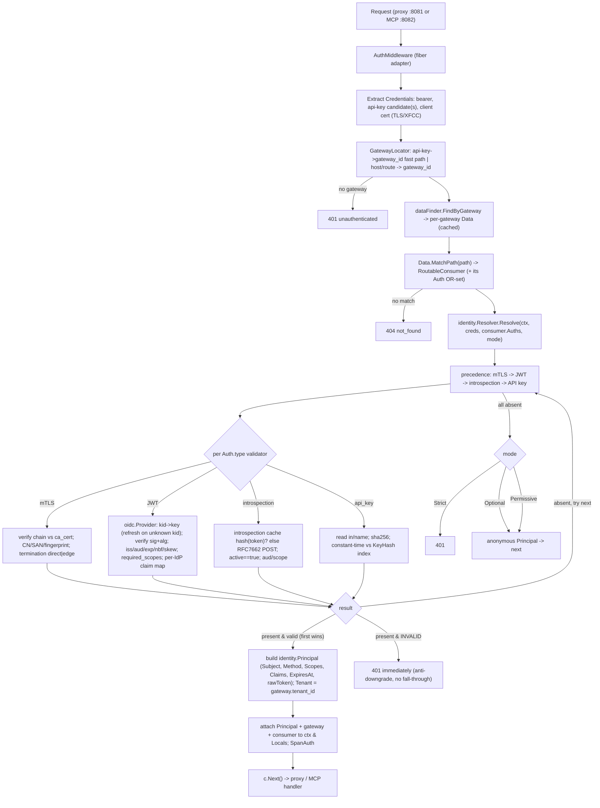

# Design: TrustGate MCP Gateway — Phase 2 (Inbound Credential Validation)

## Linked artifacts
- Epic plan: `.cursor/plans/trustgate_mcp_gateway_and_auth_016192dd.plan.md` (Phase 2 = `inbound-auth` todo; "Inbound auth flows (per Auth style)" A1–A9; Appendix A config examples)
- Phase 1 design: `docs/design/trustgate-mcp-gateway-phase1-tenancy.md` — Phase 2 **consumes** the `identity.Principal`, `tenant.Scope`, typed `ids`, DI/module, and migration idioms it establishes
- **No Linear `ENG-###` supplied** — this doc is tracked in-repo. Create the ticket before
  implementation so the SDD memory contract / `/task-check` gate can run, then (optionally) mirror
  this file to `.cursor/sdd/<ENG-###>/design.md`.

> Scope note: this designs **only Phase 2** — replacing the inbound credential stub with a real,
> transport-agnostic resolver that validates API key / JWT(JWKS) / introspection / mTLS against a
> consumer's `Auth` OR-set and populates the Phase 1 `identity.Principal`. The MCP plane (Phase 3),
> the MCP OAuth RS/AS challenge (Phase 4 — A9), and the STS / downstream credential federation
> (Phase 5) appear here only as forward-compatibility seams.
>
> **Hard prerequisite:** Phase 1 must merge first. `pkg/domain/identity` and `pkg/domain/tenant` do
> **not exist in the tree today** (verified: `Glob pkg/domain/{identity,tenant}/**` → 0 files); this
> design treats the Phase 1 `Principal`/`Scope`/`OrgID` shapes as committed contracts, not as code to
> redefine.

---

## Grounding (verified against the code, not assumed)

| Claim | Evidence |
|---|---|
| The "stub" is **not** the plan's `headerIdentityResolver` trusting `X-Gateway-Id`. It has already evolved to `apiKeyIdentityResolver`, which reads the `X-AG-API-Key` header and calls `APIKeyFinder.FindByAPIKey`. **This** is what Phase 2 replaces. | `pkg/api/middleware/auth.go` (`apiKeyIdentityResolver`, `HeaderAPIKey = "X-AG-API-Key"`) |
| `IdentityResolver.Resolve(c *fiber.Ctx) (Identity, error)` returns `Identity{GatewayID, AuthID}` — it is **fiber-coupled** and produces no `Principal`. Replacing it transport-agnostically is the core refactor. | `pkg/api/middleware/auth.go` lines 19–46 |
| The gateway today is derived **from the credential** (API key → `Auth.GatewayID`), then `dataFinder.FindByGateway` loads the read model, then the handler path-matches. Non-API-key credentials carry no gateway → resolution order must change. | `auth.go` `Middleware()`; `proxy_handler.go` `resolveConsumer` |
| `auth.Config` has only `OAuth2 *OAuth2Config` and `MTLS *MTLSConfig`. **There is no `APIKey` config sub-struct in Go.** API-key material lives as `Auth.KeyHash`/`Auth.RawKey` columns; the legacy `config.api_key.key` JSON is only referenced in a backfill. The Appendix A1 `api_key.in`/`name` (header/query/cookie placement) is **not modeled** — keys are always read from `X-AG-API-Key`. | `pkg/domain/auth/config.go`; `pkg/domain/auth/auth.go` (`KeyHash`, `RawKey`, `HashAPIKey`); `migrations/20260603140000_add_auth_key_hash.go` |
| `OAuth2Config` already has `Issuer, Audiences, JWKSURL, IntrospectionURL, ClientID, ClientSecret, RequiredScopes, Algorithms`. It has **no** clock-skew/leeway, no JWKS cache TTL, no `tid`-pin pattern, no claim-name mappings (groups/roles), no required-claims map. These are the gaps Phase 2 adds. | `pkg/domain/auth/config.go` lines 15–24 |
| The per-gateway aggregated read model already resolves and attaches each consumer's full `Auth` set: `RoutableConsumer.Auths = collectAuths(c.AuthIDs, authByID)`. **Validators get the OR-set per consumer with zero extra DB hits.** | `pkg/app/consumer/data_finder.go` (`loadAuths`); `pkg/app/consumer/consumer_data.go` (`RoutableConsumer.Auths`) |
| `cache.TTLMap` has a **single fixed TTL per namespace** (`Set` always uses `now + m.ttl`); there is **no per-entry expiry**. "Cache introspection until token `exp`" cannot be expressed by TTLMap alone — the value must carry its own `exp` and be re-checked on read. | `pkg/infra/cache/ttlmap.go` (`Set`); `pkg/infra/cache/ttlmap_manager.go` (named TTL constants) |
| `golang-jwt/jwt/v5` is a direct dependency; there is **no** JWKS / JWK-parsing / jose library. RS/ES verification needs `crypto.PublicKey`s built from a JWKS document — a new dependency or a hand-rolled JWK decoder is required (incl. Ed25519/`OKP`). | `go.mod` (`golang-jwt/jwt/v5 v5.3.1`; no `jwx`/`keyfunc`/`go-jose`) |
| DI idiom: `c.Provide(constructor)` in `pkg/container/modules/*`; the resolver + middleware are wired in `API()` (`NewAPIKeyIdentityResolver`, `NewAuthMiddleware`). New providers slot in here / in a new `modules/identity.go`. | `pkg/container/modules/api.go`; `pkg/container/modules/auth.go` |
| Tracing exposes `SpanMCP`/`SpanLLM` via `RequestTrace.StartSpan(type, name)`, but `Span` only allocates `LLM`/`Plugin` attribute structs (`newSpan`). Auth spans need either a generic attribute bag or to ride the existing plugin/LLM fields. | `pkg/infra/trace/span.go` (`newSpan`); `pkg/infra/trace/trace.go` (`StartSpan`) |
| Migration idiom = Go `init()` + `database.RegisterMigration(database.Migration{ID,Name,Up,Down})`, `ADD COLUMN IF NOT EXISTS` + backfill, reversible `Down`. | `migrations/20260603140000_add_auth_key_hash.go` |
| Server ports come from `config.ServerConfig` (`AdminPort 8080`, `ProxyPort 8081`); env-driven with defaults. A rollout flag for the resolver follows this idiom (`getEnvBool`/`getEnvDuration`). | `pkg/config/config.go` |

The most consequential finding: **the live resolver is API-key-only and gateway-from-credential.**
Phase 2 is therefore not "fill in a stub" but a **resolution-order inversion** — resolve
gateway+consumer first, then validate the caller against *that consumer's* Auth OR-set — plus four new
validators behind a transport-agnostic port.

---

## Technical approach

Introduce a **transport-agnostic `identity.Resolver`** in a new app package `pkg/app/identity/` that
takes an extracted, framework-neutral `Credentials` snapshot plus the matched consumer's `Auth` OR-set
and returns a populated Phase 1 `*identity.Principal`. The resolver iterates the consumer's enabled
`Auth` entries in a **fixed precedence (mTLS → JWT → introspection → API key)**, dispatches each to a
`Validator` selected by `auth.Type`, and applies the **anti-downgrade rule**: a credential that is
*present but invalid* fails the whole request `401` immediately — no silent fall-through to a weaker
method.

Concrete validators live under `pkg/infra/auth/`: `oidc` (OIDC discovery via
`.well-known/openid-configuration` + a JWKS cache with refresh-on-unknown-`kid`, RS/EC/Ed25519),
`introspection` (RFC 7662, cached by `hash(token)` until the token's own `exp`), and a `validator`
package binding API-key / JWT / introspection / mTLS to the `identity.Validator` port. **Per-IdP
quirks are claim-mapping strategies** (`pkg/infra/auth/idp/`) selected by issuer, not separate
validators: Entra (`oid`→subject, `tid` pin/read, `scp`/`roles`), Okta (org vs custom AS), Keycloak
(`realm_access`/`resource_access.<client>.roles`, the `aud=account` trap), Auth0 (`permissions`),
Google (opaque access tokens → routed to introspection, never JWKS), generic OIDC.

The fiber `AuthMiddleware` becomes a **thin adapter**: it (1) extracts `Credentials` from the request
(headers/query/cookies + TLS/XFCC client cert), (2) resolves the gateway and loads the existing
per-gateway `Data` read model, (3) path-matches the `RoutableConsumer` (moved up from the proxy
handler so the OR-set is known at validation time), (4) calls `identity.Resolver.Resolve`, (5) on
success attaches the `*identity.Principal`, gateway, and matched consumer to `context.Context` and
fiber `Locals`. Because step 4 is pure (`context.Context` + values in, `Principal` out), **the Phase 3
MCP plane reuses the same resolver verbatim** behind its own router.

Validators populate the Phase 1 `Principal` and **never** redefine it: `Subject` (`sub`/`oid`/cert CN),
`Method` (`MethodAPIKey|MethodJWT|MethodIntrospection|MethodMTLS`), `Scopes`, `Claims` (raw IdP claims
incl. `tid`, groups, roles), `ExpiresAt`, and the redacted `rawToken` (set via a constructor, read via
`RawToken()` for Phase 5 OBO/passthrough). **`Principal.Tenant` is the TrustGate `OrgID` of the
resolved gateway/consumer (Phase 1 `tenant_id`), not the token's `tid`** — see D9.

---

## Decisions

### D1 — `Validator` is an app-layer port; orchestration in `pkg/app/identity`, concretes in `pkg/infra/auth`
- **Choice:** define `identity.Validator` and `identity.Resolver` in `pkg/app/identity/` (the
  consumer of the abstraction, per "accept interfaces" / Go rules). Concrete validators
  (`apikey`, `jwt`, `introspection`, `mtls`) live in `pkg/infra/auth/validator/`; the OIDC provider
  and introspector live in `pkg/infra/auth/oidc/` and `pkg/infra/auth/introspection/`. The fiber
  middleware is a transport adapter only.
- **Rejected:**
  - *Keep everything in `pkg/api/middleware`* — couples validation to fiber, blocks Phase 3 MCP reuse,
    and grows an already-load-bearing package.
  - *Put the port in `pkg/domain/identity`* — the domain owns `Principal` (data), but a validator does
    network I/O (JWKS/introspection) and HTTP-request parsing, which is infra/app concern; keeping the
    port in the domain would drag transport types into the domain.
- **Rationale:** the resolver must be callable from both the proxy and MCP planes with no fiber import;
  defining the port where it's consumed and returning structs matches `golang.mdc` and mirrors how
  `appconsumer.DataFinder` / `appauth.APIKeyFinder` are already structured.

### D2 — `Credentials` is a framework-neutral snapshot extracted at the edge
- **Choice:** a `identity.Credentials` value object (`BearerToken`, `APIKeyCandidates`, `ClientCert
  *x509.Certificate` + `Chain`, plus a `Lookup(in, name)` over headers/query/cookies) is built once by
  the fiber adapter and passed to the resolver. Validators read from it, never from `*fiber.Ctx`.
- **Rejected:** passing `*fiber.Ctx` (or `*http.Request`) into validators — re-introduces the
  transport coupling D1 removes and makes table-driven validator tests need a live fiber app.
- **Rationale:** API-key placement (`in`/`name`, see D8) and mTLS edge-termination (XFCC, see D7) both
  need request-shaped access; a neutral snapshot gives validators exactly that and makes them pure +
  trivially testable.

### D3 — JWKS cache: per-issuer key set in a dedicated TTLMap namespace, refresh-on-unknown-`kid`, single-flight
- **Choice:** `oidc.Provider` caches `{issuer → keySet}` in a new `cache.TTLMap` namespace
  (`OIDCKeysTTLName`, ~1 h soft TTL) keyed by JWKS URL. Lookup is by `kid`; **an unknown `kid` forces
  one refresh** (bypassing TTL), coalesced via `golang.org/x/sync/singleflight` (already a dep, used by
  `dataFinder`) so a key rotation triggers exactly one fetch under load. A negative-result guard
  (short TTL) prevents a forged `kid` from hammering the IdP. Discovery
  (`.well-known/openid-configuration`) is cached the same way to resolve `jwks_url`/`introspection_url`
  when only `issuer` is configured.
- **Rejected:**
  - *Fetch JWKS per request* — defeats the "offline-after-JWKS" property (plan A2) and adds IdP latency
    to the hot path.
  - *Background refresh goroutine per issuer* — leaks goroutines per gateway config churn
    (`golang.mdc`: clear goroutine lifecycle); lazy refresh-on-miss + soft TTL covers rotation without
    a reaper.
- **Rationale:** matches the plan's A2 sequence diagram (cache miss/rotated → GET jwks_url) and reuses
  the established TTLMap + singleflight pattern; refresh-on-unknown-`kid` is the standard, correct
  handling of mid-flight key rotation.

### D4 — Introspection cache: keyed by `hash(token)`, value carries its own `exp`, capped TTL
- **Choice:** cache successful RFC 7662 results in a new namespace (`IntrospectionTTLName`) keyed by
  `sha256(token)` (hex) — **never the raw token**. Because `TTLMap` has no per-entry expiry (grounding),
  the cached value stores the IdP-reported `exp`; on read, an entry past `exp` is treated as a miss.
  The namespace TTL is a **safety cap** (`min(configured_cap, exp-now)` semantics enforced by the
  value's own `exp`), so a long-lived token is still re-introspected at the cap.
- **Rejected:**
  - *Cache the raw token as the key* — secret-in-memory-key risk; hashing is the norm and matches the
    existing API-key hash pattern (`HashAPIKey`).
  - *No cache* — hammers the IdP (plan A6 explicitly warns against this).
  - *Cache `active:false`* — would mask a just-activated/-revoked token; negatives are not cached (or
    only for a few seconds) to keep revocation latency low.
- **Rationale:** the plan's stated trade-off is "real-time revocation visibility vs IdP load." Capping
  positive-cache lifetime at the token `exp` (and offering a small operator cap) bounds the revocation
  window while removing per-request IdP calls. **This is the only validator with a revocation knob**;
  JWKS-verified JWTs are valid until `exp` by construction.

### D5 — OR-set precedence is fixed (mTLS → JWT → introspection → API key) with strict anti-downgrade
- **Choice:** the resolver tries validators in a **fixed strength order**, independent of `auth_ids`
  ordering. The first validator whose credential is *present and valid* wins. If any validator finds
  its credential **present but invalid** (bad sig, expired, wrong aud/iss/alg, mismatched cert), the
  request fails `401` immediately — no fall-through to a weaker method. "No credential at all" →
  `401` (Strict) per D6.
- **Rejected:**
  - *Honor `auth_ids` order* — lets an operator accidentally rank API key above mTLS; a downgrade
    attacker could then strip the cert and present a key.
  - *"Any valid wins, ignore invalids"* — the classic confused-deputy/downgrade hole: present a valid
    weak credential alongside a tampered strong one and the strong failure is silently ignored.
- **Rationale:** matches plan A8 exactly ("fixed precedence … a credential present but invalid returns
  401 immediately"). Fixed precedence + anti-downgrade is the defensible, testable contract (see the
  anti-downgrade test in Testing strategy).

### D6 — Validation mode (Strict / Optional / Permissive) lives on the resolver call, sourced per gateway
- **Choice:** a `identity.Mode` enum threaded into `Resolver.Resolve`. **Strict** (default): no valid
  credential → `401`. **Optional**: no credential → proceed with a `nil`/anonymous `Principal`
  (endpoint decides); a *present-but-invalid* credential **still** fails (anti-downgrade is mode
  independent). **Permissive** (migration only, D-rollout): validate and attach the `Principal` if
  possible, but **never reject** — log the would-be decision. Mode is read from gateway config
  (forward: per-consumer override), defaulting Strict.
- **Rejected:** a global build flag — can't do per-gateway opt-in during rollout; baking mode into each
  validator — duplicates the policy across four validators.
- **Rationale:** Permissive is the safe stub→real cutover (D-rollout); Optional supports future public
  endpoints; centralizing mode in the orchestrator keeps validators single-purpose (return
  valid/invalid/absent, not "should I 401").

### D7 — mTLS termination trust: explicit `direct` vs `edge` (XFCC), default `direct`
- **Choice:** `MTLSConfig` gains a `termination` discriminator. **`direct`**: read the verified client
  cert from the TLS connection state (fasthttp `c.Context().Conn().(*tls.Conn).ConnectionState()`);
  the gateway terminates TLS with `tls.RequireAnyClientCert` (chain re-verified in-app against
  `ca_cert`, so we don't rely solely on the listener). **`edge`**: trust a configured forwarding header
  (`X-Forwarded-Client-Cert`, Envoy/Gateway-API style) **only when the peer is an allow-listed edge**
  (`trusted_proxy_cidrs`), parsing the cert from XFCC. Either way the leaf is checked against
  `allowed_common_names` / `allowed_dns_names` (SAN) / `allowed_fingerprints` and validity (optional
  CRL/OCSP later).
- **Rejected:**
  - *Always trust XFCC* — anyone who can set the header spoofs any client identity; a catastrophic auth
    bypass.
  - *Direct-only* — breaks behind Gateway API / L7 LBs that terminate TLS (the common k8s topology).
- **Rationale:** the plan A7 names both modes; making termination explicit + gating `edge` behind a
  trusted-proxy allowlist is the only safe way to honor a forwarded cert.

### D8 — API-key placement (`in`/`name`) added to config; lookup stays a hashed consumer/auth index
- **Choice:** add an `APIKeyConfig{ In ("header"|"query"|"cookie"), Name string }` to `auth.Config`
  (gap: the live `X-AG-API-Key`-only resolver can't honor Appendix A1's `Authorization`/header/query/
  cookie placement). Extraction reads the configured location; the value is hashed (`HashAPIKey`,
  constant-time compare against the stored `KeyHash`) and resolved via the existing
  `FindByAPIKeyHash`/`APIKeyFinder` index. `X-AG-API-Key` remains the default when no placement is set
  (back-compat).
- **Rejected:** keep header-only — diverges from the documented config surface and the partner use
  cases (`Authorization: Bearer sk_...`).
- **Rationale:** zero change to the secure storage model (hash + unique partial index already exist
  from `20260603140000_add_auth_key_hash`); only *where we read the candidate* becomes configurable.
  Constant-time compare + hashed index preserves the "no plaintext key at rest, no timing leak"
  property.

### D9 — `Principal.Tenant` binds to the TrustGate `OrgID`, not the IdP `tid`
- **Choice:** `Principal.Tenant` is set from the **resolved gateway/consumer `tenant_id`** (Phase 1),
  not from the token. The IdP tenant (`tid`, Keycloak realm, Okta org) is preserved in
  `Principal.Claims` for Phase 5 authority derivation (Entra OBO uses `claims["tid"]`).
- **Rejected:** `Principal.Tenant = tid` (as plan A2's prose shorthand suggests) — would let an
  externally-controlled claim drive internal tenant isolation, and multi-IdP gateways have no single
  `tid`.
- **Rationale:** Phase 1 makes `tenant_id` the hard isolation boundary; the token only proves *who the
  caller is*, the gateway config decides *which org owns the endpoint*. This keeps Phase 5's
  per-`(subject, target, tenant)` credential cache structurally non-cross-tenant (Phase 1 D-feed).
  A defense check (D11) rejects a token whose issuer isn't trusted by the matched consumer.

### D10 — Issuer→validator registry is built per gateway from the `Auth` OR-set, cached with `Data`
- **Choice:** the JWT/introspection validators select their config by **`iss` → `*auth.OAuth2Config`**.
  The map is derived from the matched consumer's `Auths` (already in `RoutableConsumer.Auths`), so it's
  per-gateway and refreshes with the `consumer_data` TTL/event invalidation — **no separate registry
  lifecycle**. The `oidc.Provider`/`introspection.Introspector` (holding the network caches) are
  process-singletons injected by DI; only the *selection* is per-request.
- **Rejected:**
  - *A global issuer registry* — can't express "gateway A trusts Entra, gateway B trusts Keycloak"; a
    token valid for one tenant's IdP would validate on another's endpoint.
  - *A standalone per-gateway registry cache* — duplicates the `Data` cache + its Kafka-driven
    invalidation already built in Phase-3-adjacent infra.
- **Rationale:** trust is per-gateway by construction (Auth rows carry `gateway_id`); reusing the
  existing read model avoids a parallel cache and gives correct multi-IdP isolation for free.

### D11 — Resolution order inverts: gateway+consumer first, then validate against that OR-set
- **Choice:** move path→consumer matching **into the auth step** (middleware/app), before credential
  validation, so the consumer's `Auth` OR-set (and trusted issuers) is known. The gateway is located
  by a pluggable `GatewayLocator` (see Open Question 1): API key keeps its fast path (key → `gateway_id`
  via `Auth` row); token/mTLS requests resolve the gateway from a request attribute (host / route
  prefix). The proxy handler's `resolveConsumer`/`consumerHasAuth` then reads the already-matched
  consumer + `Principal` from context instead of re-deriving them.
- **Rejected:** keep "gateway from credential, match path later" — impossible for JWT/mTLS, which carry
  no gateway, and it can't run an OR-set because the consumer is unknown at validation time.
- **Rationale:** the plan's shared pre-step is explicitly "Resolve Consumer from path → Gateway +
  tenant + auth_ids → run the matching validator per Auth.type." This inversion is the structural
  change that makes A8 (multi-auth) and non-API-key flows possible at all.

---

## Data flow



Three properties hold by construction: (1) trust is per-gateway (validators only see the matched
consumer's Auth set, D10); (2) a tampered strong credential can never be downgraded to a weak one
(D5); (3) the resolver is pure over `(ctx, Credentials, []*auth.Auth, Mode)` so Phase 3's MCP plane
calls it unchanged.

---

## Interfaces / contracts

### Phase 1 types consumed (NOT redefined — see `phase1-tenancy.md`)
```go
// pkg/domain/identity/principal.go — defined in Phase 1, populated here.
type Principal struct {
    Subject   string            // sub / oid / cert CN
    Tenant    ids.OrgID         // D9: from resolved gateway.tenant_id, NOT token tid
    TeamID    *ids.TeamID
    Method    AuthMethod        // MethodAPIKey | MethodJWT | MethodIntrospection | MethodMTLS
    Scopes    []string
    Claims    map[string]any    // raw IdP claims (tid, groups, roles, realm_access, permissions, ...)
    ExpiresAt *time.Time
    rawToken  string            // redacted; set via constructor; read via RawToken()
}
// Phase 2 adds a constructor next to the type so rawToken can be set without exporting it:
func NewPrincipal(p PrincipalParams) (*Principal, error) // sets rawToken, validates
```

### Resolver + Validator ports (`pkg/app/identity/`)
```go
// resolver.go — transport-agnostic; shared by proxy (now) and MCP plane (Phase 3).
type Mode int
const ( ModeStrict Mode = iota; ModeOptional; ModePermissive )

type Resolver interface {
    // Resolve runs the consumer's Auth OR-set in fixed precedence and returns a
    // populated Principal, or an error. anti-downgrade: a present-but-invalid
    // credential returns ErrInvalidCredential regardless of mode.
    Resolve(ctx context.Context, creds Credentials, auths []*auth.Auth, mode Mode) (*identity.Principal, error)
}

var (
    ErrNoCredential      = errors.New("identity: no credential presented")
    ErrInvalidCredential = errors.New("identity: credential present but invalid") // => 401, no fall-through
)

// validator.go — implemented in pkg/infra/auth/validator. "Accept interfaces" per golang.mdc.
type Outcome int
const ( OutcomeAbsent Outcome = iota; OutcomeValid; OutcomeInvalid )

type Validator interface {
    // Type reports which auth.Type this validator handles (precedence is fixed by the resolver).
    Type() auth.Type
    // Validate inspects creds for THIS auth entry. Absent => try next; Invalid => 401 now; Valid => Principal.
    Validate(ctx context.Context, creds Credentials, a *auth.Auth) (Outcome, *identity.Principal, error)
}
```

### Credentials snapshot (`pkg/app/identity/credentials.go`)
```go
type CredentialLocation string // "header" | "query" | "cookie"

type Credentials struct {
    BearerToken string                 // parsed from Authorization: Bearer
    ClientCert  *x509.Certificate      // leaf (TLS conn state or parsed XFCC)
    Chain       []*x509.Certificate
    EdgeVerified bool                  // true only if XFCC came from a trusted proxy (D7)

    lookup func(in CredentialLocation, name string) (string, bool) // header/query/cookie access
}
func (c Credentials) Get(in CredentialLocation, name string) (string, bool) { return c.lookup(in, name) }
```

### OIDC provider (`pkg/infra/auth/oidc/provider.go`)
```go
type KeySet interface{ Key(kid string) (crypto.PublicKey, bool) }

type Provider interface {
    // Discover resolves jwks_url / introspection_url from issuer's well-known doc (cached).
    Discover(ctx context.Context, issuer string) (Metadata, error)
    // KeyFunc returns a jwt.Keyfunc bound to issuer; on unknown kid it refreshes once (singleflight).
    KeyFunc(ctx context.Context, jwksURL string) (jwt.Keyfunc, error)
}
// backed by cache.TTLMap namespaces OIDCDiscoveryTTLName / OIDCKeysTTLName + singleflight.Group
```

### Introspector (`pkg/infra/auth/introspection/introspector.go`)
```go
type Result struct {
    Active bool
    Subject string
    Scope  string            // space-delimited per RFC 7662
    Audience []string
    Claims map[string]any
    ExpiresAt time.Time       // drives the cache entry's own expiry (D4)
}
type Introspector interface {
    Introspect(ctx context.Context, cfg auth.OAuth2Config, token string) (Result, error)
}
// cache key = hex(sha256(token)); value carries ExpiresAt; namespace IntrospectionTTLName is a safety cap.
```

### Per-IdP claim mapping (`pkg/infra/auth/idp/`)
```go
// mapper.go — selected by issuer host pattern; turns verified claims into Principal fields.
type Mapper interface {
    Subject(claims jwt.MapClaims) string         // entra: oid; default: sub
    Scopes(claims jwt.MapClaims) []string         // scp | scope | permissions (auth0) | roles
    Tenant(claims jwt.MapClaims) (string, bool)   // entra tid; keycloak realm; -> Claims, not Principal.Tenant (D9)
}
// concrete: entra.go, okta.go, keycloak.go (realm_access/resource_access; aud=account guard), auth0.go,
// google.go (opaque access token detection -> force introspection), generic.go (RFC-compliant default).
```

### Validators building the Principal (`pkg/infra/auth/validator/`)
```go
// jwt.go (sketch of the Principal build, per A2):
//   tok, err := jwt.Parse(creds.BearerToken, provider.KeyFunc(ctx, cfg.JWKSURL),
//                jwt.WithValidMethods(cfg.Algorithms), jwt.WithLeeway(skew),
//                jwt.WithIssuer(cfg.Issuer), jwt.WithAudience(oneOf(cfg.Audiences)))
//   -> err class maps to OutcomeInvalid (sig/alg/exp/aud/iss) vs OutcomeAbsent (no bearer)
//   m := idp.For(cfg.Issuer)
//   return OutcomeValid, identity.NewPrincipal(PrincipalParams{
//       Subject: m.Subject(claims), Method: identity.MethodJWT,
//       Scopes: subsetCheck(m.Scopes(claims), cfg.RequiredScopes),
//       Claims: claims, ExpiresAt: claims.exp, RawToken: creds.BearerToken })
//
// apikey.go: hashed, constant-time compare vs Auth.KeyHash (D8); Method=MethodAPIKey; Subject = auth name/id.
// mtls.go:   verify chain vs cfg.MTLS.CACert; CN/SAN/fingerprint allowlists; termination direct|edge (D7);
//            Method=MethodMTLS; Subject = leaf CN or first SAN; rawToken empty.
// introspection.go: wraps Introspector; active==true + aud/scope; Method=MethodIntrospection.
```

### Fiber adapter (replaces `pkg/api/middleware/auth.go`)
```go
type AuthMiddleware struct {
    resolver   identity.Resolver
    locator    GatewayLocator               // D11 / OQ1
    dataFinder appconsumer.DataFinder
    gateways   appgateway.Finder
    mode       func(*gateway.Gateway) identity.Mode
}
func (m *AuthMiddleware) Middleware() fiber.Handler // extract creds -> locate gw -> Data -> MatchPath -> Resolve -> attach
// attaches: appidentity.WithPrincipal(ctx, p), appconsumer.WithData/GatewayID, the matched RoutableConsumer.
```

### Context plumbing (`pkg/app/identity/context.go`, mirrors `pkg/app/consumer/context.go`)
```go
func WithPrincipal(ctx context.Context, p *identity.Principal) context.Context
func PrincipalFromContext(ctx context.Context) (*identity.Principal, bool)
// new key in pkg/infra/context/context_keys.go: PrincipalContextKey ContextKey = "principal"
```

---

## Migration / config plan

Phase 2 is mostly additive config on the existing `auths.config` JSONB; **no column changes are
strictly required** because new `OAuth2Config`/`MTLSConfig`/`APIKeyConfig` fields ride the existing
JSON `Scan`/`Value`. One optional migration tidies API-key placement back-compat.

**Config additions** (`pkg/domain/auth/config.go`, JSON-back-compatible — old rows omit the fields):
```go
type OAuth2Config struct {
    Issuer, JWKSURL, IntrospectionURL, ClientID, ClientSecret string
    Audiences, RequiredScopes, Algorithms []string
    // NEW (Phase 2):
    Leeway            *Duration         `json:"leeway,omitempty"`             // clock skew; default 60s
    IssuerPattern     string            `json:"issuer_pattern,omitempty"`     // Entra v2 multi-tenant {tid}
    RequiredClaims    map[string]string `json:"required_claims,omitempty"`    // e.g. {"tid":"<guid>"} single-tenant pin
    GroupsClaim       string            `json:"groups_claim,omitempty"`       // Okta/Keycloak group mapping
    OpaqueToken       bool              `json:"opaque_token,omitempty"`       // Google access tokens => introspection
}
type MTLSConfig struct {
    CACert string; AllowedCommonNames, AllowedDNSNames, AllowedFingerprints []string
    // NEW (Phase 2):
    Termination       string   `json:"termination,omitempty"`        // "direct" (default) | "edge"
    ForwardedCertHeader string `json:"forwarded_cert_header,omitempty"` // default "X-Forwarded-Client-Cert"
    TrustedProxyCIDRs []string `json:"trusted_proxy_cidrs,omitempty"`   // required when termination=edge
}
type APIKeyConfig struct { // NEW sub-struct (D8)
    In   string `json:"in,omitempty"`   // "header" (default) | "query" | "cookie"
    Name string `json:"name,omitempty"` // default "X-AG-API-Key"
}
type Config struct { OAuth2 *OAuth2Config; MTLS *MTLSConfig; APIKey *APIKeyConfig /* NEW */ }
```
`Config.Validate(Type)` extends to accept `APIKey` for `TypeAPIKey`, require `trusted_proxy_cidrs`
when `mtls.termination=edge`, and reject `opaque_token` without an `introspection_url`.

**Optional migration** `pkg/infra/database/migrations/20260606xxxxxx_apikey_placement_backfill.go`
(Go `init()` + `RegisterMigration`, reversible) — only if we want existing `api_key` rows to gain an
explicit `config.api_key = {"in":"header","name":"X-AG-API-Key"}` default so the admin UI shows it.
No new columns; a JSONB `UPDATE ... WHERE type='api_key' AND NOT (config ? 'api_key')`. Secrets rule:
the migration touches placement metadata only, never key material.

**Cache namespaces** (`pkg/infra/cache/ttlmap_manager.go`): add `OIDCDiscoveryTTLName`,
`OIDCKeysTTLName`, `IntrospectionTTLName` with constants (`OIDCKeysCacheTTL = 1h`,
`OIDCDiscoveryCacheTTL = 6h`, `IntrospectionCacheTTL = 5m` cap).

---

## File changes (grouped into ≤400-line chained PRs)

Per `_base.mdc` the 400-line budget forces a split. Phase 2 ships as **5 stacked PRs (2.1 → 2.5)**;
each is independently compilable + testable. LOC forecasts include tests.

### PR 2.1 — Config surface + OIDC provider (discovery + JWKS cache) — forecast ≈ 390 LOC
| File | Action | Purpose |
|---|---|---|
| `pkg/domain/auth/config.go` | Modify | Add `APIKeyConfig`, new `OAuth2Config`/`MTLSConfig` fields; extend `Validate` |
| `pkg/domain/auth/config_test.go` | Modify/Create | Table-driven validate: edge-without-CIDR, opaque-without-introspection, api-key placement |
| `pkg/infra/cache/ttlmap_manager.go` | Modify | New OIDC/introspection namespaces + TTL constants |
| `pkg/infra/auth/oidc/provider.go` | Create | Discovery + JWKS cache, refresh-on-unknown-`kid`, singleflight |
| `pkg/infra/auth/oidc/jwks.go` | Create | JWK→`crypto.PublicKey` (RSA/EC/OKP-Ed25519) — or thin wrapper over the chosen lib (OQ4) |
| `pkg/infra/auth/oidc/provider_test.go` | Create | `httptest` JWKS server: cache hit, rotation/unknown-`kid` refresh, negative guard |
| `go.mod` / `go.sum` | Modify | JWKS lib if not hand-rolled (OQ4) |

### PR 2.2 — Introspection (RFC 7662) — forecast ≈ 250 LOC
| File | Action | Purpose |
|---|---|---|
| `pkg/infra/auth/introspection/introspector.go` | Create | RFC 7662 POST (`client_id`/`secret`), parse result |
| `pkg/infra/auth/introspection/cache.go` | Create | `hash(token)`→Result, value-carried `exp`, capped TTL (D4) |
| `pkg/infra/auth/introspection/introspector_test.go` | Create | `httptest` IdP: active/inactive, cache-until-exp, no-negative-cache, hashing |

### PR 2.3 — Validator port + concrete validators + per-IdP mappers — forecast ≈ 400 LOC *(split 2.3a/2.3b if over)*
| File | Action | Purpose |
|---|---|---|
| `pkg/app/identity/credentials.go` | Create | `Credentials` snapshot + `Get(in,name)` |
| `pkg/app/identity/validator.go` | Create | `Validator` port, `Outcome` enum |
| `pkg/infra/auth/validator/apikey.go` | Create | placement-aware extract, hash + constant-time vs `KeyHash` (D8) |
| `pkg/infra/auth/validator/jwt.go` | Create | parse/verify via `oidc.Provider`; iss/aud/exp/alg/skew/scope; build Principal |
| `pkg/infra/auth/validator/introspection.go` | Create | wrap `Introspector`; active+aud+scope; build Principal |
| `pkg/infra/auth/validator/mtls.go` | Create | chain verify vs `ca_cert`; CN/SAN/fingerprint; direct\|edge (D7) |
| `pkg/infra/auth/idp/{entra,okta,keycloak,auth0,google,generic}.go` | Create | claim mappers (oid/tid, realm_access, permissions, opaque→introspection) |
| `pkg/infra/auth/validator/*_test.go`, `pkg/infra/auth/idp/*_test.go` | Create | per-validator + per-IdP table-driven (matrix below) |

> If 2.3 exceeds budget at implementation: **2.3a** = port + apikey + mtls (offline validators);
> **2.3b** = jwt + introspection + idp mappers (token validators). The `Validator` port from 2.3a
> keeps both halves small.

### PR 2.4 — Resolver orchestration + fiber adapter + DI wiring — forecast ≈ 380 LOC
| File | Action | Purpose |
|---|---|---|
| `pkg/app/identity/resolver.go` | Create | OR-set, fixed precedence, anti-downgrade, `Mode` (D5/D6) |
| `pkg/app/identity/context.go` | Create | `WithPrincipal`/`PrincipalFromContext` |
| `pkg/infra/context/context_keys.go` | Modify | `PrincipalContextKey` |
| `pkg/api/middleware/credentials.go` | Create | fiber→`Credentials` (headers/query/cookies + TLS/XFCC) |
| `pkg/api/middleware/gateway_locator.go` | Create | `GatewayLocator`: api-key fast path + host/route (OQ1) |
| `pkg/api/middleware/auth.go` | Modify | Replace `apiKeyIdentityResolver`; new `AuthMiddleware` flow (D11) |
| `pkg/api/handler/http/proxy/proxy_handler.go` | Modify | Read matched consumer + `Principal` from ctx (drop re-derivation) |
| `pkg/container/modules/identity.go` | Create | Provide provider/introspector/validators/resolver/locator |
| `pkg/container/modules/api.go` | Modify | Swap `NewAPIKeyIdentityResolver` for the new wiring |
| `pkg/container/modules/modules.go` | Modify | Register identity module |
| `pkg/api/middleware/auth_resolver_test.go` | Modify | Rework for the new resolver contract |
| `pkg/app/identity/resolver_test.go` | Create | precedence + **anti-downgrade** + mode tests |

### PR 2.5 — Tracing + rollout flag + Permissive transition — forecast ≈ 180 LOC
| File | Action | Purpose |
|---|---|---|
| `pkg/infra/trace/span.go` | Modify | `SpanAuth` type or auth attrs (method/issuer/decision) |
| `pkg/config/config.go` | Modify | `Server.InboundAuthMode` (`strict\|permissive`) + per-gateway override hook |
| `pkg/api/middleware/auth.go` | Modify | Honor mode; emit auth span; structured decision log |
| `pkg/config/config_test.go`, span/middleware tests | Modify/Create | flag default, permissive-never-rejects, span emitted |

Stacking: 2.1/2.2 are pure infra (no behavior change, mergeable alone); 2.3 adds validators (unused);
2.4 flips the resolver on (behind Strict, the default — but see rollout); 2.5 adds the safety
flag/observability for the cutover.

---

## Testing strategy

| Layer | What to test | How |
|---|---|---|
| Unit (table-driven) | **JWT validator** per outcome: valid / expired / nbf-in-future / wrong-`aud` / wrong-`iss` / disallowed-`alg` (incl. `alg:none` & HS-with-RSA-key confusion) / unknown-`kid`-then-refresh / missing-`required_scopes` | `httptest` JWKS server returning a controlled key set; sign fixtures with `golang-jwt`; assert `Outcome` + mapped error class |
| Unit | **Introspection validator**: `active:true` happy, `active:false`→Invalid, aud/scope mismatch, cache-hit avoids 2nd POST, cache entry past `exp`→re-introspect, **no negative caching** | `httptest` IdP counting requests; fake clock for `exp` |
| Unit | **API-key validator**: placement (`header`/`query`/`cookie`, custom `name`, `Authorization: Bearer`), hash + **constant-time** compare, wrong/disabled/wrong-type key → Invalid/Absent | pure; `Credentials` snapshot fixtures |
| Unit | **mTLS validator**: chain-valid vs untrusted-CA, CN/SAN/fingerprint allow & deny, `direct` (conn state) vs `edge` (XFCC) — **XFCC from untrusted proxy → Invalid**, malformed XFCC | `x509` cert fixtures (test CA + leaf), generated in `testdata` |
| Unit | **Per-IdP mapper matrix** (one row per IdP): Entra (`oid`→Subject, `tid`→Claims, `scp`), Okta (org vs custom AS `iss`/`aud`, groups claim), Keycloak (`realm_access.roles`, `resource_access.<client>.roles`, **`aud:"account"` trap rejected unless configured**), Auth0 (`permissions`), Google (opaque token routes to introspection, not JWKS), generic OIDC | shared fixture table `[]idpCase{issuer, claims, wantSubject, wantScopes, wantTenantClaim}` |
| Unit | **Resolver OR-set precedence**: mTLS beats JWT beats introspection beats API key when multiple valid; first-valid wins | fake validators with scripted `Outcome` |
| Unit (security gate) | **Anti-downgrade**: valid API key + **tampered** JWT present → `ErrInvalidCredential` `401` (no silent fall-through); valid mTLS + invalid key → still 401 | resolver over fake validators returning `OutcomeInvalid` for the strong method |
| Unit | **Mode**: Strict no-cred→401; Optional no-cred→anonymous Principal; Optional present-but-invalid→**still 401**; Permissive invalid→proceed+log | resolver table over `Mode` |
| Unit | **Principal population & redaction**: `Method`/`Scopes`/`Claims`/`ExpiresAt` set correctly; `Tenant` = gateway `OrgID` (D9), **not** token `tid`; `rawToken` retained but redacted in JSON/log | assert via `RawToken()` + `MarshalJSON`/`LogValue` (Phase 1 contract) |
| Middleware | fiber adapter: credential extraction, gateway location (api-key fast path + host/route), 401/404 mapping, `Principal` attached to ctx & Locals | fiber test app + fake resolver/locator/dataFinder |
| Integration (build tag) | introspection + JWKS against `httptest` IdPs end-to-end through the resolver; cache behavior under concurrency (`-race`) | `//go:build integration`; real `TTLMap`/singleflight |

Mocking strategy: JWKS and introspection endpoints are `httptest.Server`s returning controlled
documents (no live IdP). Cert fixtures are generated into `pkg/infra/auth/validator/testdata` by a
small `generate_test.go` helper (test CA, valid leaf, expired leaf, wrong-CA leaf). **Assertions are
on behavior** (outcome class, status code, attached `Principal`), never on internal SQL or cache keys
— per `_base.mdc`.

---

## Migration / rollout

The stub→real cutover is the risk: a wrong validator config could `401` legitimate traffic.

1. **Ship dark (2.1–2.3):** infra + validators merge unused behind the existing API-key path — zero
   behavior change.
2. **Permissive transition (2.4 + 2.5):** flip the resolver on with `Server.InboundAuthMode=permissive`
   (or per-gateway override). In Permissive the resolver **validates and attaches the `Principal` but
   never rejects**, logging the decision it *would* have made (`would_reject` + reason + matched
   `auth_id`). Operators watch the logs/metrics to confirm real traffic validates before enforcing.
3. **Per-gateway opt-in to Strict:** because mode is sourced per gateway (D6), tenants flip to Strict
   independently once their Permissive logs are clean. API-key-only gateways are effectively unchanged
   (the API-key validator reproduces today's behavior), so they can go Strict immediately.
4. **Default flips to Strict** once all active gateways are migrated; Permissive remains available for
   onboarding new IdP configs.

No destructive schema change; the optional placement migration is reversible. Rolling deploy is safe:
old binaries ignore the new `config` fields (JSONB tolerant), new binaries default to the configured
mode. Anti-downgrade (D5) is **mode-independent** — even in Permissive a present-but-invalid strong
credential is logged as a reject candidate, so the transition never hides a downgrade attempt.

---

## Open questions (lock before implementation)

1. **Gateway identification for non-API-key credentials (OQ1, blocking).** Today the gateway is derived
   from the API key's `Auth` row; JWT/mTLS carry no gateway. How is the gateway located for a
   token/mTLS request? **Recommended:** a `GatewayLocator` with (a) the API-key fast path (unchanged),
   and (b) host-based routing (`Host`/SNI → `gateway_id`) for the proxy, with the **Phase 3 MCP plane
   using its path prefix** (`/v1/mcp/<gateway-or-consumer-slug>/...`). Confirm the proxy's gateway
   addressing scheme (one gateway per host? a route table?) — this determines `GatewayLocator`'s
   concrete shape and is the only true blocker.
2. **`Principal.Tenant` source (OQ2).** Confirm D9: `Tenant` = resolved gateway `tenant_id` (Phase 1),
   with IdP `tid`/realm in `Claims`. **Recommended:** yes — internal tenancy must not be driven by an
   external claim. (Aligns Phase 5's per-tenant credential cache with Phase 1 isolation.)
3. **Introspection negative-cache & revocation window (OQ3).** Positive results cache until token `exp`
   (capped). Do we cache `active:false` at all, and what's the positive-cache safety cap?
   **Recommended:** never cache negatives; cap positive cache at `min(exp-now, 5m)` so revocation is
   visible within ≤5m while removing per-request IdP load. Confirm the 5m cap with security.
4. **JWKS/JWK library (OQ4).** `golang-jwt/jwt/v5` verifies but doesn't parse JWKS. **Recommended:**
   add `github.com/MicahParks/keyfunc/v3` (purpose-built `jwt.Keyfunc` over JWKS, minimal deps,
   supports RSA/EC/Ed25519 + rotation) rather than hand-rolling JWK decoding or pulling the larger
   `lestrrat-go/jwx`. Confirm dependency-addition policy / supply-chain review.
5. **mTLS edge-termination header format (OQ5).** XFCC encodings differ (Envoy `Hash=...;Cert="..."`
   vs Gateway-API/NGINX `ssl-client-cert` URL-encoded PEM). **Recommended:** support Envoy XFCC + a
   configurable PEM header, gated by `trusted_proxy_cidrs`; default `direct`. Confirm which edge
   TrustGate runs behind in target deployments.
6. **API-key placement default & `Authorization` collision (OQ6).** If `api_key.in=header,
   name=Authorization`, it collides with Bearer JWT extraction. **Recommended:** when the
   `Authorization` value lacks the `Bearer ` prefix (or matches the `ag_` key prefix), treat it as an
   API key; otherwise as a bearer token. Confirm this disambiguation rule.
7. **Permissive-mode default & sunset (OQ7).** Initial default mode and when it flips to Strict.
   **Recommended:** default `strict` in config but document a `permissive` onboarding window per
   gateway; no global Permissive default in production. Confirm with ops.
8. **Required-claims / single-tenant Entra pin shape (OQ8).** Is `RequiredClaims map[string]string`
   (exact-match) plus `IssuerPattern` (for v2 `{tid}` multi-tenant) sufficient, or do we need
   predicate matching now? **Recommended:** exact-match map + issuer pattern in Phase 2; defer richer
   predicates. Confirm no immediate need for claim *list*-membership matching (e.g. group ∈ set) at
   the auth layer vs the (deferred) policy layer.
