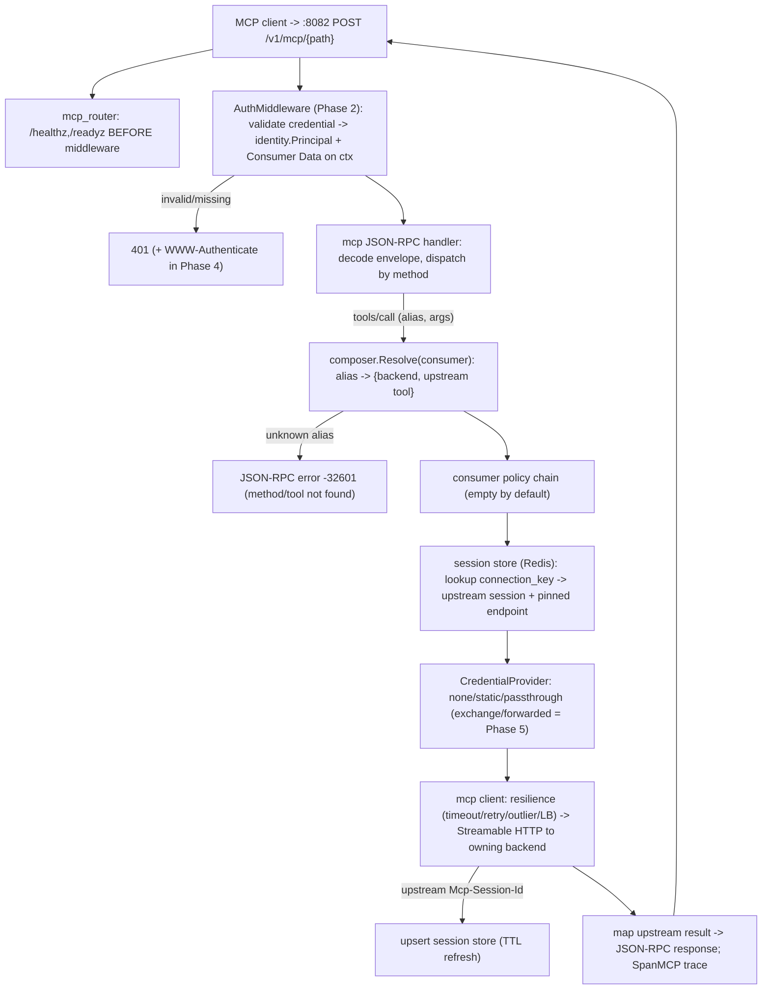
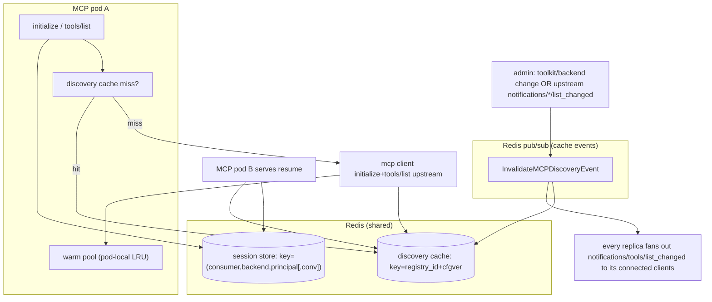

# Design: TrustGate MCP Gateway — Phase 3 (MCP Gateway server (third plane) + virtual MCP toolkit composition)

## Linked artifacts
- Epic plan: `.cursor/plans/trustgate_mcp_gateway_and_auth_016192dd.plan.md`
  (Phase 3 = `mcp-dataplane` todo; "Scope, protocol surface, and enterprise hardening";
  "Scaling and session state"; "Target request flow"; Appendix B/C).
- Phase 1 design: `docs/design/trustgate-mcp-gateway-phase1-tenancy.md`
  (`tenant.Scope`, typed `ids`, DI/module pattern, migration idiom, `tenant_id` columns).
- Phase 2 design: `docs/design/trustgate-mcp-gateway-phase2-inbound-auth.md`
  (**not yet written at design time** — this doc relies on the plan's Phase 2 section).
  Phase 3 **reuses** the Phase 2 `AuthMiddleware` chain and the `identity.Principal` it produces;
  it does **not** redesign credential validation.
- **No Linear `ENG-###` supplied** — tracked in-repo. Create the ticket before implementation so the
  SDD `/task-check` gate can run, then optionally mirror to `.cursor/sdd/<ENG-###>/design.md`.

> Scope note: this designs **only Phase 3** — the new MCP server plane, the MCP upstream-target spec on
> the backend aggregate, the Streamable HTTP MCP client + resilience, the Redis-backed session &
> discovery stores, the virtual-MCP composer, the JSON-RPC handler for the v1 surface, admin
> tool-introspection, and config-lifecycle invalidation. Inbound credential validation is Phase 2;
> the OAuth 2.1 RS/AS challenge is Phase 4; STS / downstream token exchange is Phase 5. For downstream
> auth, **only `none` / `static` / `passthrough` land here**; `exchange` / `forwarded` are seams only.

---

## Grounding (verified against the code, not assumed)

| Claim | Evidence |
|---|---|
| Server selection is `argv[1]` (`admin`/`proxy`, default proxy); a worker is started before `runProxy` | `cmd/agentgateway/main.go` (`serverType()`, `StartMetricsWorker` → `runProxy`) |
| Named `server.Server` instances are DI-provided per plane (`name:"admin"`/`name:"proxy"`) over a shared `server.NewHTTPServer` | `pkg/container/modules/server_proxy.go`, `server_admin.go`; `pkg/server/http_server.go` |
| Routers register **health/readiness before** the middleware chain so probes bypass auth; proxy is a single `app.All("/v1/*", …)` | `pkg/server/router/proxy_router.go` (`BuildRoutes`) |
| **There is no `pkg/domain/backend/`.** The "backend" aggregate is `registry` — backends were renamed to registries | `pkg/domain/registry/registry.go`, `target.go`; migration `20260603100000_rename_backends_to_registries.go`; admin path `/v1/gateways/:gateway_id/registries` in `admin_router.go` |
| `registry.Registry` has **no `Type` discriminator**; `Provider` must be a valid LLM provider and `Auth` is **required** in `Validate()` | `pkg/domain/registry/registry.go` (`Validate`), `pkg/infra/providers` |
| Registry persistence is pgx + JSONB columns (`provider_options`, `auth`, `health_checks`) | `pkg/infra/repository/registry/repository.go` (`Save` INSERT) |
| `consumer.Type` already includes `MCP`; consumer has **no** `toolkit` / `fail_mode` / `tool_allowlist` / `mcp_oauth` fields | `pkg/domain/consumer/consumer.go` |
| Config snapshot is an in-process per-gateway TTL cache with `singleflight`, composing consumers+registries+policies+auths | `pkg/app/consumer/data_finder.go` (`dataFinder`, `cache.TTLMap`, `ConsumerDataTTLName`) |
| **Redis is present** (go-redis v8) with a `cache.Client` exposing `RedisClient()`, `Get/Set/Delete`, TTLMaps | `pkg/infra/cache/client.go`; config `RedisConfig` |
| **Cross-replica event-driven invalidation already exists as Redis pub/sub**, not Kafka — publisher + listener + typed subscribers | `pkg/container/modules/cache_events.go`; `pkg/infra/cache/redis_event_publisher.go`, `redis_event_listener.go`, `cache/subscriber/*` |
| **Kafka is present but telemetry-only** (request/trace export) | `pkg/infra/telemetry/kafka/exporter.go`, `kafka_base.go`; `config.KafkaConfig` |
| `SpanMCP` trace type already reserved | `pkg/infra/trace/span.go` (`SpanMCP SpanType = "mcp"`) |
| Typed IDs are `ids.ID[K Kind]` over a closed `Kind` union | `pkg/domain/ids/ids.go` |
| `AuthMiddleware` resolves an `Identity`, loads the gateway `Data` snapshot, attaches both to ctx via `appconsumer.With*` | `pkg/api/middleware/auth.go` |
| k8s is kustomize base+overlays; per-plane Deployment/Service/HPA/HTTPRoute already exist for admin+proxy; HPA is CPU-based | `k8s/base/{deployment,service,horizontalpodautoscaler,httproute}/*` |

**Two consequential corrections to the plan's wording, carried through this design:**

1. **"backend" == `registry`.** The plan and its Appendix B/C say `pkg/domain/backend/`,
   `POST /v1/backends`, `backend.Type`. None of those exist; the real aggregate is `registry`
   (`/v1/gateways/:gateway_id/registries`). Phase 3 adds the MCP discriminator and `MCPTarget` to
   **`registry`**. Where this doc says "backend" it means the `registry` aggregate, and the public
   admin field/concept stays "backend"-flavoured where the appendix already uses it.
2. **Event-driven invalidation is already Redis pub/sub, not Kafka.** The plan says "prefer
   event-driven (Kafka)". The repo already has a working cross-replica Redis pub/sub invalidation bus
   (`cache.EventPublisher`/`EventListener`). Phase 3 **reuses that bus** for discovery invalidation and
   `notifications/tools/list_changed` fan-out, and does **not** introduce Kafka for control-plane
   invalidation (Kafka stays telemetry-only). See D7.

---

## Technical approach

Add a **third server plane** that mirrors admin/proxy exactly: a `serverMCP = "mcp"` `argv[1]` branch
and `runMCP` in `cmd/agentgateway/main.go` (booting an MCP session reaper the way `runProxy` boots the
metrics worker), a `pkg/server/router/mcp_router.go` (health/readiness before middleware, then the MCP
endpoint), a `pkg/container/modules/server_mcp.go` providing `name:"mcp"` transport+router+`server.Server`,
and a new `Server.MCPPort` (`:8082`). The plane **reuses the Phase 2 `AuthMiddleware`** so reachability
is already gated and `identity.Principal` is on the request context.

Upstream connectivity extends the **`registry` aggregate** with a `registry.Type` discriminator
(`LLM` default / `MCP`) and an `MCPTarget{URL, Transport, Headers, AuthRef, Resilience}` JSONB column.
A new `pkg/infra/mcp/client/` speaks **Streamable HTTP JSON-RPC** to upstreams (initialize, list/call,
`Mcp-Session-Id` echo, SSE response parsing), wrapped by a resilience layer (connect/request timeouts,
idempotent-only retry+backoff, outlier-detection→circuit-breaker eviction, replica load-balancing
balanced-at-session-creation-then-pinned, backend TLS/mTLS) driven by `MCPTarget.Resilience`.

The **virtual MCP server is a `consumer` (Type=MCP)**: it gains a `Toolkit []ToolkitEntry`
composition spec plus `FailMode` and a `tool_allowlist` shorthand. A new `pkg/app/mcp/` **composer**
connects to the referenced backends, reads their (Redis-cached, **backend-keyed**) discovery, and
projects the per-consumer toolkit into one merged virtual surface — resolving each selected tool,
applying `expose_as` or auto-prefixing `{backend}_{tool}` on collision, and recording an alias→
`{backend, upstream tool}` routing map. `tools/call` routes to exactly the owning backend (no
broadcast) and runs through the consumer's existing `policy` chain (empty by default).

Scale-out correctness comes from being **stateless on the inbound edge** (`enableJsonResponse`-style
request/response, no server-issued session for the common case) plus two **shared Redis stores**: a
**session store** (`connection_key → {upstream Mcp-Session-Id, pinned upstream endpoint}`, keyed by
`(consumer, backend, principal[, conversation])`, TTL + reaper) for upstream session continuity, and a
**backend-keyed discovery cache**. Any replica serves any request; the only pod-pinned resource is a
live SSE/server-push stream, bounded by a per-pod cap that sheds `503` to drive HPA. Config changes
publish on the existing Redis pub/sub bus to invalidate the backend-keyed discovery cache and fan out
`notifications/tools/list_changed`.

---

## Decisions

### D1 — A dedicated third server plane, not a branch inside the proxy
- **Choice:** new `mcp` plane (`argv mcp` + `runMCP` + `server_mcp.go` + `mcp_router.go` + `MCPPort`),
  its own Deployment/Service/HPA/HTTPRoute, reusing `server.NewHTTPServer` and the middleware chain.
- **Rejected:** add MCP routes to `proxy_router.go` behind a path prefix on `:8081`.
- **Rationale:** the plan mandates independent scale (MCP load is connection/stream-bound; the LLM
  proxy is CPU/token-bound — different HPA signals, D6). The codebase already proves the pattern
  (`server_admin.go`/`server_proxy.go` are near-identical thin DI modules), so a third plane is low
  marginal cost and isolates blast radius (a stuck upstream MCP can saturate streams without touching
  the LLM hot path). Branching the proxy would couple two autoscaling profiles onto one Deployment.

### D2 — MCP target via a `Type` discriminator on the existing `registry` aggregate, not a new MCP-backend aggregate
- **Choice:** add `registry.Type` (`LLM` default, `MCP`) + an optional `MCPTarget` struct (new JSONB
  column `mcp_target`); make `Validate()` branch on `Type` (LLM keeps the `Provider`+`Auth` invariants;
  MCP requires `mcp_target.url`+`transport` and ignores `Provider`).
- **Rejected:**
  - *A separate `pkg/domain/mcpbackend/` aggregate + `mcp_backends` table.* Duplicates the whole
    repository/finder/admin-CRUD/association surface and the `dataFinder` join, and forks the
    consumer↔backend reference (`RegistryIDs`) into two ID kinds.
  - *Overloading `registry.Provider="mcp"` with no `Type`.* Hides the discriminant inside a free-text
    field that `providers.IsValidProvider` already rejects, and gives no place to hang `MCPTarget`.
- **Rationale:** consumers already reference backends by `registry.RegistryID`; the `dataFinder`
  already loads registries as "backends". A discriminator keeps one reference type, one repo, one
  association path, and one cache snapshot. The cost is conditional validation — small and explicit.
  (Naming caveat: the plan calls it `backend.Type`; in code it is `registry.Type`. The migration
  history `rename_backends_to_registries` is why.)

### D3 — `toolkit` lives on the `consumer`, not in a separate composition aggregate
- **Choice:** add `Toolkit []ToolkitEntry`, `FailMode`, and `ToolAllowlist []string` to `consumer`.
  The consumer (Type=MCP) **is** the virtual MCP server; the toolkit is its body.
- **Rejected:** a `pkg/domain/virtualmcp/` aggregate joining consumer↔backend↔tool.
- **Rationale:** Appendix C models the virtual server as a consumer with `backend_ids` + `toolkit`;
  the `dataFinder` snapshot already carries the consumer + its backends + auths + policies per gateway,
  so the toolkit rides for free into the existing TTL/`singleflight` cache. A separate aggregate would
  need its own invalidation and a third join with zero added expressiveness. The toolkit is config
  (cheap, cardinality = #consumers), distinct from discovery (expensive, cardinality = #backends, D5).

### D4 — Stateless inbound + a **shared Redis** upstream-session store; no pod-local session map, no sticky dependency
- **Choice:** serve `tools/call` as request/response JSON by default (no server-issued session for the
  common case). When an upstream demands session affinity, persist
  `{connection_key → upstream Mcp-Session-Id, pinned upstream endpoint}` in **Redis** with TTL + a
  reaper, keyed by `(consumer, backend, principal[, conversation])`. Any replica resumes the same
  upstream session by reading Redis.
- **Rejected:**
  - *docker/mcp-gateway pod-local in-memory session map.* Cannot scale horizontally — a second replica
    can't resume a session it never created; correctness then depends on LB stickiness. Explicitly
    avoided.
  - *agentgateway self-encoded session token (sign the upstream session into the client-visible
    `Mcp-Session-Id`, no store).* Elegant and store-free, but the signing key is a **Phase 5** artifact
    (STS signing key + JWKS); adopting it now pulls Phase 5 forward. Kept as a future optimization (OQ2).
  - *archestra shared **DB row** (`mcp_http_sessions`).* Same shape as our choice but on Postgres; we
    already run Redis for hot cross-replica state and it has native TTL — better fit for short-lived,
    high-churn session metadata than a DB table needing a sweeper job.
- **Rationale:** the hard requirement is "any replica serves any request; stickiness is only a warm
  optimization." Stateless inbound makes the common path replica-agnostic; Redis makes the rare
  affinity case replica-agnostic too. Stickiness on `Mcp-Session-Id`, if configured, only raises
  warm-pool hit rate — never load-bearing for correctness. (See "Scaling & session-state design".)

### D5 — Discovery cache keyed by **backend**, not by consumer
- **Choice:** cache each upstream's `initialize` result + `tools/list`/`resources`/`prompts` in Redis
  keyed by `registry.RegistryID` (+ a config version), TTL + refresh. The per-consumer toolkit is a
  cheap in-memory projection over the shared discovery.
- **Rejected:** cache the composed virtual surface per consumer.
- **Rationale:** 100 consumers fronting the same backend should discover it once; per-consumer caching
  re-pays discovery N times and multiplies invalidation work. Composition (select/rename/collide) is
  microseconds over cached discovery, so it stays uncached/recomputed.

### D6 — SSE/server-push streams are the only pod-pinned resource; bound them per pod and shed `503`
- **Choice:** a per-pod concurrent-stream cap (config + atomic gauge). New stream requests over the cap
  return `503` (with `Retry-After`); HPA scales on the stream/session gauge (Prometheus/custom metric),
  not CPU.
- **Rejected:** unbounded streams scaled on CPU (proxy default).
- **Rationale:** MCP load is connection-bound; an OOM under stream fan-in is worse than shedding. A
  bounded gauge gives HPA a meaningful, fast signal and protects the node. Request/response calls (the
  common path) are not pinned and not capped beyond Fiber concurrency.

### D7 — Reuse the existing Redis pub/sub invalidation bus for discovery invalidation + `list_changed`; do **not** add Kafka
- **Choice:** add `InvalidateMCPDiscoveryEvent` (+ optional `ToolkitChangedEvent`) to the existing
  `cache.EventPublisher`/`EventListener` machinery (`channel`/`event`/`subscriber`). Admin
  toolkit/backend mutations publish; every MCP replica's subscriber drops the backend-keyed discovery
  entry and fans out `notifications/tools/list_changed` to its locally connected clients. Upstream
  `notifications/*/list_changed` received by any replica re-publishes onto the same bus.
- **Rejected:**
  - *TTL-only invalidation* (today's `dataFinder` behaviour) — stale tools linger for a TTL window
    across replicas; the plan explicitly wants prompt propagation.
  - *Introduce Kafka for control-plane invalidation* — Kafka exists but is telemetry-only; adding a
    consumer-group control path is heavier than the proven Redis pub/sub bus and adds an ordering/offset
    surface we don't need for fire-and-forget invalidation.
- **Rationale:** the requirement (prompt, cross-replica, event-driven) is already satisfied by Redis
  pub/sub with one new event type. Lowest risk, consistent with `cache_events.go`. (If a durable,
  replayable audit of config changes is later required, Kafka is the right tool — out of Phase 3 scope.)

### D8 — Negotiate one protocol version with the client = the **intersection** of backend capabilities (down-level)
- **Choice:** on `initialize`, the composer collects each live backend's negotiated protocol version +
  capability set, picks the **highest version ≤ client's requested version that all *included*
  backends support**, and advertises capabilities = the **intersection** (a capability the virtual
  server claims must be served by every backend that contributes to it). A backend excluded by
  `failOpen` (D9) drops out of the intersection for that session.
- **Rejected:** advertise the union (would promise capabilities some backend can't serve → runtime
  errors mid-call) or pin a single hardcoded version (breaks heterogeneous fleets).
- **Rationale:** the merged surface must be *honest* — every advertised tool/capability is reachable.
  Intersection is the only safe lower bound across heterogeneous upstreams; down-levelling the version
  keeps older backends usable.

### D9 — `failClosed` is the **default** fail mode; `failOpen` is opt-in per consumer
- **Choice:** if a referenced backend is unreachable/uninitialized during composition, default
  (`failClosed`) **fails the `initialize`/`tools/list`** so the client never sees a partial surface
  silently. `failOpen` (opt-in via `consumer.FailMode`) **skips** the dead backend, composes from the
  survivors, and marks it for re-discovery on reconnect.
- **Rejected:** `failOpen` as default.
- **Rationale:** enterprise default should be predictable correctness — a half-populated toolkit that
  silently drops a partner's tools is a worse surprise than a clear failure. Appendix C3 shows
  `failOpen` as an explicit opt-in for resilience-over-completeness consumers.

### D10 — Inbound transport: **Streamable HTTP only** in v1; decline legacy HTTP+SSE clients
- **Choice:** inbound is MCP **Streamable HTTP** (single endpoint, POST JSON-RPC; SSE only as the
  server→client push channel within Streamable HTTP). We do **not** implement the deprecated
  2024-11-05 HTTP+SSE two-endpoint transport for inbound clients. Upstream is likewise Streamable HTTP;
  no stdio.
- **Rejected:** also accept legacy HTTP+SSE inbound for maximum client reach.
- **Rationale:** legacy SSE needs a second long-lived endpoint and a per-client outbound queue —
  exactly the pod-pinned resource D6 wants to minimize — for a transport the spec already deprecates.
  Modern clients negotiate Streamable HTTP. Revisit only if a must-support client is SSE-only (OQ1).

### D11 — Downstream backend-auth: ship `none`/`static`/`passthrough` now; `exchange`/`forwarded` are seams
- **Choice:** `MCPTarget.AuthRef`/`auth.mode` supports `none`, `static`, `passthrough` in Phase 3,
  enforced by the MCP client just before opening the upstream connection. `exchange`/`forwarded`
  resolve through an injected `mcp.CredentialProvider` interface whose Phase 3 implementation returns
  `ErrUnsupportedMode` for those modes; Phase 5 supplies the STS-backed implementation.
- **Rejected:** stub all modes inline in the client (couples Phase 5 STS into the client) / defer all
  downstream auth to Phase 5 (blocks real static/internal upstreams now).
- **Rationale:** `passthrough` must carry the spec confused-deputy guardrail (only when the upstream's
  expected `aud` is explicitly configured and matches the inbound `aud`); building the
  `CredentialProvider` seam now keeps the client closed to modification when Phase 5 lands.

### D12 — A thin in-house Streamable HTTP MCP client over the existing HTTP stack, not a vendored SDK
- **Choice:** implement `pkg/infra/mcp/client/` directly (JSON-RPC envelope, `Mcp-Session-Id`,
  `text/event-stream` response parsing) on `net/http`, wrapped by our own resilience layer.
- **Rejected:** vendor a third-party Go MCP SDK (e.g. an `mcp-go`) for the client.
- **Rationale:** we need tight control over per-backend resilience, Redis session pinning, TLS/mTLS,
  header injection, and tracing (`SpanMCP`) — all things a generic SDK hides or fights. The protocol
  surface we consume upstream is small and stable. Keep the dependency surface minimal.

---

## Data flow

### Request / JSON-RPC flow (`tools/call`)



### Session continuity + discovery flow (any replica)



---

## Interfaces / contracts

### Backend (registry) discriminator + MCP target (`pkg/domain/registry/`)
```go
// registry.go — add a Type discriminator (default LLM keeps today's behaviour).
type Type string
const (
    TypeLLM Type = "LLM"
    TypeMCP Type = "MCP"
)
func IsValidType(t Type) bool { /* exhaustive */ }

type Registry struct {
    // ...existing fields...
    Type      Type       `json:"type"`                  // default "LLM" in Validate()
    MCPTarget *MCPTarget `json:"mcp_target,omitempty"`  // required iff Type==MCP
    // TenantID/TeamID arrive from Phase 1.
}

// mcp_target.go (new file in the registry package)
type Transport string
const TransportStreamableHTTP Transport = "streamable-http"

type MCPTarget struct {
    URL        string            `json:"url"`
    Transport  Transport         `json:"transport"`          // streamable-http only in v1 (D10)
    Headers    map[string]string `json:"headers,omitempty"`  // static, non-secret pass-through headers
    Auth       MCPDownstreamAuth `json:"auth"`               // see below
    Resilience *Resilience       `json:"resilience,omitempty"`
}

type DownstreamMode string
const (
    DownstreamNone        DownstreamMode = "none"
    DownstreamStatic      DownstreamMode = "static"
    DownstreamPassthrough DownstreamMode = "passthrough"
    DownstreamExchange    DownstreamMode = "exchange"  // Phase 5 seam
    DownstreamForwarded   DownstreamMode = "forwarded" // Phase 5 seam
)

type MCPDownstreamAuth struct {
    Mode             DownstreamMode `json:"mode"`
    Header           string         `json:"header,omitempty"`            // static
    ValueRef         string         `json:"value_ref,omitempty"`         // secret REFERENCE, never inline (cross-cutting rule)
    ExpectedAudience string         `json:"expected_audience,omitempty"` // passthrough confused-deputy guardrail (B3)
    // Phase 5 fields (pattern/provider/resource/audience/actor/scopes) parsed but inert in Phase 3.
}

type Resilience struct {
    ConnectTimeout time.Duration     `json:"connect_timeout"`
    RequestTimeout time.Duration     `json:"request_timeout"`
    Retries        RetryPolicy       `json:"retries"`
    Outlier        OutlierDetection  `json:"outlier_detection"`
    LoadBalancing  LoadBalancing     `json:"load_balancing"` // balanced at session creation, then pinned (D4)
    TLS            *UpstreamTLS      `json:"tls,omitempty"`  // ca/client cert REFERENCES for mTLS
}
type RetryPolicy      struct { Max int; Backoff time.Duration; IdempotentOnly bool }
type OutlierDetection struct { ConsecutiveFailures int; EvictFor time.Duration }
type LoadBalancing    struct { Endpoints []string; Algorithm string }
type UpstreamTLS      struct { CACertRef, ClientCertRef, ClientKeyRef string }
```
`Validate()` branches on `Type`: `TypeLLM` keeps the `Provider`+`Auth`-required invariants; `TypeMCP`
requires `MCPTarget.URL` + `Transport==streamable-http`, ignores `Provider`, and rejects inline
secrets (only `*Ref` fields).

### Consumer toolkit (`pkg/domain/consumer/consumer.go`)
```go
type FailMode string
const ( FailClosed FailMode = "failClosed"; FailOpen FailMode = "failOpen" ) // default FailClosed (D9)

type ToolkitEntry struct {
    BackendID ids.RegistryID `json:"backend_id"`         // a Type==MCP registry referenced by the consumer
    Tool      string         `json:"tool"`               // upstream tool name, or "*" for whole-server
    ExposeAs  string         `json:"expose_as,omitempty"`// alias; else auto-prefix {backend}_{tool} on collision
    Enabled   bool           `json:"enabled"`
}

type Consumer struct {
    // ...existing...
    Toolkit       []ToolkitEntry `json:"toolkit,omitempty"`
    ToolAllowlist []string       `json:"tool_allowlist,omitempty"` // shorthand single-backend toolkit
    FailMode      FailMode       `json:"fail_mode,omitempty"`      // default failClosed
    // MCPOAuth lands in Phase 4.
}
```
`Validate()` (Type==MCP): each `ToolkitEntry.BackendID` must be in `RegistryIDs`; non-`*` entries
unique per `(backend, tool)`; `expose_as` aliases unique across the toolkit.

### MCP client (`pkg/infra/mcp/client/`)
```go
// Client speaks Streamable HTTP JSON-RPC to one upstream MCP backend.
type Client interface {
    Initialize(ctx context.Context, t registry.MCPTarget, sess *Session) (InitializeResult, *Session, error)
    ListTools(ctx context.Context, t registry.MCPTarget, sess *Session) ([]Tool, error)
    CallTool(ctx context.Context, t registry.MCPTarget, sess *Session, name string, args json.RawMessage) (CallToolResult, error)
    ListResources(ctx context.Context, t registry.MCPTarget, sess *Session) ([]Resource, error)
    ReadResource(ctx context.Context, t registry.MCPTarget, sess *Session, uri string) (ResourceContents, error)
    ListPrompts(ctx context.Context, t registry.MCPTarget, sess *Session) ([]Prompt, error)
    GetPrompt(ctx context.Context, t registry.MCPTarget, sess *Session, name string, args map[string]string) (GetPromptResult, error)
    Ping(ctx context.Context, t registry.MCPTarget, sess *Session) error
}

// Session = the upstream pin persisted in Redis (D4).
type Session struct {
    UpstreamSessionID string // upstream Mcp-Session-Id
    PinnedEndpoint    string // chosen replica from LoadBalancing.Endpoints
    ProtocolVersion   string
}

// CredentialProvider resolves the upstream Authorization just before connect (D11).
// Phase 3 impl: none/static/passthrough; exchange/forwarded -> ErrUnsupportedMode (Phase 5 swaps impl).
type CredentialProvider interface {
    Apply(ctx context.Context, p identity.Principal, t registry.MCPTarget, h http.Header) error
}
```
The client wraps every call in the resilience layer (timeouts, idempotent-only retry, outlier-eviction
→ circuit breaker, LB pick honoring `Session.PinnedEndpoint`) and opens a `SpanMCP` child span.

### Session store (`pkg/infra/mcp/session/`)
```go
// ConnectionKey is derived, never client-supplied; correctness must not depend on the client.
type ConnectionKey struct {
    ConsumerID ids.ConsumerID
    BackendID  ids.RegistryID
    Subject    string // identity.Principal.Subject
    Conversation string // optional; "" when stateless (OQ3)
}
func (k ConnectionKey) Redis() string // e.g. "mcp:sess:{consumer}:{backend}:{sha256(subject|conv)}"

type Store interface {
    Get(ctx context.Context, k ConnectionKey) (*client.Session, bool, error)
    Put(ctx context.Context, k ConnectionKey, s *client.Session, ttl time.Duration) error
    Delete(ctx context.Context, k ConnectionKey) error
}
// Reaper: relies on Redis TTL for expiry; a lightweight sweeper logs/metrics orphan rate.
// Backed by cache.Client.RedisClient(); reaper started in runMCP like the proxy metrics worker.
```

### Discovery cache (`pkg/infra/mcp/discovery/`)
```go
// Keyed by BACKEND (D5), versioned so a config bump is a key change, not a race.
type Snapshot struct {
    ProtocolVersion string
    Capabilities    Capabilities
    Tools           []client.Tool
    Resources       []client.Resource
    Prompts         []client.Prompt
    DiscoveredAt    time.Time
}
type Cache interface {
    Get(ctx context.Context, backendID ids.RegistryID, cfgVersion string) (*Snapshot, bool, error)
    Put(ctx context.Context, backendID ids.RegistryID, cfgVersion string, s *Snapshot, ttl time.Duration) error
    Invalidate(ctx context.Context, backendID ids.RegistryID) error // also publishes InvalidateMCPDiscoveryEvent
}
```

### Composer (`pkg/app/mcp/`)
```go
// VirtualServer is the merged, honest surface for one consumer (Type=MCP).
type VirtualServer struct {
    ProtocolVersion string                       // intersection/down-level (D8)
    Capabilities    client.Capabilities          // intersection (D8)
    Tools           []client.Tool                // aliased/prefixed
    routes          map[string]ToolRoute         // alias -> {backend, upstream tool}
}
type ToolRoute struct { BackendID ids.RegistryID; UpstreamTool string }

type Composer interface {
    // Compose discovers (cache-first) every referenced MCP backend and projects the toolkit.
    // Honors FailMode (D9): failClosed -> error if any backend dead; failOpen -> skip + mark redo.
    Compose(ctx context.Context, scope tenant.Scope, c *consumer.Consumer, backends []*registry.Registry) (*VirtualServer, error)
    Resolve(vs *VirtualServer, alias string) (ToolRoute, bool)
}
```

### JSON-RPC handler dispatch (`pkg/api/handler/http/mcp/`)
```go
type Handler struct {
    composer  appmcp.Composer
    client    mcpclient.Client
    sessions  session.Store
    discovery discovery.Cache
    cred      mcpclient.CredentialProvider
    tracer    trace.Tracer
    streams   *StreamLimiter // per-pod cap (D6)
}

// Handle is the single Streamable HTTP endpoint (POST JSON-RPC; SSE only for server push).
func (h *Handler) Handle(c *fiber.Ctx) error {
    p, _ := identity.PrincipalFromContext(c.UserContext()) // attached by Phase 2 AuthMiddleware
    data, _ := appconsumer.DataFromContext(c.UserContext())// the resolved virtual server (consumer)
    req := decodeJSONRPC(c.Body())
    switch req.Method {
    case "initialize":               // version+capability negotiation (D8)
    case "tools/list":               // == composed toolkit (authorization model)
    case "tools/call":               // alias -> route -> policy chain -> backend (no broadcast)
    case "resources/list", "resources/read":
    case "prompts/list", "prompts/get":
    case "ping":
    case "notifications/initialized": // client notification, ack
    default:                          // -32601 method not found
    }
}
```
**How `Principal` + `tenant.Scope` thread through:** Phase 2's `AuthMiddleware` validates the inbound
credential and puts `identity.Principal` (+ the gateway `Data` snapshot) on the request context; the
MCP handler reads it via `identity.PrincipalFromContext`. `Principal.Tenant` (an `ids.OrgID`) is the
same tenant stamped on the consumer/backend rows in Phase 1, so the consumer/backends loaded for
composition are already tenant-correct (the admin plane wrote them under a `tenant.Scope`). The
`ConnectionKey` and the Phase 5 credential cache both include `Subject`, guaranteeing per-principal
isolation of upstream sessions and (later) tokens.

---

## Migration plan

New file `pkg/infra/database/migrations/20260606xxxxxx_add_mcp_targets_and_toolkit.go` following the
established idiom (Go `init()` + `database.RegisterMigration` + `ADD COLUMN IF NOT EXISTS` + backfill,
one `tx`).

**Up:**
```sql
-- 1) Backend (registry) discriminator + MCP target.
ALTER TABLE registries ADD COLUMN IF NOT EXISTS type TEXT NOT NULL DEFAULT 'LLM';
ALTER TABLE registries ADD COLUMN IF NOT EXISTS mcp_target JSONB;            -- null for LLM rows
UPDATE registries SET type = 'LLM' WHERE type IS NULL OR type = '';
CREATE INDEX IF NOT EXISTS registries_type_idx ON registries (gateway_id, type);
-- Integrity: an MCP backend must carry a target; an LLM backend must not.
ALTER TABLE registries ADD CONSTRAINT registries_mcp_target_ck
  CHECK ((type = 'MCP' AND mcp_target IS NOT NULL) OR (type = 'LLM' AND mcp_target IS NULL));

-- 2) Consumer composition spec.
ALTER TABLE consumers ADD COLUMN IF NOT EXISTS toolkit JSONB;               -- []ToolkitEntry
ALTER TABLE consumers ADD COLUMN IF NOT EXISTS tool_allowlist JSONB;        -- []string shorthand
ALTER TABLE consumers ADD COLUMN IF NOT EXISTS fail_mode TEXT NOT NULL DEFAULT 'failClosed';
```
- `type`/`fail_mode` get safe defaults so existing LLM rows are valid with no backfill of business
  data; the `CHECK` keeps the discriminator honest. `mcp_target`/`toolkit`/`tool_allowlist` are JSONB
  (matches `registries.auth`/`provider_options` and the consumer's existing JSON columns), so the repo
  marshals/scans them exactly like the existing JSONB fields.
- Secrets stay **referenced** (`*Ref` fields) per the cross-cutting rule; the migration stores no
  plaintext credential.

**Down:** drop the `CHECK`, the indexes, then the added columns from `registries` and `consumers`.

**Deploy ordering:** migrate first (old binaries ignore the new columns), then roll out the MCP plane;
no destructive change, so rolling deploy is safe.

---

## Scaling & session-state design

**Invariant proven here: correctness never depends on LB stickiness or on the client/LB honoring
`Mcp-Session-Id`.** Three independent properties:

1. **Inbound is stateless by default.** `tools/list`/`tools/call`/`resources/*`/`prompts/*` are served
   request/response (`enableJsonResponse`-style). No server-issued inbound session for the common path
   → any replica handles any request with only Redis + Postgres (both shared). A cold replica re-opens
   the upstream from the shared session metadata; nothing lives only in a pod.
2. **Upstream affinity is shared, not pinned to a pod.** When an upstream requires
   `Mcp-Session-Id`, the `(consumer, backend, principal[, conversation])` → `{upstream session, pinned
   endpoint}` mapping is in **Redis with TTL**. Replica B resumes replica A's upstream session by
   reading Redis and re-using the warm pool only if it happens to have one — otherwise it re-dials the
   *same* upstream endpoint. The server-issued client `Mcp-Session-Id` is echoed by compliant clients
   automatically; we never require operators to configure it and never require the LB to route on it.
   If the client drops it, the server re-derives `ConnectionKey` from `(consumer, principal)` and still
   finds the upstream pin — so even a non-compliant client stays correct (just not conversation-pinned).
3. **Only a live SSE/server-push stream is pod-pinned, for its duration.** Bounded by a per-pod cap
   (D6); over-cap requests get `503 Retry-After` so HPA adds pods instead of the node OOMing.

**Capacity reasoning (which tier is elastic):**

| Tier | Cardinality / cost | Elasticity | Protection |
|---|---|---|---|
| Virtual MCPs (consumers/toolkits) | config; per-gateway TTL snapshot (`dataFinder`) | trivially elastic | in-memory cache + Redis pub/sub invalidation |
| Concurrent client sessions/streams | the real cost; connection-bound | **scale pods** (HPA on stream/session gauge) | per-pod stream cap + `503` shedding |
| Discovery (per backend) | #backends, not #consumers (D5) | shared once in Redis | backend-keyed cache, TTL + event invalidation |
| Upstream MCP servers | **least elastic** — a shared dependency | cannot scale on our side | resilience: timeout/retry/outlier-eviction→breaker, LB across replicas, warm-pool cap |

**HPA signal:** the MCP plane's HPA scales on a `mcp_active_streams` / `mcp_active_sessions` gauge
(custom/Prometheus metric) plus per-upstream circuit-breaker health, **not CPU** (the proxy's CPU HPA
is the wrong signal for a connection-bound plane). Replicas are interchangeable; sticky routing on
`Mcp-Session-Id`, if configured at the gateway/Envoy at all, only improves warm-pool hit rate.

---

## File changes (grouped into ≤400-line chained PRs)

Phase 3 is large; it ships as **6 stacked PRs (3.1 → 3.6)**, each independently compilable + testable.
LOC forecasts include tests.

### PR 3.1 — MCP server-plane scaffold (~330 LOC)
| File | Action | Purpose |
|---|---|---|
| `cmd/agentgateway/main.go` | Modify | `serverMCP="mcp"` const + `argv` branch + `runMCP` (starts MCP session reaper, mirrors `StartMetricsWorker`→`runProxy`) |
| `pkg/config/config.go` | Modify | `ServerConfig.MCPPort` (+ `SERVER_MCP_PORT` default 8082); MCP stream-cap + session-TTL config |
| `pkg/server/router/mcp_router.go` | Create | health/readiness before middleware, then the single Streamable HTTP MCP endpoint |
| `pkg/container/modules/server_mcp.go` | Create | `name:"mcp"` transport (reuse Auth chain) + router + `server.Server` |
| `pkg/container/modules/modules.go` | Modify | register `ServerMCP` in `All()` |
| `pkg/api/handler/http/mcp/handler.go` | Create | stub `Handle` returning `initialize`/`ping` only (real dispatch in 3.5) |
| tests | Create | router wiring + health-bypass + plane boot smoke |

### PR 3.2 — Backend `MCPTarget` + MCP client + resilience (~390 LOC)
| File | Action | Purpose |
|---|---|---|
| `pkg/domain/registry/registry.go` | Modify | `Type` discriminator + `MCPTarget` field + branched `Validate()` |
| `pkg/domain/registry/mcp_target.go` | Create | `MCPTarget`, `MCPDownstreamAuth`, `Resilience` types + validation |
| `pkg/infra/repository/registry/repository.go` | Modify | marshal/scan `type` + `mcp_target` JSONB columns |
| `pkg/infra/database/migrations/20260606xxxxxx_add_mcp_targets_and_toolkit.go` | Create | registries `type`+`mcp_target` half of the migration |
| `pkg/infra/mcp/client/client.go` | Create | Streamable HTTP JSON-RPC client (initialize/list/call/ping, `Mcp-Session-Id`, SSE parse) |
| `pkg/infra/mcp/client/resilience.go` | Create | timeout/retry(idempotent)/outlier→breaker/LB wrapper |
| `pkg/infra/mcp/client/credential.go` | Create | `CredentialProvider` (none/static/passthrough + guardrail; exchange/forwarded → `ErrUnsupportedMode`) |
| tests | Create | client against a mock MCP server; resilience table tests |

> 3.2 is at-budget; if it exceeds 400 lines at implementation, split **3.2a** (domain+migration+repo)
> from **3.2b** (client+resilience+credential).

### PR 3.3 — Redis session store + backend-keyed discovery cache (~300 LOC)
| File | Action | Purpose |
|---|---|---|
| `pkg/infra/mcp/session/store.go` | Create | `ConnectionKey` (derived) + Redis `Store` (TTL) on `cache.Client.RedisClient()` |
| `pkg/infra/mcp/session/reaper.go` | Create | orphan sweeper + metrics (started by `runMCP`) |
| `pkg/infra/mcp/discovery/cache.go` | Create | backend-keyed, versioned Redis discovery `Cache` |
| `pkg/container/modules/server_mcp.go` | Modify | provide store + cache + reaper |
| tests | Create | session resume across simulated replicas; discovery shared across consumers |

### PR 3.4 — Composer / virtual MCP (`pkg/app/mcp/`) (~380 LOC)
| File | Action | Purpose |
|---|---|---|
| `pkg/domain/consumer/consumer.go` | Modify | `Toolkit`/`ToolAllowlist`/`FailMode` + branched `Validate()` |
| `pkg/infra/repository/consumer/repository.go` | Modify | marshal/scan `toolkit`/`tool_allowlist`/`fail_mode` |
| migration file (3.2) | Modify | add the consumers half of the migration |
| `pkg/app/mcp/composer.go` | Create | discover (cache-first) + project toolkit; rename/auto-prefix; alias→route map |
| `pkg/app/mcp/negotiate.go` | Create | protocol-version + capability intersection/down-level (D8) |
| `pkg/app/mcp/failmode.go` | Create | failClosed/failOpen handling + reconnect-redo marking |
| tests | Create | select/rename/collision/whole-server; intersection negotiation; fail modes |

### PR 3.5 — JSON-RPC handler + routing + stream cap (~390 LOC)
| File | Action | Purpose |
|---|---|---|
| `pkg/api/handler/http/mcp/handler.go` | Modify | full dispatch (initialize/tools/resources/prompts/ping) |
| `pkg/api/handler/http/mcp/jsonrpc.go` | Create | JSON-RPC envelope encode/decode + error codes |
| `pkg/api/handler/http/mcp/call.go` | Create | `tools/call`: alias→route→policy chain→backend (no broadcast); session upsert |
| `pkg/api/handler/http/mcp/stream.go` | Create | `StreamLimiter` (per-pod cap, `503` shed) + SSE push channel |
| `pkg/infra/trace/span.go` | Modify | `MCPAttrs` on `Span` for `tools/list`/`tools/call` |
| tests | Create | dispatch table; call routing; stream-cap shedding; SpanMCP emission |

### PR 3.6 — Admin tool-introspection + `list_changed` invalidation (~330 LOC)
| File | Action | Purpose |
|---|---|---|
| `pkg/api/handler/http/registry/introspect_handler.go` | Create | admin: connect to a backend, return discoverable tools/resources/prompts |
| `pkg/server/router/admin_router.go` | Modify | mount `/v1/gateways/:gateway_id/registries/:id/mcp/introspect` |
| `pkg/infra/cache/event/*` + `channel` | Create/Modify | `InvalidateMCPDiscoveryEvent` (+ `ToolkitChangedEvent`) |
| `pkg/infra/cache/subscriber/*` | Create | subscriber: drop discovery entry + fan out `notifications/tools/list_changed` |
| `pkg/container/modules/cache_events.go` | Modify | register the new subscriber |
| `pkg/app/{registry,consumer}` mutators | Modify | publish invalidation on backend/toolkit change |
| tests | Create | introspection; invalidation propagation; list_changed fan-out |

> Stacking rationale: 3.1 boots an inert plane; 3.2 adds upstream connectivity (no consumer wiring);
> 3.3 adds shared state; 3.4 composes (no transport); 3.5 turns on the protocol; 3.6 closes the
> config-lifecycle loop. Each merges green on its own.

---

## Testing strategy

| Layer | What to test | How |
|---|---|---|
| Unit (table-driven) | `registry.Validate` branched by `Type`; `MCPTarget`/`Resilience` validation; reject inline secrets | pure, `testify/require`, `t.Parallel()` |
| Unit | composer: select / `expose_as` rename / collision auto-prefix `{backend}_{tool}` / whole-server `*`; failClosed vs failOpen; alias→route map | fake discovery snapshots |
| Unit | version negotiation: highest common ≤ client; capability **intersection**; excluded-backend drop (D8) | table of heterogeneous backend capability sets |
| Unit | `ConnectionKey` derivation is client-independent (dropped `Mcp-Session-Id` still resolves) | pure |
| Integration | session store resume **across simulated replicas** (two `Store` instances, one Redis): pod B resumes pod A's upstream session | Redis test instance |
| Integration | discovery cache **shared across consumers**: N consumers fronting one backend → one upstream discovery | mock MCP + Redis |
| Integration | resilience: connect/request timeout, idempotent-only retry+backoff, outlier eviction→breaker open, LB pick honors pin | mock MCP with fault injection |
| Functional (`tests/functional/`) | **mock remote MCP server**; end-to-end `initialize`→`tools/list`→`tools/call` over the MCP plane; rename/collision visible in `tools/list`; failmode behaviour; downstream `none`/`static`/`passthrough` (+ confused-deputy reject) | extend `setup_test.go` harness |
| Functional | stream-cap shedding: streams over cap get `503 Retry-After`; gauge increments/decrements | in-process MCP plane |
| Functional | `list_changed`: admin toolkit/backend change → discovery invalidated → connected client receives `notifications/tools/list_changed` | Redis pub/sub + mock client |

Assert on **behavior** (e.g. "unknown alias → JSON-RPC `-32601`", "pod B returns the same upstream
result", "over-cap → 503"), never on internal SQL or cache internals — per `_base.mdc`/`golang.mdc`.

---

## Migration / rollout

- **Deploy order:** apply the DB migration (additive, defaulted, reversible) → deploy the new MCP
  Deployment/Service/HPA/HTTPRoute → no change to admin/proxy behaviour (old binaries ignore the new
  columns). Backwards-compatible rolling deploy.
- **k8s (new, mirroring proxy under `k8s/base/`):** `deployment/agentgateway-mcp.yaml`
  (`args: [mcp]`, `containerPort: 8082`), `service/agentgateway-mcp.yaml`,
  `horizontalpodautoscaler/agentgateway-mcp.yaml` (**custom metric** `mcp_active_streams`, **not** CPU),
  `httproute/` entry for the MCP host/path, `poddisruptionbudget/agentgateway-mcp.yaml`; add all to
  `kustomization.yaml`. Reuse the existing secret CSI mount + configmap pattern.
- **HPA signal:** publish `mcp_active_streams`/`mcp_active_sessions` gauges; HPA targets streams.
  Per-upstream circuit-breaker state is exported for alerting (not autoscaling).
- **Feature gating:** the MCP plane only runs when explicitly started (`./agentgateway mcp`) and the
  HTTPRoute is added — so it ships dark until the route is published. No code flag needed beyond
  not-deploying the Deployment; optionally gate downstream `passthrough` behind requiring
  `ExpectedAudience` (hard requirement, not a flag).
- **Redis dependency:** the MCP plane treats Redis as a hard runtime dependency (session/discovery
  shared state) — readiness should fail if Redis is unreachable (OQ4).

---

## Open questions (lock before implementation)

1. **Inbound legacy HTTP+SSE compatibility (OQ1).** Recommended: **Streamable HTTP only** in v1 (D10);
   add legacy SSE only if a must-support client is SSE-only. Confirm no current target client requires it.
2. **Self-encoded session token vs Redis store (OQ2).** Recommended: **Redis store now**; revisit
   agentgateway-style self-encoded `Mcp-Session-Id` once the Phase 5 STS signing key/JWKS exists (it
   would remove the store for the affinity case). Confirm we don't want to pull that key forward.
3. **Conversation-key derivation (OQ3).** What composes `ConnectionKey.Conversation` —
   `(consumer, principal)` only (one upstream session per user per backend), or include a client-
   supplied conversation/thread id when present? Recommended: default `(consumer, backend, principal)`;
   incorporate a conversation id only if the client sends one, never *require* it (keeps correctness
   client-independent). Confirm the desired isolation granularity.
4. **Redis as a hard dependency for the MCP plane (OQ4).** Recommended: **yes** — fail readiness if
   Redis is down (session/discovery correctness needs it). Confirm acceptable vs a degraded
   single-replica in-memory fallback (which would reintroduce the pod-local anti-pattern, so: no).
5. **`passthrough` guardrail enforcement point (OQ5).** Recommended: reject at **config validation**
   (require `ExpectedAudience` when `mode=passthrough`) **and** re-check `aud` match at call time.
   Confirm both gates are in Phase 3 scope (the runtime `aud` value depends on Phase 2's `Principal`).
6. **Whole-server (`tool: "*"`) collision policy (OQ6).** When two `*` backends export the same tool
   name, recommended: **auto-prefix both** with `{backend}_{tool}` (deterministic), and let an explicit
   `expose_as` entry win over the wildcard. Confirm precedence (explicit toolkit entry > wildcard).
7. **Discovery/session TTLs + stream cap defaults (OQ7).** Recommended starting points: discovery TTL
   ~60s (with event invalidation as the primary mechanism, TTL as backstop), session TTL ~30m idle,
   per-pod stream cap sized to memory budget (e.g. 2–4k). Confirm/triage with load testing.
