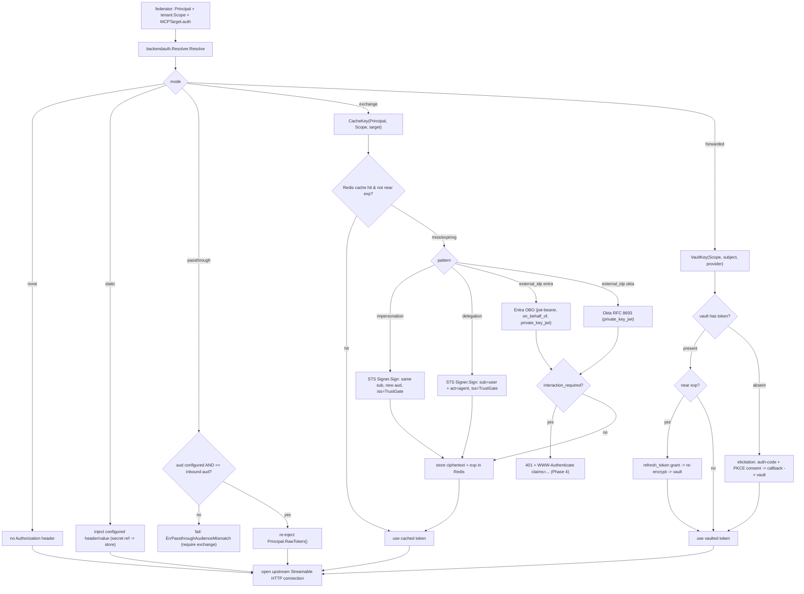

# Design: TrustGate MCP Gateway — Phase 5 (Security Token Service & Downstream Credential Federation)

## Linked artifacts
- Epic plan: `.cursor/plans/trustgate_mcp_gateway_and_auth_016192dd.plan.md` (Phase 5 = `cred-federation` todo; see
  "Phase 5 — Security Token Service", "Downstream auth flows (per target mode)" B1–B8, and Appendix B4–B8 / C2,C3,C6).
- Phase 1: `docs/design/trustgate-mcp-gateway-phase1-tenancy.md` (tenant model, `tenant.Scope`/`ids.OrgID`,
  `identity.Principal` shape + `RawToken()` redaction, migration idiom, DI module pattern).
- Phase 2 (inbound auth): **doc not yet written**; consumed from the plan ("Phase 2 — Inbound credential validation").
  Phase 5 reads exactly what Phase 2 produces on the `identity.Principal`: `Subject`, `Claims["tid"]`/`Claims["aud"]`,
  `Method`, and the retained `RawToken()`.
- Phase 3 (MCP data plane): **doc not yet written**; consumed from the plan ("Phase 3 — MCP Gateway server"). Defines
  `pkg/app/mcp/` (the federator), the `backend.MCPTarget.auth` shape, and the basic downstream modes none/static/passthrough.
- Phase 4 (MCP OAuth RS/AS): **doc not yet written**; consumed from the plan ("Phase 4"). Phase 5 reuses its
  `401 + WWW-Authenticate` challenge machinery (now also carrying the RFC 9470 `claims` parameter) and its
  `pkg/api/handler/http/oauth/` handler surface.
- **No Linear `ENG-###` supplied** — this doc is tracked in-repo. Create the ticket before implementation so the SDD
  memory contract / `/task-check` gate can run, then (optionally) mirror this file to `.cursor/sdd/<ENG-###>/design.md`.

> Scope note: this designs **only Phase 5** — TrustGate-as-issuer (signing key + JWKS), the `sts.Exchanger` seam with
> four patterns (impersonation / delegation / external-IdP exchange / elicitation credential-forwarding), the
> per-(principal, target, tenant) credential cache, the encrypted credential vault, and the federator integration that
> wires backend auth modes `passthrough`/`exchange`/`forwarded`. Phases 1–4 appear only as upstream dependencies.

---

## Grounding (verified against the code, not assumed)

| Claim | Evidence |
|---|---|
| The only JWT signer today is **HMAC/HS256 over a symmetric `config.SecretKey`**, admin-plane only, no asymmetric keys, no JWKS, no `kid` | `pkg/infra/auth/jwt/jwt_manager.go` (`SigningMethodHS256`, `[]byte(m.config.SecretKey)`); `Manager` exposes only `CreateToken/ValidateToken/DecodeToken` |
| `SecretKey` is sourced from env, never inline | `pkg/config/config.go` `getEnv("SERVER_SECRET_KEY", "")`; DB/Redis passwords also `getEnv(...)` |
| Secrets are **partly inline in the DB today** — `auth.config.oauth2.client_secret` and `api_key.key` live in the `auths.config` JSON | `pkg/domain/auth/config.go` (`OAuth2Config.ClientSecret`), migration `20260603140000_add_auth_key_hash.go` hashes `config->'api_key'->>'key'`. The cross-cutting rule (plan "Cross-cutting → Secret handling") says credentials must be *referenced, not stored inline* — Phase 5 entities therefore hold **secret references**, not raw secrets |
| A **shared, replica-wide Redis** client exists with `Get/Set(ttl)/Delete` + raw `*redis.Client`; `TTLMap` is explicitly **pod-local** | `pkg/infra/cache/client.go` (`cache.Client`), `pkg/infra/cache/ttlmap.go`. The token/credential cache must use Redis (shared), not `TTLMap` (pod-local) |
| `pkg/app/mcp/` **does not exist yet** (Phase 3 not landed) | glob of `pkg/app/**` returns no `mcp/` package; the federator is created by Phase 3 and Phase 5 adds the `Exchanger` call inside it |
| `pkg/domain/identity/` **does not exist yet** (Phase 1 not landed) | glob returns 0 files; `identity.Principal` + `RawToken()` are introduced by Phase 1 and consumed here |
| `backend.MCPTarget` / `mcp_target.auth` **does not exist yet** (Phase 3) | `pkg/domain/auth/config.go` only models `OAuth2`/`MTLS` inbound; the `mode/pattern/provider/...` downstream shape is the Phase 3 addition |
| Migration idiom = Go `init()` + `database.RegisterMigration(database.Migration{ID,Name,Up,Down})` over `pgx.Tx`, `ADD COLUMN IF NOT EXISTS` + backfill | `pkg/infra/database/migrations/20260603140000_add_auth_key_hash.go` |
| DI = `func Module(c *container.Container) error { c.Provide(ctor) }`, registered in `modules.go` | `pkg/container/modules/auth.go`, `modules/modules.go` |
| Admin HTTP handlers follow `pkg/api/handler/http/<entity>/{create,get,list,update,delete}_<entity>_handler.go` + `request/` + `response/` + shared `helpers/` | `pkg/api/handler/http/auth/*`, `helpers/errors.go`, `helpers/params.go` |

The most consequential finding: **TrustGate cannot mint a verifiable third-party-trustable token today.** HS256 with a
shared secret cannot anchor `iss = TrustGate` for an external downstream (the verifier would need the secret). Phase 5's
first building block is therefore a genuine **asymmetric STS issuer** (private key from the secret store, public JWKS
published), which is a new capability, not an extension of `jwt_manager`.

---

## Technical approach

Phase 5 adds **TrustGate as an OAuth 2.0 Token Exchange (RFC 8693) Security Token Service**, in-process, called by the
Phase 3 MCP federator on the path to each upstream. Three new pieces:

1. **STS issuer (`pkg/infra/auth/sts/`)** — an asymmetric `Signer` (RS256/ES256/EdDSA) whose private key is loaded from
   the secret store by reference and whose public keys are published as a JWKS at `/.well-known/jwks.json` on the MCP
   plane, plus an STS metadata document. This is the trust/audit anchor: downstreams configure `iss = https://<gw>/sts`
   and fetch our JWKS to verify minted tokens.

2. **Exchanger seam (`pkg/app/identity/sts/`)** — a single `Exchanger.Mint(ctx, TokenRequest) → TokenResult` port with a
   strategy dispatcher selecting one of four patterns: **impersonation** and **delegation** (we mint, `iss=TrustGate`),
   **external-IdP exchange** (Entra OBO via `urn:ietf:params:oauth:grant-type:jwt-bearer`, Okta via RFC 8693; `iss` =
   external IdP), and **forwarded/elicitation** (no token minted — a vaulted third-party OAuth credential). Every result
   is memoised in a **shared Redis credential cache** keyed by `(principal subject/oid, target resource, tenant OrgID)`
   with refresh-before-expiry.

3. **Federator integration + per-mode resolver (`pkg/app/mcp/backendauth/`)** — a `Resolver` maps
   `backend.MCPTarget.auth.mode` to the concrete header injection: `none`/`static`/`passthrough` resolve locally;
   `exchange`/`forwarded` delegate to the `Exchanger`. The federator sets `Authorization: Bearer {credential}` (or the
   configured header) on the upstream Streamable HTTP request. The **B3 confused-deputy guardrail** lives here:
   passthrough is permitted only when the target's expected audience is explicitly configured *and* equals the inbound
   token's `aud`; otherwise the resolver refuses and demands an exchange mode.

Isolation is the dominant non-functional requirement (a cache/vault leak is cross-user privilege escalation). We mirror
Phase 1's **"isolation by signature"** philosophy: the cache key and vault key are opaque types whose **only constructor
requires a `tenant.Scope` and an `identity.Principal`**, so a caller physically cannot build a key without the tenant
boundary, and the Redis namespace embeds the `OrgID`. IdP `interaction_required` errors during exchange propagate back
to the client as `401 + WWW-Authenticate ... claims=...` (reusing Phase 4), never a 500.

---

## Decisions

### D1 — STS is an in-process library, not a separate RFC 8693 `/token` endpoint
- **Choice:** the `Exchanger` is a Go package the federator calls in-process; minted tokens never leave the gateway as a
  generic, client-callable token-exchange endpoint. We *do* publish read-only metadata (`/.well-known/jwks.json`,
  STS metadata) so downstreams can verify our tokens.
- **Rejected:** stand up a public `POST /sts/token` RFC 8693 endpoint that clients/agents call to obtain exchanged tokens.
- **Rationale:** the credential is needed at exactly one place — just before opening the upstream connection — and the
  whole point of forwarded/elicitation is that **the agent never holds the credential**. A public exchange endpoint
  would (a) hand minted/forwarded credentials to clients, defeating the custody model; (b) require its own authn/rate
  limiting/abuse surface; (c) duplicate the per-mode resolver. We keep the *option* open (OQ1) by making `Exchanger` a
  clean port: a thin RFC 8693 handler could later wrap it for non-MCP consumers without touching the strategies.

### D2 — STS signing key: asymmetric, secret-store-sourced by reference, rotated with overlapping JWKS
- **Choice:** a new `pkg/infra/auth/sts/Signer` using **ES256 by default** (small tokens, fast) with RS256 selectable
  for downstreams that only accept RSA. The active private key is loaded by **reference** (`STS_SIGNING_KEY_REF` →
  env/file/k8s-secret/external-manager via a `secret.Source` indirection), tagged with a `kid`. Rotation is
  **overlap-based**: a `sts_signing_keys` table tracks `{kid, alg, public_jwk, secret_ref, status ∈ active|next|retiring,
  not_before, not_after}`; the JWKS publishes **all non-retired public keys** so tokens signed by the previous key still
  verify during the rotation window. New tokens always use the single `active` key.
- **Rejected:**
  - *Reuse `jwt_manager`'s HS256 symmetric key* — a symmetric key cannot be safely published; any downstream that must
    verify would need the secret, which is a shared-secret-with-every-downstream anti-pattern.
  - *Single static key, manual rotation only* — a key swap would invalidate all in-flight short-lived tokens and break
    cached results; overlap is required for zero-downtime rotation.
- **Rationale:** asymmetric + published JWKS is the only model that lets an external service trust `iss=TrustGate`
  without sharing a secret. Storing the key by reference satisfies the cross-cutting "referenced, not inline, never
  logged" rule; the `sts_signing_keys` row holds only the **public** JWK + a **secret reference**, never the private key.

### D3 — `Exchanger` is one port; strategy dispatch is config-first with issuer-hostname inference as fallback
- **Choice:** a single `Exchanger.Mint` port; an internal `strategy` per pattern (`impersonation`, `delegation`,
  `entraOBO`, `oktaExchange`, `forwardedVault`). Dispatch reads `MCPTarget.auth.mode`/`pattern`/`provider` **explicitly
  first**; when `provider` is omitted for `external_idp`, infer it from the inbound token issuer hostname
  (`login.microsoftonline.com`/`sts.windows.net` → Entra, `*.okta.com`/`*.oktapreview.com` → Okta) — but the explicit
  per-consumer config always wins.
- **Rejected:** *pure hostname inference* (brittle, surprises operators, can't express "this Entra tenant via Okta") and
  *one monolithic `Mint` switch* (untestable, violates the small-interface rule).
- **Rationale:** explicit config is auditable and predictable; inference is a convenience that removes a required field
  for the common single-IdP case. Per-strategy types keep each pattern independently table-testable and let us ship
  Entra before Okta (OQ3) without a god-function.

### D4 — Credential cache: shared Redis, key = `(subject, target, tenant)`, isolation enforced by an opaque key type
- **Choice:** cache exchange/forwarded results in **Redis** (`cache.Client`), not `TTLMap`. The key is an opaque
  `sts.CacheKey` whose **only constructor** is `NewCacheKey(p identity.Principal, scope tenant.Scope, t TargetAuth)`; its
  Redis serialization is `sts:cred:{orgID}:{sha256(subject)}:{sha256(target)}:{pattern}`. Stored value is the minted/
  exchanged token + `exp`; entries are **refreshed before expiry** (refresh when `now > exp − skew`, default 60s) and
  Redis TTL is set to `exp` as a hard backstop. The cache stores ciphertext (see D5) for forwarded tokens; minted
  short-lived JWTs may be stored as-is given their bounded lifetime (OQ2).
- **Rejected:**
  - *Pod-local `TTLMap`* — every replica would re-mint/re-OBO independently (load on IdPs) and, worse, a token minted on
    pod A is invisible to pod B, breaking the "any replica serves any request" Phase 3 invariant.
  - *Plain `string` cache key assembled at call sites* — a developer could forget the tenant component and silently
    serve org A's token to org B. Making `OrgID` a **required constructor argument** turns that into a compile error,
    exactly mirroring Phase 1's `tenant.Scope`-by-signature decision (Phase 1 D3).
- **Rationale:** correctness (shared across replicas) + isolation-by-construction (can't build a key without a tenant) +
  IdP-friendliness (one exchange per principal/target/tenant per TTL window). The `OrgID` is the leading, un-hashed key
  segment so a misconfigured `SCAN`/eviction can never cross tenants and ops can audit per-org.

### D5 — Credential vault: envelope encryption (KMS-wrapped DEK), persisted in Postgres, plaintext never at rest
- **Choice:** vaulted third-party tokens (forwarded/elicitation) are stored in a new `credential_vault` table as
  **envelope-encrypted blobs**: a per-record data-encryption key (DEK) encrypts `{access_token, refresh_token, scopes,
  obtained_at, expires_at}` with AES-256-GCM; the DEK is wrapped by a key-encryption key (KEK) from a `KeyManager` port.
  Default KEK provider is **app-level** (KEK from `CREDENTIAL_VAULT_KEK_REF` in the secret store); a `KMS` provider
  (AWS KMS / GCP KMS / Vault Transit) is selectable for production. Columns hold `ciphertext BYTEA`, `dek_wrapped BYTEA`,
  `nonce BYTEA`, `kek_version INT` — never plaintext, never a logged value.
- **Rejected:**
  - *Store third-party tokens in Redis only* — Redis is the hot cache, not the system of record; refresh tokens are
    long-lived and must survive cache flushes and be revocable per principal.
  - *Single static symmetric key for all records* — no per-record blast-radius containment and painful rotation;
    envelope encryption lets us rotate the KEK without re-reading every plaintext.
- **Rationale:** refresh tokens are the highest-value secret in the system (long-lived, user-scoped). Envelope
  encryption with a pluggable KEK gives KMS-grade protection where required and a working default elsewhere, satisfies
  "encrypted at rest", and contains blast radius to one record per compromised DEK. (KMS-vs-app-level default is OQ2.)

### D6 — Passthrough is gated by an explicit, matching audience (confused-deputy guardrail)
- **Choice:** `mode: passthrough` re-injects `Principal.RawToken()` **only if** `MCPTarget.auth.audience` is set *and*
  equals the inbound token's `aud` (read from `Principal.Claims["aud"]`). Otherwise the resolver returns
  `ErrPassthroughAudienceMismatch` and the federator fails the call (with a clear operator-facing error), demanding an
  `exchange` mode instead.
- **Rejected:** *unconditional passthrough* (the MCP-spec "token passthrough" anti-pattern) and *passthrough whenever an
  inbound token exists* (still a confused-deputy: a token minted for the gateway's own `aud` is replayed to an upstream
  that never validated it).
- **Rationale:** the inbound `aud` is almost always the gateway itself (Phase 4), so a naive passthrough hands the
  upstream a token it must reject — or worse, accepts. Requiring an explicit, matching audience makes passthrough safe
  only in the genuine same-trust-domain case and pushes everything else to a properly-scoped exchange.

### D7 — `private_key_jwt` client assertions: per-IdP keys, separate from the STS signing key
- **Choice:** external-IdP exchange authenticates the gateway as an OAuth client via **`private_key_jwt`**
  (`client_assertion_type=urn:ietf:params:oauth:client-assertion-type:jwt-bearer`). Each registered IdP provider has its
  **own** client-assertion key, referenced by `client_assertion_key_ref` on a new `sts_idp_provider` config (env/secret
  store), distinct from the STS issuer signing key. The client-assertion JWT carries `iss=sub=client_id`,
  `aud=<idp token endpoint>`, short `exp`, unique `jti`.
- **Rejected:** *reuse the STS signing key for client assertions* (conflates "TrustGate as issuer-of-record" with
  "TrustGate as an OAuth client at IdP X" — different trust relationships, different rotation cadences, and a single
  compromise would span both roles) and *client_secret* (Entra/Okta best practice is `private_key_jwt`; secrets are
  weaker and the plan mandates it).
- **Rationale:** separation of duties and blast-radius containment; each IdP relationship rotates independently.

### D8 — Elicitation: server-orchestrated auth-code + PKCE, short-lived signed `state`, callback on the OAuth handler
- **Choice:** when a forwarded credential is missing, the federator surfaces an **elicitation** (an MCP
  `interaction_required`-style signal to the client) carrying a TrustGate authorize URL. TrustGate runs the third-party
  **authorization-code + PKCE** flow: it generates `code_verifier`/`code_challenge` and an opaque `state`, persists the
  flow context (`{tenant, subject, provider, backend, code_verifier, return}`) in a short-TTL `oauth_state` store, and
  exposes a callback `GET /v1/oauth/elicitation/callback` (under the Phase 4 `pkg/api/handler/http/oauth/` surface) that
  exchanges the code, encrypts the tokens, and writes them to the vault keyed by `(tenant, subject, provider)`.
- **Rejected:** *implicit flow / no PKCE* (deprecated, insecure for public-ish redirects) and *passing flow state in the
  redirect itself* (tamperable; PKCE verifier must never leave the server).
- **Rationale:** auth-code+PKCE is the only acceptable modern interactive grant; a server-side, TTL'd, single-use
  `state` binds the callback to the originating principal/tenant and defeats CSRF/mix-up. The agent only ever sees a
  consent prompt, never the resulting credential.

### D9 — `Principal.RawToken()` is read at the boundary and never logged; credentials are a redacting type
- **Choice:** the resolver/strategies read `Principal.RawToken()` only to populate the `assertion`/`subject_token`/
  passthrough header, and pass minted/forwarded secrets around as a `secret.Value` wrapper whose `String()`/`LogValue()`/
  `MarshalJSON()` redact to `"[REDACTED]"`. Audit logs record `iss`, `aud`, `act`, `sub`, `exp`, `jti`, pattern, and a
  token **fingerprint** (`sha256` prefix) — never the token.
- **Rejected:** logging tokens at debug level "temporarily" (they leak to log sinks) and passing raw `string`
  credentials (one stray `slog.String("token", v)` is a breach).
- **Rationale:** the Phase 1 redaction contract for `Principal.rawToken` must extend to *every* derived credential; a
  type that is structurally unloggable is the only durable defense, consistent with Phase 1 D5.

---

## Data flow

### Per-mode downstream dispatch (extends the plan's B-mode flowchart)



### Entra On-Behalf-Of exchange (B6) sequence

```mermaid
sequenceDiagram
  participant F as MCP federator
  participant X as sts.Exchanger
  participant Cz as Redis cred cache
  participant K as secret store (client-assertion key)
  participant E as Entra token endpoint
  F->>X: Mint(TokenRequest{Principal, Scope, target=entra})
  X->>Cz: GET sts:cred:{org}:{h(sub)}:{h(resource)}:external_idp
  alt cache miss / near exp
    X->>K: load client_assertion_key_ref (private_key_jwt)
    X->>X: build client_assertion JWT (iss=sub=client_id, aud=token_ep, jti, exp)
    X->>E: POST grant_type=jwt-bearer & requested_token_use=on_behalf_of\n assertion=Principal.RawToken() & scope=<resource>/.default\n client_assertion_type=...jwt-bearer & client_assertion=<jwt>\n (authority from Principal.Claims["tid"])
    alt interaction_required / claims challenge
      E-->>X: 400 {error:"interaction_required", claims:...}
      X-->>F: ErrInteractionRequired{claims}
      F-->>F: 401 + WWW-Authenticate claims=... (Phase 4)
    else success
      E-->>X: {access_token, expires_in}
      X->>Cz: SET ciphertext, TTL=expires_in
    end
  end
  X-->>F: TokenResult{Bearer access_token, exp}
  F->>F: set Authorization: Bearer <token>; open upstream
```

### Elicitation auth-code + vault (B8) sequence

```mermaid
sequenceDiagram
  participant Cl as MCP client (agent)
  participant F as MCP federator
  participant V as Credential vault
  participant O as oauth_state store (Redis, TTL)
  participant CB as /v1/oauth/elicitation/callback
  participant TP as Third-party IdP (GitHub/Salesforce)
  F->>V: Lookup(VaultKey{org, sub, github})
  alt absent
    F->>O: store {tenant, sub, provider, backend, code_verifier} by state
    F-->>Cl: elicitation: authorize_url (code_challenge, state, scopes)
    Cl->>TP: user consents (auth-code + PKCE)
    TP-->>CB: redirect ?code&state
    CB->>O: load + delete state (single-use); rebuild PKCE
    CB->>TP: POST code + code_verifier -> {access, refresh, exp}
    CB->>V: envelope-encrypt + Store(VaultKey, cred)
    CB-->>Cl: consent complete (retry tool call)
  else present (refresh if near exp)
    V-->>F: decrypted access token
  end
  F->>F: set Authorization: Bearer <token>; open upstream
```

---

## Interfaces / contracts

### STS issuer / signer (`pkg/infra/auth/sts/`)
```go
// signer.go — asymmetric issuer; the trust/audit anchor. Distinct from jwt.Manager (HS256 admin).
type Signer interface {
    // Sign mints a short-lived JWT (iss = TrustGate STS) for impersonation/delegation.
    Sign(ctx context.Context, c MintClaims) (token string, exp time.Time, err error)
    // JWKS returns all currently-publishable public keys (active + retiring) for /.well-known/jwks.json.
    JWKS(ctx context.Context) (JWKS, error)
    ActiveKID() string
}

type MintClaims struct {
    Subject  string            // sub — same as inbound for impersonation/delegation
    Audience []string          // aud — the downstream target
    Actor    *Actor            // act — set for delegation only (RFC 8693 §4.1)
    Scope    []string          // space-joined into "scope"
    TenantID ids.OrgID         // embedded as a private "org" claim for downstream audit
    TTL      time.Duration     // bounded; default 5m
    // iss, iat, exp, nbf, jti are filled by the signer; jti is a UUIDv7 for replay/audit.
}
type Actor struct { Subject string; Actor *Actor } // nested "act" for multi-hop chains
```

### Exchanger seam + strategies (`pkg/app/identity/sts/`)
```go
//go:generate mockery --name=Exchanger ...
type Exchanger interface {
    // Mint resolves a downstream credential for one upstream connection (cache-aware).
    Mint(ctx context.Context, req TokenRequest) (*TokenResult, error)
}

type TokenRequest struct {
    Principal identity.Principal // Subject, Claims["tid"]/["aud"], Method, RawToken()
    Scope     tenant.Scope       // Phase 1 OrgID boundary — REQUIRED (isolation)
    Backend   ids.BackendID
    Target    TargetAuth         // projected from backend.MCPTarget.Auth
}

// TargetAuth is the Phase 3 mcp_target.auth projected into the STS domain.
type TargetAuth struct {
    Mode     Mode     // none|static|passthrough|exchange|forwarded
    Pattern  Pattern  // impersonation|delegation|external_idp (exchange only)
    Provider Provider // entra|okta (external_idp); github|salesforce (forwarded)
    Resource string   // external_idp resource / scope base, e.g. "https://graph.microsoft.com/.default"
    Audience string   // mint aud (impersonation/delegation) AND the passthrough guardrail value
    Actor    string   // delegation act sub, e.g. "trustgate-agent-v2"
    Scopes   []string // forwarded / mint scopes
}

type TokenResult struct {
    Header     string        // default "Authorization"
    Scheme     string        // default "Bearer"
    Credential secret.Value  // redacting wrapper — never logged/serialized
    ExpiresAt  time.Time
    Issuer     string        // for audit: TrustGate STS or external IdP
    Pattern    Pattern
}

// internal dispatch — one tiny, table-testable strategy per pattern.
type strategy interface {
    pattern() Pattern
    resolve(ctx context.Context, req TokenRequest) (*TokenResult, error)
}
// impersonationStrategy / delegationStrategy use Signer.Sign.
// entraStrategy / oktaStrategy do the HTTP exchange + private_key_jwt.
// (forwarded is handled by the vault path, not a mint strategy.)

var ErrInteractionRequired = errors.New("sts: idp requires interaction") // carries the claims param
type InteractionRequiredError struct{ Claims string; WWWAuthenticate string }
```

### Per-mode backend-auth resolver (`pkg/app/mcp/backendauth/`)
```go
type Resolver struct { /* exchanger sts.Exchanger; vault sts.CredentialVault; secrets secret.Source */ }

// Resolve is called by the Phase 3 federator just before opening the upstream connection.
func (r *Resolver) Resolve(
    ctx context.Context,
    p identity.Principal,
    scope tenant.Scope,
    t backend.MCPTarget,
) (Injection, error)

type Injection struct {
    Header string
    Value  secret.Value // redacted in logs; empty for mode=none
}

var (
    ErrPassthroughAudienceMismatch = errors.New("backendauth: passthrough requires matching configured aud")
    ErrUnsupportedMode             = errors.New("backendauth: unsupported auth mode")
)
```

### Credential cache key (isolation by construction) (`pkg/app/identity/sts/cachekey.go`)
```go
// CacheKey is opaque: its ONLY constructor requires a Scope + Principal, so a
// caller cannot build a key without the tenant boundary (mirrors Phase 1's
// tenant.Scope-by-signature). The OrgID is the leading, un-hashed segment.
type CacheKey struct {
    org     ids.OrgID
    subject string
    target  string
    pattern Pattern
}
func NewCacheKey(p identity.Principal, s tenant.Scope, t TargetAuth) (CacheKey, error) {
    if !s.Valid() || p.Subject == "" { return CacheKey{}, ErrInvalidCacheKey }
    return CacheKey{org: s.OrgID, subject: p.Subject, target: canonicalTarget(t), pattern: t.Pattern}, nil
}
// Redis serialization — org first so SCAN/eviction can never cross tenants.
func (k CacheKey) Redis() string {
    return fmt.Sprintf("sts:cred:%s:%s:%s:%s",
        k.org, sha256hex(k.subject), sha256hex(k.target), k.pattern)
}
```

### Credential vault (`pkg/app/identity/sts/vault.go` port; impl in `pkg/infra/identity/vault/`)
```go
type CredentialVault interface {
    Lookup(ctx context.Context, key VaultKey) (*StoredCredential, error) // ErrNotFound if absent
    Store(ctx context.Context, key VaultKey, c StoredCredential) error   // envelope-encrypts before write
    Delete(ctx context.Context, key VaultKey) error                      // revoke
}
type VaultKey struct { // same isolation discipline: built from Scope + Principal
    Org      ids.OrgID
    Subject  string
    Provider Provider
}
func NewVaultKey(p identity.Principal, s tenant.Scope, prov Provider) (VaultKey, error)

type StoredCredential struct {
    Access    secret.Value
    Refresh   secret.Value
    Scopes    []string
    ExpiresAt time.Time
}

// KeyManager wraps/unwraps the per-record DEK (app-level or KMS).
type KeyManager interface {
    Wrap(ctx context.Context, dek []byte) (wrapped []byte, kekVersion int, err error)
    Unwrap(ctx context.Context, wrapped []byte, kekVersion int) (dek []byte, err error)
}
```

### How Principal + tenant.Scope thread through (and enforce isolation)
- The Phase 3 federator already holds the `identity.Principal` (from Phase 2 context) and the resolved consumer's
  `tenant.Scope` (from Phase 1 context). It passes **both** into `Resolver.Resolve`.
- `Resolve` constructs `CacheKey`/`VaultKey` via their tenant-requiring constructors → **no key exists without an
  `OrgID`** → org A can never read org B's Redis entry or vault row (the namespace/`WHERE org_id` differ).
- Strategies read `Principal.RawToken()` (OBO assertion / Okta `subject_token` / passthrough) and `Principal.Subject`
  (mint `sub`) and `Principal.Claims["tid"]` (Entra authority) — all already redacted types from Phase 1.

---

## Migration plan

New file `pkg/infra/database/migrations/20260612xxxxxx_add_sts_credential_federation.go`, single transaction, following
the `init()` + `database.RegisterMigration` idiom. **All secret-bearing columns hold references or ciphertext — never
plaintext.**

**Up:**
1. `sts_signing_keys` — issuer key registry (public material + secret reference only):
   ```sql
   CREATE TABLE sts_signing_keys (
       kid         TEXT PRIMARY KEY,
       alg         TEXT NOT NULL,                 -- ES256 | RS256 | EdDSA
       public_jwk  JSONB NOT NULL,                -- published in JWKS
       secret_ref  TEXT NOT NULL,                 -- reference to the PRIVATE key in the secret store
       status      TEXT NOT NULL,                 -- active | next | retiring
       not_before  TIMESTAMPTZ NOT NULL,
       not_after   TIMESTAMPTZ,
       tenant_id   UUID NOT NULL REFERENCES organizations(id) ON DELETE RESTRICT, -- Phase 1 default-org for the shared issuer
       created_at  TIMESTAMPTZ NOT NULL
   );
   CREATE UNIQUE INDEX sts_signing_keys_one_active
       ON sts_signing_keys (status) WHERE status = 'active';
   ```
2. `sts_idp_providers` — per-IdP external-exchange config (references, not secrets):
   ```sql
   CREATE TABLE sts_idp_providers (
       id                        UUID PRIMARY KEY,
       tenant_id                 UUID NOT NULL REFERENCES organizations(id) ON DELETE RESTRICT,
       provider                  TEXT NOT NULL,    -- entra | okta
       client_id                 TEXT NOT NULL,
       token_endpoint            TEXT NOT NULL,
       authority_template        TEXT,             -- e.g. https://login.microsoftonline.com/{tid}/oauth2/v2.0/token
       client_assertion_key_ref  TEXT NOT NULL,    -- private_key_jwt key reference (NOT the key)
       created_at                TIMESTAMPTZ NOT NULL,
       updated_at                TIMESTAMPTZ NOT NULL,
       CONSTRAINT sts_idp_providers_tenant_provider_uniq UNIQUE (tenant_id, provider, client_id)
   );
   CREATE INDEX sts_idp_providers_tenant_idx ON sts_idp_providers (tenant_id);
   ```
3. `credential_vault` — envelope-encrypted third-party tokens (forwarded/elicitation):
   ```sql
   CREATE TABLE credential_vault (
       id           UUID PRIMARY KEY,
       tenant_id    UUID NOT NULL REFERENCES organizations(id) ON DELETE RESTRICT,
       subject      TEXT NOT NULL,                 -- principal sub/oid
       provider     TEXT NOT NULL,                 -- github | salesforce | ...
       ciphertext   BYTEA NOT NULL,                -- AES-256-GCM { access, refresh, scopes, exp }
       dek_wrapped  BYTEA NOT NULL,                -- DEK wrapped by KEK
       nonce        BYTEA NOT NULL,
       kek_version  INT  NOT NULL,
       expires_at   TIMESTAMPTZ,                   -- access-token expiry (refresh hint)
       created_at   TIMESTAMPTZ NOT NULL,
       updated_at   TIMESTAMPTZ NOT NULL,
       CONSTRAINT credential_vault_principal_provider_uniq UNIQUE (tenant_id, subject, provider)
   );
   CREATE INDEX credential_vault_tenant_idx ON credential_vault (tenant_id);
   ```
4. `oauth_state` — short-lived elicitation/auth-code flow state (Postgres backstop; Redis is the hot path):
   ```sql
   CREATE TABLE oauth_state (
       state         TEXT PRIMARY KEY,            -- opaque, single-use
       tenant_id     UUID NOT NULL REFERENCES organizations(id) ON DELETE CASCADE,
       subject       TEXT NOT NULL,
       provider      TEXT NOT NULL,
       backend_id    UUID NOT NULL,
       code_verifier TEXT NOT NULL,               -- PKCE; never leaves the server
       redirect_uri  TEXT NOT NULL,
       expires_at    TIMESTAMPTZ NOT NULL,        -- ~10 min TTL; reaper deletes
       created_at    TIMESTAMPTZ NOT NULL
   );
   CREATE INDEX oauth_state_expires_idx ON oauth_state (expires_at);
   ```

**Tenancy:** every table carries `tenant_id` referencing `organizations(id)` (Phase 1), so the cache/vault/state
isolation lines up with the `OrgID` cache-key segment. The shared STS issuer keys live under the Phase 1 default org.

**Down:** drop `oauth_state`, `credential_vault`, `sts_idp_providers`, `sts_signing_keys` (and their indexes).

**Secret-reference invariant (test-asserted):** `sts_signing_keys.secret_ref` and
`sts_idp_providers.client_assertion_key_ref` contain a reference string only; a data-integrity test asserts they never
look like PEM/JWK private material, and `credential_vault` has no plaintext column.

---

## Security analysis

### Primary threat: cross-user / cross-tenant credential escalation
A leaked cached token or vaulted credential = one user acting as another, or one org reading another's downstream
credentials — the single highest-severity risk in the epic. Defenses, each independently fail-closed:

1. **Isolation by construction (compile-time).** `CacheKey`/`VaultKey` have **no public fields and one constructor**
   that *requires* a `tenant.Scope` (`OrgID`) and an `identity.Principal`. A developer cannot assemble a key without the
   tenant — the forgotten-tenant bug is a build error, mirroring Phase 1 D3.
2. **Namespace by construction (runtime).** Redis keys are `sts:cred:{orgID}:…` and every vault/state query carries
   `WHERE tenant_id = $org`; the `OrgID` is the leading, un-hashed segment so `SCAN`/eviction/ops tooling can never
   straddle tenants.
3. **Per-principal subject in the key.** `subject` (sub/oid) is part of both keys, so two users in the same org get
   distinct entries; a hash of the subject avoids leaking identifiers in Redis while preserving uniqueness.
4. **Redaction everywhere.** All credentials are `secret.Value` (redacting `String/LogValue/MarshalJSON`);
   `Principal.RawToken()` is read only at the injection boundary. Audit records carry fingerprints, not tokens.
5. **Isolation test suite.** A mandatory table-driven suite seeds org A & org B (and two users in A), then asserts: A's
   `Mint`/vault `Lookup` never returns B's entry; same-org distinct users never collide; a key built with B's scope
   cannot read A's Redis entry. Adding a new pattern without isolation coverage fails CI (mirrors Phase 1's isolation
   gate).

### Confused-deputy (passthrough)
Unconstrained passthrough lets a token minted for the gateway's `aud` be replayed to an upstream that never validated it
(D6). Mitigation: passthrough requires an **explicitly configured** `audience` that **equals** the inbound `aud`;
otherwise the resolver refuses and forces an exchange. The default posture is "exchange, not passthrough."

### Key-compromise blast radius
- **STS signing key:** compromise lets an attacker mint TrustGate-issued tokens for any `sub`/`aud`. Containment:
  short token TTL (≤5m), overlapping rotation so revocation is a fast key swap (drop the `kid` from JWKS → all its
  tokens fail verification), and audit of every mint (`jti`, `sub`, `aud`, `act`). Recommended HSM/KMS-backed key
  (OQ2) so the private key never sits in app memory.
- **`private_key_jwt` IdP keys:** scoped per-IdP (D7), so one compromise affects one IdP relationship, rotatable
  independently.
- **Vault KEK:** envelope encryption means a leaked DEK exposes one record; the KEK is the crown jewel and lives in
  the secret store/KMS, rotatable without re-reading plaintext (re-wrap DEKs).

### Audit-trail requirements
Every credential resolution emits a structured audit event (extending the plan's tool-call audit): `principal.sub`,
`tenant`, `backend`, resolved upstream, mode/pattern, `iss`/`aud`/`act` of the issued credential, `jti`, cache
hit/miss, and outcome (minted / cached / exchanged / vault-hit / interaction_required / refused). For delegation this
yields the full **user → agent → tool** chain via the `act` claim. No token material is ever in the audit record.

---

## File changes (grouped into ≤400-line chained PRs)

Per `_base.mdc` the 400-line budget forces a split. Phase 5 ships as **5 stacked PRs** (5.1 → 5.5); each is independently
compilable + testable. LOC forecasts include tests.

### PR 5.1 — STS issuer: asymmetric signer + key sourcing/rotation + JWKS endpoint (~390 LOC)
| File | Action | Purpose |
|---|---|---|
| `pkg/infra/auth/sts/signer.go` | Create | ES256/RS256/EdDSA `Signer`; `Sign(MintClaims)`, `JWKS()`, `ActiveKID()` |
| `pkg/infra/auth/sts/keyset.go` | Create | Load active/next/retiring keys by `secret_ref`; overlap rotation; build JWKS |
| `pkg/infra/secret/source.go` | Create | `secret.Source` indirection (env/file/k8s/external) + `secret.Value` redacting type |
| `pkg/infra/database/migrations/20260612xxxxxx_add_sts_credential_federation.go` | Create | `sts_signing_keys` (+ other Phase 5 tables; co-located migration) |
| `pkg/infra/repository/sts/signingkey_repository.go` | Create | pgx repo for `sts_signing_keys` |
| `pkg/api/handler/http/oauth/jwks_handler.go` | Create | `GET /.well-known/jwks.json` + STS metadata on the MCP plane |
| `pkg/container/modules/sts.go` | Create | Provide `Signer`, repo, JWKS handler |
| `pkg/container/modules/modules.go` | Modify | Register the STS module |
| `pkg/config/config.go` | Modify | `STS_SIGNING_KEY_REF`, `STS_ISSUER`, default alg/TTL |
| `*_test.go` (signer, keyset, jwks handler) | Create | Sign/verify round-trip, JWKS contents, rotation overlap |

### PR 5.2 — Exchanger seam + impersonation/delegation mint + Redis cache + isolation keys (~400 LOC)
| File | Action | Purpose |
|---|---|---|
| `pkg/app/identity/sts/exchanger.go` | Create | `Exchanger` port, `TokenRequest`/`TokenResult`, strategy dispatch |
| `pkg/app/identity/sts/impersonation.go` | Create | `impersonationStrategy` (same `sub`, new `aud`, `iss=TrustGate`) |
| `pkg/app/identity/sts/delegation.go` | Create | `delegationStrategy` (`sub`=user + `act`=agent / nested ID-JAG) |
| `pkg/app/identity/sts/cachekey.go` | Create | Opaque `CacheKey` + tenant-requiring constructor |
| `pkg/app/identity/sts/cache.go` | Create | Redis-backed cache (`cache.Client`), refresh-before-expiry |
| `pkg/app/identity/sts/errors.go` | Create | `ErrInteractionRequired`, `InteractionRequiredError`, sentinels |
| `pkg/container/modules/sts.go` | Modify | Provide `Exchanger` + cache |
| `*_test.go` (impersonation, delegation, cachekey, cache, **isolation suite**) | Create | Claim correctness; cache hit/miss/refresh; cross-tenant/cross-user isolation |

> If 5.2 lands over budget, cut at the cache boundary: 5.2a = exchanger + mint strategies + cache key; 5.2b = Redis cache
> + refresh + isolation suite.

### PR 5.3 — External-IdP exchange: Entra OBO + Okta RFC 8693 + `private_key_jwt` (~390 LOC)
| File | Action | Purpose |
|---|---|---|
| `pkg/app/identity/sts/entra.go` | Create | Entra OBO (`grant_type=jwt-bearer`, `requested_token_use=on_behalf_of`, authority from `tid`) |
| `pkg/app/identity/sts/okta.go` | Create | Okta RFC 8693 (`grant_type=token-exchange`, `subject_token`, `audience`/`resource`) |
| `pkg/infra/auth/sts/clientassertion.go` | Create | `private_key_jwt` builder (per-IdP key by ref); strategy inference from issuer hostname |
| `pkg/infra/repository/sts/idp_provider_repository.go` | Create | pgx repo for `sts_idp_providers` |
| `pkg/infra/auth/sts/http.go` | Create | Token-endpoint client + `interaction_required`/claims-challenge parsing |
| `pkg/container/modules/sts.go` | Modify | Provide IdP strategies + provider repo |
| `*_test.go` (entra, okta, clientassertion) | Create | Request-shape assertions vs mock IdP; claims-challenge mapping; inference |

### PR 5.4 — Credential vault (envelope encryption) + elicitation auth-code callback (~400 LOC)
| File | Action | Purpose |
|---|---|---|
| `pkg/app/identity/sts/vault.go` | Create | `CredentialVault` port, `VaultKey` (tenant-requiring), `StoredCredential` |
| `pkg/infra/identity/vault/repository.go` | Create | pgx vault impl; envelope encrypt/decrypt on write/read |
| `pkg/infra/identity/vault/envelope.go` | Create | AES-256-GCM DEK + `KeyManager` (app-level KEK; KMS provider hook) |
| `pkg/app/identity/sts/elicitation.go` | Create | Auth-code+PKCE orchestration; `oauth_state` create/consume; refresh-token grant |
| `pkg/infra/repository/sts/oauth_state_repository.go` | Create | pgx `oauth_state` repo (Redis hot path + DB backstop) + reaper hook |
| `pkg/api/handler/http/oauth/elicitation_callback_handler.go` | Create | `GET /v1/oauth/elicitation/callback`: code→tokens→vault |
| `pkg/container/modules/sts.go` | Modify | Provide vault, key manager, elicitation, callback handler |
| `*_test.go` (vault, envelope, elicitation, callback) | Create | Encrypt round-trip; refresh; state single-use; callback happy/CSRF |

### PR 5.5 — Federator integration + per-mode resolver + passthrough guardrail + claims propagation (~360 LOC)
| File | Action | Purpose |
|---|---|---|
| `pkg/app/mcp/backendauth/resolver.go` | Create | `Resolver.Resolve(Principal, Scope, MCPTarget) → Injection`; mode dispatch |
| `pkg/app/mcp/backendauth/passthrough.go` | Create | B3 guardrail: require configured `aud` == inbound `aud`, else refuse |
| `pkg/app/mcp/federator.go` | Modify | Call `Resolver.Resolve` before opening each upstream; set the header (Phase 3 seam) |
| `pkg/api/handler/http/mcp/*.go` | Modify | Map `ErrInteractionRequired` → `401 + WWW-Authenticate claims=...` (Phase 4 machinery) |
| `pkg/infra/audit/credential_event.go` | Create | Structured credential-resolution audit (no token material) |
| `pkg/container/modules/sts.go` / `server_mcp.go` | Modify | Wire `Resolver` into the federator |
| `*_test.go` (resolver, passthrough, federator integration) | Create | Per-mode dispatch; guardrail rejection; interaction propagation; audit shape |

> Stacking: 5.1 stands alone (issuer + JWKS, no behavior change to the data path); 5.2 adds mint+cache; 5.3 adds external
> exchange; 5.4 adds vault+elicitation; 5.5 flips the federator onto the resolver. 5.5 is the only PR that changes the
> live upstream request path, so it ships last and behind the per-consumer opt-in.

---

## Testing strategy

| Layer | What to test | How |
|---|---|---|
| Unit (table-driven) | **Impersonation** mint: `sub` preserved, `aud`=target, `iss`=TrustGate, `exp` bounded, `jti` unique, no `act` | `Signer` + parse back with the public JWK |
| Unit | **Delegation** mint: `sub`=user, `act.sub`=agent, nested `act` for multi-hop, `aud`=target | Parse + assert `act` chain |
| Unit | **Entra OBO** request shape: `grant_type=jwt-bearer`, `requested_token_use=on_behalf_of`, `assertion`=RawToken, `scope=<resource>/.default`, `client_assertion_type`/`client_assertion` present, authority from `tid` | `httptest` mock Entra; assert form body |
| Unit | **Okta RFC 8693** shape: `grant_type=...token-exchange`, `subject_token`+`subject_token_type`, `audience`/`resource`, `private_key_jwt` | `httptest` mock Okta |
| Unit | **`private_key_jwt`** assertion: `iss=sub=client_id`, `aud`=token endpoint, short `exp`, unique `jti`, signed by the per-IdP key | Verify with the provider public key |
| Unit | **Strategy inference**: issuer hostname → provider; explicit config overrides inference | Table of issuer→expected |
| Unit | **Vault** envelope: encrypt→store→decrypt round-trip; tamper (bad nonce/ciphertext) → error; no plaintext column | In-memory `KeyManager` |
| Unit | **Vault refresh**: near-exp triggers refresh-token grant; re-encrypt; expired refresh → re-elicit | Mock provider token endpoint |
| Unit | **Cache** hit/miss/refresh-before-expiry; TTL backstop = `exp`; ciphertext at rest for forwarded | Redis test client / miniredis |
| Unit/Sec | **Cross-tenant + cross-user isolation suite** | Seed org A (2 users) + org B; assert no key built with B's scope reads A's entry; same-org users never collide; mirrors Phase 1 isolation gate |
| Unit | **Passthrough guardrail**: no `aud` → refuse; `aud` ≠ inbound `aud` → refuse; match → inject `RawToken()` | Table of (configured aud, inbound aud) |
| Unit | **`interaction_required` propagation**: IdP claims challenge → `ErrInteractionRequired{claims}` → `401 + WWW-Authenticate claims=...`, never 500 | Mock IdP 400 + handler assert |
| Unit | **Redaction**: `secret.Value`/`TokenResult`/`Injection` never leak token in `String`/`LogValue`/`MarshalJSON`; audit carries fingerprint only | `slog` capture + JSON marshal |
| Integration (build tag) | Migration up/down; vault + provider + signing-key repos CRUD; `oauth_state` single-use + reaper | Real Postgres test DB |
| E2E (`tests/functional/`) | Mock remote MCP upstream + mock IdP: exchange mode mints/caches and the upstream accepts; forwarded mode runs elicitation→callback→vault→inject | Extends Phase 3 federation E2E |

Assert on behavior (e.g. "cross-tenant `Mint` returns this org's own/`ErrNotFound`", "guardrail refuses"), never on
internal SQL or token internals beyond documented claims — per `_base.mdc` / `golang.mdc`.

---

## Migration / rollout

- **Deploy order:** Phases 1→2→3→4 first (Phase 5 hard-depends on `identity.Principal` + `RawToken()`, the MCP
  federator, and the Phase 4 challenge machinery). Then: run the Phase 5 migration → provision the STS signing key
  (`STS_SIGNING_KEY_REF`) and per-IdP `private_key_jwt` keys in the secret store → register downstream trust of
  `iss=TrustGate` + our JWKS → roll out binaries.
- **Per-consumer opt-in:** the live request path only changes for backends whose `mcp_target.auth.mode` is
  `passthrough`/`exchange`/`forwarded`. Existing `none`/`static` backends are unaffected, so PR 5.5 is safe to deploy
  before any consumer opts in. Migrate consumers one at a time, starting with impersonation/delegation (no external
  dependency), then Entra OBO, then forwarded/elicitation.
- **Key provisioning is a prerequisite, not a runtime fallback:** with no `active` signing key, mint patterns fail
  closed (clear operator error), never with an insecure default — consistent with `jwt_manager`'s "empty key rejects
  everything" posture.
- **Rotation runbook:** add a `next` signing key → promote to `active` (old → `retiring`, still in JWKS) → after the
  max token TTL window, drop the retiring key. `private_key_jwt` and vault KEK rotate independently on their own cadence.

---

## Open questions (lock before implementation)

1. **Separate RFC 8693 `/token` endpoint? (OQ1)** Recommended: **no** for v1 — keep STS in-process (D1) and publish only
   JWKS/metadata; expose `Exchanger` as a clean port so a public endpoint can wrap it later if a non-MCP consumer needs
   it. Confirm no near-term requirement for client-callable token exchange.
2. **KMS vs app-level encryption + HSM for the signing key (OQ2).** Recommended: ship the **app-level KEK + in-process
   signer** as the default (works everywhere) but make `KeyManager`/key loading **pluggable** so production can select
   AWS/GCP KMS or Vault Transit and an HSM-backed signing key. Confirm the v1 default and which KMS to implement first.
3. **Which external IdPs ship first (OQ3).** Recommended: **Entra OBO first** (richest demand, ties to Phase 4), Okta
   second; Keycloak/Auth0 RFC 8693 as fast-follows reusing `oktaStrategy`'s 8693 path. Confirm ordering.
4. **Vault provider abstraction (OQ4).** Recommended: persist in **Postgres with envelope encryption** as the system of
   record (D5) and keep `CredentialVault` a port so an external secrets manager (Vault KV, AWS Secrets Manager) can back
   it later. Confirm Postgres-as-vault is acceptable for v1 vs requiring an external manager from day one.
5. **Signing-key rotation cadence + token TTL (OQ5).** Recommended: **ES256**, **5-minute** minted-token TTL, **30-day**
   signing-key rotation with a rotation-window ≥ token TTL. Confirm the numbers with security/compliance.
6. **Cache storage of minted JWTs: plaintext vs encrypted (OQ6).** Recommended: store **forwarded/exchanged third-party
   tokens encrypted** in Redis but allow **short-lived self-minted JWTs plaintext** (bounded by TTL, no refresh token).
   Confirm this asymmetry is acceptable, or require encryption for all cached credentials.
7. **`oauth_state` home: Redis-only vs Postgres backstop (OQ7).** Recommended: **Redis hot path + Postgres table** for
   durability across restarts/replicas during a multi-minute consent. Confirm whether Redis-only (simpler) is acceptable
   given consent flows are short and re-startable.
