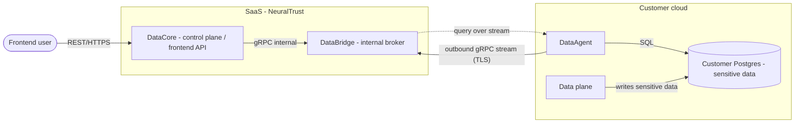
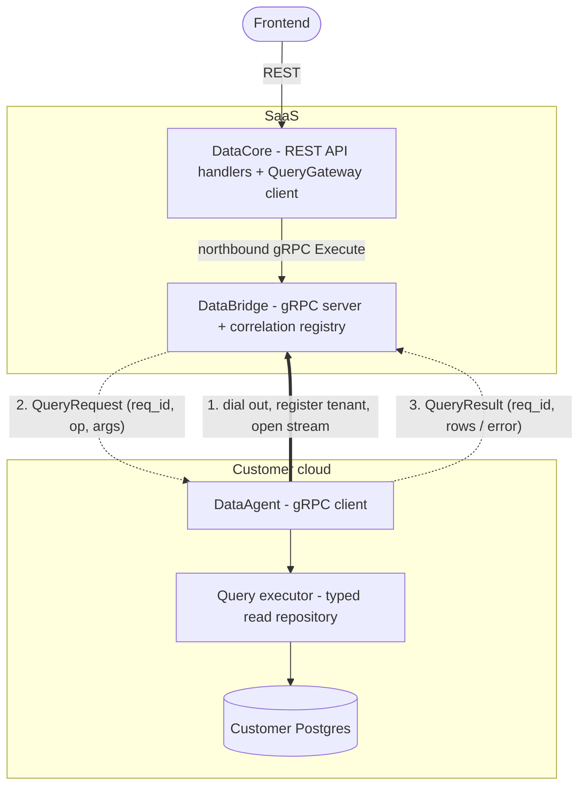
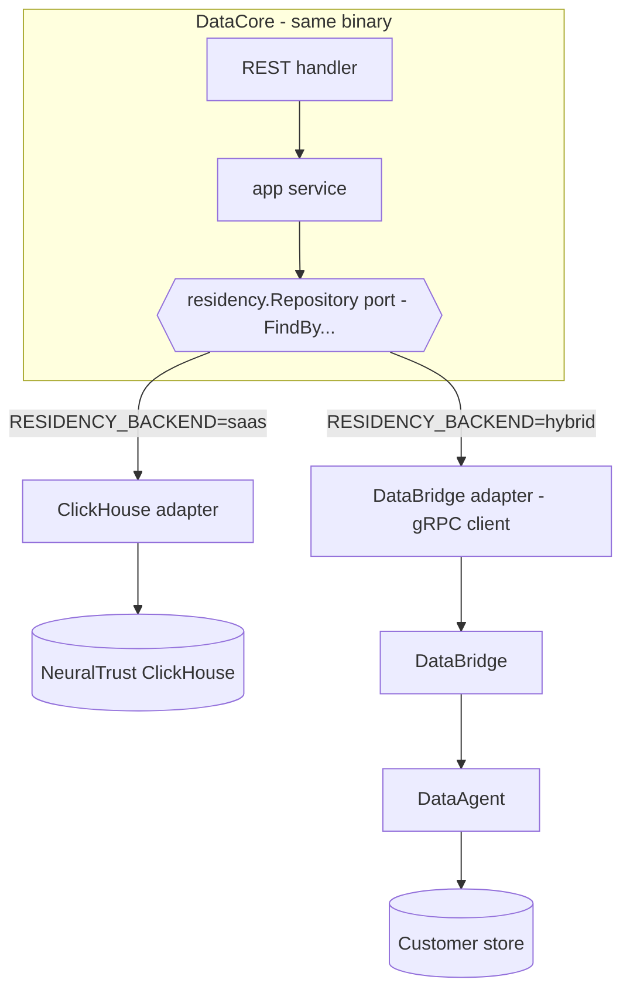
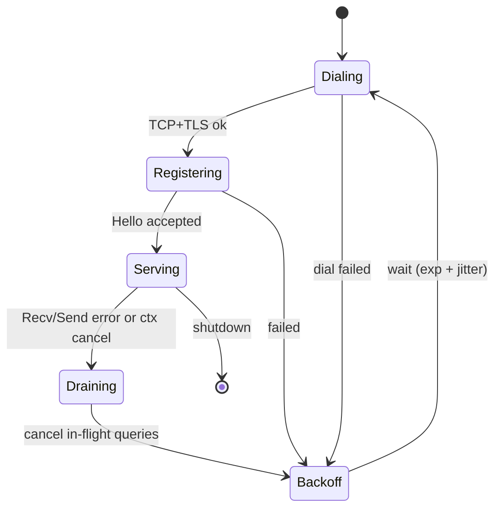
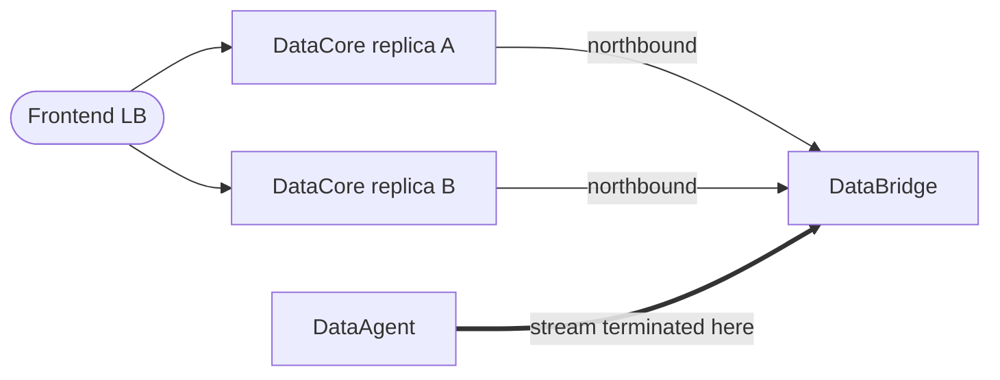

<div align="center">

# Hybrid Data Residency — DataCore, DataBridge & DataAgent

**`DataCore (SaaS control plane)` · `DataBridge (SaaS broker)` · `DataAgent (customer cloud)`**

</div>

| | |
|---|---|
| **Document type** | Architecture proposal / design analysis |
| **Audience** | Engineering, Platform / SRE, Security |
| **Status** | Proposal — nothing implemented yet. Three new Go services (**DataCore**, **DataBridge**, **DataAgent**); the legacy `data-plane-api` (Python) is being **deprecated** in favour of DataCore. |
| **Last updated** | 2026-07-02 |
| **Scope** | How the SaaS control plane reads **sensitive data that must stay in the customer cloud** (a customer-owned Postgres) to serve the frontend, via a customer-side **DataAgent** that opens an outbound gRPC connection to a SaaS-side **DataBridge** and executes queries on the control plane's behalf. Complements — and reuses the transport principle of — the config-sync refactor **[ENG-959](https://linear.app/neuraltrust/issue/ENG-959)** (DP-initiated gRPC bidi). This is the **inverse data path**: ENG-959 pushes *config* CP→DP; this serves *reads* customer→CP→frontend. |

> [!NOTE]
> **At a glance.**
> - The customer cloud holds a **Postgres with sensitive data** (data residency). The SaaS **cannot** open inbound connections into the customer cloud (NAT/firewall).
> - So the **DataAgent runs in the customer cloud** and opens a single **outbound gRPC stream** to the **DataBridge** in the SaaS control plane. Direction of the *connection* is customer → SaaS; direction of the *work* is SaaS → DataAgent.
> - The frontend keeps a **plain REST API** against **DataCore** (the control plane). DataCore calls **DataBridge**, which bridges each call to the open stream using a **request-id correlation** layer (async stream ⇄ sync REST).
> - Sensitive rows travel to the SaaS **only in-flight to answer a request** and are **never persisted** there.

### Components & repos

| Name | Repo | Language | Location | Role |
|---|---|---|---|---|
| **DataCore** | `NeuralTrust/DataCore` (new control plane) | Go, hexagonal | SaaS | Frontend REST API + admin/config + orchestration. **Replaces the legacy `data-plane-api`** (Python/FastAPI), which is being **deprecated**. Runs in **two modes** (SaaS → ClickHouse directly; Hybrid → DataBridge) via an env-var adapter swap (see [§4.4](#44-datacore-deployment-modes--the-saashybrid-adapter-swap)). |
| **DataBridge** | `NeuralTrust/DataBridge` | Go | SaaS | Internal gRPC **broker**: **northbound** unary `Execute` (called by DataCore / other backends) + **southbound** bidi `Connect` stream (DataAgents dial in). Owns the stream registry + request correlation. Not exposed to the browser. |
| **DataAgent** | `NeuralTrust/DataAgent` | Go | Customer cloud | gRPC **client**. Dials out to DataBridge, executes typed read-only queries against the customer Postgres, streams results back. |
| **event-schemas** | `NeuralTrust/event-schemas` | proto → multi-lang | shared | Home of the `residency.v1` proto. Already produces `gen/go` + `gen/python`, so DataCore/DataBridge/DataAgent (and any other consumer) share one versioned contract. |

> The `Data*` names are pure infra plumbing, deliberately disambiguated from AI "agents" (product domain: `AgentGateway`, multi-agent, …). "DataAgent" = a data-access agent (Datadog/Teleport-style), not an LLM agent. **DataCore** is an internal-piece name (not a product brand like `Trust*`), chosen to avoid colliding with the legacy `control-plane` repo.

> [!NOTE]
> Earlier drafts of this doc drew "the control plane" as a single box. The final architecture splits it in two SaaS services: **DataCore** (the frontend-facing API / control plane, Go, replacing `data-plane-api`) and **DataBridge** (the internal query broker). The frontend talks **only** to DataCore; DataBridge is internal infra reachable by backends, and publicly only on its mTLS southbound port for DataAgents.

## Table of contents

1. [The problem](#1-the-problem)
2. [Why the connection must be DataAgent-initiated](#2-why-the-connection-must-be-dataagent-initiated)
3. [Relationship to config-sync (ENG-959)](#3-relationship-to-config-sync-eng-959)
4. [Proposed architecture](#4-proposed-architecture)
5. [The end-to-end flow](#5-the-end-to-end-flow)
6. [Connection management & supervision](#6-connection-management--supervision)
7. [The multi-replica routing problem](#7-the-multi-replica-routing-problem)
8. [The query contract: typed operations, not raw SQL](#8-the-query-contract-typed-operations-not-raw-sql)
9. [Security & data residency](#9-security--data-residency)
10. [Reliability & failure modes](#10-reliability--failure-modes)
11. [Hexagonal placement across the repos](#11-hexagonal-placement-across-the-repos)
12. [The gRPC contract (proto sketch)](#12-the-grpc-contract-proto-sketch)
13. [Alternatives considered](#13-alternatives-considered)
14. [Open decisions](#14-open-decisions)
15. [Phased rollout](#15-phased-rollout)

---

## 1. The problem

We are moving to a **hybrid deployment**:

- **Control plane (CP)** — lives in the **NeuralTrust SaaS**. It is both the admin/config surface *and* the **REST API the frontend talks to**.
- **Data plane (DP)** and its stateful stores (Redis, and a **Postgres holding sensitive data**) — live in the **customer cloud**.

Some data is legally/contractually **not allowed to leave the customer cloud** (PII, request bodies, audit trails, detection payloads, …). It is written by the customer-side workloads into the **customer's Postgres**. But the **frontend is served from the SaaS**, and users expect to browse/search that data.

So the SaaS control plane needs to **read data that physically lives in the customer cloud**, on demand, without that data being copied into or persisted in the SaaS.



The dotted arrow (`bridge -.-> agent`) is the crux: the SaaS needs to *send work into the customer cloud*, but it **has no route to open a connection there**.

---

## 2. Why the connection must be DataAgent-initiated

Customer clouds sit behind NAT / firewalls / private VPCs. The SaaS has **no inbound route** to anything in the customer cloud — not the Postgres, not the data plane, not the DataAgent. This is exactly the constraint that drove **ENG-959** to make the data plane *dial out* to the control plane.

We apply the same principle here:

> **The DataAgent is the gRPC client. The DataBridge is the gRPC server. The DataAgent dials out.**

Once the DataAgent has established the outbound stream, the transport is **bidirectional**: the DataBridge can push `QueryRequest` messages *down* the already-open stream, and the DataAgent pushes `QueryResult` messages *up* the same stream. No inbound connection to the customer cloud is ever required.

This inverts the usual intuition ("the side that needs data is the client"). Here the side that *needs* the data (CP) is the **server**, and the side that *has* the data (DataAgent) is the **client** — because connection direction is dictated by the network, not by the data flow.

---

## 3. Relationship to config-sync (ENG-959)

The DataAgent is the **sibling** of the config-sync channel, not a competitor. Same transport shape, opposite payload direction.

| Aspect | Config-sync (ENG-959) | DataAgent / DataBridge (this doc) |
|---|---|---|
| Who dials | Data plane → CP | DataAgent → DataBridge |
| Transport | DP-initiated gRPC bidi stream (TLS) | DataAgent-initiated gRPC bidi stream (TLS) |
| Payload direction | CP **pushes config** down; DP acks version | CP **pushes queries** down; DataAgent returns rows |
| Trigger | Admin write → transactional outbox → dispatch | Frontend REST call → correlation → dispatch |
| Data at rest in SaaS | Compiled snapshot (config, not customer PII) | **Nothing** — results are in-flight only |
| Delivery guarantee | At-least-once convergence (outbox + ack + backstop) | Exactly-one response per request (req-id correlation + timeout) |
| State-of-the-world | Yes (snapshot) | No — point-in-time query/response |

> [!IMPORTANT]
> **Decision to make early:** do config-sync and the DataAgent share **one** gRPC connection (multiplexed) or run as **two** independent channels/binaries? See [§14](#14-open-decisions). Default: two logical services that may share one physical connection later, because their lifecycles, scaling, and security scopes differ (config = broadcast/cacheable; queries = per-request, carry PII).

Reused building blocks from ENG-959 (do **not** reinvent):

- The **outbound-stream / reconnect / backoff** client machinery.
- **mTLS + shared-token** auth on the channel.
- The **encrypted LKG** is *not* reused for queries (queries are live, not cached), but the **instance-id / identity** conventions are.

---

## 4. Proposed architecture

Four components: **DataCore** (new SaaS control plane / frontend API), **DataBridge** (new SaaS broker), **DataAgent** (new, customer cloud), and the customer Postgres (existing).



### 4.0 DataCore (SaaS, control plane / frontend API)

- The **new control plane**, Go + hexagonal (like TrustGate/TrustGuard), **replacing the legacy `data-plane-api`** (Python).
- Owns everything user-facing: **user auth (JWT), RBAC, team→tenant resolution, DTO mapping, cross-source aggregation** (e.g. joining residency reads with ClickHouse analytics/config), CORS, error shape.
- For residency-bound reads it depends on a domain **port** `QueryGateway` whose adapter is a **gRPC client of DataBridge's northbound** — so DataCore never knows a stream exists; it just calls a port, like a repository.
- The **only** service the frontend talks to. DataBridge is never called from the browser.

### 4.1 DataAgent (customer cloud, gRPC **client**)

- A small Go binary (or a **role of the data plane** — see [§14](#14-open-decisions)) deployed in the customer cloud with **least-privilege, read-scoped** credentials to the customer Postgres.
- On boot it **dials the DataBridge**, authenticates (mTLS + token), announces its **tenant/instance identity**, and opens the long-lived stream.
- It **receives `QueryRequest`** messages, maps each to a **typed read operation** against Postgres (never arbitrary SQL from the wire — see [§8](#8-the-query-contract-typed-operations-not-raw-sql)), executes it, and **streams back `QueryResult`** tagged with the same `req_id`.
- It bounds concurrency, applies per-query timeouts, and **reconnects with backoff** on drop (its supervisor — see [§6](#6-connection-management--supervision)).

### 4.2 DataBridge (SaaS, gRPC **server** + correlation)

- A **standalone Go service** (its own repo/deployment) with **two gRPC surfaces**:
  - **Southbound** (`Connect`, bidi stream, public + mTLS): DataAgents dial in from customer clouds.
  - **Northbound** (`Execute`, unary, internal ClusterIP): called by DataCore (or any backend). Cross-language — a Python/other consumer works too.
- It owns the in-memory state:
  - the **connection registry**: `tenant_id → active DataAgent stream(s)`;
  - the **pending-request registry**: `req_id → response channel + deadline`.
- On a northbound `Execute` it allocates a `req_id`, writes the request to the tenant's stream, and blocks on the response channel until the DataAgent replies or the deadline fires.
- **Stateful** (holds live streams), so it's a **dedicated, low-replica deployment** distinct from DataCore's stateless replicas (see [§7](#7-the-multi-replica-routing-problem)).

### 4.3 Customer store (existing)

- The sensitive datastore in the customer cloud (Postgres or ClickHouse — the DataAgent executor abstracts it). The DataAgent is the **only** component with a route to it from the SaaS's perspective, and the SaaS never gets its connection credentials.

### 4.4 DataCore deployment modes — the SaaS/Hybrid adapter swap

The **same DataCore binary** serves two deployment models, chosen by a single env var (e.g. `RESIDENCY_BACKEND=saas|hybrid`). This is textbook hexagonal: **one port, two driven adapters, bound once at the composition root.**



- **Port (domain):** `residency.Repository` with intent-based reads (`FindByX`, `Count`, …) — or a single `Execute(op)` over the typed `QueryOp` set. Handlers and app services depend **only** on this port.
- **SaaS mode:** adapter = **ClickHouse repo**. DataCore queries NeuralTrust's own ClickHouse directly — there is no residency boundary, so no DataBridge/DataAgent in the path.
- **Hybrid mode:** adapter = **DataBridge gRPC client**. DataCore → DataBridge → DataAgent → customer store.

The endpoint always calls the same `FindBy...`; only the bound adapter differs:

```go
// Composition root — bind the port to an adapter by deployment mode.
func provideResidencyRepo(cfg Config, ch *clickhouse.Conn, bridge *databridge.Client) residency.Repository {
    switch cfg.ResidencyBackend {
    case "hybrid":
        return databridge.NewRepository(bridge) // gRPC client of DataBridge northbound
    default: // "saas"
        return clickhouse.NewRepository(ch)     // direct ClickHouse
    }
}
```

Why this is the right seam:

- **Handlers / app services / DTOs are identical in both modes** — they never branch on `saas` vs `hybrid`. Only the composition root knows.
- **The `QueryOp`/port contract is the contract that makes the two interchangeable.** It must be expressible on **both** ClickHouse (SaaS adapter) *and* the customer store (via the DataAgent executor). Keep ops at **domain granularity**, never raw SQL — otherwise the two backends drift.
- **Behavioural parity + contract tests.** Both adapters must return the same domain shapes and normalise failures to the same **domain errors** (SaaS: ClickHouse errors; Hybrid: `agent_unavailable`/`timeout` → mapped). Add one contract test both adapters pass, plus a fake adapter for unit tests.
- **Scope note.** Mode is **per-deployment** (env var at boot), exactly as asked. If per-tenant modes are ever needed, replace the bind-time `switch` with a runtime strategy resolver keyed by tenant — out of scope now.

> [!NOTE]
> This is the same "swap the driven adapter" idea TrustGuard already uses for its DB-less vs Postgres-backed data plane (different DI module set per mode). Here it's per-adapter instead of per-module, but the principle — the app core is oblivious to the backend — is identical.

---

## 5. The end-to-end flow

> This section describes the **hybrid** path (via DataBridge/DataAgent). In **SaaS** mode the flow short-circuits: DataCore's ClickHouse adapter runs the query locally and returns — no DataBridge, no DataAgent, no stream. Everything below applies only when `RESIDENCY_BACKEND=hybrid`.

The frontend stays **100% synchronous REST**. The async stream is hidden behind a **request/response correlation** layer inside the DataBridge, which turns "fire a message down a stream and wait for a matching message to come back up" into a normal blocking function call.

### Phase 0 — The DataAgent opens the channel (boot, no user yet)

Happens once at DataAgent startup and stays alive:

1. The **DataAgent** dials **outbound** to the **DataBridge** gRPC server (mTLS + enrolment token).
2. It opens the bidi `Connect` stream and sends `Hello{tenant_id, agent_version, supported_ops}`.
3. The **DataBridge** registers it: `registry[tenant_id] = stream`. It now holds an open cable into that customer cloud.
4. The stream sits **idle but open**, with keepalive pings. Nobody has requested anything yet.

The key property: by the time a frontend request arrives, the channel **already exists**. The CP never initiates a connection toward the customer.

### Phase 1 — A user request

```mermaid
sequenceDiagram
    autonumber
    participant FE as Frontend
    participant API as DataCore (replica X)
    participant GW as QueryGateway adapter (in DataCore)
    participant BR as DataBridge (owns the stream)
    participant AG as DataAgent (customer cloud)
    participant PG as Customer Postgres

    Note over BR,AG: Stream already open from Phase 0
    FE->>API: GET /v1/tenants/t/records?filter=... (user JWT)
    API->>API: authN/authZ, validate DTO, resolve tenant=t
    API->>GW: Execute(ctx, tenant=t, op=ListRecords, args)
    GW->>BR: forward Execute (internal gRPC)
    BR->>BR: req_id=new(); pending[req_id]=chan; deadline=ctx
    BR-)AG: QueryRequest{req_id, op, args}  (down the stream)
    AG->>AG: validate op supported + force tenant=t
    AG->>PG: parametrised, read-only SQL
    PG-->>AG: rows
    AG-)BR: QueryResult{req_id, rows, done}  (up the stream)
    BR->>BR: pending[req_id] <- rows; delete(pending,req_id)
    BR-->>GW: rows
    GW-->>API: residency.Result
    API-->>FE: 200 JSON (mapped DTO)
```

Per hop:

- **Frontend → DataCore (REST)**: normal synchronous HTTPS with the user JWT. The frontend has no idea a stream or DataAgent exists, and never talks to DataBridge.
- **DataCore handler**: authenticates the user, validates the DTO, resolves `tenant`, and calls the **port** `QueryGateway.Execute(...)`. The handler thinks it's calling a normal repository (hexagonal: it doesn't know the "adapter" is a gRPC client of DataBridge).
- **QueryGateway adapter (in DataCore)**: forwards to the **DataBridge** northbound over internal gRPC. This is what makes multiple DataCore replicas work: any replica can serve the request because it doesn't need to *hold* the stream — it asks the DataBridge, the single owner of streams (see [§7](#7-the-multi-replica-routing-problem)).
- **DataBridge (correlation)**: allocates `req_id`, stores `pending[req_id]=chan` with the deadline inherited from `ctx`, pushes `QueryRequest` down the idle stream, and **blocks** on that channel.
- **DataAgent**: checks the op is allow-listed, **forces `tenant_id`** (defence in depth — never trusts the wire), runs **parametrised, read-only** SQL, returns `QueryResult{req_id, rows}` up the same stream.
- **Return path**: the DataBridge matches by `req_id`, delivers into the waiting channel, unblocks, and the result flows back up the call stack to the handler, which maps it to a DTO and returns JSON.

### The core trick: async → sync via `req_id`

One stream multiplexes many concurrent REST calls. A `map[req_id]chan Result` turns it into a blocking call:

```go
func (b *DataBridge) Execute(ctx context.Context, tenant string, q Query) (Result, error) {
    stream, ok := b.registry.Stream(tenant)
    if !ok {
        return Result{}, ErrAgentUnavailable // 503: DataAgent not connected
    }
    reqID := newID()
    ch := make(chan Result, 1)
    b.pending.Put(reqID, ch)
    defer b.pending.Delete(reqID)

    if err := stream.Send(&QueryRequest{ReqId: reqID, Op: q.Op, Args: q.Args}); err != nil {
        return Result{}, err // stale stream -> treat as unavailable
    }

    select {
    case res := <-ch:   // the stream receiver did pending[reqID] <- res
        return res, nil
    case <-ctx.Done():  // 504: DataAgent didn't answer in time
        return Result{}, ctx.Err()
    }
}
```

A single receiver goroutine per stream dispatches responses:

```go
for {
    msg, err := stream.Recv()
    if err != nil { b.failAllPending(tenant, err); return } // DataAgent down: 503 waiters
    if r := msg.GetResult(); r != nil {
        if ch, ok := b.pending.Get(r.ReqId); ok {
            ch <- toResult(r)   // unblocks the waiting Execute
        } // unknown req_id: a late reply to an expired request -> discard
    }
}
```

> [!NOTE]
> For **large result sets** the `QueryResult` is streamed in **chunks** (same `req_id`, ordered frames, final `done=true`). The REST layer can stream/paginate to the frontend. Prefer **keyset pagination** in the op contract over huge payloads.

---

## 6. Connection management & supervision

There is **no external supervisor process** — supervision is **plain Go** (goroutines with a loop) inside each binary. Three layers of supervision stack, each covering a different failure:

| Layer | Who | Restarts | Lives in |
|---|---|---|---|
| **Transport** | `google.golang.org/grpc` | HTTP/2 transport, keepalive, `Dial` backoff | the library (not your code) |
| **Application (the supervisor)** | your Go code | the **logical stream**: re-dial, re-`Hello`, re-register, fail in-flight | this project |
| **Process / infra** | Kubernetes (liveness + restartPolicy) | the **whole pod** if the binary dies/hangs | k8s manifests |

The rule of thumb: **only the DataAgent reconnects** (it's the client that dials out). The DataBridge never tries to revive anything — it cleans up and waits for the DataAgent to come back.

### 6.1 Detecting a dead connection

From fastest to slowest:

1. **gRPC keepalive (HTTP/2 PING)** — primary mechanism. The DataAgent pings periodically; no ACK within `keepalive_timeout` ⇒ gRPC kills the transport and `Recv`/`Send` error on **both** sides. Catches "dirty" drops (NAT idle-timeout, yanked network) where no FIN arrives.
2. **Stream error** — clean close (pod restart → GOAWAY, or cancel) ⇒ `Recv` returns error/`io.EOF` immediately.
3. **Per-request deadline** — even on a seemingly-alive cable, each `QueryRequest` has a timeout; a single slow request fails `504` without tearing down the whole stream.

```go
// DataAgent (client)
keepalive.ClientParameters{ Time: 10*time.Second, Timeout: 3*time.Second, PermitWithoutStream: true }
// DataBridge (server) — must permit that cadence or it evicts the client
keepalive.EnforcementPolicy{ MinTime: 5*time.Second, PermitWithoutStream: true }
```

### 6.2 DataAgent supervisor (the reconnect loop)



```go
func (a *DataAgent) Supervise(ctx context.Context) {
    bo := backoff{min: 1*time.Second, max: 30*time.Second}
    for ctx.Err() == nil {
        err := a.runOnce(ctx) // dial -> Hello -> Recv loop until it dies
        if ctx.Err() != nil { return } // clean shutdown
        a.log.Warn("stream down, reconnecting", "err", err, "wait", bo.next())
        select {
        case <-time.After(bo.next()): // backoff + jitter
        case <-ctx.Done(): return
        }
    }
}
```

Key points:

- **Backoff + jitter** avoids reconnection storms (DataBridge restart shouldn't make N DataAgents reconnect in lockstep). Same jitter rationale as ENG-959's backstop.
- **Reset backoff** once a connection stays healthy for a while, or flapping leaves you stuck at max backoff.
- **In-flight queries when the cable dies**: the connection `ctx` is cancelled ⇒ Postgres queries cancel ⇒ don't try to answer over a dead stream (the DataBridge already gave them up).
- **One connection** per DataAgent (not a pool): it's a control channel and HTTP/2 already multiplexes all requests over it.

This mirrors the existing `configsync.Worker.Run(ctx)` in ENG-959 — a long-lived `Run`/`Supervise` loop that keeps the channel alive.

### 6.3 DataBridge lifecycle management (no reconnect, aggressive cleanup)

The DataBridge can't reconnect (no route to the client). Its job: register while alive, and **clean up hard** the instant it dies.

```go
func (b *DataBridge) Connect(stream pb.DataBridge_ConnectServer) error {
    hello, err := stream.Recv()
    if err != nil { return err }
    tenant := hello.GetHello().TenantId

    conn := b.registry.Register(tenant, stream) // replaces any prior stream (epoch)
    defer func() {
        b.registry.Deregister(tenant, conn)
        b.failAllPending(conn, ErrAgentDisconnected) // 503 everything that was waiting
    }()

    for {
        msg, err := stream.Recv()
        if err != nil { return err } // defer cleans up
        b.dispatchResult(msg)
    }
}
```

What it solves:

- **`failAllPending`**: on stream death, every blocked request gets `503 agent_disconnected` immediately instead of hanging to its deadline. No goroutine/channel leaks.
- **Duplicate connection replacement (epoch/generation)**: if a DataAgent reconnects before the DataBridge noticed the old cable died, you briefly have **two** streams for one tenant. A **generation id** marks the old one stale and closes it; `Send` on the stale stream errors and is ignored. The registry always points at the newest.
- **`Send` to a stale stream**: if a request tries to go down a just-died cable before deregistration, `Send` errors ⇒ that request becomes `503`, never hangs.

### 6.4 Surfacing health to the frontend

- `GET /v1/tenants/{t}/agent-health` → `registry.IsConnected(tenant)` so the UI shows "data plane unreachable" instead of an infinite spinner.
- Metrics: `dataagent_connected{tenant}` (0/1), `dataagent_reconnects_total`, `pending_requests{tenant}`, per-op p99 latency, `dataagent_disconnect_total{reason}`.

Unlike config-sync there is **no LKG / stale-serving**: a read reaches the live customer DB or it fails. That's the correct semantics for residency-bound data — never serve stale or SaaS-cached copies. Losing a request during a drop just means a `503/504` the client retries — never lost data (reads are on-demand, nothing is queued SaaS-side).

---

## 7. The multi-replica routing problem

This is the hardest part, and it's exactly why DataBridge is a **separate service** from DataCore. DataCore runs **multiple stateless replicas** (like every frontend API). A DataAgent's stream is a **TCP connection terminated on exactly one process**. If it were held inside a DataCore replica, a request landing on replica **B** couldn't see a stream held by replica **A**.



Options, worst to best:

| Option | How | Verdict |
|---|---|---|
| **A. Any-replica REST + no routing** | Hope the request hits the replica holding the stream | ❌ Broken with >1 replica |
| **B. Shared pending-registry via Redis/DB** | Replica holding the stream writes the result to a shared store; requesting replica subscribes | ⚠️ Works but adds a shared store on the SaaS hot path + latency |
| **C. Sticky routing by tenant** | Registry maps `tenant → replica holding the stream`; DataCore replicas forward (internal gRPC) | ⚠️ Works; needs discovery/forwarding + rebalancing on churn |
| **D. Dedicated DataBridge service (recommended)** | DataAgents connect only to the **separate DataBridge deployment**; DataCore replicas are **clients** over internal gRPC. DataBridge owns *all* streams and *all* correlation | ✅ Cleanest: decouples DataCore scaling from stream affinity; single owner of streams; mirrors config-sync's separation |

**Recommendation: Option D** (this is why DataBridge exists as its own repo/deployment). Run **DataBridge** as its own deployment (1–few replicas). DataCore replicas call it via the internal `QueryGateway` gRPC client. If DataBridge itself needs >1 replica, DataAgents are pinned by the LB and the DataBridge replicas share a small **tenant→replica** lookup (Option C *inside* the DataBridge tier only), keeping DataCore oblivious.

> [!TIP]
> Start with **one DataBridge replica** — it removes the routing problem entirely and is likely enough for early customers (it's I/O-bound and cheap). Design the port so scaling to N replicas later is a DataBridge-internal concern, invisible to DataCore.

---

## 8. The query contract: typed operations, not raw SQL

**Do not send raw SQL over the wire from the SaaS to the DataAgent.** It looks flexible but it's a security and coupling disaster: injection surface, no least-privilege, schema coupling across the boundary, impossible to audit/version safely.

Instead, define a **closed set of typed read operations** — a **repository interface serialized over gRPC**:

```proto
enum QueryOp {
  QUERY_OP_UNSPECIFIED   = 0;
  QUERY_OP_LIST_RECORDS  = 1;
  QUERY_OP_GET_RECORD    = 2;
  QUERY_OP_COUNT_RECORDS = 3;
}
```

Properties this buys:

- **Allow-list by construction.** The DataAgent only runs ops it implements; anything else is `UNIMPLEMENTED`. The SaaS can't ask for arbitrary data.
- **Parametrised queries only.** Typed args bound as query params — no interpolation, no injection.
- **Tenant scoping enforced at the DataAgent.** Every op runs with a mandatory `tenant_id` predicate the SaaS can't override.
- **Versionable.** Adding a field/op is additive; the DataAgent advertises capabilities on connect (`Hello.supported_ops`).
- **Auditable.** Each op maps to a known access pattern; log op + tenant + row count, never row contents.

This mirrors TrustGate's **hexagonal repository ports**: the SaaS defines a `Repository`-style **port**; the "adapter" just happens to live across a gRPC stream in the customer cloud.

---

## 9. Security & data residency

| Concern | Control |
|---|---|
| **Transport** | mTLS on the DataAgent↔DataBridge stream; pin the SaaS CA in the DataAgent, authorise DataAgent client certs in the DataBridge |
| **AuthN of DataAgent** | Client cert **plus** a per-tenant enrolment token (same shared-token pattern as config-sync). Bind cert ↔ tenant |
| **AuthZ of queries** | DataBridge attaches the authenticated `tenant_id`; DataAgent **re-enforces** tenant scoping in every query (defence in depth) |
| **Data residency** | Result rows are **in-flight only**: streamed to answer one request, mapped to a DTO, returned. **Never written to SaaS Postgres, cache, disk, or logs** |
| **DB least privilege** | DataAgent's Postgres role is **read-only**, scoped to the residency tables; no DDL, no writes, no unrelated schemas |
| **Logging/PII** | Log `req_id`, `tenant_id`, `op`, `row_count`, latency — **never** field values |
| **Blast radius** | A DataAgent compromise exposes at most that one customer's own data (already in their cloud). A DataBridge compromise exposes no data at rest (there is none) — only the live request stream |
| **Rate & size limits** | Per-tenant QPS + max rows/bytes per response, enforced at the DataBridge and re-checked at the DataAgent |

> [!WARNING]
> The single most important invariant: **sensitive rows are never durably stored in the SaaS.** Any SaaS-side caching of results defeats the entire data-residency purpose. If read latency hurts, cache **in the customer cloud** (DataAgent-side), never SaaS-side.

---

## 10. Reliability & failure modes

| Failure | Behaviour |
|---|---|
| **DataAgent not connected** | DataBridge has no stream for the tenant → REST `503 agent_unavailable` fast |
| **DataAgent disconnects mid-request** | `failAllPending` → `503 agent_disconnected`; DataAgent reconnects with backoff (§6) |
| **Request timeout** | Deadline from REST `ctx`; on expiry drop the pending entry, return `504`. Late replies for unknown `req_id` discarded |
| **Slow / huge query** | Per-op statement timeout at the DataAgent; chunked streaming + max-bytes cap; keyset pagination |
| **Backpressure** | Bounded in-flight per tenant at the DataBridge; bounded DB concurrency at the DataAgent; overflow → `429`/`503` |
| **DataBridge restart** | Streams drop; DataAgents reconnect within backoff. In-flight REST calls fail fast, client retries |
| **CP unreachable from DataAgent** | DataAgent keeps retrying the dial; no data lost because nothing is queued SaaS-side |
| **Readiness** | DataBridge `/readyz` green once it can accept streams; per-tenant "agent connected" health exposed to the frontend |

---

## 11. Hexagonal placement across the repos

All three Go services follow the same layering as TrustGate/TrustGuard (`handlers → app → domain ← infra`). The gRPC-over-stream execution is just a **driven adapter** behind a domain **port**.

**DataCore repo (control plane, new — replaces `data-plane-api`):**

```
pkg/
├── domain/residency/            # entities + port
│   ├── record.go                # domain entity (residency-bound data shape)
│   ├── query.go                 # QueryOp value objects, typed args
│   └── gateway.go               # QueryGateway PORT (interface, //go:generate mockery)
├── app/residency/               # use cases (Finder, ...) depend only on the port
├── api/handler/http/residency/  # thin REST handlers -> app service (frontend-facing)
├── infra/databridge/            # QueryGateway ADAPTER = gRPC CLIENT of DataBridge northbound
└── container/modules/           # wire it
```

```go
// QueryGateway executes a typed, tenant-scoped read against the customer-side
// store via DataBridge. It blocks until the result returns or ctx is cancelled.
type QueryGateway interface {
    Execute(ctx context.Context, tenantID string, q residency.Query) (residency.Result, error)
}
```

DataCore's `infra/databridge` adapter is a **thin gRPC client** of DataBridge's northbound `Execute`. The app/handlers never know a stream exists — they see a normal port, like a repository.

**DataBridge repo (`NeuralTrust/DataBridge`, new — the broker):**

```
cmd/databridge/main.go        # starts both gRPC servers + graceful shutdown
internal/northbound/          # unary Execute service (called by DataCore) -> correlation
internal/southbound/          # Connect bidi stream service (DataAgents dial in) + mTLS
internal/registry/            # tenant -> stream (epoch), req_id -> chan  (in-memory state)
```

**DataAgent repo (`NeuralTrust/DataAgent`, new — customer-side executor):**

```
cmd/dataagent/main.go               # dials DataBridge, starts Supervise(ctx)
internal/supervisor/                # the for{ runOnce; backoff } loop (§6.2)
internal/executor/                  # QueryOp -> parametrised, read-only SQL (the real "repository")
```

**Shared contract (`NeuralTrust/event-schemas`):** the `residency.v1` proto lives here; `gen/go` feeds DataCore/DataBridge/DataAgent, `gen/python` (and others) feed any non-Go consumer. One versioned source of truth (pinned by tag, as `data-plane-api` already does with `events.v1`).

Startup in each service follows TrustGate's existing pattern (`startConfigSyncWorker` / `startRecompiler` in `cmd/trustgate/main.go`): launch the goroutine, keep a `cancel`, and on shutdown `cancel()` + `wg.Wait()`.

---

## 12. The gRPC contract (proto sketch)

A single bidirectional stream carries a small envelope. The DataAgent sends `Hello` first to register; thereafter the DataBridge sends `QueryRequest` and the DataAgent sends `QueryResult`, multiplexed by `req_id`.

```proto
syntax = "proto3";
package residency.v1;

service DataBridge {
  // DataAgent dials out and holds this stream open. Server pushes QueryRequests,
  // DataAgent pushes Hello (once) + QueryResults.
  rpc Connect(stream AgentToServer) returns (stream ServerToAgent);
}

message AgentToServer {
  oneof msg {
    Hello        hello  = 1;   // sent once on connect
    QueryResult  result = 2;   // one or more per req_id (chunked)
  }
}

message ServerToAgent {
  oneof msg {
    QueryRequest request = 1;
    Ping         ping    = 2;  // liveness keepalive
  }
}

message Hello {
  string tenant_id     = 1;
  string agent_version = 2;
  repeated QueryOp supported_ops = 3; // capability advertisement
}

message QueryRequest {
  string  req_id           = 1;
  QueryOp op               = 2;
  bytes   args             = 3;   // typed args (op-specific message)
  int64   deadline_unix_ms = 4;
}

message QueryResult {
  string req_id     = 1;
  bool   done       = 2;   // last chunk marker
  repeated Row rows = 3;   // one chunk of rows
  Error  error      = 4;   // set instead of rows on failure
}
```

Notes:
- `Connect` is a **single** long-lived bidi RPC; all requests/responses ride it (matches ENG-959's one-outbound-stream model).
- `Hello.supported_ops` lets the DataBridge reject calls the DataAgent can't serve (rolling upgrades).
- `QueryResult` is **chunked** (`done=false` until the final frame) for large reads.
- Keepalive via `Ping` + gRPC keepalive params so dead streams are detected promptly (§6.1).

---

## 13. Alternatives considered

| Alternative | Why not |
|---|---|
| **Site-to-site VPN / VPC peering, SaaS connects straight to customer Postgres** | Heavy per-customer network engineering; exposes the DB to the SaaS network; gives SaaS direct DB creds (breaks least-privilege & residency); brittle at scale |
| **DataAgent exposes an inbound API the SaaS calls** | Requires inbound access into the customer cloud — the exact thing NAT/firewalls forbid |
| **DataAgent dials out but SaaS opens a fresh connection per request** | Can't — the SaaS still can't initiate into the customer cloud. The stream must be persistent and DataAgent-initiated |
| **Replicate sensitive data to SaaS Postgres and query locally** | Violates data residency — the whole reason these pieces exist |
| **Reuse config-sync's HTTP+ETag pull for reads** | That's a pull of a cacheable snapshot; live per-request PII reads aren't cacheable and must not be stored SaaS-side |
| **Message queue (customer Redis/Kafka) between CP and DataAgent** | The SaaS has **no access to the customer's Redis/Kafka** (exactly why ENG-959 dropped Redis from the CP↔DP path) |

---

## 14. Open decisions

1. **One channel or two?** Multiplex config-sync (ENG-959) and queries over a **single** DataAgent↔CP stream, or keep **two** independent services? Default: two logical services; revisit multiplexing once both exist.
2. **DataAgent = new binary or a role of the data plane?** The DB-less DP intentionally avoids Postgres; the DataAgent intentionally *needs* it. Cleanest is a **separate `dataagent` binary/deployment** with its own read-only DB creds. Decide whether it shares the DP image (`argv[1]` selector, like `control`/`data`) or is standalone.
3. **DataBridge replica count.** Start with **1** (no routing problem). Keep the `QueryGateway` port so N-replica routing is a later, DataBridge-internal change.
4. **Result size strategy.** Confirm keyset pagination in every list op + a hard max-bytes per response.
5. **Which datasets are residency-bound?** Enumerate the exact tables/read patterns the frontend needs (audit logs? request traces? detections?) to fix the initial `QueryOp` set.
6. **Repo/module home.** Does the DataAgent live in this repo (`cmd/dataagent`), in TrustGuard, or a shared module extracted alongside `runtimeconfig`?

---

## 15. Phased rollout

1. **Contract first.** Define the `residency.v1` proto + initial `QueryOp` set from the frontend's real read needs.
2. **Port + adapter in the CP.** `domain/residency` port, `infra/databridge` server + correlation, REST handlers. Behind a feature flag; single DataBridge replica.
3. **DataAgent MVP.** Dial-out stream client + supervisor + read-only executor for the first ops; mTLS + token enrolment.
4. **End-to-end on one tenant.** Frontend → CP REST → DataBridge → DataAgent → customer Postgres, with timeouts, health, PII-safe logging.
5. **Harden.** Backpressure, chunked large reads, per-tenant limits, reconnection storms, observability.
6. **Scale the DataBridge** only if needed (tenant→replica affinity inside the DataBridge tier).

---

### Appendix — one-line mental model

> **ENG-959** taught the data plane to *dial out and receive config*. The **DataAgent** dials out and *answers questions* through the **DataBridge** — so the SaaS frontend can read data that is never allowed to leave the customer's cloud.
