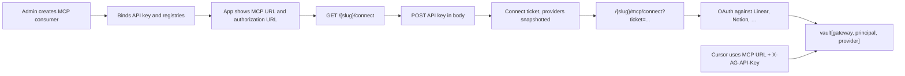

# MCP API key auth and external credential ownership

How inbound authentication to the MCP gateway relates to the credentials
TrustGate uses against external MCP servers, and how an API-key consumer
connects its `forwarded` registries through a self-service page.

## 1. Mental model

The identity that calls the gateway and the credential used against an external
MCP server are independent concepts:

1. **Inbound authentication** identifies who calls TrustGate.
2. **External credential ownership** decides whether a registry uses a personal
   or a shared upstream account.
3. **Authorization** limits which registries and tools a principal may use,
   regardless of which upstream account is selected.

The same MCP URL can be distributed manually or through MDM to every user of a
consumer. Isolation depends entirely on the inbound credential:

- One API key is one service principal. Everyone holding that key shares the
  external credentials linked to it.
- OAuth2 creates one principal per user through the IdP's stable subject.
  Personal registries then keep one credential per principal.
- A global registry uses a managed, shared credential even when inbound
  authentication is OAuth2.

## 2. How the principal is derived

```text
OAuth2:
  principal = stable subject returned by the IdP

API key:
  principal = name of the auth record bound to the key
```

The OAuth2 access token is not the identity — it expires and rotates. The
binding must use the subject obtained after validating it.

For API keys the long-term identifier should be immutable
(`"api_key:" + auth_id`), but the current implementation deliberately keeps the
auth record name so that credentials already stored in the vault keep resolving.
Changing it requires a vault migration and is out of scope.

## 3. External credential selection

`mcp_target.auth.mode` decides the behavior:

| Mode | Credential used |
|---|---|
| `forwarded` | Looked up in the vault by `(gateway_id, principal_sub, provider)` |
| `static` | Fixed header and value stored on the registry, for every call |
| `passthrough` | The principal's own inbound credential |
| `exchange` | The principal's identity exchanged for an upstream token |
| `none` | No credential injected |

So `forwarded` means "per principal", which yields:

```text
Same MCP gateway API key
  -> same principal
  -> same forwarded grant for every provider
  -> one shared upstream account for all holders of the key

OAuth2 IdP
  -> one principal per subject
  -> personal registry: one upstream grant per principal
  -> global registry: shared credential
```

## 4. Personal versus global registries

### Personal

Each principal authorizes its own upstream account. This is the natural case for
mail, calendars, Linear or Notion, where per-user permissions and audit matter.

```text
OAuth2 inbound:   user -> IdP -> subject -> connect -> vault[subject, provider]
API key inbound:  key  -> service principal -> connect -> vault[principal, provider]
```

The second variant does not represent individual people. If several people share
the key, they all use whichever upstream account was connected for that
principal.

### Global

Every principal uses one managed upstream account. `static` mode already covers
shared API keys and bearer tokens. TrustGate has no managed global OAuth flow
with refresh and revocation as a first-class domain concept yet; that flow would
also need to block personal connects for the affected registry.

### Scopes

A shared upstream account does not imply unlimited access. Upstream OAuth scopes
bound what the provider allows; TrustGate policies, roles and toolkits bound what
each caller can execute. TrustGate can attribute activity to a person only when
inbound authentication is per-user OAuth2 — with a shared API key it can only
attribute activity to the key. The upstream provider always sees the shared
account.

## 5. The API-key self-service connect flow

The flow preserves `one API key = one identity` and lets that identity connect
its `forwarded` providers without adding OAuth2 to the consumer's inbound
authentication.



### Routes

Specific self-service routes are registered **before** `/+/connect`, because that
Fiber pattern would otherwise capture any path ending in `/connect`:

```text
GET  /:slug/connect       -> API key form
POST /:slug/connect       -> validation, ticket, redirect
GET  /+/connect           -> existing ticket page
GET  /*                   -> method not allowed
```

`/+/connect` is an internal Fiber pattern, never a URL shown to a user.
`SlugFromMCPPath` is not used for `/:slug/connect`, since it only accepts paths
ending in `/mcp`.

### What POST does

1. Applies the source rate limit before parsing anything.
2. Resolves the gateway from the request host, then reads the slug from
   `c.Params("slug")`.
3. Resolves the consumer by slug and checks it is an active MCP consumer of that
   gateway.
4. Applies the consumer rate limit.
5. Looks up and validates the API key without logging or reflecting it, checking
   that the auth is enabled, of type API key, belongs to the same gateway and is
   bound to that consumer.
6. Derives the principal with the same rule the MCP runtime uses.
7. Calls `ConnectService.CreateAPIKeyTicket`, which stores the consumer ID, the
   auth ID and a snapshot of the forwarded provider IDs authorized at mint time.
8. Redirects to `/{slug}/mcp/connect?ticket=<ticket>`.

Every rejection on POST — unknown key, disabled key, key belonging to another
consumer or gateway, missing consumer, non-MCP consumer — collapses into the same
opaque `401`, so the endpoint cannot be used to probe which keys or consumers
exist.

### Provider snapshot

The ticket carries the set of forwarded providers that were authorized when it
was minted. Page rendering, start, callback and disconnect all operate within
that snapshot, so a provider added or renamed after issuance cannot widen an
outstanding ticket's authorization, and a provider removed from the registry can
still be unlinked. Tickets that carry a partial identity — a consumer ID without
an auth ID, or no snapshot at all — are rejected as not found before any vault
access.

### Rate limiting

A Redis fixed-window limiter guards the endpoint, keyed by HMAC-derived buckets
so raw addresses and consumer IDs never reach Redis:

| Variable | Meaning |
|---|---|
| `MCP_CONNECT_RATE_LIMIT_ENABLED` | Turns the limiter on |
| `MCP_CONNECT_RATE_LIMIT_SOURCE` | Attempts per source per window |
| `MCP_CONNECT_RATE_LIMIT_CONSUMER` | Attempts per consumer per window |
| `MCP_CONNECT_RATE_LIMIT_WINDOW` | Window duration |
| `MCP_CONNECT_TRUSTED_PROXY_CIDRS` | Proxies whose `X-Forwarded-For` is trusted |

`X-Forwarded-For` is only honored when the peer matches a trusted CIDR, and
parsing is bounded to 2048 bytes and 16 hops so a crafted header cannot burn CPU.
Configuration rejects `0.0.0.0/0` and `::/0`, which would trust anyone. Limiter
backend failures surface as an opaque `503`, exceeded limits as `429`.

### Audit

Lifecycle events are emitted with identifiers only, never with the secret:

| Event | Fields |
|---|---|
| `mcp_connect_ticket_created` | `gateway_id`, `consumer_id`, `auth_id` |
| `mcp_provider_linked` | plus `provider_id` |
| `mcp_provider_unlinked` | plus `provider_id` |

Vault deletion is a single atomic Redis compare-and-delete, so concurrent
disconnects emit exactly one unlink event.

### Other guarantees

Responses set `Cache-Control: no-store` and `Referrer-Policy: no-referrer`, and
the ticket never appears in access logs, including the 303 redirect. Connect
routes are classified as MCP OAuth in operation metrics using bounded enums
rather than raw paths. A `401` only advertises OAuth discovery when the path
actually has an enabled OAuth2 auth, so an API-key-only consumer gets a plain
`401`. Existing TTLs are unchanged: 15 minutes for the reusable ticket, 10
minutes for the one-time OAuth state.

### The built-in identity provider never covers an API-key consumer

`MCP_DEFAULT_IDP_ISSUER` lets an MCP consumer that carries **no** credential of
its own fall back to the NeuralTrust platform login, so a PoC does not have to
register an identity provider. That fallback is added to the path's auth scope,
and the platform issues a code to any authenticated user without checking team
membership against the gateway.

It therefore applies only while the path has no enabled credential. As soon as
one is attached — an api key, mTLS, or the consumer's own OAuth2 IdP — the
fallback is withheld and that credential is the only way in. Otherwise any
platform login would reach an API-key consumer without its key, and the key
would stop being an access control.

The rule holds in three places, because a client discovers OAuth through more
than the challenge header:

| Surface | Behaviour for a credential-protected consumer |
|---|---|
| Auth chain scope | The built-in provider is absent, so a brokered session is refused |
| `/.well-known/oauth-protected-resource/{path}` | No `authorization_servers` advertised |
| `/oauth/authorize` | `invalid_target`; no login is brokered |

Fixing only the auth chain leaves a client offering an authorization prompt
that ends in a session the gateway rejects, so all three follow the same
condition.

The `invalid_target` refusal travels back on the client's `redirect_uri` as
RFC 6749 §4.1.2.1 prescribes, carrying `state` and a description that names the
`X-AG-API-Key` header. Rendering it on the gateway instead would strand an MCP
client that is parked on its callback: the access is denied either way, but the
client only learns of it through the redirect. The `redirect_uri` is therefore
validated against the client before the resource is resolved — a request whose
redirect cannot be trusted is still refused on the gateway, since following it
would be an open redirect.

## 6. URLs the App must expose

For an MCP consumer with an `api_key` auth, the consumer detail view should show:

```text
MCP URL:
https://{gateway.hosts.mcp}/{consumer.slug}/mcp

Header:
X-AG-API-Key: <API_KEY>

Authorization URL:
https://{gateway.hosts.mcp}/{consumer.slug}/connect
```

The App already receives the MCP host as `gateway.hosts.mcp`, so no new variable
or bootstrap endpoint is needed. The API key must never be placed in the
authorization URL. The UI must warn:

> Everyone using this API key shares the external MCP accounts connected from
> this URL.

If the product only reveals the API key secret at creation time, the detail view
must not show it again.

## 7. Implementation map

| Concern | File |
|---|---|
| HTTP handler | `pkg/api/handler/http/oauth/api_key_connect_handler.go` |
| Application service | `pkg/app/oauth/api_key_connect.go` |
| Ticket creation and lifecycle | `pkg/app/oauth/connect.go` |
| Audit events | `pkg/app/oauth/connect_auditor.go` |
| Rate limiter | `pkg/infra/ratelimit/connect.go` |
| Route registration | `pkg/server/router/mcp_router.go` |
| Route classification | `pkg/api/middleware/ops_metrics.go` |
| Conditional OAuth challenge | `pkg/api/middleware/auth_chain.go` |
| Atomic vault delete | `pkg/infra/repository/vault/redis_repository.go` |

The existing connect page, OAuth callbacks, vault and `forwarded` resolver are
reused unchanged.

## 8. Known limitations

### Vault key granularity

The vault is keyed by `(gateway_id, principal_sub, provider)` and does not
include `registry_id`. Two registries for the same provider therefore reuse one
credential and cannot cleanly hold different accounts or scopes. A future model
would bind explicitly:

```text
personal:  (gateway_id, registry_id, principal_id) -> credential
shared:    (gateway_id, registry_id)               -> credential
```

### Out of scope

- Telling apart several people behind one API key.
- Migrating `principal_sub` from the auth name to `auth_id`.
- Managed global OAuth with refresh and revocation.
- Choosing between several accounts of the same provider.
- Personal upstream API-key credentials.
- Reshaping the vault schema to include `registry_id`.

## 9. Operational note

If an API key leaks, the holder can act as that principal and use every external
account connected for it. Key rotation belongs in the operational runbook.
