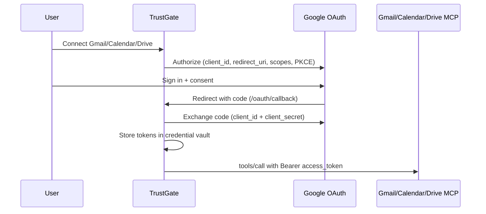

# Google Workspace MCP OAuth (Gmail, Calendar, …)

How TrustGate connects to Google’s remote MCP servers (Gmail, Calendar, Drive,
and future Workspace MCP products), why the UI asks for a **client ID and secret**,
how that differs from Claude, and how to register a **shared TrustGate OAuth
app** so end users get a Claude-like one-click connect.

## 1. Mental model

Connecting Gmail, Calendar, or Drive MCP is always **OAuth 2.0**. Someone’s application
must be registered with Google as “the thing asking for access.” That
registration produces a **client ID** and **client secret**.



| Role | Who |
|------|-----|
| OAuth **client** (the registered app) | Whoever owns the GCP OAuth client — customer (BYO) or NeuralTrust (shared) |
| OAuth **authorization server** | Google (`accounts.google.com` / `oauth2.googleapis.com`) |
| Resource / MCP server | e.g. `https://gmailmcp.googleapis.com/mcp/v1`, `https://calendarmcp.googleapis.com/mcp/v1`, `https://drivemcp.googleapis.com/mcp/v1` |
| Token broker + vault | TrustGate (`forwarded` MCP auth) |

Catalog entries for these servers use:

- `registration: "manual"`
- `dcr: false`
- `pkce: true`

Google does **not** support Dynamic Client Registration (DCR) for these MCP
endpoints. The host cannot invent a client at connect time (unlike Granola,
Notion-style DCR servers with `registration: "auto"`).

## 2. Why Claude does not ask for client ID / secret

Claude (and Antigravity) still use a Google OAuth client. Users simply never
type it:

| Path | Who owns the OAuth client? | User sees |
|------|----------------------------|-----------|
| Claude built-in / first-party Calendar connect | **Anthropic** (pre-registered) | Sign in + consent only |
| Claude **custom** connector ([Google docs](https://developers.google.com/workspace/calendar/api/guides/configure-mcp-server)) | **You** | Paste client ID + secret |
| TrustGate without shared-client env | **You** (BYO) | Paste client ID + secret |
| TrustGate with `GOOGLE_WORKSPACE_MCP_CLIENT_ID` + `_SECRET` | **NeuralTrust** shared app | Sign in + consent only |

TrustGate cannot reuse Claude’s client: OAuth clients are bound to a specific
application name, redirect URI allowlist, and Google Cloud project.

## 3. Catalog entries (source of truth)

Seeded in `seed/mcp-catalog/enterprise-servers.json`:

| Catalog name | Vendor | Server URL |
|--------------|--------|------------|
| `com.google.workspace/gmail` | Gmail | `https://gmailmcp.googleapis.com/mcp/v1` |
| `com.google.workspace/calendar` | Google Calendar | `https://calendarmcp.googleapis.com/mcp/v1` |
| `com.google.workspace/drive` | Google Drive | `https://drivemcp.googleapis.com/mcp/v1` |

Shared OAuth endpoints:

- Authorize: `https://accounts.google.com/o/oauth2/v2/auth`
- Token: `https://oauth2.googleapis.com/token`

### Gmail scopes (catalog)

Google’s configure-MCP page lists `gmail.readonly` and `gmail.compose` (search,
read, drafts). Label tools (`label_thread`, `unlabel_thread`, `label_message`,
`create_label`) require [`gmail.modify`](https://developers.google.com/workspace/gmail/api/reference/mcp/tools_list/label_thread):

- `openid`
- `email`
- `https://www.googleapis.com/auth/gmail.readonly`
- `https://www.googleapis.com/auth/gmail.compose`
- `https://www.googleapis.com/auth/gmail.modify`

Do **not** request `https://mail.google.com/` (permanent delete). After adding
`gmail.modify`, add it on the GCP consent screen Data Access list and
**Reconnect** Gmail so Google re-issues the grant.

### Calendar scopes (catalog)

Configure-screen docs list mostly readonly scopes; write tools require events
write access. Catalog uses:

- `openid`
- `email`
- `https://www.googleapis.com/auth/calendar.calendarlist.readonly`
- `https://www.googleapis.com/auth/calendar.events` (read + write)
- `https://www.googleapis.com/auth/calendar.events.freebusy`

### Drive scopes (catalog)

Google’s [Drive MCP setup](https://developers.google.com/workspace/drive/api/guides/configure-mcp-server)
lists:

- `openid`
- `email`
- `https://www.googleapis.com/auth/drive.readonly`
- `https://www.googleapis.com/auth/drive.file` (files the app creates or the user
  opens with the app — needed for upload / write tools)

Do **not** request the full `drive` scope unless a tool actually needs it; it is
restricted and slows OAuth verification.

### Calendar tools (preview in catalog)

`list_calendars`, `list_events`, `search_events`, `get_event`, `suggest_time`,
`create_event`, `update_event`, `delete_event`, `respond_to_event`.
Authoritative tool set is discovered at runtime after connect. Official setup:
[Configure the Calendar MCP server](https://developers.google.com/workspace/calendar/api/guides/configure-mcp-server).

### Drive tools (preview in catalog)

Google’s own test prompts use `search_files` and `read_file_content`. Catalog
preview lists those two. Authoritative tool set is discovered at runtime after
connect. Official setup:
[Configure the Drive MCP server](https://developers.google.com/workspace/drive/api/guides/configure-mcp-server).

---

## 4. Current path: BYO Google OAuth client (per customer / env)

Use this today when connecting Gmail, Calendar, or Drive from the Registry UI.

### 4.1 Prerequisites

- A Google Cloud project you control
- Ability to configure the OAuth consent screen and create OAuth clients
- TrustGate gateway reachable at a stable HTTPS (or localhost) base URL whose
  callback you can allowlist

### 4.2 Enable Google APIs

Replace `PROJECT_ID` with your GCP project id.

**Calendar**

```bash
gcloud services enable calendar-json.googleapis.com --project=PROJECT_ID
gcloud services enable calendarmcp.googleapis.com --project=PROJECT_ID
```

**Gmail** (enable the Gmail API and Gmail MCP API for your project — same
pattern as Calendar; see Google Workspace MCP product docs for the exact MCP
service name for Gmail).

**Drive**

```bash
gcloud services enable drive.googleapis.com --project=PROJECT_ID
gcloud services enable drivemcp.googleapis.com --project=PROJECT_ID
```

### 4.3 Configure the OAuth consent screen

In Google Cloud Console → **Google Auth Platform** (or APIs & Services →
OAuth consent screen):

1. App name (e.g. `TrustGate` or your company name).
2. User support email and developer contact.
3. Audience:
   - **Internal** — Google Workspace org only.
   - **External** — any Google account (requires test users until verified).
4. Under **Data Access**, add the scopes listed in §3 for the products you
   enable.
5. If External and unverified: **Audience → Test users** → add every account
   that will connect.

### 4.4 Create the OAuth client

1. **Google Auth Platform → Clients → Create client**.
2. Application type: **Web application**.
3. Name: e.g. `TrustGate MCP`.
4. **Authorized redirect URIs** — MCP **connect** callbacks are per provider:

   ```text
   https://<OAUTH_PUBLIC_HOST>/oauth/callback/<provider>
   ```

   Examples (provider codes match the MCP catalog `code`):

   ```text
   https://gateway-mcp.dev.neuraltrust.ai/oauth/callback/com.google.workspace/calendar
   https://gateway-mcp.dev.neuraltrust.ai/oauth/callback/com.google.workspace/gmail
   https://gateway-mcp.dev.neuraltrust.ai/oauth/callback/com.google.workspace/drive
   ```

   Local / BYO (no `MCP_OAUTH_PUBLIC_BASE_URL`) uses the gateway request host:

   ```text
   http://localhost:8082/oauth/callback/com.google.workspace/calendar
   https://gw-xxxxx.mcp.example.com/oauth/callback/com.google.workspace/gmail
   https://gw-xxxxx.mcp.example.com/oauth/callback/com.google.workspace/drive
   ```

   Path shape is `{base}/oauth/callback/{provider}` from `connectCallbackURL`
   (not the inbound IdP path `/oauth/callback`). Google requires an **exact**
   match (scheme, host, port, full path). With a fixed platform base you
   allowlist one host and one URI per Google MCP product.

5. Create → copy **Client ID** and **Client secret**.

### 4.5 Connect in TrustGate / App Registry

1. Open the MCP catalog → Gmail, Google Calendar, or Google Drive.
2. When prompted for manual OAuth, paste:
   - **Client ID**
   - **Client secret** (if the panel asks for it)
3. Complete the browser consent for the Google account that owns the mailbox /
   calendar / Drive files.
4. Tokens are stored in TrustGate’s credential vault; later tool calls use
   `forwarded` auth with that user’s access token. TrustGate requests Google
   **offline** access (`access_type=offline` + `prompt=consent` on
   `accounts.google.com`) so the vault stores a **refresh_token**. Without it,
   the access token dies in ~1 hour and tools force reconnect.

### 4.6 Common failures

| Symptom | Likely cause |
|---------|----------------|
| `redirect_uri_mismatch` | Callback URL not exactly allowlisted on the OAuth client |
| Access blocked / app not verified | External app + user not in Test users |
| Tools fail with insufficient scope | Consent screen missing write scopes (e.g. Calendar `calendar.events`, Gmail `gmail.modify`) |
| Gmail `label_thread` / `create_label` returns Forbidden | Token was issued with `gmail.readonly` + `gmail.compose` only. Catalog now requests `gmail.modify`. Add that scope on the GCP consent screen and Reconnect Gmail |
| API not enabled | Forgot `calendarmcp.googleapis.com` / Calendar API (or Gmail / Drive equivalents) |
| Works once, fails ~1h later / “reconnect” | Grant has no `refresh_token` (pre-offline build, or user must **Reconnect** once after deploy so Google re-issues offline access) |

---

## 5. Claude-like path: shared NeuralTrust / TrustGate OAuth app

Goal: end users never paste client ID/secret. TrustGate injects a platform-owned
Google OAuth client the same way Claude injects Anthropic’s.

### 5.1 What you register (one-time, platform)

1. Create a dedicated GCP project, e.g. `neuraltrust-trustgate-mcp`.
2. Enable Gmail + Calendar + Drive APIs and their MCP services (§4.2).
3. Consent screen branded as **TrustGate** / **NeuralTrust**:
   - Homepage, privacy policy, support email (required for verification).
   - Audience **External** for multi-tenant cloud.
   - All scopes for every Google Workspace MCP product you will productize.
4. Create **one** Web OAuth client.
5. Point TrustGate cloud at a **fixed** connect callback origin and allowlist
   that host once:

   ```bash
   # TrustGate MCP plane env (dev example; prod uses gateway-mcp.neuraltrust.ai)
   MCP_OAUTH_PUBLIC_BASE_URL=https://gateway-mcp.dev.neuraltrust.ai
   ```

   Use an existing MCP-plane hostname (e.g. `gateway-mcp.*` already on the
   HTTPRoute). Wildcard routes accept slashy provider codes.

   Google OAuth client redirect URIs (one per product, per env):

   ```text
   https://gateway-mcp.dev.neuraltrust.ai/oauth/callback/com.google.workspace/calendar
   https://gateway-mcp.dev.neuraltrust.ai/oauth/callback/com.google.workspace/gmail
   https://gateway-mcp.dev.neuraltrust.ai/oauth/callback/com.google.workspace/drive
   https://gateway-mcp.neuraltrust.ai/oauth/callback/com.google.workspace/calendar
   https://gateway-mcp.neuraltrust.ai/oauth/callback/com.google.workspace/gmail
   https://gateway-mcp.neuraltrust.ai/oauth/callback/com.google.workspace/drive
   ```

   Self-hosted / BYO: leave `MCP_OAUTH_PUBLIC_BASE_URL` empty so `redirect_uri`
   uses the request gateway host, and allowlist that customer’s URI (or keep a
   customer-owned Google OAuth client).

6. Store client ID + secret in platform secrets (never in git or the MCP catalog
   JSON).

### 5.2 Product behaviour (shipped)

Catalog `registration: "manual"` still describes Google’s constraint (no DCR).
Claude-like UX is **inject + hide fields**, not DCR.

1. Platform env (never in git or `enterprise-servers.json`):

   ```text
   GOOGLE_WORKSPACE_MCP_CLIENT_ID=...
   GOOGLE_WORKSPACE_MCP_CLIENT_SECRET=...
   ```

   Both must be non-empty. Client ID is non-secret (`overlays/*/config.env`);
   secret lives in the agentgateway `.env` blob.

2. On create/update of `com.google.workspace/gmail`,
   `com.google.workspace/calendar`, and `com.google.workspace/drive`, TrustGate injects those credentials into
   `forwarded` auth when the request did not send a different `client_id`.
   OAuth start/refresh re-reads the platform secret so rotation does not
   require rewriting stored registries.

3. `GET /v1/mcp-servers-catalog` then reports `requires_config: false` and
   `platform_client: true` for those three entries. The App Connect button skips
   the config panel (same as DCR auto). TrustGate’s Registry UI hides Client
   ID / Secret.

4. BYO remains when:
   - the env vars are unset (self-hosted default),
   - the operator pastes their own `client_id` (not overwritten),
   - the shared redirect URI is not registered for that host.

Suggested product split:

| Deployment | Default |
|------------|---------|
| NeuralTrust cloud | Shared TrustGate Google OAuth app (`GOOGLE_WORKSPACE_MCP_*` set) |
| Self-hosted / enterprise BYO IdP requirements | Customer-provided client (env unset) |

### 5.3 Google verification (required for real customers)

Until the OAuth app is **verified**:

- Only **test users** listed on the consent screen can complete OAuth.
- Fine for dogfooding; not fine for open signup.

For External apps with Calendar / Gmail / Drive scopes expect:

- OAuth verification in Google Cloud
- Privacy policy + homepage
- Possible security assessment for sensitive / restricted scopes
- Clear branding (“TrustGate wants access to your Google Calendar”)

Plan timeline and legal/privacy review before promising one-click connect in
production.

### 5.4 Tradeoffs

| | BYO (today) | Shared NeuralTrust client |
|--|-------------|---------------------------|
| UX | Paste client + secret | One-click connect |
| Who owns the GCP project | Customer | NeuralTrust |
| Consent screen name | Customer’s app | TrustGate / NeuralTrust |
| Self-hosted | Natural | Shared client usually unfit |
| Redirect URI ops | Per customer project | Must allowlist every TrustGate host |
| Compliance | Customer is OAuth app owner | NeuralTrust is the OAuth app / data processor for the grant |

---

## 6. Operator checklist (shared app launch)

- [ ] GCP project created; Gmail/Calendar/Drive (+ MCP) APIs enabled
- [ ] Consent screen branded; scopes match catalog (and write tools)
- [ ] Web client created; per-provider `/oauth/callback/{provider}` URIs allowlisted
- [ ] `MCP_OAUTH_PUBLIC_BASE_URL` set on cloud MCP plane; DNS points at that plane
- [ ] Client ID/secret in platform secret store (`GOOGLE_WORKSPACE_MCP_*`)
- [x] Connect path injects credentials; UI fields hidden when configured
- [ ] Dogfood with test users
- [ ] Start Google OAuth verification before GA
- [ ] Document BYO fallback for self-hosted
- [ ] Privacy / DPA wording updated for “TrustGate connects to Google on your behalf”

---

## 7. Related code & docs

| Area | Location |
|------|----------|
| MCP catalog seed | `seed/mcp-catalog/enterprise-servers.json` |
| Connect OAuth callback path | `pkg/app/oauth/connect.go` → `connectCallbackURL` (`/oauth/callback/{provider}`) |
| Fixed connect callback origin | `MCP_OAUTH_PUBLIC_BASE_URL` → `ServerConfig.MCPOAuthPublicBaseURL` |
| Inbound IdP callback (separate) | `pkg/app/oauth/proxy_types.go` → `CallbackPath` (`/oauth/callback`) |
| Forwarded MCP credentials | `pkg/app/mcp/credentials.go` |
| Shared Google OAuth client | `GOOGLE_WORKSPACE_MCP_CLIENT_ID` / `_SECRET` → `pkg/app/mcpoauth` |
| Registry inject on create/update | `pkg/app/registry/mcp_catalog_auth.go` |
| Catalog `requires_config` / `platform_client` overlay | `pkg/app/catalog/mcp_servers.go` |
| Registry UI (manual client fields) | App `McpServerConfigPanel` / `mcpCatalog.ts`; TrustGate `mcp-registries-view.tsx` |
| Local MCP plane testing | `docs/mcp/testing-guide.md` |
| Google Calendar MCP setup | https://developers.google.com/workspace/calendar/api/guides/configure-mcp-server |
| Google Drive MCP setup | https://developers.google.com/workspace/drive/api/guides/configure-mcp-server |

---

## 8. Short FAQ

**Why can’t TrustGate DCR against Google like Granola?**  
Google Workspace remote MCP requires a pre-created Cloud Console OAuth client.
Catalog marks `dcr: false` / `registration: "manual"`.

**Why does Claude feel easier?**  
Anthropic already registered Claude with Google. Users authorize Anthropic’s
app; they never see the client credentials.

**How do we do the same?**  
Set `GOOGLE_WORKSPACE_MCP_CLIENT_ID` and `GOOGLE_WORKSPACE_MCP_CLIENT_SECRET`
(§5), allowlist the connect callback URIs, and complete Google verification
for production users. Leave the env unset for self-hosted BYO.

**Can we put the client secret in `enterprise-servers.json`?**  
No. Secrets belong in platform config / secret manager, not the public catalog.
