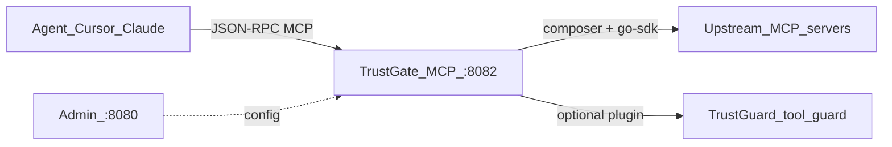

# MCP testing guide

How to exercise TrustGate’s **MCP plane** locally: configure registries and
consumers on Admin, call JSON-RPC on `:8082`, point an agent client at the
gateway, and map manual checks to the functional suite.

This is **not** the Proxy LLM plane’s OpenAI-style tool calling. Agents talk
MCP **to** TrustGate; TrustGate dials upstream MCP servers **as a client**
(`streamable-http` via the official Go SDK).

## 1. Mental model



| Role | Who | Notes |
|------|-----|--------|
| MCP **client** | Cursor, Claude, `curl`, SDKs | Calls TrustGate |
| MCP **server** (gateway) | TrustGate MCP plane | Aggregates tools/prompts/resources |
| MCP **client** (upstream) | TrustGate composer | Dials registered MCP targets |
| MCP **server** (upstream) | Vendor or local MCP | Registered as registry `type: mcp` |

### Admin objects

1. **Gateway** — owns registries, consumers, auth, roles, policies.
2. **Registry** (`type: mcp`) — `mcp_target.url` (+ optional auth:
   `none` / `static` / `passthrough` / `exchange` / `forwarded`).
3. **Consumer** (`type: mcp`) — binds registries; optional `toolkit`,
   `fail_mode` (`open` \| `closed`), or `routing_mode: role_based` with
   `mcp_policies` on roles.

### Auth (consumer → TrustGate)

Preference for interactive agents is **OAuth2** (gateway brokers login;
plain OIDC attach is rejected for MCP consumers). For smoke tests, an
**API key** attached to the MCP consumer is enough — send it as
`X-AG-API-Key` (same header as the Proxy plane). Bearer tokens are also
accepted when OAuth/JWT auth is configured.

### Endpoint shape

Shared-host / path-scoped (what functional tests use):

```text
POST {MCP_URL}/{consumer_slug}/mcp
```

Pin the **Host** header to the gateway MCP host
(`{gateway_slug}.{MCP_BASE_DOMAIN}` from the gateway create/get response
`hosts.mcp`). Path-first auth resolves the consumer from
`/{consumer_slug}/mcp`; the Host must still match a known gateway host
so scoping works.

Do **not** send the Admin JWT to the MCP plane — only the consumer
credential.

## 2. Prerequisites / process smoke

```bash
# Full stack (admin + proxy + mcp + infra)
make up
curl -sf localhost:8080/healthz   # admin
curl -sf localhost:8082/healthz   # mcp

# Or infra in Docker + planes on the host
make compose-up
make run-admin   # :8080
make run-mcp     # :8082
```

Relevant env (see `.env.example`):

| Variable | Default / role |
|----------|----------------|
| `SERVER_MCP_PORT` | `8082` |
| `MCP_BASE_DOMAIN` | MCP host suffix (`{slug}.<domain>`) |
| `GATEWAY_BASE_DOMAIN` | Proxy host suffix (separate from MCP) |
| `STS_SIGNING_KEY` | RSA PEM for MCP session / JWKS (required in prod; ephemeral OK in local non-prod) |

Mint an Admin token the same way as the README “Admin token” section
(`SERVER_SECRET_KEY` → HS256 JWT).

## 3. Happy path (Admin API + curl)

Replace `$TOKEN`, URLs, and IDs as needed. Type fields are case-insensitive
in the Admin API (`mcp` → `MCP`).

### 3.1 Gateway

```bash
ADMIN="http://localhost:8080"
MCP="http://localhost:8082"
TOKEN="$ADMIN_TOKEN"

GW=$(curl -s -X POST "$ADMIN/v1/gateways" \
  -H "Authorization: Bearer $TOKEN" -H "Content-Type: application/json" \
  -d '{"name":"MCP Demo","slug":"mcp-demo"}')
GW_ID=$(echo "$GW" | jq -r .id)
GW_SLUG=$(echo "$GW" | jq -r .slug)
MCP_HOST=$(echo "$GW" | jq -r .hosts.mcp)   # e.g. mcp-demo.mcp.neuraltrust.sandbox
```

### 3.2 MCP registry (upstream)

**Option A — catalog prefill**

```bash
curl -s "$ADMIN/v1/mcp-servers-catalog" \
  -H "Authorization: Bearer $TOKEN" | jq '.mcp_servers[0:3]'
```

Use a catalog entry’s URL (and auth hints) when creating the registry, or
add it from the Admin UI (“Add MCP server”).

**Option B — local upstream**

Functional tests spin a real streamable-HTTP MCP with
`startMCPUpstream` in
[`tests/functional/mcp_e2e_test.go`](../../tests/functional/mcp_e2e_test.go).
Point `mcp_target.url` at any reachable streamable-HTTP MCP (your process,
or a public catalog server in read-only mode).

```bash
# Example: registry pointing at an upstream you already run
REG=$(curl -s -X POST "$ADMIN/v1/gateways/$GW_ID/registries" \
  -H "Authorization: Bearer $TOKEN" -H "Content-Type: application/json" \
  -d '{
    "name": "local-mcp",
    "type": "mcp",
    "weight": 1,
    "mcp_target": { "url": "http://127.0.0.1:9100/mcp" }
  }')
REG_ID=$(echo "$REG" | jq -r .id)
```

Transport defaults to `streamable-http`. Omit `mcp_target.auth` (or set
`"mode":"none"`) for an open local upstream.

### 3.3 MCP consumer + API key

An empty / omitted `toolkit` on an **inline** MCP consumer grants **full
access** to tools exposed by bound registries (see
`TestMCPServer_ToolsListAndCallWithFullAccess`).

```bash
CON=$(curl -s -X POST "$ADMIN/v1/gateways/$GW_ID/consumers" \
  -H "Authorization: Bearer $TOKEN" -H "Content-Type: application/json" \
  -d '{
    "name": "agent-client",
    "type": "mcp",
    "registries": [{"id": "'"$REG_ID"'"}]
  }')
CON_ID=$(echo "$CON" | jq -r .id)
CON_SLUG=$(echo "$CON" | jq -r .slug)

AUTH=$(curl -s -X POST "$ADMIN/v1/gateways/$GW_ID/auths" \
  -H "Authorization: Bearer $TOKEN" -H "Content-Type: application/json" \
  -d '{"name":"agent-key","type":"api_key"}')
AUTH_ID=$(echo "$AUTH" | jq -r .id)
API_KEY=$(echo "$AUTH" | jq -r .api_key)

curl -s -X POST "$ADMIN/v1/gateways/$GW_ID/consumers/$CON_ID/auths/$AUTH_ID" \
  -H "Authorization: Bearer $TOKEN"
```

Optional toolkit (filter + alias), matching E2E:

```json
"toolkit": [
  { "registry_id": "<REG_ID>", "tool": "echo", "expose_as": "alias-echo" }
]
```

Optional `fail_mode`: `"closed"` fails the whole list/call when any bound
upstream is down; `"open"` skips dead upstreams.

### 3.4 JSON-RPC smoke

Helpers in the suite (`mcpPost` / `mcpRPC`) POST to
`MCPURL + "/" + consumerSlug + "/mcp"`, set `Content-Type: application/json`,
send `X-AG-API-Key`, and pin `Host` to the gateway host.

```bash
mcp_rpc() {
  local method="$1"
  local params="${2:-null}"
  curl -s -X POST "$MCP/$CON_SLUG/mcp" \
    -H "Host: $MCP_HOST" \
    -H "Content-Type: application/json" \
    -H "X-AG-API-Key: $API_KEY" \
    -d "{\"jsonrpc\":\"2.0\",\"id\":1,\"method\":\"$method\",\"params\":$params}"
}

mcp_rpc initialize '{"protocolVersion":"2025-03-26"}'
mcp_rpc ping null
mcp_rpc tools/list null
mcp_rpc tools/call '{"name":"echo","arguments":{"message":"hola"}}'

# Optional
mcp_rpc prompts/list null
mcp_rpc resources/list null
```

Notifications (no `id`) return **202 Accepted**:

```bash
curl -s -o /dev/null -w "%{http_code}\n" -X POST "$MCP/$CON_SLUG/mcp" \
  -H "Host: $MCP_HOST" \
  -H "Content-Type: application/json" \
  -H "X-AG-API-Key: $API_KEY" \
  -d '{"jsonrpc":"2.0","method":"notifications/initialized"}'
```

GET on the MCP path returns **405** (POST only for JSON-RPC).

### Admin UI path

Same objects via the frontend: gateway → **MCP** registries (“Add MCP
server” from catalog or custom URL) → consumer type MCP → attach auth →
call the MCP URL above.

## 4. Real agent client (Cursor / Claude)

Point the client at the TrustGate MCP URL with the consumer API key.
Exact config keys vary by client version; the contract is:

- **URL**: `http://localhost:8082/{consumer_slug}/mcp` (or the public MCP
  host / path your ingress exposes).
- **Headers**: `X-AG-API-Key: <key>`. If the client cannot set `Host`, use
  a DNS/ingress name that already resolves to `{gateway_slug}.{MCP_BASE_DOMAIN}`.

Example shape for Cursor `mcp.json` (adjust to your client’s schema):

```json
{
  "mcpServers": {
    "trustgate": {
      "url": "http://localhost:8082/agent-client/mcp",
      "headers": {
        "X-AG-API-Key": "<consumer api key>"
      }
    }
  }
}
```

Checklist:

1. Client completes `initialize` against TrustGate (not the upstream).
2. `tools/list` shows only toolkit-/role-allowed tools (and aliases).
3. `tools/call` returns upstream content; blocked tools get an RPC error
   (e.g. `-32602` for toolkit miss).

For OAuth-backed consumers, use the MCP plane’s well-known /
`/oauth/*` flow (see §5 OAuth shared host) instead of a static API key.

## 5. Scenario checklist ↔ functional tests

Run the automated suite (boots a real binary including the MCP plane):

```bash
cp .env.functional.example .env.functional   # once
make test-functional
```

| Scenario | What to try manually | Test reference |
|----------|----------------------|----------------|
| Reject unauthenticated | Omit `X-AG-API-Key` → HTTP 401 | `TestMCPServer_RejectsUnauthenticatedRequests` |
| initialize / ping / notification | §3.4 | `TestMCPServer_InitializePingAndNotification` |
| tools list/call (full access) | Empty toolkit, call a tool | `TestMCPServer_ToolsListAndCallWithFullAccess` |
| Toolkit filter + aliases | Toolkit entry with `expose_as`; call alias; raw name fails | `TestMCPServer_ToolkitFiltersAndAliasesTools` |
| Prompts / resources | `prompts/*`, `resources/*` with toolkit globs | `TestMCPServer_PromptsAndResources` |
| Fail closed / open | Bind a dead upstream URL | `TestMCPServer_FailModeClosedRejectsWhenUpstreamIsDown`, `TestMCPServer_FailModeOpenSkipsDeadUpstream` |
| Cross-consumer credential | Key of consumer B on path of consumer A | `TestMCPServer_CredentialOfAnotherConsumerIsRejected` |
| Unknown / malformed RPC | Bad method / `jsonrpc: "1.0"` | `TestMCPServer_UnknownMethodAndMalformedBody` |
| Role `mcp_policies` | `routing_mode: role_based` + role toolkit | `TestMCPServer_RoleBasedConsumer*` |
| OAuth shared host | `/{slug}/mcp` + well-known resource metadata | `tests/functional/mcp_oauth_shared_host_test.go` |
| Plugin enforce / observe | TrustGuard (or stub) on tool call chain | `tests/functional/mcp_plugin_chain_test.go` |
| Per-tool rate limit | Rate limiter deny on `tools/call` | `TestPluginE2E_PerToolRateLimiter_MCPToolCallDeny` |
| DB-less OAuth vault | Redis-backed vault without Postgres session store | `tests/functional/dbless_mcp_vault_test.go` |
| API-key self-service connect | §5.1 below | `TestMCPAPIKeyConnect_ForwardedFlowEndToEnd` |
| Shared key reuses one grant | Same key from two clients; second principal gets consent-required | `TestMCPAPIKeyConnect_SharedKeyReusesGrantAndIsolatesPrincipals` |

Living documentation: [`tests/functional/mcp_e2e_test.go`](../../tests/functional/mcp_e2e_test.go).

### 5.1 API-key self-service connect

For an MCP consumer whose registries use `forwarded` auth, the admin sends users
two URLs and the header. Users authorize their own upstream accounts from the
browser; no gateway-side OAuth2 IdP is involved.

```text
MCP URL:            https://{mcp_host}/{slug}/mcp   with  X-AG-API-Key: <key>
Authorization URL:  https://{mcp_host}/{slug}/connect
```

Open the authorization URL, submit the key in the form, and the gateway
redirects to the existing provider page carrying a connect ticket. After
consenting, a `tools/call` with the same key reaches the upstream carrying the
stored bearer. Everyone holding that key shares those upstream accounts — one
key is one principal, as explained in
[`api-key-auth-and-external-credentials.md`](api-key-auth-and-external-credentials.md).

The connect attempt limiter is disabled in `.env.functional.example`: it allows
10 attempts per minute per source and every functional request arrives from
`127.0.0.1`, so the suite would share one bucket. Its coverage lives in
`pkg/infra/ratelimit/connect_test.go`. Per-user OAuth2 behavior is unchanged and
stays guarded by `TestMCPOAuth_SharedHostScopesChallengeAndResolvesConsumerIdP`.

## 6. Catalog health / hide broken vendors

The curated list lives in
[`seed/mcp-catalog/enterprise-servers.json`](../../seed/mcp-catalog/enterprise-servers.json)
and is embedded at build time. Entries with `"hidden": true` are **omitted**
from `GET /v1/mcp-servers-catalog` (so the Admin UI and the product Registry
“Add MCP server” flow never show them). Keep the row in git with
`hidden_reason` for audit / re-probe.

Probe every concrete `server_url` (unauthenticated reachability):

```bash
make mcp-catalog-probe ARGS='-out /tmp/mcp-catalog-probe.jsonl'
# After reviewing broken_* lines:
make mcp-catalog-probe ARGS='-out /tmp/mcp-catalog-probe.jsonl -apply'
```

| Probe status | Meaning | `-apply` |
|--------------|---------|----------|
| `ok` | `initialize` reached an MCP server | clears `hidden` if set |
| `auth_required` | HTTP 401 (expected for many OAuth/static servers) | no change |
| `broken_forbidden` | HTTP 403 / other hard client deny (e.g. vendor allowlist) | sets `hidden` |
| `broken_unreachable` | DNS / TLS / timeout / 5xx / 404 | sets `hidden` |
| `broken_protocol` | HTTP 2xx but not MCP | sets `hidden` |
| `broken_unsupported` | `transport: sse` (TrustGate only speaks `streamable-http`) | sets `hidden` |
| `skipped_needs_config` | URL templates / required `url_variables` | no change |

Known seed hides (not shown in catalog API):

- SSE unsupported: Replicate (`com.replicate/mcp`), InVideo (`io.invideo/mcp`)
- Probe `broken_*`: DocuSign, SonarCloud, Zapier, Rube, Datadog, PayPal

Figma (`com.figma/mcp`) may return **401** (keep; OAuth) or **403** (vendor
allowlist) depending on network — only hide when the probe reports
`broken_forbidden`.

## 7. Appendix: TrustGuard on the MCP chain

When a gateway policy runs the TrustGuard plugin on MCP `tools/call`
(pre-request / pre-response), poisoned tool descriptions and argument
inspection are product concerns of **TrustGuard**, not this happy path.

Use:

- TrustGuard QA: **RT-UC-07** (poisoned MCP tool description) in that
  repo’s `docs/qa/runtime-usecases.md`
- Postman folder **07 — Agent & MCP Security (`tool_guard`)**
- Payload shapes: TrustGuard `docs/api/provider-signatures.md` (MCP
  JSON-RPC / tool_guard)

TrustGate’s own plugin-chain behaviour is covered by
`mcp_plugin_chain_test.go` (enforce block, observe-only, fail-open on
guard errors).

## 8. Troubleshooting

| Symptom | Likely cause |
|---------|----------------|
| HTTP 401 | Missing/wrong `X-AG-API-Key`; auth not attached to this consumer; wrong Host / path so path-first auth cannot scope |
| HTTP 403 / 401 with another key | Credential of a different consumer (`TestMCPServer_CredentialOfAnotherConsumerIsRejected`) |
| Empty `tools` | No registry bound; toolkit/role policy denies all; upstream down with `fail_mode=closed` (RPC `-32603`) |
| Toolkit call error `-32602` | Tool name not in toolkit (use `expose_as` alias if configured) |
| Resource read error `-32002` | URI outside toolkit resource glob |
| OAuth / session issues | Set a stable `STS_SIGNING_KEY` (required in prod); DB-less deployments need Redis vault (`dbless_mcp_vault_test.go`) |
| GET → 405 | Expected — MCP JSON-RPC is POST-only on `/{slug}/mcp` |
| Confusing LLM tool_calls | That traffic hits the **Proxy** plane (`:8081`), not MCP (`:8082`) |
