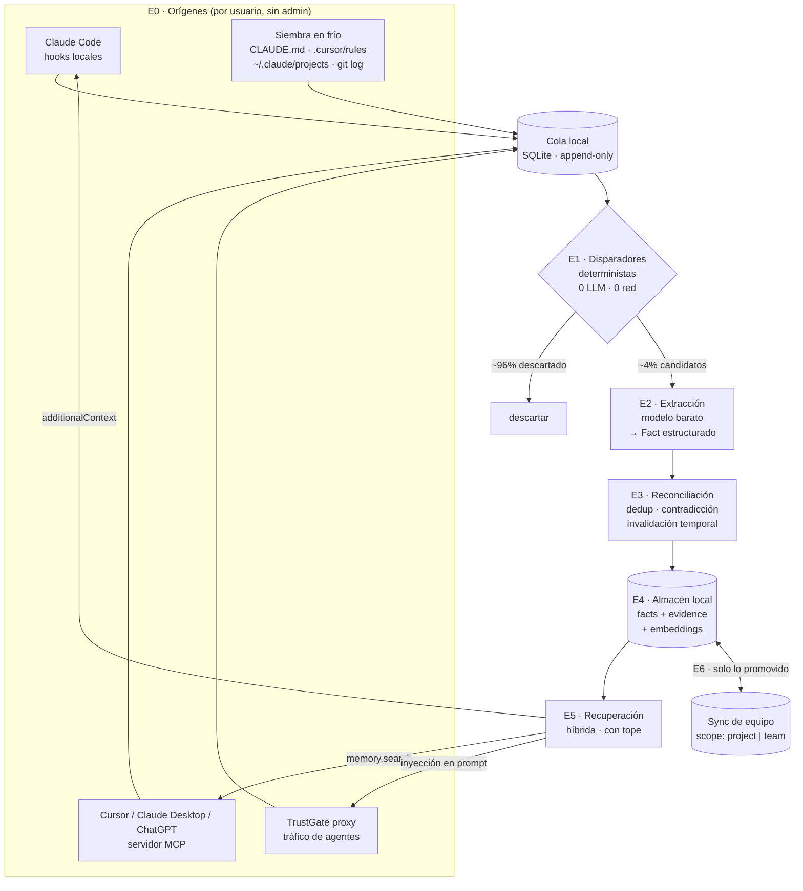

# Knowledge Gateway — data flow

> Diseño del flujo de datos para la versión bottom-up (peldaño 1: equipos de 3–10 personas,
> instalación por usuario, sin admin, sin licencia Enterprise).
> Complementa `knowledge-gateway.md`, que cubre landscape y propuesta de valor.

## 0. La restricción que define toda la arquitectura

**La lectura es síncrona y está en el camino crítico. La escritura es asíncrona y no.**

El hook que inyecta contexto corre *antes* de que el usuario vea nada: si tarda, el producto se siente
lento y se desinstala. La extracción de conocimiento no la ve nadie: puede tardar segundos o diferirse a
la noche.

De ahí se deriva todo lo demás:

| | Lectura | Escritura |
|---|---|---|
| Presupuesto | **< 150 ms p95** | Sin límite (asíncrona) |
| Dónde corre | **Local, siempre** (SQLite + embeddings en disco) | Local o diferida |
| Llamadas LLM | **Cero** | Sí, pero solo sobre candidatos |
| Si falla | Pass-through, el turno sigue | Se encola y se reintenta |

SQLite local no es una preferencia ideológica de "local-first": **es un requisito de latencia**. Una
llamada de red en el camino del prompt mata el producto.

---

## 1. Lo que ya existe (y que casi nadie ha conectado)

El plugin `trustguard@neuraltrust` ya está en producción y ya instala, **por usuario y con un solo
comando** (`claude plugin install trustguard@neuraltrust`), un colector con hooks en `UserPromptSubmit`,
`PreToolUse` y `PostToolUse`, un binario local que enví­a a un data plane, `fail_mode` configurable y
bootstrap que falla abierto para no romper nunca Claude Code.

**El knowledge gateway no necesita fontanería nueva. Necesita un consumidor nuevo de los eventos que ese
colector ya emite, más dos hooks que aún no se enganchan.**

Y aquí está el dato que cambia el planteamiento: la objeción de que "el hook solo ve la entrada del
usuario" es cierta para los *Inference Hooks* de Anthropic, pero **falsa para los hooks locales de
Claude Code**:

| Hook | Campo de entrada | Qué te da |
|---|---|---|
| `UserPromptSubmit` | `prompt`, `session_id`, `transcript_path`, `cwd` | Lo que escribe el usuario **y** la ruta al transcript completo en disco |
| `PostToolUse` | `tool_name`, `tool_input`, `tool_response` | **La salida de las integraciones**, incluidos los `mcp__servidor__tool` |
| **`Stop`** | **`last_assistant_message`**, `stop_reason` | **La respuesta completa del modelo** |
| `SessionStart` | `session_start_reason`, `model` | Momento de siembra y de precalentado |
| `SessionEnd` | `session_end_reason` | Cierre y consolidación |

`Stop` y `SessionStart` **no se están enganchando hoy**. Son los dos que faltan, y son justo los que
aportan lo que la vía Enterprise prometía.

Además, `UserPromptSubmit` puede devolver
`hookSpecificOutput.additionalContext` → **el mismo hook que captura es el que inyecta**. Un solo punto
de integración para leer y escribir.

---

## 2. Vista general



---

## 3. E0 · Captura

Un solo formato de entrada, venga de donde venga. El colector normaliza a un **episodio**:

```json
{
  "episode_id": "01JD8...",
  "source": "claude-code",
  "session_id": "...",
  "actor": "sha256(email)",
  "workspace": { "repo": "github.com/acme/api", "cwd": "/Users/x/api", "branch": "main" },
  "turn": {
    "user": "no, el año fiscal empieza en abril, no en enero",
    "assistant_prev": "…he calculado el Q1 de enero a marzo…",
    "tools": [{ "name": "mcp__jira__search", "input": {...}, "output": "…" }]
  },
  "captured_at": "2026-09-19T10:14:02Z"
}
```

Reglas de captura:
- **Nunca bloquea.** El hook encola y devuelve `{}` de inmediato. Cualquier error → `exit 0`.
- **Nunca sale de la máquina** en esta etapa. La cola es local.
- **Idempotente** por `session_id` + índice de turno, porque los hooks se reintentan.

Degradación por superficie:

| Superficie | Captura | Inyección | Cómo se instala |
|---|---|---|---|
| Claude Code | **Completa** (prompt + respuesta + tools) | Determinista (`additionalContext`) | `claude plugin install` |
| Cursor / Windsurf / Claude Desktop | Parcial (lo que pase por MCP) | Probabilística (el modelo llama a `memory.search`) | Una URL de MCP |
| Agentes vía TrustGate | **Completa** | Determinista (inyección en el prompt) | Cambio de base URL |
| chatgpt.com / claude.ai | Solo con extensión | Solo con extensión | Extensión (fase posterior) |

---

## 4. E1 · Disparadores — el filtro que hace viable la economía

Corre **en local, sin LLM y sin red**. Su único trabajo es tirar el 96% del tráfico.

**Señales de corrección** (las de más valor):
1. Mensaje de usuario justo después de uno del asistente que empieza por negación o contraste:
   `no,` · `en realidad` · `qué va` · `eso está mal` · `incorrecto` · `actually` · `that's wrong`
2. **Rechazo de herramienta**: `PreToolUse` denegado por el usuario, o un `Edit` revertido después.
3. **Ciclo de fallo→arreglo**: `PostToolUse` de tests en rojo, seguido de una edición humana y verde.
4. `git revert` o un commit que deshace lo que el asistente escribió.
5. **Pregunta repetida**: el embedding del prompt cae en un clúster ya visto ≥ 3 veces en sesiones
   distintas → el modelo nunca ha aprendido eso. *(Señal de segundo orden, se calcula en E3.)*
6. **Explícita**: el usuario escribe `/recuerda` o menciona `@memory`. Siempre captura, sin filtro.

**Señales de decisión**:
- Mensajes con marcadores de elección (`vamos a usar`, `hemos decidido`, `descartamos`)
- ADRs, mensajes de commit con `why:`, descripciones de PR

Todo lo que no dispare ninguna señal **se descarta sin almacenarse**. Esto no es solo economía: es la
razón por la que el producto pasa la revisión de privacidad. No guardas conversaciones, guardas el 4%
que es conocimiento.

---

## 5. E2 · Extracción

Solo sobre candidatos. Un modelo barato (clase Haiku) con salida estructurada:

**Entrada:** el turno candidato + los 2 turnos previos como contexto + los hechos ya conocidos que
solapen semánticamente (para que pueda decir "esto contradice el hecho X").

**Salida:**
```json
{
  "is_knowledge": true,
  "kind": "correction",
  "statement": "El año fiscal de Acme empieza en abril",
  "generalizes": true,
  "scope_hint": "org",
  "subjects": ["Acme", "año fiscal"],
  "contradicts": ["01JC..."],
  "sensitivity": "internal",
  "evidence_quote": "no, el año fiscal empieza en abril, no en enero"
}
```

Dos reglas de calidad innegociables:

1. **`statement` tiene que ser autocontenido.** Nada de "esto", "el de antes", "ese endpoint". Si no se
   entiende fuera de la conversación, no es portable a otro proveedor — y la portabilidad es justo la
   propiedad que vendemos.
2. **`generalizes: false` → se descarta.** "Cambia el nombre de esta variable a `total`" no es
   conocimiento, es una instrucción de un momento. El 40% de lo que pasa el filtro E1 muere aquí, y está
   bien.

**Dónde corre:** en la máquina del usuario, **con las credenciales que el usuario ya tiene**. Un dev que
usa Claude Code ya paga Claude. Eso deja el COGS de NeuralTrust en ~0 para el plan gratuito, que es lo
que hace posible el PLG. Alternativa para quien no quiera ni eso: modelo local vía Ollama.

---

## 6. E3 · Reconciliación

Asíncrona, por lotes (al cerrar sesión y una pasada nocturna).

1. **Dedup semántico**: si la similitud con un hecho vigente > umbral y no hay contradicción →
   `confirmations += 1` y se refuerza la confianza. No se crea un hecho nuevo.
2. **Contradicción → invalidación temporal**: no se borra nada. Al hecho viejo se le pone `valid_to`,
   el nuevo apunta con `supersedes`. Así el histórico queda auditable y se puede responder
   *"¿qué creíamos en marzo?"*.
3. **Decaimiento**: un hecho sin confirmar durante N meses baja de confianza y deja de inyectarse antes
   de desaparecer. La memoria rancia es peor que no tener memoria.
4. **Promoción de scope**: `user` → `project` cuando el hecho se deriva del repo; `project` → `team`
   cuando lo confirman ≥ 2 personas distintas. **La promoción a `team` es el único momento en que un dato
   sale de la máquina**, y es explícita.

---

## 7. E4 · Almacén

```sql
CREATE TABLE fact (
  id             TEXT PRIMARY KEY,      -- ULID
  statement      TEXT NOT NULL,         -- autocontenido
  kind           TEXT NOT NULL,         -- correction|decision|preference|resolution|entity
  scope          TEXT NOT NULL,         -- user|project|team|org
  scope_key      TEXT,                  -- remote del repo, id de equipo
  subjects       TEXT,                  -- JSON
  valid_from     TIMESTAMP NOT NULL,
  valid_to       TIMESTAMP,             -- NULL = vigente
  supersedes     TEXT REFERENCES fact(id),
  confidence     REAL NOT NULL,
  confirmations  INTEGER NOT NULL DEFAULT 1,
  sensitivity    TEXT NOT NULL,         -- public|internal|secret
  embedding      BLOB,
  created_at     TIMESTAMP NOT NULL
);

CREATE TABLE evidence (              -- por qué creemos cada hecho
  fact_id     TEXT NOT NULL REFERENCES fact(id),
  source      TEXT NOT NULL,          -- claude-code|cursor|gateway|seed
  session_id  TEXT,
  actor       TEXT,                   -- hash
  quote       TEXT NOT NULL,          -- literal, para auditar y para la UI
  captured_at TIMESTAMP NOT NULL
);
```

`evidence` no es opcional. Es lo que permite que el usuario abra el dashboard, vea *"creo esto porque
el 14 de marzo dijiste literalmente esto"*, y lo corrija. Sin eso no hay confianza, y sin confianza se
desinstala.

---

## 8. E5 · Recuperación e inyección

Presupuesto: **≤ 8 hechos y ≤ 800 tokens**. Inyectar la base entera es el error clásico: dispara el
coste y diluye la atención del modelo, con lo que el producto *empeora* las respuestas y el usuario lo
nota.

Orden de la consulta:
1. Filtro duro por `scope` (usuario + repo actual + equipo) y `valid_to IS NULL`
2. Híbrido: vector + BM25 sobre `statement`
3. Reordenado por `similitud × confianza × frescura`
4. **Resta de lo ya presente**: si el hecho ya está en el contexto de la conversación, no se inyecta

Formato inyectado — explícito y atribuible, nunca camuflado como si fuera del usuario:

```
<memoria_equipo>
- El año fiscal de Acme empieza en abril. (confirmado 3×, últ. 2026-09-02)
- El endpoint /v1/orders está deprecado; usar /v2/orders. (María, 2026-08-14)
</memoria_equipo>
```

Que sea visible importa por tres razones: el usuario entiende de dónde sale la respuesta, puede decir
"eso ya no es verdad" (que es un ciclo de corrección más, gratis), y en la revisión legal es la
diferencia entre "transparente" y "manipulación oculta del prompt".

---

## 9. E6 · Scopes y sincronización

```
user ──────► project ──────► team ──────► org
 │             │               │            │
local          local       sync opt-in   (peldaño 3)
```

- **Nada sale de la máquina salvo lo promovido a `team`.** Es la frontera de privacidad y, no por
  casualidad, también la frontera de cobro.
- El sync es un CRDT sencillo o un log append-only con resolución por `(valid_from, confirmations)`.
  No hace falta tiempo real: la propagación en minutos sobra.
- **Olvidar** = tombstone que se propaga, más purga de `evidence`. Tiene que funcionar de verdad, porque
  es el primer botón que va a pulsar cualquiera que evalúe esto.

---

## 10. Gobierno en el camino de escritura

Antes de persistir nada, en este orden:
1. **Escaneo de secretos** (ya tenéis gitleaks y `logredact` en el repo) → si hay credencial, se descarta
   el hecho entero, no se redacta.
2. **Redacción de PII** → los nombres de personas se mantienen si el hecho es sobre trabajo; los datos
   personales se van.
3. **Clasificación de sensibilidad** → `secret` nunca se promociona a `team` automáticamente.
4. **Registro de auditoría** de cada promoción de scope.

---

## 11. La economía (el número que decide si hay negocio)

Un dev con ~100 turnos/día:

| Etapa | Volumen | Coste |
|---|---|---|
| E1 disparadores | 100 turnos | **0** (local, sin LLM) |
| E2 extracción | ~4 candidatos | ~4 × $0,002 = **$0,008/día** |
| E3 reconciliación | 1 lote nocturno | ~**$0,002/día** |
| E5 recuperación | ~100 consultas | ~0 (embeddings locales) |

→ **≈ $0,30 por dev y mes**, y pagado con la clave que el usuario ya tiene.

Frente al diseño ingenuo de "extraer de cada turno": 100 × ~$0,11 ≈ $11/día ≈ **$330/mes por dev**.
**Tres órdenes de magnitud.** Ese ratio es exactamente la diferencia entre poder tener un plan gratuito
—sin el cual no hay bottom-up— y no poder tenerlo. *(Cifras estimadas, a validar con medición propia.)*

---

## 12. Modos de fallo

| Fallo | Comportamiento |
|---|---|
| El colector no responde | `exit 0`, el turno sigue. Nunca se rompe Claude Code. |
| La recuperación tarda > presupuesto | Se inyecta lo que haya, o nada. |
| El extractor se equivoca | El hecho nace con confianza baja; se refuerza o decae. El usuario puede borrarlo. |
| Sync caído | Se trabaja en local; se reconcilia al volver. |
| Cola llena | Se descartan los episodios más antiguos que no dispararon señal. |

---

## 13. Qué hay que construir

| Pieza | Estado |
|---|---|
| Plugin de Claude Code + hooks + binario colector | **Ya existe** (`trustguard@neuraltrust` 0.1.21) |
| Hooks `Stop` y `SessionStart` | **Falta** — son los que dan respuesta del modelo y siembra |
| Devolver `additionalContext` desde `UserPromptSubmit` | **Falta** — hoy el hook solo evalúa |
| Motor E1 (disparadores) | Falta — es donde está el producto |
| Extractor E2 + esquema E4 | Falta |
| Recuperación E5 con tope | Falta; hay embeddings en `pkg/infra/embedding` |
| Servidor MCP `memory` | Falta; el plano MCP ya existe |
| Dashboard local | Falta — es lo que genera confianza |
| Sync de equipo | Falta — es la frontera de cobro |
| Siembra en frío | Falta — es lo que mata el cold start |

El orden importa: **siembra en frío + `Stop` + `additionalContext` + E1 + dashboard** ya es un producto
que se puede instalar y sentir. Todo lo demás viene después.
