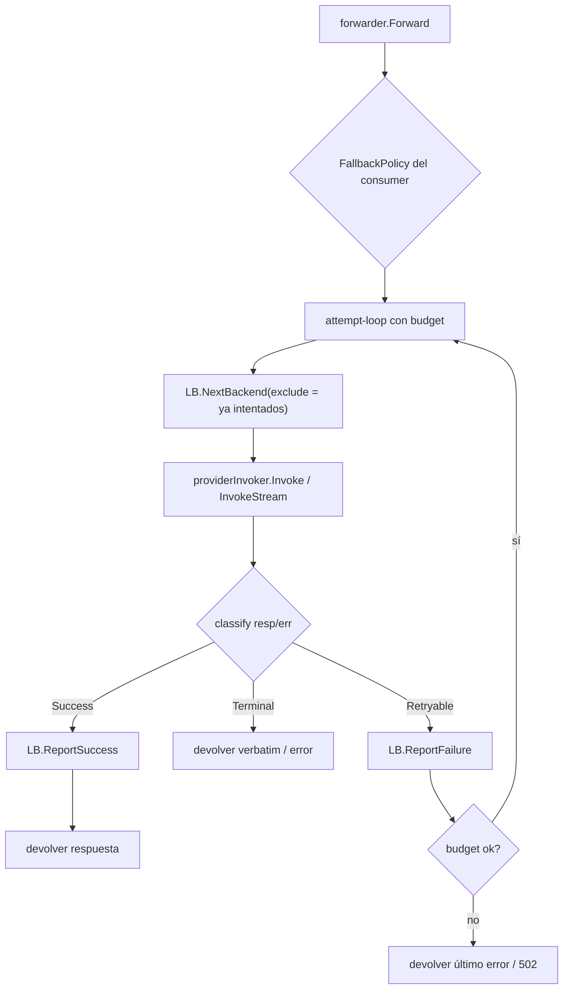

# RUN-277 — Sistema de Fallback configurable (provider/model failover)

> Investigación de diseño. No es código final; es el mapa para implementar.
> Issue: [RUN-277](https://linear.app/neuraltrust/issue/RUN-277/feat-fallback-configurable-system-providermodel-failover) · Parent: RUN-279 · Relacionada: RUN-285 (streaming ↔ non-streaming).

## 1. Qué pide la issue

- `Fallback` declarativo: una **cadena** de alternativas (otro modelo, provider o región) que se reintenta cuando el backend primario falla.
- **Taxonomía de triggers**: clase de status HTTP, código de error del provider, breach de SLO de latencia, rechazo de plugin.
- **Budget**: máximo de intentos, máxima latencia total, máximo coste.
- **Visibilidad**: cada hop emite un evento de métrica ligado al `request_id` original.
- **Streaming**: decidir la semántica de failover una vez enviado el primer chunk.
- **Fuera de scope**: fallback semántico (por calidad de respuesta) y fallback cross-tenant.

## 2. Estado actual de AgentGateway (lo que ya tenemos)

### 2.1. Modelo de routing tras el rediseño (RUN estructural)

```
AuthMiddleware ─► resuelve gatewayID + consumer.Data (read model)
ForwardedHandler.Handle ─► resolveConsumer (match exacto de path) ─► forwarder.Forward
forwarder.Forward ─► selectBackend (LB.NextBackend) ─► DetectStream
                  ─► doForwardRequest / doForwardStream ─► providerInvoker.Invoke(Stream)
providerInvoker ─► provider client (OpenAI, Anthropic, Bedrock, …)
```

- Un **`Consumer`** posee un **pool de `Backends`** + `Algorithm` + `EmbeddingConfig` + `Path`.
- Un **`Backend`** es **un único target** (provider + auth + weight + health checks). Ya no tiene `targets[]`.
- El **LoadBalancer** opera sobre `Pool{Backends, Algorithm, EmbeddingConfig}`; `strategy.Next(req)` devuelve `*backend.Backend`.

### 2.2. Health pasivo = ya es un "circuit breaker" por backend

`pkg/infra/loadbalancer/load_balancer.go`:

- `NextBackend` → `strategy.Next` → si el elegido está **unhealthy** llama a `fallbackBackend` (que pide otro `strategy.Next`, **una sola vez**, sin volver a chequear health).
- `ReportFailure` → `UpdateBackendHealth(false)` → incrementa `lb:health:{backendID}:failures` en Redis; al llegar a `HealthChecks.Threshold` marca el backend `unhealthy` durante `Interval` segundos.
- `ReportSuccess` → resetea el contador.

Esto es, de facto, un **breaker distribuido por backend** (estado en Redis, compartido entre instancias). No necesitamos `gobreaker` para la versión inicial.

### 2.3. Cómo se propagan hoy los errores del backend (GAP importante)

`pkg/app/proxy/provider.go`:

```go
respBody, err := prep.client.Completions(ctx, prep.cfg, prep.body)
if err != nil {
    if be, ok := backend.IsBackendError(err); ok {
        return &ProviderResponse{StatusCode: be.StatusCode, Headers: be.PassthroughHeaders(), Body: be.Body}, nil // 5xx/429 ⇒ err == nil
    }
    return nil, fmt.Errorf("provider completions: %w", err) // solo errores de transporte
}
```

Y en `forwarder.doForwardRequest`:

```go
resp, err := f.invoker.Invoke(ctx, dto.backend, dto.request)
if err != nil { lb.ReportFailure(...) ; return nil, err }
lb.ReportSuccess(dto.backend)   // ⚠️ se ejecuta también con resp.StatusCode == 503
```

**Consecuencia**: un 5xx/429 del provider se trata como **éxito** para el health pasivo. El breaker nunca salta por errores HTTP, solo por errores de transporte/timeout. **Esto hay que arreglarlo sí o sí** para que fallback (y el breaker) funcionen.

### 2.4. Config y métricas que ya existen

- `config.ProviderConfig{ RequestTimeout, MaxRetries }` — `MaxRetries` ya está pero **no se usa**.
- `config.UpstreamConfig{ Timeout, ErrorPassthrough }`.
- `metric_events.Event` tiene `TraceID`, `Upstream.Target{Provider, Latency}`, `Usage`, `Streaming`, `StatusCode`. **No** tiene `request_id`/`attempt`/`fallback` todavía.

### 2.5. Referencia TrustGate (de donde se porta)

- Retry-loop en `forwarded_handler.go`: `for attempt := 0; attempt <= maxRetries; attempt++` pidiendo `lb.NextTarget(req)` en cada intento; en éxito `ReportSuccess`+return; ante `UpstreamError` con `ErrorPassthrough` hace passthrough **sin** reintentar; en otro caso `ReportFailure`+siguiente intento. `maxRetries = rule.RetryAttempts` (default 2).
- `httpx.CircuitBreaker` (`sony/gobreaker`) **existe pero no está cableado** al loop. El health pasivo hace de breaker.
- No hay cadena de fallback declarativa heterogénea; el "fallback" es simplemente "el LB te da otro target del pool".

## 3. Las tres preguntas

### Q1 — ¿Un Consumer puede tener un Backend fallback?

**Sí, y es el sitio correcto para la cadena.** En el modelo nuevo el `Consumer` es la unidad de routing y ya posee el pool de backends + algoritmo. Hay que separar dos conceptos que NO son lo mismo:

| Concepto | Eje | Quién lo resuelve | Ejemplo |
|---|---|---|---|
| **Load balancing** | Horizontal (mismo "tier", backends equivalentes) | LB (`strategy.Next` + health) | 3 API keys de OpenAI gpt-4o → repartir carga |
| **Fallback / failover** | Vertical (tiers heterogéneos, prioridad) | Orquestador por encima del LB | gpt-4o ▸ si cae ▸ claude-sonnet ▸ si cae ▸ gemini |

Recomendación: **cadena de fallback a nivel `Consumer`** (`Consumer.Fallback`), referenciando backends del mismo gateway por orden de prioridad.

- La issue dice "attached to a Backend (or Policy)". En el modelo nuevo eso encaja peor: poner la cadena en cada `Backend` invita a cadenas por-backend solapadas y a ciclos; ponerla en `Policy` la acopla al motor de plugins (aún no portado, B.3). El `Consumer` es donde vive el routing y el pool → es el dueño natural. (Se documenta la divergencia y las alternativas en §7.)

Semántica unificada propuesta:

- `Fallback.Chain` **vacía** → el failover recorre los **backends sanos restantes del propio pool** en orden del LB (homogéneo: varias keys/regiones del mismo modelo).
- `Fallback.Chain` **definida** → tras el pick primario del LB, el failover sigue la **lista ordenada explícita** (heterogéneo: modelo/provider/región distintos), saltándose los ya intentados.

### Q2 — ¿Cómo tratamos los retries? ¿Circuit Breaker?

**Retries** = un **attempt-loop acotado por budget** en el `forwarder` (portado de TrustGate, adaptado al modelo consumer/LB):

1. Resolver `FallbackPolicy` desde el consumer (triggers + budget + chain).
2. Construir la secuencia ordenada de candidatos: `primary = LB.NextBackend()`; siguientes = chain explícita **o** `LB.NextBackend(excluyendo ya intentados)`.
3. Para cada candidato: invocar → **clasificar** el resultado → si es *retryable* y el budget lo permite, avanzar; si no, devolver.
4. Triggers deciden qué es retryable; un 2xx o un 4xx (salvo 429) es **terminal**.

**Circuit Breaker** = **reutilizar el health pasivo** que ya tiene el LB (contador de fallos en Redis + threshold → backend unhealthy durante `Interval`). Es un breaker distribuido y ya implementado. La cadena de fallback y el breaker se complementan:

- El breaker **saca de rotación** un backend que falla repetidamente (efecto entre requests).
- El fallback **reintenta dentro del mismo request** con el siguiente candidato (efecto intra-request).

> No hace falta `gobreaker` para v1. Si más adelante queremos un trip in-process ultrarrápido (evitar pegar a Redis en cada selección), se puede añadir como capa de caché del estado de health, pero no es necesario.

**Prerrequisito** (§2.3): clasificar `ProviderResponse.StatusCode` y llamar a `ReportFailure` ante 5xx/429/timeout, no solo ante errores de transporte. Sin esto, ni el breaker ni el fallback "ven" los errores HTTP.

### Q3 — ¿Cómo encaja con el LB?

El fallback es una capa de **orquestación por encima** del LB, no dentro de él:



Cambios concretos que el LB necesita:

1. **`NextBackend` con set de exclusión**: hoy `strategy.Next` puede devolver el mismo backend ya intentado en este request. Necesitamos `NextBackend(req, exclude map[uuid.UUID]struct{})` (o que el forwarder construya la lista de candidatos a partir de `rc.Backends` + chain y solo use el LB para **ordenar** el tier primario). Sin exclusión, round-robin con 1 backend reintenta el mismo eternamente.
2. **`fallbackBackend` actual** (un único reintento sin re-check de health) queda subsumido por el attempt-loop; se puede simplificar.
3. El **estado del LB** (round-robin counter, least-connections) sigue por consumer; la cadena de fallback no necesita estado propio (es per-request).

## 4. Modelo de datos propuesto

```go
// pkg/domain/consumer (o pkg/domain/fallback si crece)

type FallbackTrigger string

const (
    TriggerHTTP5xx       FallbackTrigger = "http_5xx"
    TriggerHTTP429       FallbackTrigger = "http_429"        // rate limit
    TriggerTimeout       FallbackTrigger = "timeout"         // SLO de latencia / ctx deadline
    TriggerProviderError FallbackTrigger = "provider_error"  // código de error del provider en el body
    TriggerPluginReject  FallbackTrigger = "plugin_rejection"// fase posterior (B.3)
)

type FallbackBudget struct {
    MaxAttempts     int           `json:"max_attempts"`      // intentos totales (incl. primario), p.ej. 3
    MaxTotalLatency time.Duration `json:"max_total_latency"` // presupuesto wall-clock entre hops
    MaxCostUSD      float64       `json:"max_cost_usd,omitempty"` // fase 2 (requiere usage→coste)
}

type Fallback struct {
    Enabled  bool              `json:"enabled"`
    Triggers []FallbackTrigger `json:"triggers"`
    Budget   FallbackBudget    `json:"budget"`
    Chain    []uuid.UUID       `json:"chain,omitempty"` // backends del mismo gateway, por prioridad
    // PerAttemptTimeout opcional; backoff opcional (fase 2)
}
```

- Persistencia: columna `fallback JSONB` en `consumers` (patrón idéntico a `embedding_config`/`headers`). Migración in-code + `UNIQUE` no aplica.
- Validación de dominio:
  - `Chain` solo backends del mismo `gateway_id` (igual que `BackendIDs`); sin `uuid.Nil`; sin duplicados.
  - `MaxAttempts >= 1`; si `Enabled` y `Triggers` vacío → error.
  - `TriggerProviderError`/`TriggerPluginReject` aceptados pero marcados "no-op hasta su fase".

## 5. Matriz de triggers (clasificación de resultados)

`classify(resp *ProviderResponse, err error, budget) -> {Success | Retryable | Terminal}`:

| Resultado del intento | Clasificación | Trigger | Acción LB |
|---|---|---|---|
| 2xx | Success | — | `ReportSuccess` |
| 5xx (500, 502, 503, 504) | Retryable | `http_5xx` | `ReportFailure` |
| 429 | Retryable | `http_429` | `ReportFailure` (respetar `Retry-After` si hay budget) |
| 408 / ctx deadline / transporte | Retryable | `timeout` | `ReportFailure` |
| 400, 401, 403, 404, 422 | **Terminal** | — | passthrough verbatim (no reintentar) |
| body con código de error retryable del provider (`overloaded`, `insufficient_quota`, `rate_limit_exceeded`, …) | Retryable | `provider_error` | `ReportFailure` |
| rechazo de plugin con `fallback_on_reject` | Retryable | `plugin_rejection` | n/a (fase B.3) |
| budget agotado | Terminal | — | devolver último resultado (verbatim si era HTTP, 502 si transporte) |

Notas:
- **Solo se reintentan los triggers que el consumer ha activado** en `Fallback.Triggers`. Un 5xx con `http_5xx` no listado → terminal/passthrough.
- 4xx (salvo 429) es terminal por defecto: reintentar un payload inválido en otro provider no ayuda. Configurable más adelante (p.ej. 401 por key quemada de un backend concreto → fallback al siguiente).
- `provider_error` requiere clasificación por provider en la capa `adapter` (mapear body → categoría canónica). Se puede empezar solo con status HTTP y añadir esto en fase posterior.

## 6. Streaming — semántica de failover

Regla de oro: **solo se puede hacer failover ANTES de enviar el primer byte al cliente.** Una vez se ha flautado un chunk, el status ya está comprometido y un error a mitad de stream es **terminal**.

El diseño actual de `InvokeStream` ya da la costura perfecta:

- Pre-stream non-2xx → devuelve `ProviderResponse{StatusCode, Body, Stream: nil}` → **elegible para failover** (igual que una respuesta no-streaming).
- Stream OK → `ProviderResponse{Stream: seq}` → una vez el handler empieza a drenar `seq` y escribe el primer chunk, **no hay vuelta atrás**.

Implementación:
- En `doForwardStream`, la **selección + InvokeStream** entran en el attempt-loop **igual que** non-streaming, porque el error pre-stream se devuelve sincrónicamente y sin escribir nada al cliente.
- En `proxy_handler.writeStream`, si el primer `seq.Yield` devuelve error **antes** de escribir nada, en teoría aún se podría reintentar; en la práctica el `BodyStreamWriter` de fasthttp ya ha fijado el status → lo tratamos **terminal** (documentar y no complicar v1).
- Riesgo conocido: si activamos `stream: true` y el provider responde 200 + primer chunk de error semántico, no hacemos failover (es terminal). Aceptable para v1.

## 7. Dónde adjuntar el `Fallback` — decisión y alternativas

| Opción | Pros | Contras | Veredicto |
|---|---|---|---|
| **Consumer.Fallback** (recomendado) | Es la unidad de routing y ya tiene el pool + algoritmo; una sola cadena por path; sin ciclos | Diverge del texto de la issue ("Backend/Policy") | ✅ v1 |
| Backend.Fallback (por target) | Coincide con el texto de la issue; cadenas específicas por target | Cadenas solapadas/ciclos; difícil de razonar; ¿qué cadena gana si el LB elige otro? | ❌ |
| Policy.Fallback (plugin-driven) | Encaja con triggers de plugin | Acopla al motor de plugins (B.3, no portado); demasiado pronto | 🔜 fase posterior para `plugin_rejection` |

La cadena en `Consumer` no impide que en una fase 2 una `Policy` añada triggers basados en plugins; los triggers son aditivos.

## 8. Métricas y trazabilidad (por hop)

Requisito: cada hop emite un evento ligado al `request_id` original.

- Usar `TraceID` (ya existe) como **id de correlación** del request; todos los hops comparten `TraceID`.
- Añadir a `metric_events.Event`:
  - `Attempt int` — número de intento (0 = primario).
  - `Fallback bool` — true si este hop es un fallback.
  - `FallbackFromBackendID string` / `BackendID string` — de quién venimos / quién atiende.
  - `Outcome string` — `success` | `retryable` | `terminal`.
- Emitir **un evento por intento** (no solo el final), reutilizando el `StreamMetricsFinalizer` / worker existente. El attempt-loop debe poder publicar eventos intermedios además del final.
- El budget de **coste** depende de `CanonicalUsage` (ya capturado en `req.Metadata[usage]`); se integra cuando exista pricing por modelo (fase 2).

## 9. Cambios de código (mapa de impacto)

1. **Clasificación + fix del breaker** (`pkg/app/proxy/provider.go`, `forwarder.go`):
   - Helper `classify(resp, err, triggers) Outcome`.
   - `doForwardRequest`/`doForwardStream`: `ReportFailure` ante 5xx/429/timeout; `ReportSuccess` solo en 2xx. **Valioso por sí solo, aunque no haya cadenas.**
2. **LB exclude-set** (`pkg/infra/loadbalancer/{load_balancer.go,strategy.go,strategies/*}`):
   - `NextBackend(req, exclude)` o que el forwarder ordene candidatos y el LB solo elija el primario.
3. **Dominio** (`pkg/domain/consumer` o nuevo `pkg/domain/fallback`): tipos `Fallback`, `FallbackTrigger`, `FallbackBudget` + validación.
4. **Persistencia**: columna `fallback JSONB` en `consumers`; migración in-code; repo `Save/Update/scan`; read model `RoutableConsumer` (resolver `Chain` → `[]*Backend`).
5. **Attempt-loop** en `forwarder.Forward` (orquestación + budget de intentos y latencia).
6. **Admin API**: DTOs create/update/response de consumer con `fallback`.
7. **Métricas**: campos nuevos en `Event` + emisión por hop.
8. **Tests**: matriz de triggers (unit), E2E primary 503 → fallback 200, métricas con `TraceID` compartido y `attempt` incremental.

## 10. Plan por fases sugerido

| Fase | Alcance | Depende de |
|---|---|---|
| **0** | Clasificación de resultados + `ReportFailure` en 5xx/429/timeout (arregla el breaker) | — |
| **1** | Dominio `Fallback` + migración + repo + read model + validación | 0 |
| **2** | Attempt-loop non-streaming + LB exclude-set + budget (attempts, latency) | 0,1 |
| **3** | Failover pre-stream en streaming | 2 |
| **4** | Métricas por hop (TraceID, attempt, fallback_from, outcome) | 2 |
| **5** | `provider_error` (clasificación por provider), `plugin_rejection` (tras B.3), budget de coste | 2, B.3 |

Fuera de scope (issue): fallback semántico y cross-tenant.

## 11. Preguntas abiertas / decisiones a confirmar

1. **Sitio de la cadena**: ¿confirmamos `Consumer.Fallback` (recomendado) o el texto literal de la issue (`Backend`)?
2. **Pool vs chain**: ¿la cadena vacía debe recorrer el pool del consumer (recomendado) o no hacer fallback salvo chain explícita?
3. **4xx**: ¿algún 4xx (401/403 por key quemada) debe ser retryable de forma configurable, o terminal siempre en v1?
4. **Idempotencia**: chat/completions es seguro de reintentar; ¿hay flujos con side-effects (tool execution server-side) donde el retry sea peligroso? En v1 asumimos seguro.
5. **Budget de coste**: ¿lo dejamos para fase 2 (depende de pricing por modelo)?
6. **gobreaker**: ¿lo portamos como caché in-process del health, o nos quedamos solo con el health pasivo en Redis para v1 (recomendado)?
