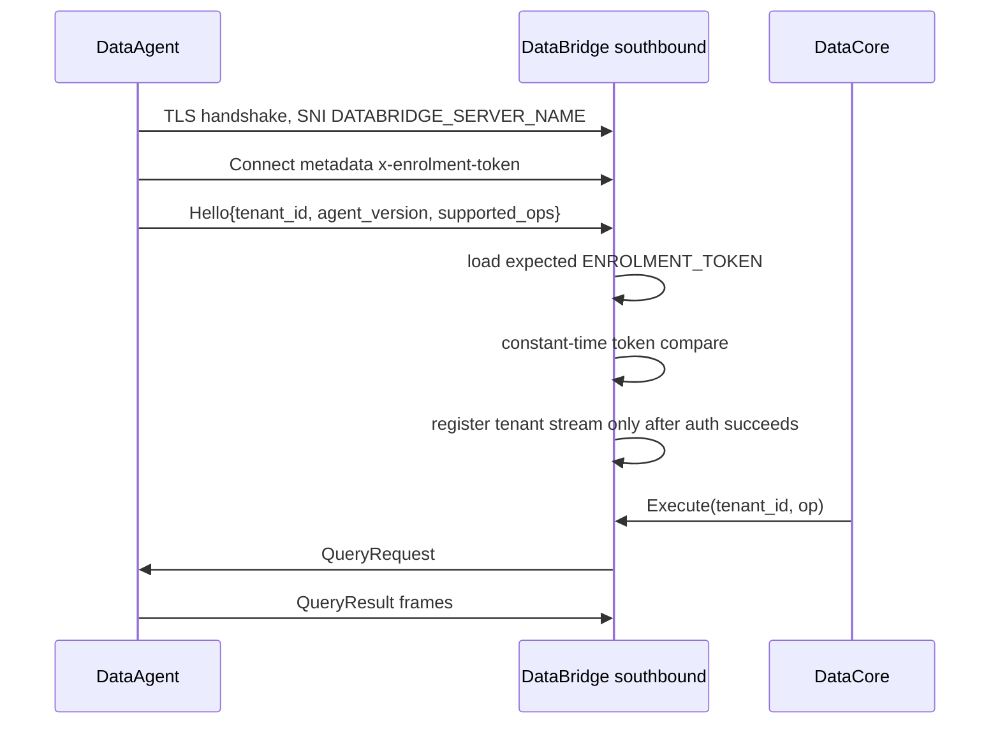

# Design: RUN-915 TLS Enrolment Auth

## Technical Approach

Keep the existing outbound DataAgent -> DataBridge bidi stream and registry flow. Change the default security boundary from client mTLS to server-side TLS plus application auth: DataAgent validates DataBridge TLS identity, sends `x-enrolment-token`, then DataBridge authenticates the first `Hello` before registration. No residency proto or `INSTANCE_ID` contract changes.

## Architecture Decisions

| Area | Choice | Rejected | Rationale |
|---|---|---|---|
| DataBridge auth | Add `AUTH_MODE=token` with singular `ENROLMENT_TOKEN`, loaded from `databridge-secrets`; compare the presented token in constant time and return `ErrUnauthenticated` on missing or invalid token. | mTLS default; DataBridge-side tenant token map; credential exchange now. | Fits the 1:1 DataAgent/tenant model: DataAgent owns one token and DataBridge validates the expected token for that deployment. |
| DataAgent transport | Add `TLS_MODE=tls` and make it the default. Require `DATABRIDGE_SERVER_NAME` and `ENROLMENT_TOKEN`; use `TLS_CA_FILE` when set, otherwise system roots. | Reusing `mtls`; allowing empty server name; requiring private CA always. | Removes client cert/key from default path while preserving server identity validation. |
| Compatibility | Keep `TLS_MODE=mtls` and `SOUTHBOUND_CLIENT_CA_FILE` as explicit internal compatibility only. | Deleting mTLS code now. | Lowers migration risk without documenting mTLS as the default. |
| Dev trust | Replace `dataagent-client-tls` default with a CA-only trust bundle mounted at `/etc/databridge-ca/ca.crt`. | Mounting client cert just to get `ca.crt`; insecure dev stream. | Dev remains TLS with server validation and no client cert/key. |

## Auth And TLS Flow

Failure handling is fail-closed: unauthenticated streams return gRPC `Unauthenticated`, log no token value, and never touch the registry.

This singular-token design assumes an isolated 1:1 tenant/DataAgent deployment. A shared multi-tenant DataBridge would need tenant-bound credential storage before accepting multiple independent tenant tokens.

## Config Contract

DataBridge: `AUTH_MODE=token` outside local dev; `AUTH_MODE=dev` remains local-only. `ENROLMENT_TOKEN` is required in token mode and must match the token configured in the tenant's DataAgent. `SOUTHBOUND_TLS_CERT_FILE` and `SOUTHBOUND_TLS_KEY_FILE` are required outside dev. `SOUTHBOUND_CLIENT_CA_FILE` is unset by default; setting it intentionally enables client cert verification.

DataAgent: `TLS_MODE=tls` default; `TLS_MODE=insecure` still requires `ALLOW_INSECURE_TRANSPORT=true` and never sends the token. `DATABRIDGE_SERVER_NAME` and `ENROLMENT_TOKEN` are required for `tls` and `mtls`. `TLS_CA_FILE` is optional in `tls`; `TLS_CLIENT_CERT_FILE` and `TLS_CLIENT_KEY_FILE` are only required in `mtls`.

## File Changes

| Repo | Files | Action |
|---|---|---|
| DataBridge | `internal/auth/auth.go`, `internal/auth/auth_test.go` | Modify: add token authenticator and table tests. |
| DataBridge | `internal/config/config.go`, `internal/config/config_test.go`, `internal/container/modules/bridge.go` | Modify: parse/validate token auth config and wire provider. |
| DataBridge | `internal/container/modules/servers.go`, `internal/container/modules/servers_test.go` | Modify/create: lock TLS-only default and explicit mTLS behavior. |
| DataBridge | `internal/southbound/connect_test.go`, `internal/e2e/e2e_test.go` | Modify: cover TLS-only success, invalid token, missing token, and no registry registration. |
| DataBridge | `.env.example`, `README.md`, `k8s/base/secrets.env.example`, `k8s/base/deployment.yaml`, `k8s/overlays/dev/config.env`, `k8s/overlays/prod/config.env`, `k8s/overlays/prod/kustomization.yaml`, `k8s/overlays/prod/patches/southbound-tls-patch.yaml` | Modify/create: token secret, TLS server mount/env, client CA unset by default. |
| DataAgent | `internal/config/config.go`, `internal/config/config_test.go`, `internal/transport/credentials.go`, `internal/transport/credentials_test.go` | Modify: add `tls` mode, optional CA pool, token per-RPC credentials over TLS. |
| DataAgent | `internal/supervisor/connector_test.go` | Modify: prove TLS-mode dial options carry token metadata through Connect. |
| DataAgent | `.env.example`, `README.md`, `k8s/base/secrets.env.example`, `k8s/overlays/dev/config.env`, `k8s/overlays/dev/kustomization.yaml`, `k8s/overlays/dev/client-cert.yaml`, `k8s/overlays/dev/patches/client-tls-patch.yaml`, `k8s/overlays/dev/databridge-ca.yaml`, `k8s/overlays/dev/patches/ca-bundle-patch.yaml`, `k8s/overlays/prod/config.env` | Modify/delete/create: remove default client cert/key, add CA-only dev trust, set `TLS_MODE=tls`. |
| DataCore | `docs/hybrid-residency-deploy-secrets-checklist.md` | Modify: docs-only removal of default DataAgent client cert rotation. |
| TrustGate | `docs/hybrid-residency-gsm-secrets.md`, `docs/sdd/run-915-tls-enrolment-auth/design.md` | Create/modify: coordination docs and this design. |

## Testing Strategy

| Layer | Coverage |
|---|---|
| Unit | DataBridge token parsing/auth table tests; DataAgent config and credential provider tests for `tls`, `mtls`, `insecure`, CA file, system roots, and token security. |
| Stream/e2e | In-process TLS-only Connect success, missing/invalid token rejection before registry registration, and Execute round trip after auth. |
| Verification | `gofmt`, `go vet ./...`, `golangci-lint run`, `make test`, and `go test -race ./...` for DataBridge/DataAgent. Docs-only DataCore/TrustGate need markdown review. |

## Rollout And Compatibility

Deploy DataBridge first with TLS cert/key and `ENROLMENT_TOKEN`, leaving `SOUTHBOUND_CLIENT_CA_FILE` unset. Then deploy DataAgent with `TLS_MODE=tls`, `DATABRIDGE_SERVER_NAME`, optional CA file, and the same `ENROLMENT_TOKEN`. Rollback is explicit mTLS mode: restore client cert/key mounts, set DataAgent `TLS_MODE=mtls`, and set DataBridge `SOUTHBOUND_CLIENT_CA_FILE`.

## Risks

- Long-lived token remains weaker than per-agent credentials; track one-time exchange and credential lifecycle as follow-up.
- `ENROLMENT_TOKEN` rotation needs a coordinated DataBridge/DataAgent rollout; document dual-token or grace-window rotation as follow-up if needed.
- Dev CA bundle injection depends on cert-manager/cainjector availability in the cluster.

## Open Questions

None blocking.
