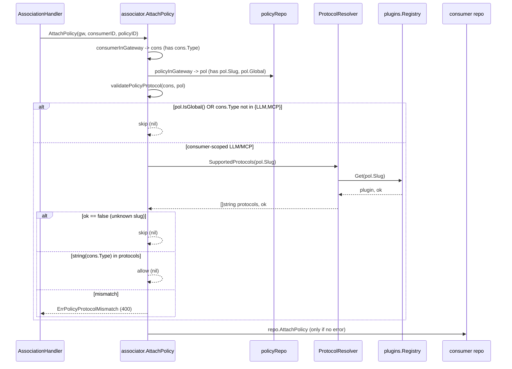

# Design: Supported Protocols (RUN-966)

Concrete technical design for the plugin protocol contract. All 11 proposal
decisions are FIXED; this document turns them into exact files, signatures, and
symbol locations so the tasks/apply phases are mechanical. See
`explore.md` (line-level anchors) and `proposal.md` (resolved decisions).

Binding conventions: `.agents/AGENT.md` (hexagonal layout §3, DI §4, DTO/use-case
placement §10, **strict no-comments** §11 — new Go files carry only the Apache
license header, no doc/inline comments) and the `golang-pro` skill (`%w` wrapping,
`ctx` first, small consumer-defined interfaces, `-race` table tests). Every new
`.go` file needs the license header (`make license`).

---

## 1. Protocol type — new file `pkg/app/plugins/protocol.go`

New file, package `plugins`. Mirrors `consumer.Type` (`pkg/domain/consumer/consumer.go:25-43`)
and the `validateDeclaredModes` pattern in `pkg/app/plugins/modes.go:25-44`.

```go
package plugins

import (
	"errors"
	"fmt"
)

type Protocol string

const (
	ProtocolLLM Protocol = "LLM"
	ProtocolMCP Protocol = "MCP"
	ProtocolA2A Protocol = "A2A"
)

var ErrInvalidProtocols = errors.New("plugin: invalid declared protocols")

func Protocols() []Protocol {
	return []Protocol{ProtocolLLM, ProtocolMCP, ProtocolA2A}
}

func (p Protocol) IsValid() bool {
	switch p {
	case ProtocolLLM, ProtocolMCP, ProtocolA2A:
		return true
	}
	return false
}

func validateDeclaredProtocols(name string, protocols []Protocol) error {
	if len(protocols) == 0 {
		return fmt.Errorf("%w: %s declares no supported protocols", ErrInvalidProtocols, name)
	}
	for _, p := range protocols {
		if !p.IsValid() {
			return fmt.Errorf("%w: %s supports %q", ErrInvalidProtocols, name, p)
		}
	}
	return nil
}
```

Rationale for `ErrInvalidProtocols` + `validateDeclaredProtocols` co-located here:
mirrors `modes.go` (which owns `ErrInvalidModes` + `validateDeclaredModes`), so
`registry.go` stays a thin caller. `ProtocolA2A` is declared but assigned to no
plugin (decision 7).

---

## 2. Contract change — `pkg/app/plugins/plugin.go`

Add one method to `PluginDescriptor` (interface at lines 31-44), immediately
after `SupportedModes()` (line 39). No comment (matches surrounding style is
doc-commented today, but per AGENT.md §11 new lines carry no comment; the
pre-commit hook strips them regardless):

```go
type PluginDescriptor interface {
	Name() string
	MandatoryStages() []policy.Stage
	SupportedStages() []policy.Stage
	SupportedModes() []policy.Mode
	SupportedProtocols() []Protocol
	ValidateConfig(settings map[string]any) error
	MutatesRequestBody() bool
	MutatesResponseBody() bool
	MutatesMetadata() bool
}
```

`Plugin` embeds `PluginDescriptor` (line 55-58) → the `//go:generate mockery`
directive on `Plugin` (line 54) regenerates the mock with the new method
(Phase 1 ripple, §9).

---

## 3. Registry enforcement — `pkg/app/plugins/registry.go`

In `Register` (lines 48-81), after the `validateDeclaredModes` call (line 76-78)
and before `r.plugins[name] = p` (line 79), add:

```go
	if err := validateDeclaredProtocols(name, p.SupportedProtocols()); err != nil {
		return err
	}
```

This mirrors the existing stages check (lines 59-67) and modes check exactly.
Startup fails (`ErrInvalidProtocols`) if any plugin omits protocols — decision 3.

**Ripple (mandatory, same commit):** the in-package test doubles
`stagePlugin` (`registry_test.go:27-41`) and `fakePlugin` (`executor_test.go:31-54`)
implement `Plugin` and are passed to `reg.Register(...)`; both must gain
`SupportedProtocols()` returning a non-empty valid set (e.g.
`[]Protocol{ProtocolLLM}`) or every registry/executor/catalog test fails to
compile or panics on registration.

---

## 4. The 16 plugin implementations — `pkg/infra/plugins/*/plugin.go`

Every plugin file already aliases the app package as
`appplugins "github.com/NeuralTrust/TrustGate/pkg/app/plugins"` (verified in
`cors`, `costcap`, `pertoolratelimit`, `trustguard`; guaranteed for all 16 by the
`var _ appplugins.Plugin = (*Plugin)(nil)` line each declares). Add the method to
each descriptor block, placed adjacent to `SupportedModes()`:

```go
func (p *Plugin) SupportedProtocols() []appplugins.Protocol {
	return []appplugins.Protocol{ /* per matrix */ }
}
```

Apply must confirm the alias per file (grep `pkg/app/plugins"` in the import
block); if any file uses a different alias, use that file's alias.

| # | File | slug | Method body (`return []appplugins.Protocol{…}`) |
|---|------|------|--------------------------------------------------|
| 1 | `cors/plugin.go` | `cors` | `ProtocolLLM, ProtocolMCP` |
| 2 | `requestsize/plugin.go` | `request_size_limiter` | `ProtocolLLM, ProtocolMCP` |
| 3 | `ratelimit/plugin.go` | `rate_limiter` | `ProtocolLLM, ProtocolMCP` |
| 4 | `costcap/plugin.go` | `cost_cap` | `ProtocolLLM` |
| 5 | `tokenratelimit/plugin.go` | `token_rate_limiter` | `ProtocolLLM` |
| 6 | `modelallowlist/plugin.go` | `model_allowlist` | `ProtocolLLM` |
| 7 | `prompttemplate/plugin.go` | `prompt_template` | `ProtocolLLM` |
| 8 | `tooltransform/plugin.go` | `tool_definition_transformation` | `ProtocolLLM` |
| 9 | `toolallowlist/plugin.go` | `tool_allowlist` | `ProtocolLLM` |
| 10 | `tool_call_validation/plugin.go` | `tool_call_validation` | `ProtocolLLM` |
| 11 | `pertoolratelimit/plugin.go` | `per_tool_rate_limiter` | `ProtocolMCP` |
| 12 | `openaimoderation/plugin.go` | `openai_moderation` | `ProtocolLLM` |
| 13 | `bedrockguardrail/plugin.go` | `bedrock_guardrail` | `ProtocolLLM` |
| 14 | `azurecontentsafety/plugin.go` | `azure_content_safety` | `ProtocolLLM` |
| 15 | `semanticcache/plugin.go` | `semantic_cache` | `ProtocolLLM` |
| 16 | `trustguard/plugin.go` | `trustguard` | `ProtocolLLM, ProtocolMCP` |

`trustguard` already has unexported runtime consts `protocolLLM/protocolMCP/protocolA2A`
(`plugin.go:41-45`) used for its wire payload — those are unrelated lowercase
strings and stay; the new descriptor method returns the `appplugins.Protocol`
values above.

---

## 5. Narrow resolver port + adapter (hexagonal wiring)

### 5.1 Port (consumer-defined, unexported) — new file `pkg/app/consumer/plugin_protocol_resolver.go`

Its own file (AGENT.md §10.1: one interface per file; the port has no impl in
this package — the "accept interfaces" pattern):

```go
package consumer

type pluginProtocolResolver interface {
	SupportedProtocols(slug string) ([]string, bool)
}
```

Returns `[]string` (protocol values) so `pkg/app/consumer` never imports
`pkg/app/plugins` (keeps `app → domain` direction; AGENT.md §3).

### 5.2 Adapter (exported, over the registry) — new file `pkg/app/plugins/protocol_resolver.go`

Lives in `pkg/app/plugins` (already imported by the plugins DI module; keeps the
`Protocol → string` conversion next to the type). Exported so the dig provider
can name it:

```go
package plugins

type ProtocolResolver struct {
	registry Registry
}

func NewProtocolResolver(registry Registry) *ProtocolResolver {
	return &ProtocolResolver{registry: registry}
}

func (r *ProtocolResolver) SupportedProtocols(slug string) ([]string, bool) {
	p, ok := r.registry.Get(slug)
	if !ok {
		return nil, false
	}
	protocols := p.SupportedProtocols()
	out := make([]string, 0, len(protocols))
	for _, protocol := range protocols {
		out = append(out, string(protocol))
	}
	return out, true
}
```

`*ProtocolResolver` structurally satisfies the unexported
`consumer.pluginProtocolResolver` (method set matches). Go allows the `modules`
package to pass `*appplugins.ProtocolResolver` to `NewAssociator`'s unexported
interface parameter even though it cannot *name* that type — the assignability
check runs against `NewAssociator`'s declared signature. No import cycle:
`app/plugins` does not import `app/consumer`, and vice-versa.

*Alternative considered:* an infra adapter under `pkg/infra/...`. Rejected — the
resolver has no infra dependency (pure registry read + string conversion), and
`pkg/app/plugins` already owns `Registry` and is wired in the same module, so this
minimizes new packages and dig plumbing.

### 5.3 `NewAssociator` signature + struct field — `pkg/app/consumer/associator.go`

Add the field to the `associator` struct (after `signaler`, line 57) and a
trailing constructor parameter (after `signaler`, line 69):

```go
type associator struct {
	repo         domain.Repository
	registryRepo registrydomain.Repository
	roleRepo     roledomain.Repository
	authRepo     authdomain.Repository
	policyRepo   policydomain.Repository
	memoryCache  *cache.TTLMap
	policyCache  *cache.TTLMap
	publisher    cache.EventPublisher
	logger       *slog.Logger
	signaler     configsyncport.SnapshotSignaler
	resolver     pluginProtocolResolver
}

func NewAssociator(
	repo domain.Repository,
	registryRepo registrydomain.Repository,
	roleRepo roledomain.Repository,
	authRepo authdomain.Repository,
	policyRepo policydomain.Repository,
	manager *cache.TTLMapManager,
	publisher cache.EventPublisher,
	logger *slog.Logger,
	signaler configsyncport.SnapshotSignaler,
	resolver pluginProtocolResolver,
) Associator {
	return &associator{
		repo:         repo,
		registryRepo: registryRepo,
		roleRepo:     roleRepo,
		authRepo:     authRepo,
		policyRepo:   policyRepo,
		memoryCache:  manager.GetTTLMap(cache.ConsumerTTLName),
		policyCache:  manager.GetTTLMap(cache.PolicyTTLName),
		publisher:    publisher,
		logger:       logger,
		signaler:     signaler,
		resolver:     resolver,
	}
}
```

### 5.4 dig wiring

**`pkg/container/modules/plugins.go`** — in `Plugins(c)` (after the registry
provider at lines 63-65), provide the adapter:

```go
	if err := c.Provide(appplugins.NewProtocolResolver); err != nil {
		return err
	}
```

dig resolves `NewProtocolResolver(registry Registry) *ProtocolResolver` from the
existing `appplugins.Registry` provider.

**`pkg/container/modules/consumer.go`** — the Associator provider (lines 88-92)
gains the resolver parameter and passes it through; add the `appplugins` import:

```go
	if err := c.Provide(func(
		repo domain.Repository,
		registryRepo registrydomain.Repository,
		roleRepo roledomain.Repository,
		authRepo authdomain.Repository,
		policyRepo policydomain.Repository,
		manager *cache.TTLMapManager,
		publisher cache.EventPublisher,
		logger *slog.Logger,
		sig snapshotSignalParams,
		resolver *appplugins.ProtocolResolver,
	) appconsumer.Associator {
		return appconsumer.NewAssociator(repo, registryRepo, roleRepo, authRepo, policyRepo, manager, publisher, logger, sig.Signaler, resolver)
	}); err != nil {
		return err
	}
```

---

## 6. AttachPolicy validation — `pkg/app/consumer/associator.go`

### 6.1 `policyInGateway` returns the policy

Change the helper (lines 268-277) — it is called **only** by `AttachPolicy`
(`DetachPolicy` uses `repo.DetachPolicy` directly), so the signature change is
fully local:

```go
func (a *associator) policyInGateway(ctx context.Context, gatewayID ids.GatewayID, policyID ids.PolicyID) (*policydomain.Policy, error) {
	pol, err := a.policyRepo.FindByID(ctx, policyID)
	if err != nil {
		return nil, err
	}
	if pol.GatewayID != gatewayID {
		return nil, policydomain.ErrNotFound
	}
	return pol, nil
}
```

### 6.2 `AttachPolicy` (lines 195-209)

```go
func (a *associator) AttachPolicy(ctx context.Context, gatewayID ids.GatewayID, consumerID ids.ConsumerID, policyID ids.PolicyID) error {
	cons, err := a.consumerInGateway(ctx, gatewayID, consumerID)
	if err != nil {
		return err
	}
	pol, err := a.policyInGateway(ctx, gatewayID, policyID)
	if err != nil {
		return err
	}
	if err := a.validatePolicyProtocol(cons, pol); err != nil {
		return err
	}
	if err := a.repo.AttachPolicy(ctx, consumerID, policyID); err != nil {
		return err
	}
	a.invalidate(ctx, cons)
	a.policyCache.Delete(policyID.String())
	return nil
}
```

### 6.3 `validatePolicyProtocol` helper (new, same file)

```go
func (a *associator) validatePolicyProtocol(cons *domain.Consumer, pol *policydomain.Policy) error {
	if pol.IsGlobal() {
		return nil
	}
	if cons.Type != domain.TypeLLM && cons.Type != domain.TypeMCP {
		return nil
	}
	protocols, ok := a.resolver.SupportedProtocols(pol.Slug)
	if !ok {
		return nil
	}
	for _, protocol := range protocols {
		if protocol == string(cons.Type) {
			return nil
		}
	}
	return fmt.Errorf("%w: plugin %s does not support consumer protocol %s", domain.ErrPolicyProtocolMismatch, pol.Slug, cons.Type)
}
```

Decision mapping:
- `pol.IsGlobal()` → skip (decision 6). A global policy applies gateway-wide;
  LLM-only plugins already no-op for MCP at runtime.
- `cons.Type` not LLM/MCP → skip. This covers **A2A** (decision 7) and any
  future/empty type; `Consumer.Validate()` defaults empty type to `TypeLLM`
  (`consumer.go:230-232`) so a resolved consumer is always one of LLM/MCP/A2A.
- `resolver.SupportedProtocols(pol.Slug)` returns `ok=false` for a slug unknown
  to the registry → **skip validation** (decision documented below). Existing
  policy-config validation and stage planning (`chain.go` `reg.Get(pol.Slug)`)
  already own the "unknown plugin" failure mode; this validator must not become a
  second, divergent gate. A policy with an unknown slug is a pre-existing
  data-integrity problem, not a protocol mismatch.

### 6.4 Error sentinel — `pkg/domain/consumer/errors.go`

Add to the existing sentinel block (grouping sentinels in `errors.go` is the
established pattern; these are `var`s, not interfaces, so AGENT.md §10.1 does not
apply):

```go
	ErrPolicyProtocolMismatch = fmt.Errorf("consumer: policy protocol mismatch: %w", commonerrors.ErrValidation)
```

Wraps `commonerrors.ErrValidation` → `httpio.WriteError` maps to **400**
(decision 8), matching the existing consumer validation sentinels
(`ErrInvalidType`, etc.). The message at the call site adds the
`plugin <slug> does not support consumer protocol <type>` detail via a second
`%w` wrap, so both `errors.Is(err, ErrPolicyProtocolMismatch)` and
`errors.Is(err, commonerrors.ErrValidation)` hold.

`AttachPolicy` Swagger already documents 400/401/404
(`association_handler.go` AttachPolicy annotations mirror AttachRegistry lines
49-51) — **no `@Failure` annotation change needed**.

### 6.5 Validation flow



---

## 7. Catalog exposure — `pkg/app/plugins/catalog.go`

Add the field to `CatalogEntry` (struct lines 76-85), after `SupportedModes`:

```go
	SupportedModes     []policy.Mode  `json:"supported_modes"`
	SupportedProtocols []Protocol     `json:"supported_protocols"`
	DefaultMode        policy.Mode    `json:"default_mode"`
```

Populate in `catalogService.Catalog()` at the `CatalogEntry{...}` literal
(lines 135-144), after `SupportedModes`:

```go
		SupportedModes:     plugin.SupportedModes(),
		SupportedProtocols: plugin.SupportedProtocols(),
		DefaultMode:        policy.DefaultMode,
```

Sourced from the descriptor (behavioural), not the curated
`catalog_metadata.go` — consistent with stages/modes, so the catalog cannot drift
from behaviour (decision 9). `GET /v1/policies-catalog` returns
`appplugins.Catalog`, so the field flows through with no handler change.

---

## 8. Ripple / regeneration

| Item | Action | Phase |
|------|--------|-------|
| `pkg/app/plugins/mocks/plugin_mock.go` | `go generate ./...` — `Plugin` gains `SupportedProtocols` | 1 |
| `pkg/app/plugins/mocks/registry_mock.go` | **No change** — `Registry` interface is unchanged (the resolver is a separate exported adapter, not a `Registry` method) | — |
| `registry_test.go` `stagePlugin` | add `SupportedProtocols()` method | 1 |
| `executor_test.go` `fakePlugin` | add `SupportedProtocols()` method | 1 |
| `pkg/container/modules/plugins_test.go` | matrix guard test via `newTestPluginRegistry` (§9 Phase 1) | 1 |
| `associator_test.go` `newAssociator` helper + all `NewAssociator` call sites | add resolver arg; define a local fake resolver | 2 |
| `pkg/container/modules/consumer.go` + `plugins.go` | dig wiring (§5.4) | 2 |
| `docs/swagger.json` · `docs/swagger.yaml` · `docs/docs.go` | `make swagger` | 3 |
| `docs/openapi.json` | `make openapi` (runs `swagger` first) | 3 |

Mock/swagger/openapi outputs are generated (never hand-edited): `make gen-mocks`
(or `go generate ./...`), `make swagger`, `make openapi`. New `.go` files need the
license header (`make license`). `go vet ./...` + `golangci-lint run` +
`go test -race ./...` clean before each phase closes.

---

## 9. Implementation phases (one work unit per commit)

Boundaries chosen so each phase **compiles and is green on its own** and each PR
stays under the 400-line budget. The hard constraint driving Phase 1's scope: the
moment `Register` enforces non-empty protocols (§3), every plugin + every in-package
`Plugin` fake must declare protocols in the **same** commit, or the `plugins`
package won't build. Phase 1 is therefore "the whole plugin-side contract"; the
attach-side wiring (which changes a constructor signature and DI) is a clean second
unit; catalog+swagger is a thin, generated third unit.

### Phase 1 — Contract + type + registry enforcement + all 16 plugins + mocks/fakes
Type/contract/enforcement and every implementation land together (compile gate).
- **Prod:** `protocol.go` (new, ~40) · `plugin.go` (+1) · `registry.go` (+3) ·
  16 × plugin method (~4 each = ~64). ≈ **110 lines**.
- **Generated:** `plugin_mock.go` regen ≈ 35 lines.
- **Test:** `stagePlugin` +1 · `fakePlugin` +1 · `registry_test.go` reject-empty /
  reject-invalid cases (~12) · matrix guard in `plugins_test.go` (~40) ≈ **55 lines**.
- **Phase total ≈ 200 changed lines.** Well under budget.
- **Green on its own:** yes — catalog still compiles (extra descriptor method is
  additive), no attach changes yet.

Matrix guard (drift protection, decision-critical) — added to
`plugins_test.go`, reusing the existing `newTestPluginRegistry(t)` helper
(builds the real registry with nil-safe params):

```go
func TestNewPluginRegistry_SupportedProtocolsMatrix(t *testing.T) {
	reg := newTestPluginRegistry(t)
	want := map[string][]appplugins.Protocol{
		"cors":                           {appplugins.ProtocolLLM, appplugins.ProtocolMCP},
		"request_size_limiter":           {appplugins.ProtocolLLM, appplugins.ProtocolMCP},
		"rate_limiter":                   {appplugins.ProtocolLLM, appplugins.ProtocolMCP},
		"trustguard":                     {appplugins.ProtocolLLM, appplugins.ProtocolMCP},
		"per_tool_rate_limiter":          {appplugins.ProtocolMCP},
		"cost_cap":                       {appplugins.ProtocolLLM},
		"token_rate_limiter":             {appplugins.ProtocolLLM},
		"model_allowlist":                {appplugins.ProtocolLLM},
		"prompt_template":                {appplugins.ProtocolLLM},
		"tool_definition_transformation": {appplugins.ProtocolLLM},
		"tool_allowlist":                 {appplugins.ProtocolLLM},
		"tool_call_validation":           {appplugins.ProtocolLLM},
		"openai_moderation":              {appplugins.ProtocolLLM},
		"bedrock_guardrail":              {appplugins.ProtocolLLM},
		"azure_content_safety":           {appplugins.ProtocolLLM},
		"semantic_cache":                 {appplugins.ProtocolLLM},
	}
	for slug, protocols := range want {
		p, ok := reg.Get(slug)
		require.Truef(t, ok, "plugin %q not registered", slug)
		assert.ElementsMatchf(t, protocols, p.SupportedProtocols(), "slug %q protocol set", slug)
	}
}
```

### Phase 2 — Attach validation + resolver port/adapter + dig + sentinel + tests
- **Prod:** `plugin_protocol_resolver.go` (new port, ~5) ·
  `protocol_resolver.go` (new adapter, ~22) · `associator.go`
  (`policyInGateway` sig +2, `AttachPolicy` +3, `validatePolicyProtocol` ~18,
  struct/ctor +4) · `errors.go` (+1) · `consumer.go` module (+~6) ·
  `plugins.go` module (+3). ≈ **65 lines**.
- **Test:** `associator_test.go` — fake resolver + helper update (~18); update
  `AttachPolicy_Success` (add `Slug` + resolver stub); new tests: mismatch→400,
  match→allow, global→skip, A2A→skip, unknown-slug→skip (~100). ≈ **120 lines**.
- **Phase total ≈ 185 changed lines.** Under budget.
- **Green on its own:** yes — depends only on Phase 1's `SupportedProtocols` +
  `ProtocolResolver`; catalog untouched.

Test fake resolver (external `consumer_test` package satisfies the unexported
port structurally):

```go
type fakeProtocolResolver struct {
	protocols map[string][]string
}

func (f *fakeProtocolResolver) SupportedProtocols(slug string) ([]string, bool) {
	p, ok := f.protocols[slug]
	return p, ok
}
```

### Phase 3 — Catalog exposure + Swagger/OpenAPI regen
- **Prod:** `catalog.go` (+2). **Test:** `catalog_test.go` protocol assertions
  (~6). **Generated:** `docs/swagger.json|yaml`, `docs/docs.go`, `docs/openapi.json`
  regen (~60-150 across files, generated).
- **Phase total ≈ 10 hand-written + generated swagger.** Under budget; if the
  generated OpenAPI diff is large, it is mechanical and reviewer-skippable.
- **Green on its own:** yes — reads `plugin.SupportedProtocols()` (Phase 1) and
  is otherwise additive.

**Ordering rationale:** 1 → 2 → 3 is the only valid order (2 needs the method +
resolver from 1; 3 needs the method from 1). Each is independently shippable, so
they can be stacked/chained PRs (`chained-pr`) if merged incrementally.

---

## 10. Residual risks / open items for tasks phase

1. **`NewAssociator` call-site sweep.** Only known call sites: the dig provider
   (`consumer.go:88`) and `associator_test.go`'s `newAssociator` helper. The tasks
   phase should `grep NewAssociator` before Phase 2 to catch any other caller.
2. **Unknown-slug skip.** Documented as intentional (§6.3): a policy whose slug is
   not in the registry passes protocol validation (owned elsewhere). Confirm no
   product expectation that AttachPolicy reject unknown-slug policies.
3. **Global-policy skip is un-tested at attach today.** No existing attach-time
   global-vs-consumer enforcement exists (explore Q1); the skip is the deliberate,
   least-surprising behaviour. New test locks it in.
4. **Doc-comment drift.** Existing `plugin.go`/`catalog.go` carry doc comments;
   AGENT.md §11 forbids new ones and a pre-commit hook strips them. Write new
   symbols comment-free; do not "helpfully" add doc comments to the new field/method.
5. **Swagger/OpenAPI diff size (Phase 3).** Regenerated files can be noisy; keep
   the hand-written change minimal (2 lines) and call out the generated churn in
   the PR description so reviewers focus on `catalog.go`.
6. **Pre-existing associations.** No backfill (decision 10) — rows violating the
   matrix persist. Confirmed in scope.
