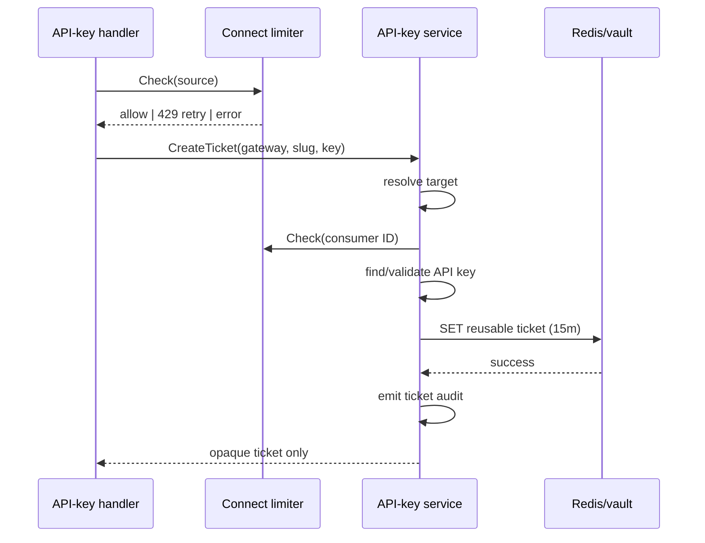

# Design: Harden API-key connect security and observability

## Technical Approach

Keep target-first authorization and the existing Fiber/DI boundaries. Add one dedicated `ConnectAttemptLimiter` port consumed by the form handler for source checks and by `APIKeyConnectService` for consumer checks; its Redis adapter owns HMAC keys and fixed-window counters. Carry additive ticket identity into the existing connect lifecycle, emit typed identifier-only audits after persistence, reuse path-scope knowledge for challenge policy, and leave ticket/state persistence timing unchanged.

## Architecture Decisions

| Decision | Rejected alternative | Rationale |
|---|---|---|
| Dedicated default-on limiter | Commercial limiter; local buckets | Separates abuse control, works across replicas, fails closed. |
| Redis fixed window | Token bucket | Reuses atomic `INCR`/first-hit `PEXPIRE`; boundary burst is accepted. |
| Peer IP plus trusted XFF | Trust all forwarding headers | Empty trust is spoof-resistant; verified proxies are explicit. |
| Typed audit emitter over injected `*slog.Logger` | Ad-hoc logs/event bus | Enforces the exact allowlist without new infrastructure. |
| Tri-state challenge local | Second lookup/path heuristics | Reuses authoritative scope and preserves unknown-path compatibility. |
| Segment/suffix metric matcher | Raw route labels | Keeps `RouteMCPOAuth` bounded and slug-free. |
| Additive ticket identity | Callback lookup/global ownership | Preserves old tickets and binds audit to authorization-time identity. |
| Provider snapshot on API-key tickets | Current-registry-only or unbounded provider arguments | Preserves post-mint disconnect compatibility without permitting cross-consumer vault deletion. |
| Atomic Redis compare-and-delete | `GET` followed by `DEL` | Ensures only the call that removes the exact credential can emit an unlink audit. |
| Preserve ticket/state invariants | Normalize both TTLs | RUN-1142 hardens around the established reusable-ticket and one-time-state contract. |

## Contracts and Flow

`ConnectAttemptLimiter.Check(ctx, scope, subject) error` uses source/consumer enum scopes; `ConnectRateLimitExceeded` carries only `RetryAfter`. Any other limiter error becomes generic `503`; expected auth misses remain the same generic `401`; unrelated failures remain `500`. The handler sets `Cache-Control: no-store`, challenge-local false, then source-limits before media parsing, Host resolution, or credential work. Consumer limiting occurs after valid target resolution and before key lookup.

Redis keys are `gt:mcp:connect:rl:v1:source:<hex-hmac>` and `...:consumer:<hex-hmac>`, with HMAC-SHA-256 inputs `source\x00<canonical-ip>` and `consumer\x00<consumer-uuid>` under the effective `SERVER_SECRET_KEY`. Lua performs `INCR`, first-hit `PEXPIRE(window-ms)`, then `PTTL`; counts `<= limit` pass. `Retry-After=max(1,ceil(PTTL/1s))`. Redis errors expose no key, scope, subject, or dependency detail.

Source resolution canonicalizes the socket peer with `net/netip`, removes ports, and unmaps IPv4-mapped IPv6. Only when that peer is inside a trusted prefix does it parse `X-Forwarded-For` right-to-left, skip trusted hops, and select the first untrusted canonical IP; absent, invalid, or all-trusted XFF falls back to peer. Other forwarding headers are ignored.

| Env | Default | Validation |
|---|---:|---|
| `MCP_CONNECT_RATE_LIMIT_ENABLED` | `true` | strict boolean |
| `MCP_CONNECT_RATE_LIMIT_SOURCE` | `10` | integer `>0` |
| `MCP_CONNECT_RATE_LIMIT_CONSUMER` | `100` | integer `>0` |
| `MCP_CONNECT_RATE_LIMIT_WINDOW` | `1m` | duration `>0` |
| `MCP_CONNECT_TRUSTED_PROXY_CIDRS` | empty | every comma-separated `netip.Prefix` valid |

Malformed values fail startup with wrapped `ErrInvalidConfig`; disabled mode binds a no-op. Enabled DI requires the effective secret after Core’s production secret resolution.

`ConnectTicket` adds optional `consumer_id`, `auth_id`, and `providers`. Any present provider snapshot or non-empty identity ID classifies the ticket as API-key-origin. That class requires a non-nil provider snapshot plus both IDs. Only complete absence of all three markers is legacy. `providers` is a presence-sensitive pointer to a sorted, deduplicated list of exact forwarded `MCPAuth.Provider` IDs; present and empty means an API-key ticket authorized for no providers. Registry names and credentials never enter the snapshot.

At resolution, partial API-key markers and identity-complete tickets without a snapshot fail with `ErrTicketNotFound`. Complete API-key tickets must still map to the exact `consumer_id`, and `auth_id` must remain an attached, enabled API-key auth for that gateway. A stale path reuse, detached auth, disabled auth, or changed auth type fails before state, provider exchange, vault access, or audit. Fully legacy tickets preserve OAuth compatibility.

Page iterates current effective registries but reuses canonical snapshot membership before constructing status or querying the vault. API-key tickets therefore expose only the intersection of current providers and their authorization-time snapshot; fully legacy tickets keep the complete current view. Start authorizes snapshot membership before state creation. Callback repeats identity and snapshot authorization from its embedded ticket before exchange and vault upsert. Both still require the provider in current effective registries. Disconnect authorizes snapshot membership and deletes/audits that canonical provider argument even if its registry changed after mint. Fully legacy tickets fall back to exact current effective-registry lookup. The Redis vault adapter performs one Lua compare-and-delete over the exact gateway, principal, and provider tuple. Protected JSON decoding maps malformed payloads to zero deletion without modifying the key. Zero deletion returns `ErrNotFound`, so concurrent disconnects produce exactly one unlink audit.

After successful ticket `SET`, vault `Upsert`, or vault `Delete`, emit INFO message `security audit` with event `mcp_connect_ticket_created`, `mcp_provider_linked`, or `mcp_provider_unlinked`; attributes are exactly `event,gateway_id,consumer_id,auth_id` plus `provider_id` for link/unlink. `provider_id` is `MCPAuth.Provider`. No event occurs on failure or incomplete tickets.

Persistence remains mechanically unchanged: tickets use `SET` with `ticketTTL=15m` and reusable `GET`; OAuth states use `connectTTL=10m` and atomic `GETDEL`. Neither constant nor command changes.

Request local `trustgate.oauth.challenge.allowed` is false for forms; path scope sets true for enabled OAuth2 or usable default IdP, false for a known API-key-only path, and leaves it absent on no match/error. Challenge middleware defaults absent to current Bearer behavior. Metrics classify `/oauth/*`, `/.well-known/*`, exact `/+/connect`, one-segment `/:slug/connect`, and segment-boundary suffix `/mcp/connect` as `RouteMCPOAuth`.

## File Changes

| Files | Action |
|---|---|
| `.env.example`; `pkg/config/config.go`; `pkg/config/config_test.go` | Modify config contract/tests. |
| `pkg/app/oauth/connect_attempt_limiter.go`; `pkg/app/oauth/connect_auditor.go`; `pkg/app/oauth/mocks/oauth_connect_attempt_limiter_mock.go`; `pkg/app/oauth/mocks/oauth_connect_auditor_mock.go` | Create ports, typed errors/events, slog adapter and generated mocks. |
| `pkg/app/oauth/api_key_connect.go`; `pkg/app/oauth/api_key_connect_test.go`; `pkg/app/oauth/connect_types.go`; `pkg/app/oauth/connect.go`; `pkg/app/oauth/connect_test.go`; `pkg/app/oauth/mocks/oauth_connect_service_mock.go` | Modify limiting, ticket identity, lifecycle audit and generated mock. |
| `pkg/infra/ratelimit/connect.go`; `pkg/infra/ratelimit/connect_test.go` | Create Redis adapter/tests. |
| `pkg/infra/repository/vault/redis_repository.go`; `pkg/infra/repository/vault/redis_repository_test.go` | Make credential deletion atomic and test concurrent exactly-once semantics. |
| `pkg/infra/oauth/connect_store_test.go` | Create regression tests around existing 15m ticket TTL, 10m state TTL, reusable `GET`, and one-time `GETDEL`; production store code is untouched. |
| `pkg/api/handler/http/oauth/api_key_connect_handler.go`; `pkg/api/handler/http/oauth/api_key_connect_handler_test.go` | Modify source policy/error mapping/leak tests. |
| `pkg/api/middleware/auth_chain.go`; `pkg/api/middleware/auth_chain_test.go`; `pkg/api/middleware/oauth_challenge.go`; `pkg/api/middleware/oauth_challenge_test.go`; `pkg/api/middleware/ops_metrics.go`; `pkg/api/middleware/ops_metrics_test.go`; `pkg/api/middleware/access_log_test.go` | Modify locals, matcher, no-leak regressions. |
| `pkg/container/modules/mcp.go`; `pkg/container/modules/api.go`; `pkg/container/modules/api_key_connect_test.go` | Modify DI. |
| `pkg/server/router/mcp_router_test.go` | Modify full-stack header/challenge/metrics coverage. |

No files are deleted.

## Testing, Rollout, and Resolved Questions

Use table-driven unit tests for thresholds, HMAC domains, proxy chains, error mappings, audit allowlists, provider snapshots across page/start/callback/disconnect, partial/stale identity, callback tampering, metric shapes, and challenge states. Page tests assert that post-mint providers expose no metadata and trigger no vault lookup, valid snapshot providers are queried, and legacy tickets retain current provider visibility. Miniredis tests assert `Retry-After`, ticket TTL `15m`, repeated ticket reads, state TTL `10m`, exactly one successful state take, malformed credential handling, and exactly one successful credential deletion under contention. Router tests assert no-store/no-referrer and sentinel-secret absence across `303/401/429/500/503`. Run `gofmt`, `goimports`, `make license-check`, `go test -race ./...`, and `golangci-lint run`.

No migration or TTL rollout is required: the existing ticket `15m`/state `10m` constants and commands remain untouched. Proxy CIDRs remain empty until infrastructure verifies immediate GKE ranges. Roll out limiter defaults, watch `429/503` and audits, then configure CIDRs. Roll back by disabling the dedicated limiter or reverting this child PR, which targets `feat/api-key-self-service-connect-endpoint@fd8782b5`, never `develop`. Fully legacy tickets remain compatible; mixed-version tickets containing identity IDs without a provider snapshot fail closed during their existing 15-minute lifetime.

Forecast: roughly 850–1,250 changed lines after removing production TTL work; 400-line-budget risk remains high. Tasks should split implementation into limiter/config, audit identity, and metrics/challenge review units; a single child PR needs `size:exception`.
