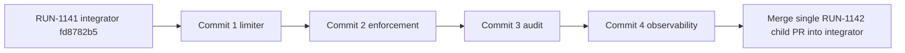

# Tasks: Harden API-key connect security and observability

## Review Workload Forecast

| Phase / commit | Lines | Work unit |
|---|---:|---|
| 1. Limiter foundation | 975 actual | Commit 1 |
| 2. Endpoint enforcement | 552 actual | Commit 2 |
| 3. Lifecycle audit | 1,122 actual | Commit 3 |
| 4. Observability regressions | 220–330 | Commit 4 |
| **Total** | **2,869–2,979 projected** | |

Delivery strategy: `exception-ok`; one child PR with approved `size:exception`.

Exception rationale: the user accepted the high review load so the coupled limiter, audit identity, middleware policy, and end-to-end security regressions ship atomically against the unmerged RUN-1141 integrator. The four phases remain independently reviewable commits.

Phase 1 actual size is 933 additions plus 42 deletions, excluding OpenSpec planning artifacts. The approved global `size:exception` remains in force; do not split the child PR.

Phase 2 final size is 508 additions plus 44 deletions, 552 changed code lines excluding planning artifacts. The approved global `size:exception` explicitly covers this work unit; do not split the child PR.

Phase 3 final size is 1,041 additions plus 81 deletions, 1,122 changed code lines excluding planning artifacts. The approved global `size:exception` explicitly covers this work unit; do not split the child PR.

Decision needed before apply: No
Chained PRs recommended: No
Chain strategy: size-exception
400-line budget risk: High

## Single-PR Dependency Order

- **Single child PR:** `fix/api-key-connect-security-observability` → `feat/api-key-self-service-connect-endpoint@fd8782b5`.
- Commit order: Phase 1 → Phase 2 → Phase 3 → Phase 4. Merge the completed child once into the RUN-1141 integrator; only that integrator later targets `develop`.

**Human gate:** Infrastructure/SRE must approve immediate GKE proxy CIDRs before a non-empty `MCP_CONNECT_TRUSTED_PROXY_CIDRS` rollout. Until approval, keep the safe empty default.

## Phase 1: Limiter Foundation — Commit 1

- [x] 1.1 Add defaults and validation in `.env.example`, `pkg/config/config.go`, `pkg/config/config_test.go`; reject non-positive limits/window and invalid CIDRs.
- [x] 1.2 Create `pkg/app/oauth/connect_attempt_limiter.go` and generated mock with bounded scope and retry metadata.
- [x] 1.3 Implement HMAC fixed windows and trusted-XFF source resolution in `pkg/infra/ratelimit/connect.go`; expose no raw identifiers and add no comments.
- [x] 1.4 Test boundaries, expiry, HMAC domains, canonical peers, proxy chains, fallback, and Redis errors in `connect_test.go`.
- [x] 1.5 Verify `go test -race ./pkg/config ./pkg/app/oauth ./pkg/infra/ratelimit`; finish Commit 1 as a reviewable work unit.

## Phase 2: Endpoint Enforcement — Commit 2

- [x] 2.1 In `api_key_connect_handler.go`, source-limit before parsing/target work; map exceeded/error to generic `429`/`503`, `Retry-After`, no-store, and challenge false.
- [x] 2.2 In `api_key_connect.go`, consumer-limit after target resolution and before key lookup; preserve uniform `401`, unrelated `500`, and target-first order.
- [x] 2.3 Wire enabled/no-op behavior through `pkg/container/modules/{mcp,api}.go`; update generated service mock.
- [x] 2.4 Test ordering, 10/11 and 100/101 boundaries, outage short-circuit, Origin absence, and sentinel-secret absence in handler/app/module tests.
- [x] 2.5 Verify focused packages with `go test -race`; finish Commit 2 without mixing audit work.

## Phase 3: Lifecycle Audit — Commit 3

- [x] 3.1 Add optional `ConsumerID`/`AuthID` in `connect_types.go`; propagate authorization-time identity through ticket creation.
- [x] 3.2 Create `connect_auditor.go` and generated mock enforcing exact events and attribute allowlists.
- [x] 3.3 Emit once after successful ticket/upsert/delete in `api_key_connect.go` and `connect.go`; remove broader grant logging; skip failures/incomplete tickets.
- [x] 3.4 Test lifecycle behavior plus `pkg/infra/oauth/connect_store_test.go`: ticket `15m` reusable `GET`, state `10m` atomic `GETDEL`; never change constants.
- [x] 3.5 Verify `go test -race ./pkg/app/oauth ./pkg/infra/oauth`; finish Commit 3 without observability changes.

## Phase 4: Observability Regressions — Commit 4

- [ ] 4.1 Fix bounded shapes in `ops_metrics.go`; test OAuth/connect inclusions, exclusions, and no raw path labels.
- [ ] 4.2 Carry tri-state eligibility from `auth_chain.go` to `oauth_challenge.go`; test OAuth/default-IdP, API-key-only, form, unknown, and errors.
- [ ] 4.3 Extend handler/access-log tests across `303/401/429/500/503`; assert sentinel absence from responses, redirects, logs, audits, keys, and metrics.
- [ ] 4.4 Extend `mcp_router_test.go` for no-store/no-referrer, middleware order, metrics, and challenges.
- [ ] 4.5 Finish with `gofmt`, `goimports`, focused race tests, `golangci-lint run`, and `go test -race ./...`; all scenarios pass before the single PR merges.
