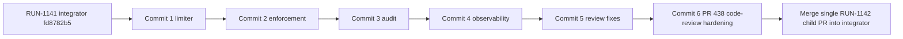

# Tasks: Harden API-key connect security and observability

## Review Workload Forecast

| Phase / commit | Lines | Work unit |
|---|---:|---|
| 1. Limiter foundation | 1,124 actual | Commit 1 |
| 2. Endpoint enforcement | 560 actual | Commit 2 |
| 3. Lifecycle audit | 1,160 actual | Commit 3 |
| 4. Observability regressions | 409 actual | Commit 4 |
| Final review fixes | 180 actual | Commit 5 |
| PR #438 additional review fixes | 615 actual | Commit 6 |
| PR #438 second review fixes | 277 actual | Commit 6 |
| PR #438 Page snapshot consistency | 88 actual | Commit 6 |
| **Cumulative diff** | **4,303 actual** | |

Delivery strategy: `exception-ok`; one child PR with approved `size:exception`.

Exception rationale: the user accepted the high review load so the coupled limiter, audit identity, middleware policy, and end-to-end security regressions ship atomically against the unmerged RUN-1141 integrator. The four phases remain independently reviewable commits.

Phase 1 actual size is 969 additions plus 155 deletions, excluding OpenSpec planning artifacts. The approved global `size:exception` remains in force; do not split the child PR.

Phase 2 final size is 510 additions plus 50 deletions, 560 changed code lines excluding planning artifacts. The approved global `size:exception` explicitly covers this work unit; do not split the child PR.

Phase 3 final size is 1,048 additions plus 112 deletions, 1,160 changed code lines excluding planning artifacts. The approved global `size:exception` explicitly covers this work unit; do not split the child PR.

Phase 4 final size is 375 additions plus 34 deletions, 409 changed code lines excluding planning artifacts. Commit 5 final-review fixes add 158 additions plus 22 deletions. The first PR #438 review batch adds 583 additions plus 32 deletions; the second adds 266 additions plus 11 deletions; Page snapshot consistency adds 85 additions plus 3 deletions. The cumulative diff from `fd8782b5` is 3,931 additions plus 372 deletions, 4,303 changed code lines excluding planning artifacts; work-unit totals are larger because later commits and review fixes revise earlier lines. The approved global `size:exception` explicitly covers the completed child PR; do not split it.

Decision needed before apply: No
Chained PRs recommended: No
Chain strategy: size-exception
400-line budget risk: High

## Single-PR Dependency Order

- **Single child PR:** `fix/api-key-connect-security-observability` → `feat/api-key-self-service-connect-endpoint@fd8782b5`.
- Commit order: Phase 1 → Phase 2 → Phase 3 → Phase 4 → final review fixes → PR #438 code-review hardening. Merge the completed child once into the RUN-1141 integrator; only that integrator later targets `develop`.

**Human gate:** Infrastructure/SRE must approve immediate GKE proxy CIDRs before a non-empty `MCP_CONNECT_TRUSTED_PROXY_CIDRS` rollout. Until approval, keep the safe empty default.

## Phase 1: Limiter Foundation — Commit 1

- [x] 1.1 Add defaults and validation in `.env.example`, `pkg/config/config.go`, `pkg/config/config_test.go`; reject non-positive limits/window and invalid CIDRs.
- [x] 1.2 Create `pkg/app/oauth/connect_attempt_limiter.go` and generated mock with bounded scope and retry metadata.
- [x] 1.3 Implement HMAC fixed windows and trusted-XFF source resolution in `pkg/infra/ratelimit/connect.go`; expose no raw identifiers and add no comments.
- [x] 1.4 Test boundaries, expiry, HMAC domains, canonical peers, proxy chains, fallback, and Redis errors in `connect_test.go`.
- [x] 1.5 Verify `go test -race ./pkg/config ./pkg/app/oauth ./pkg/infra/ratelimit`; finish Commit 1 as a reviewable work unit.

## Phase 2: Endpoint Enforcement — Commit 2

- [x] 2.1 In `api_key_connect_handler.go`, source-limit before parsing/target work; map exceeded/error to generic `429`/`503`, `Retry-After`, no-store, and challenge false.
- [x] 2.2 In `api_key_connect.go`, consumer-limit after target resolution and before key lookup; preserve uniform `401`, unrelated `500`, and target-first order.
- [x] 2.3 Wire enabled/no-op behavior through `pkg/container/modules/{mcp,api}.go`; update generated service mock.
- [x] 2.4 Test ordering, 10/11 and 100/101 boundaries, outage short-circuit, Origin absence, and sentinel-secret absence in handler/app/module tests.
- [x] 2.5 Verify focused packages with `go test -race`; finish Commit 2 without mixing audit work.

## Phase 3: Lifecycle Audit — Commit 3

- [x] 3.1 Add optional `ConsumerID`/`AuthID` in `connect_types.go`; propagate authorization-time identity through ticket creation.
- [x] 3.2 Create `connect_auditor.go` and generated mock enforcing exact events and attribute allowlists.
- [x] 3.3 Emit once after successful ticket/upsert/delete in `api_key_connect.go` and `connect.go`; remove broader grant logging; skip failures/incomplete tickets.
- [x] 3.4 Test lifecycle behavior plus `pkg/infra/oauth/connect_store_test.go`: ticket `15m` reusable `GET`, state `10m` atomic `GETDEL`; never change constants.
- [x] 3.5 Verify `go test -race ./pkg/app/oauth ./pkg/infra/oauth`; finish Commit 3 without observability changes.

## Phase 4: Observability Regressions — Commit 4

- [x] 4.1 Fix bounded shapes in `ops_metrics.go`; test OAuth/connect inclusions, exclusions, and no raw path labels.
- [x] 4.2 Carry tri-state eligibility from `auth_chain.go` to `oauth_challenge.go`; test OAuth/default-IdP, API-key-only, form, unknown, and errors.
- [x] 4.3 Extend handler/access-log tests across `303/401/429/500/503`; assert sentinel absence from responses, redirects, logs, audits, keys, and metrics.
- [x] 4.4 Extend `mcp_router_test.go` for no-store/no-referrer, middleware order, metrics, and challenges.
- [x] 4.5 Finish with `gofmt`, `goimports`, focused race tests, `golangci-lint run`, and `go test -race ./...`; all scenarios pass before the single PR merges.

## Final Review Fixes — Commit 5

- [x] 5.1 Restore provider-argument disconnect compatibility and audit the provider deleted after successful persistence.
- [x] 5.2 Bound trusted XFF to 2,048 bytes and 16 hops; reject all-address trusted proxy CIDRs.
- [x] 5.3 Preserve default-IdP exclusivity for any configured OAuth2 auth while carrying accurate challenge eligibility.
- [x] 5.4 Align router middleware composition, strengthen redirect-log secrecy, and remove exploration trailing whitespace.
- [x] 5.5 Run focused and full race tests, `go vet`, `golangci-lint`, and `git diff --check`; record accepted and rejected review triage.

## PR #438 Additional Review Fixes — Commit 6

- [x] 6.1 Snapshot stable, deduplicated forwarded provider IDs in API-key tickets and authorize disconnect by snapshot with a current-registry fallback for legacy tickets.
- [x] 6.2 Reject stale identity-complete API-key tickets when the consumer changed or the API-key auth is no longer attached and applicable.
- [x] 6.3 Make Redis vault deletion atomic and return `ErrNotFound` to losing concurrent disconnects; prove exactly one unlink audit.
- [x] 6.4 Add required Apache headers and update normative provider-snapshot, identity-freshness, and atomic-delete artifacts.
- [x] 6.5 Run `make license-check`, focused and full race tests, `go vet`, `golangci-lint`, and `git diff --check`.

## PR #438 Second Review Fixes — Commit 6

- [x] 7.1 Fail closed for any partial API-key ticket marker and require provider snapshot plus ConsumerID/AuthID revalidation.
- [x] 7.2 Authorize snapshot membership in `Start` before state creation and in `Callback` before exchange/upsert; retain fully legacy current-registry fallback.
- [x] 7.3 Cover provider additions after mint, callback state/ticket tampering, valid snapshots, and disabled stale auth.
- [x] 7.4 Protect Redis credential JSON decoding and return `ErrNotFound` without delete/audit for malformed payloads.
- [x] 7.5 Run formatting, license, focused/full race, vet, lint, and diff verification.

## PR #438 Page Snapshot Consistency — Commit 6

- [x] 8.1 Restrict API-key `Page` provider visibility and vault lookup to current providers included in the ticket snapshot by reusing canonical provider authorization.
- [x] 8.2 Preserve fully legacy `Page` behavior over current effective registries without changing Start, Callback, Disconnect, or audits.
- [x] 8.3 Test post-mint provider omission/no lookup, valid snapshot lookup, and legacy current-provider visibility.
- [x] 8.4 Run focused/full race, vet, lint, license, and diff verification; update final artifacts.
