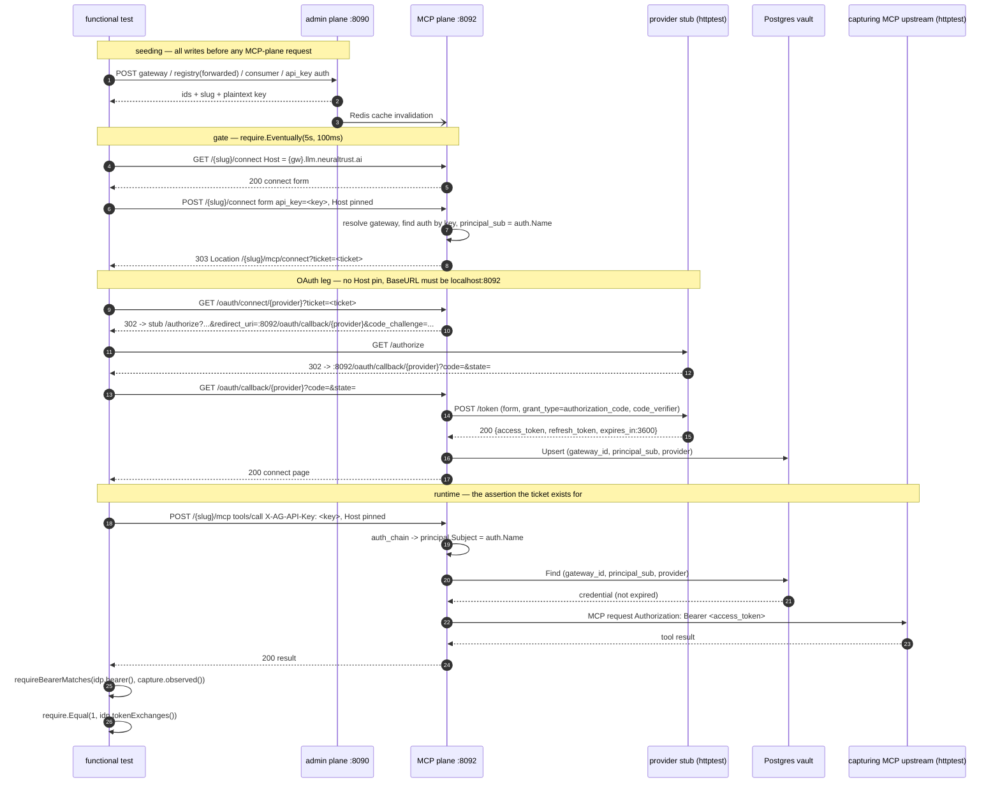

# Design: API-key forwarded authorization coverage (RUN-1139)

Implementation contract for the functional coverage described in `proposal.md`
and specified in `specs/mcp-api-key-forwarded-verification/spec.md`. The
exploration (`exploration.md`) is the factual map of the harness; this document
does not repeat it, it decides against it.

Everything below is verified against the worktree at
`/Users/edu/Neuraltrust/TrustGate-api-key-forwarded-coverage`
(branch `test/api-key-forwarded-coverage`, base `feat/api-key-self-service-connect-endpoint`).

---

## 1. Technical approach

Two top-level tests in one new file, `tests/functional/mcp_api_key_connect_test.go`
(build tag `functional`, package `functional_test`, **no comments**). All
test-support code is local to that file; no existing functional file is edited.

| Test | Scenarios | Shape |
|---|---|---|
| `TestMCPAPIKeyConnect_ForwardedFlowEndToEnd` | 1–6 | Ordered `t.Run` subtests over one fixture |
| `TestMCPAPIKeyConnect_SharedKeyReusesGrantAndIsolatesPrincipals` | 7–9 | Linear assertions over one fixture with two consumers |

The proof obligation is **behavioral**: the upstream MCP server must receive an
`Authorization` header equal to the bearer the fake provider minted, on a
`tools/call` authenticated only with `X-AG-API-Key`. That single assertion
closes the gap the ticket exists for — connect-time principal
(`api_key_connect.go` → `auth.Name`) and runtime principal
(`pkg/api/middleware/auth_chain.go:301` → `a.Name`) are derived independently,
and nothing today proves they agree.

### 1.1 Architectural decisions

**D1 — Local test-support, not promoted helpers.**
The provider stub, the capturing upstream, the form-POST helper and the
forwarded registry payload live in the new file, not in `mcp_e2e_test.go`.
Rationale: the diff stays in one reviewable place and the shared files stay
stable for the epic's other branches. Promote later if a second test needs them.
*Rejected:* editing `mcp_e2e_test.go` — spreads a test-only change across a file
every MCP test depends on, for zero benefit while there is exactly one consumer.

**D2 — Behavioral persistence proof, no `vault_credentials` access.**
The tool-call assertion proves persistence, key derivation and principal
identity in one step. *Rejected:* a pgx helper against `trustgate_functional`.
Only `setup_test.go` uses pgx today (and only against the `postgres` database);
adding a second database client to assert a row the behavior already implies is
redundant surface. Settled in the proposal; recorded here for the reviewer.

**D3 — Explicit hop-by-hop redirect driving with `noRedirectClient()`.**
The OAuth leg is three separate requests, each asserting its own `Location`,
rather than one request through a redirect-following client. Rationale: the
gateway resolves `/{slug}/connect` from the `Host` header while
`/oauth/connect/*` and `/oauth/callback/*` must be addressed on plain
`localhost:8092` (see §5.1) — a following client cannot express that Host
change, and a failure at hop 2 would be indistinguishable from a failure at
hop 3.
*Rejected:* `http.DefaultClient` with a cookie-less redirect chain.

**D4 — Fresh gateway per test.**
The vault key is `(gateway_id, principal_sub, provider)`. A distinct gateway per
top-level test makes cross-test grant bleed structurally impossible, not merely
unlikely, and costs one admin call.

**D5 — Disable the connect limiter via `.env.functional.example`.**
`MCP_CONNECT_RATE_LIMIT_ENABLED=false`, following the existing
`RATE_LIMIT_ENABLED=false` precedent. Config is read once at process boot in
`TestMain`, so this cannot be done from Go. CI copies the example file verbatim,
so one line fixes local and CI together. The tests additionally **assert the
booted value** (§9) so a future re-enable fails loudly instead of producing
order-dependent `429`s.
*Rejected:* raising `MCP_CONNECT_RATE_LIMIT_SOURCE` — leaves a live limiter in
the suite's shared `127.0.0.1` bucket, which is the failure mode we are removing.

**D6 — No `require.*` inside HTTP stub handlers.**
`httptest` handlers run on their own goroutines; `t.FailNow` off the test
goroutine is undefined behavior. Stub handlers **record and respond**; every
assertion happens on the test goroutine against recorded state.

---

## 2. Fixture layout

### 2.1 `TestMCPAPIKeyConnect_ForwardedFlowEndToEnd`

Seeded in this exact order, all through the admin API on `AdminURL`:

| # | Object | Builder | Notes |
|---|---|---|---|
| 1 | Provider stub | `newOAuthProviderStub(t)` | `httptest.Server`, closed by `t.Cleanup` |
| 2 | Capturing upstream | `startCapturingMCPUpstream(t, func(s *sdk.Server) { addTool(s, "echo") })` | returns `(*httptest.Server, *upstreamCapture)` |
| 3 | Gateway | `CreateGateway(t, map[string]any{"slug": uniqueName("mcp-gw")})` | registers `gatewayHosts[id]` |
| 4 | Registry | `CreateRegistry(t, gatewayID, mcpForwardedRegistryPayload(uniqueName("mcp-reg"), upstream.URL, provider, idp))` | `mode: forwarded`, `registration: manual` |
| 5 | Consumer | `CreateConsumer(t, gatewayID, {"name": uniqueName("mcp-consumer"), "type": "mcp", "registries": [{"id": registryID}]})` | records `consumerSlugs[id]` |
| 6 | API key | `CreateAPIKeyAuth(t, gatewayID, uniqueName("mcp-key"))` → `(authID, key)` | `auth.Name` becomes `principal_sub` |
| 7 | Attach | `AttachAuth(t, gatewayID, consumerID, authID)` | last admin write |

`provider := uniqueName("prov")` — a plain, URL-safe, slash-free id (settled
decision 4). `slug := ConsumerSlug(t, consumerID)`.

### 2.2 `TestMCPAPIKeyConnect_SharedKeyReusesGrantAndIsolatesPrincipals`

Same objects, plus a second consumer bound to the **same** registry with its
**own** API-key auth:

| # | Object | Notes |
|---|---|---|
| 8 | Consumer B | `type: mcp`, bound to the same `registryID` |
| 9 | API key B | `CreateAPIKeyAuth(t, gatewayID, uniqueName("mcp-key-b"))` → different `auth.Name` → different `principal_sub` |
| 10 | Attach B | `AttachAuth(t, gatewayID, consumerB, authB)` |

Sharing the registry is deliberate: consumer B sees the *same provider id* on the
*same gateway*, so the only thing separating the two grants is `principal_sub`.
That is exactly the isolation claim under test. Both consumers are seeded before
any MCP-plane request, so a single propagation gate per consumer suffices (§6).

### 2.3 Isolation from the rest of the suite

There is no per-test cleanup in this harness; tests coexist in one database.
Isolation rests on four independent mechanisms, in decreasing strength:

1. **Distinct gateway per test** — the vault key's first component differs, so no
   grant written by one test is findable by the other (D4).
2. **`uniqueName()` on every name** — gateway slug, registry, consumer, auth,
   provider id. Auth names are the `principal_sub`, so unique names mean unique
   vault rows.
3. **Per-test stub and upstream** — each `httptest.Server` gets its own port and
   its own minted token; no package-level mutable state is introduced.
4. **Server-generated consumer slugs** — recorded per consumer id in
   `consumerSlugs`, never guessed.

No `t.Parallel()`. The package runs sequentially today and the shared database
depends on that.

---

## 3. The fake OAuth provider stub

### 3.1 Interface

```go
type oauthProviderStub struct {
	server        *httptest.Server
	mu            sync.Mutex
	codes         map[string]string
	accessToken   string
	refreshToken  string
	tokenCalls    int
	lastAuthorize url.Values
}

func newOAuthProviderStub(t *testing.T) *oauthProviderStub
func (s *oauthProviderStub) authorizeURL() string
func (s *oauthProviderStub) tokenURL() string
func (s *oauthProviderStub) host(t *testing.T) string
func (s *oauthProviderStub) bearer() string
func (s *oauthProviderStub) tokenExchanges() int
func (s *oauthProviderStub) authorizeParams() url.Values
```

`newOAuthProviderStub` mints `accessToken = "access-" + uniqueName("t")` and
`refreshToken = "refresh-" + uniqueName("r")` once, starts `httptest.NewServer`
over a `http.NewServeMux` with two routes, and registers `t.Cleanup(s.server.Close)`
— the same lifecycle as the existing `newOAuthIDPStub`.

`bearer()` returns `"Bearer " + s.accessToken`, mutex-guarded, so the test never
has to concatenate a secret at the call site.

### 3.2 `GET /authorize`

The gateway sends what `pkg/infra/oauth/provider_client.go:AuthorizeURL` builds:
`response_type=code`, `client_id`, `redirect_uri`, `state`, `scope` (when
`cfg.Scopes` is non-empty), `code_challenge`, `code_challenge_method=S256`, and
`resource` only when `cfg.Resource` is set (we do not set it).

Handler contract:

1. Record `r.URL.Query()` into `lastAuthorize` under the mutex.
2. If `state` or `redirect_uri` is empty → `400`. (Respond, never `require` — D6.)
3. Mint `code := "code-" + uniqueName("c")`; store `codes[code] = state`.
4. Parse `redirect_uri`, set `code` and `state` on its query, and
   `http.Redirect(w, r, u.String(), http.StatusFound)`.

`authorizeParams()` lets the test assert on the test goroutine that
`code_challenge_method == "S256"` and `code_challenge != ""` — the only proof in
the suite that PKCE actually crosses the wire.

### 3.3 `POST /token`

Reached by `providerClient.tokenCall` with
`Content-Type: application/x-www-form-urlencoded` and `Accept: application/json`.

Handler contract:

1. `r.ParseForm()`; on error → `400 {"error":"invalid_request"}`.
2. `grant_type == "authorization_code"`: the `code` must exist in `codes`;
   delete it (single use). Unknown code → `400 {"error":"invalid_grant"}`.
3. `grant_type == "refresh_token"`: accept any non-empty `refresh_token`
   (free once `/token` exists; not exercised by these scenarios, and a call
   arriving here is caught by the `tokenExchanges()` assertion).
4. Any other grant → `400 {"error":"unsupported_grant_type"}`.
5. Increment `tokenCalls` and respond `200` with **exactly**:

```json
{
  "access_token": "<accessToken>",
  "refresh_token": "<refreshToken>",
  "token_type": "Bearer",
  "expires_in": 3600,
  "scope": "mcp.read"
}
```

`expires_in: 3600` **and** a refresh token are both mandatory. `tokenCall`
derives `ExpiresAt` from `expires_in` first and from `defaultProviderTokenTTL`
when only a refresh token is present; with neither, `ExpiresAt` is the zero
value, `Credential.Expired(60s)` is true, and the runtime takes the refresh path
instead of injecting — scenario 6 would fail for a reason that looks nothing
like its cause.

### 3.4 Registry wiring

```go
func mcpForwardedRegistryPayload(name, upstreamURL, provider string, idp *oauthProviderStub) map[string]any
```

Returns:

```go
map[string]any{
	"name":   name,
	"type":   "mcp",
	"weight": 1,
	"mcp_target": map[string]any{
		"url": upstreamURL,
		"auth": map[string]any{
			"mode":          "forwarded",
			"registration":  "manual",
			"provider":      provider,
			"client_id":     "client-" + provider,
			"authorize_url": idp.authorizeURL(),
			"token_url":     idp.tokenURL(),
			"scopes":        []string{"mcp.read"},
		},
	},
}
```

Field names verified against `MCPAuthRequest` in
`pkg/api/handler/http/registry/request/create_registry_request.go:45-65` and its
`ToDomain()` mapping at lines 187-205. `MCPAuth.Validate()`
(`pkg/domain/registry/mcp_target.go:171-193`) requires, for
`registration: manual`, non-empty `provider`, `client_id`, `authorize_url` and
`token_url`, with the two URLs passing `isHTTPURL` — `httptest` URLs do.

**No `client_secret`.** It is optional for `manual`, it would drag the
`secret.Resolve` masking path into an update we do not perform, and omitting it
keeps a secret out of the payload entirely. `registration: auto` is forbidden:
it triggers dynamic client registration and metadata discovery against a stub
that serves neither.

---

## 4. The upstream `Authorization` capture

### 4.1 Interface

```go
type upstreamCapture struct {
	mu     sync.Mutex
	last   string
	seen   int
}

func (c *upstreamCapture) record(v string)
func (c *upstreamCapture) observed() (string, int)
func (c *upstreamCapture) reset()

func startCapturingMCPUpstream(t *testing.T, configure func(*sdk.Server)) (*httptest.Server, *upstreamCapture)
```

`startCapturingMCPUpstream` mirrors `startMCPUpstream` exactly, wrapping the SDK
handler:

```go
handler := sdk.NewStreamableHTTPHandler(func(*http.Request) *sdk.Server { return server }, nil)
capture := &upstreamCapture{}
srv := httptest.NewServer(http.HandlerFunc(func(w http.ResponseWriter, r *http.Request) {
	capture.record(r.Header.Get("Authorization"))
	handler.ServeHTTP(w, r)
}))
t.Cleanup(srv.Close)
```

### 4.2 Concurrency

CI runs `-race`. The composer dials upstreams concurrently
(`pkg/app/mcp/composer.go` fans out over registries) and the streamable-HTTP
transport may issue several requests per JSON-RPC call, so `record` is entered
from multiple goroutines. Every field access — write in `record`, read in
`observed`, clear in `reset` — is taken under the same `sync.Mutex`. `sync.Map`
and `atomic.Value` are both rejected: the counter and the value must move
together to keep `observed()` a consistent snapshot.

`reset()` exists so the shared-key test can prove the *second* client's call
independently reached the upstream with the same bearer, rather than reading a
value the first call left behind.

### 4.3 Assertion

```go
func requireBearerMatches(t *testing.T, want, got string)
```

```go
t.Helper()
require.True(t, strings.HasPrefix(got, "Bearer "),
	"upstream authorization must be a bearer token (len=%d)", len(got))
require.True(t, got == want,
	"upstream bearer must equal the token minted by the provider stub (want len=%d, got len=%d)", len(want), len(got))
```

`require.Equal` is deliberately **not** used: it renders both operands on
failure, which would print the access token. Prefix and length are enough to
separate the three failure modes that matter — header absent, header present but
not a bearer, bearer present but not the minted one — and disclose nothing.

---

## 5. Connect flow mechanics

### 5.1 Host pinning, and where it must stop

| Request | `Host` | Why |
|---|---|---|
| `GET /{slug}/connect` | gateway host from `gatewayHosts` | `APIKeyConnectHandler.Get` calls `h.gateways.Resolve(c)`, which parses the gateway slug from the host |
| `POST /{slug}/connect` | gateway host | same resolver, before the body is parsed |
| `GET /oauth/connect/{provider}` | **none — plain `localhost:8092`** | `ConnectHandler.Start` passes `c.BaseURL()` as the OAuth callback base. A pinned `{slug}.llm.neuraltrust.ai` would produce a `redirect_uri` the test client cannot resolve |
| `GET /oauth/callback/{provider}` | **none — plain `localhost:8092`** | `Callback` recomputes `connectCallbackURL(c.BaseURL(), provider)` for the token exchange; it must match the value sent to `/authorize` |

This is the single most easily-got-wrong mechanic in the change. Neither connect
route resolves a gateway — both read everything from the ticket, which carries
`GatewayID` — so dropping the Host pin is safe and required. Both routes are
registered **before** `installMiddlewares(app, r.authTransport)` in
`mcp_router.go:97-102`, so the OAuth leg is unauthenticated: no API key on those
hops.

### 5.2 Form-encoded POST

`mcpRequestWithHost` marshals JSON only, and `Post` returns `415` for anything
that is not `application/x-www-form-urlencoded` (`isFormURLEncoded`). New helper:

```go
func mcpConnectFormPost(t *testing.T, path, host string, form url.Values) *http.Response
```

Builds `MCPURL + path` with body `form.Encode()`,
`Content-Type: application/x-www-form-urlencoded`, `req.Host = host`, and issues
it through `noRedirectClient()` so the `303` is observed rather than followed.

### 5.3 Ticket extraction

```go
func connectTicketFrom(t *testing.T, resp *http.Response, slug string) string
```

```go
t.Helper()
defer func() { _ = resp.Body.Close() }()
require.Equal(t, http.StatusSeeOther, resp.StatusCode)
loc, err := resp.Location()
require.NoError(t, err)
require.Equal(t, "/"+slug+"/mcp/connect", loc.Path)
ticket := loc.Query().Get("ticket")
require.NotEmpty(t, ticket)
return ticket
```

The body is **closed without being read**. `resp.Location()` resolves the
relative `Location` against the request URL (`http://localhost:8092/{slug}/connect`),
so `loc.Path` and `loc.Query()` both work despite the pinned `Host`. `ticket` is
never passed as a `msgAndArgs` argument and never logged.

### 5.4 Driving the OAuth leg

```go
func driveProviderConsent(t *testing.T, idp *oauthProviderStub, provider, ticket string)
```

Three hops, each with `noRedirectClient()` and no pinned `Host`:

1. `GET {MCPURL}/oauth/connect/{provider}?ticket={ticket}`
   → `302`; `Location.Host == idp.host(t)`;
   `Location.Query().Get("redirect_uri") == MCPURL + "/oauth/callback/" + provider`.
   That last equality is what proves the callback base URL is reachable, and it
   fails loudly if someone reintroduces a Host pin.
2. `GET <Location from hop 1>` (the stub's `/authorize`)
   → `302`; `Location.Host` is the MCP plane; `Location.Path == "/oauth/callback/"+provider`;
   `code` and `state` are non-empty (asserted with `require.NotEmpty`, no values printed).
3. `GET <Location from hop 2>`
   → `200`. The body is closed without being read: `renderConnectPage`
   (`pkg/api/handler/http/oauth/pages.go:129-134`) embeds the ticket in the
   rendered `href`/`action` attributes, so reading it into a variable that any
   assertion could render is a disclosure risk for no benefit. Success is proven
   by the tool call that follows, not by scraping HTML.

### 5.5 Requests whose URL carries a secret

Hops 1 and 3 have a ticket or an authorization code in the request URL. If
`client.Do` fails, `*url.Error` renders the full URL, and `require.NoError(t, err)`
would print it. Small guard used for exactly those requests:

```go
func doRedacted(t *testing.T, req *http.Request, stage string) *http.Response
```

```go
t.Helper()
resp, err := noRedirectClient().Do(req)
if err != nil {
	t.Fatalf("%s request failed", stage)
}
return resp
```

The error value is dropped on purpose; `stage` names the hop. This is the
concrete mechanism behind the spec's "failing assertion discloses nothing" for
the one case ordinary `require` cannot satisfy.

---

## 6. Cache propagation

Admin writes reach the MCP process through a Redis invalidation event. The
existing idiom in `mcp_oauth_shared_host_test.go:232-243` is
`require.Eventually(..., 5*time.Second, 100*time.Millisecond)` around the first
MCP-plane assertion.

**Rule:** gate the **first MCP-plane request that depends on a given consumer's
admin state**, once per consumer, after *all* admin writes for that consumer are
done. Everything afterwards runs unwrapped.

| Location | Gate? | Why |
|---|---|---|
| Test 1, `GET /{slug}/connect` | **yes** | first plane hit; depends on gateway + consumer + registry + auth |
| Test 1, `POST /{slug}/connect` | no | propagation already observed; no admin write since |
| Test 1, OAuth hops 1–3 | no | driven from the ticket, not from cached admin state |
| Test 1, `tools/call` | no | same consumer, same cache generation |
| Test 2, first request for consumer A | **yes** | first plane hit for A |
| Test 2, first request for consumer B | **yes** | B is a different consumer with its own cache entry |
| Test 2, everything after each gate | no | — |

The gating predicate must be **idempotent and side-effect free**, because
`Eventually` may run it several times. `GET /{slug}/connect` returning `200`
qualifies. A `POST /{slug}/connect` does **not** — it mints a ticket and consumes
a limiter slot per attempt — so it is never used as a gate.

Two gates in test 2 rather than one is deliberate: the two consumers are
invalidated independently, and each gate costs one HTTP request in the common
case where propagation has already landed.

---

## 7. Data flow



---

## 8. Interface signatures — complete list of new symbols

```go
type oauthProviderStub struct{ /* §3.1 */ }
func newOAuthProviderStub(t *testing.T) *oauthProviderStub
func (s *oauthProviderStub) authorizeURL() string
func (s *oauthProviderStub) tokenURL() string
func (s *oauthProviderStub) host(t *testing.T) string
func (s *oauthProviderStub) bearer() string
func (s *oauthProviderStub) tokenExchanges() int
func (s *oauthProviderStub) authorizeParams() url.Values

type upstreamCapture struct{ /* §4.1 */ }
func (c *upstreamCapture) record(v string)
func (c *upstreamCapture) observed() (string, int)
func (c *upstreamCapture) reset()
func startCapturingMCPUpstream(t *testing.T, configure func(*sdk.Server)) (*httptest.Server, *upstreamCapture)

func mcpForwardedRegistryPayload(name, upstreamURL, provider string, idp *oauthProviderStub) map[string]any

func mcpConnectFormPost(t *testing.T, path, host string, form url.Values) *http.Response
func doRedacted(t *testing.T, req *http.Request, stage string) *http.Response
func connectTicketFrom(t *testing.T, resp *http.Response, slug string) string
func driveProviderConsent(t *testing.T, idp *oauthProviderStub, provider, ticket string)

func requireBearerMatches(t *testing.T, want, got string)
func requireConsentRequired(t *testing.T, status int, body map[string]any)

func TestMCPAPIKeyConnect_ForwardedFlowEndToEnd(t *testing.T)
func TestMCPAPIKeyConnect_SharedKeyReusesGrantAndIsolatesPrincipals(t *testing.T)
```

### 8.1 Subtest names (test 1)

Subtest names carry the intent that comments may not:

```
"connect page is reachable through the running MCP plane"
"api key is exchanged for a ticket"
"consent completes against the fake provider"
"stored credential is injected into the upstream call"
```

### 8.2 `requireConsentRequired`

```go
t.Helper()
require.Equal(t, http.StatusOK, status)
rpcErr, ok := body["error"].(map[string]any)
require.True(t, ok, "expected a consent-required rpc error")
require.Equal(t, float64(-32003), rpcErr["code"])
```

Written locally rather than reusing `rpcErrorCode`, which renders `rpcErr` on a
missing-code failure. The consent error's `message` and `data.connect_url`
**contain a live ticket** (`pkg/api/handler/http/mcp/mcp_handler.go:251-268`), so
no assertion may render that map. `codeConsentRequired = -32003`
(`mcp_handler.go:62`). The transport answers HTTP `200` carrying a JSON-RPC
error, which is why the status assertion is `200`, not `403`.

---

## 9. Limiter guard

`.env.functional.example`, appended after the existing `RATE_LIMIT_ENABLED` block
in the same voice:

```
# The MCP connect attempt limiter is on by default (10/min per source) and every
# functional request arrives from 127.0.0.1, so the whole suite would share one
# bucket; keep it off here. Limiter behavior is covered in pkg/infra/ratelimit.
MCP_CONNECT_RATE_LIMIT_ENABLED=false
```

Both tests begin with:

```go
require.False(t, GlobalConfig.MCPConnectRateLimit.Enabled)
```

`GlobalConfig` is set in `TestMain` from the same `.env.functional` the binaries
boot with (`setup_test.go:115`), and `MCPConnectRateLimitConfig` lives at
`pkg/config/config.go:160`. This converts a future re-enable from a
non-deterministic `429` that moves with test ordering into an immediate,
self-explaining failure on line one. It is one line per test and it is the
cheapest insurance in the change.

---

## 10. Secret hygiene — the concrete mechanism

Five secrets exist in this flow: the plaintext API key, the connect ticket, the
authorization code, the OAuth state, and the access/refresh tokens. Each has a
named containment rule.

| Secret | Rule | Enforced by |
|---|---|---|
| API key | Passed only as a form value and as `X-AG-API-Key`; never a `msgAndArgs` argument | `mcpConnectFormPost`, `apiKeyHeaders` |
| Connect ticket | Asserted with bare `require.NotEmpty`; request URLs carrying it go through `doRedacted` | `connectTicketFrom`, `doRedacted` (§5.5) |
| Code / state | Asserted with bare `require.NotEmpty`; never compared with `require.Equal` | `driveProviderConsent` |
| Access token | Compared with `require.True(got == want, …len only)` | `requireBearerMatches` (§4.3) |
| Consent `connect_url` | Never rendered; only the numeric code is asserted | `requireConsentRequired` (§8.2) |

Three further prohibitions, each with a specific trap behind it:

1. **Never `%v` a response body from this flow.** `sendRequest` already does this
   for admin calls, and the create-auth response *contains* `api_key`; the new
   code must not extend that idiom to the connect POST or to any consent
   response.
2. **Never read the connect page body.** `renderConnectPage` embeds the ticket in
   `href="/oauth/connect/{provider}?ticket={ticket}"`; a body held in a variable
   is one `require.Contains` away from disclosure. Close it, assert the status.
3. **Never use `rpcResult` on a consent response.** It renders `body` on a
   non-200, and that body carries a ticket. `rpcResult` remains correct for the
   *successful* tool call, whose result is `echo:hola`.

`LOG_LEVEL=WARN` in `.env.functional.example` stays as is; gateway stdout is
streamed into test output by `prefixWriter`, so lowering it for debugging must
never be committed.

---

## 11. Testing strategy for the tests

### 11.1 Diagnosability without disclosure

The tension is real: the strongest assertion compares two secrets, and the
strongest failure message renders them. It is resolved by asserting on
**non-disclosing observable properties** and letting subtest names carry intent.

- Every `require.True` over a secret comparison carries a message naming the
  *guarantee* and, where useful, `len()` of each side. A wrong-token failure and
  an absent-header failure are then distinguishable without either value.
- `idp.tokenExchanges()` turns "the bearer is right for the wrong reason" into a
  distinct failure: `1` proves the credential came from the vault, `2` proves a
  silent refresh or a second connect happened.
- `capture.observed()` returns `(value, count)`. A count of `0` means the request
  never reached the upstream — a routing or consent failure, not a credential
  failure — and says so without touching the value.
- `authorizeParams()` isolates "PKCE was not sent" from "the token exchange
  failed", which otherwise both surface as a `500` on the callback.
- Subtest names in test 1 are the failure report: the CI line that fails names
  the scenario.

### 11.2 Runtime budget

`make test-functional` runs `-timeout=120s` for the whole package with no
`-race`; CI runs `-race` with Go's 10m default. The 120s local ceiling is the
binding constraint, and the harness spends ~10-20s on build plus three
health-polled boots before the first test.

Cost control:

- **Two top-level tests, not ten.** Ten would mean ten gateway/consumer/registry
  seedings and ten propagation waits.
- **One gateway per test**, reused by every subtest.
- **`httptest` servers are effectively free** — in-process, no boot wait.
- **Propagation gates are the only waits**, three in total (§6), each typically
  satisfied on the first 100 ms iteration.
- **No sleeps anywhere.** Any wait is a `require.Eventually` with a predicate.

Expected added wall time: well under 5 s for both tests. If the local timeout is
ever hit, the cause will be the harness boot, not these tests.

### 11.3 Race safety

CI's `-race` sees two shared structures: `upstreamCapture` and
`oauthProviderStub`. Both are mutex-guarded on every field (§3.1, §4.2). No
goroutine is started by the test code itself, so there is nothing to leak;
`httptest.Server.Close` via `t.Cleanup` joins the server goroutines.

### 11.4 Local verification order

```bash
go vet -tags functional ./tests/functional/...
golangci-lint run --build-tags functional ./tests/functional/...
cp .env.functional.example .env.functional
make test-functional
go test -tags functional -race -count=1 -p 1 -run 'TestMCPAPIKeyConnect' ./tests/functional/...
```

The full-suite `-race` run is the one that mirrors CI. Confirm the whole package
still passes, not only the new tests — `TestMCPOAuth_SharedHostScopesChallengeAndResolvesConsumerIdP`
and `TestMCPServer_RoleBasedConsumer*` passing unmodified *is* scenario 10.

---

## 12. File-change table

| File | Action | Lines | Contents |
|---|---|---|---|
| `tests/functional/mcp_api_key_connect_test.go` | **add** | **363** | see breakdown |
| `.env.functional.example` | modify | **3** | comment + `MCP_CONNECT_RATE_LIMIT_ENABLED=false` |
| `docs/mcp/testing-guide.md` | modify | **14** | §5 scenario rows + self-service connect note |
| | | **380** | **counted against the 400-line review budget** |
| `openspec/changes/api-key-forwarded-coverage/design.md` | add | ~430 | SDD process artifact — **excluded** (see below) |

Breakdown of the 363:

| Block | Lines |
|---|---|
| build tag, package, import block | 20 |
| `oauthProviderStub` + constructor + `/authorize` + `/token` + accessors | 80 |
| `upstreamCapture` + `startCapturingMCPUpstream` | 28 |
| `mcpForwardedRegistryPayload` | 20 |
| `mcpConnectFormPost` + `doRedacted` + `connectTicketFrom` | 30 |
| `driveProviderConsent` | 26 |
| `requireBearerMatches` + `requireConsentRequired` | 16 |
| `TestMCPAPIKeyConnect_ForwardedFlowEndToEnd` (4 subtests) | 85 |
| `TestMCPAPIKeyConnect_SharedKeyReusesGrantAndIsolatesPrincipals` | 58 |
| **Total** | **363** |

`380 / 400` — **20 lines of slack.** The forecast excludes comments because
`.agents/AGENT.md` §11.1 forbids them repo-wide and a pre-commit hook strips
them; an implementer who writes commented code first will overshoot and then
have the hook silently reclaim the difference.

**Budget scope.** The 400-line budget is counted over code and operator docs.
`openspec/changes/**` is SDD process output, reviewed as narrative rather than
line by line. If the reviewer counts it, request `size:exception` with that
rationale rather than shrinking the tests — splitting is not available here (§13).

**Levers, in the order to pull them, if the count drifts over 400:**

1. Trim `docs/mcp/testing-guide.md` to the §5 table rows only, moving the
   operator/Cursor narrative to a follow-up. **Saves 8-10.**
2. Drop `scopes` from the registry payload and the `authorizeParams()`
   PKCE-observation assertion. **Saves ~10**, at the cost of one diagnostic.
3. Collapse test 1's four subtests into a linear test body. **Saves ~8**, at the
   cost of the failure report that subtest names provide — least preferred.
4. `size:exception` label with the indivisibility rationale.

---

## 13. Rollout and rollback

**Rollout.** Single draft PR from `test/api-key-forwarded-coverage` into
`feat/api-key-self-service-connect-endpoint`, `RUN-1139` in the body. Never into
`develop` — Edu merges the epic manually after end-to-end validation. Rebase onto
the integration branch before review; the base is unmerged and moving.

**Rollback.** Fully additive and test-only: delete
`tests/functional/mcp_api_key_connect_test.go`, revert the
`.env.functional.example` line and the guide edit. No production code, no schema,
no migration, no runtime behavior is touched, so reverting cannot regress the
gateway. The `.env.functional.example` line is independently revertable if the
limiter guard should outlive the tests.

**Chained PRs are not available.** The provider stub is dead code without a test
that drives it, and the tests do not compile without the stub. The 400-line
budget is met by the forecast above, not by splitting.

**Escalation rule.** No production code change is expected. If one appears
necessary, the test has found a real defect: escalate it as a bug against
RUN-1136 rather than adapting the test to the behavior.

---

## 14. Risks the implementer must watch

| Risk | Symptom | Guard |
|---|---|---|
| Host pinned on the OAuth leg | Hop 1's `redirect_uri` points at `{slug}.llm.neuraltrust.ai`; hop 2 fails to connect | Hop 1 asserts `redirect_uri == MCPURL + "/oauth/callback/" + provider` (§5.4) |
| Stub omits `expires_in` / `refresh_token` | Tool call takes the refresh path; `tokenExchanges() == 2`; bearer may still match | `require.Equal(t, 1, idp.tokenExchanges())` after the tool call |
| `require.*` inside a stub handler | Flaky, undiagnosable failures under `-race` | D6: handlers record and respond only |
| `registration: auto` | `500` on connect start; DCR attempted against the stub | Always `manual` with explicit URLs (§3.4) |
| Consent body rendered in a failure message | Live ticket in CI logs | `requireConsentRequired`, never `rpcResult`, on consent paths (§8.2) |
| Propagation gate with a side effect | Ticket minted per `Eventually` iteration | Gate only on `GET /{slug}/connect` (§6) |
| Limiter silently re-enabled | Order-dependent `429` | `require.False(GlobalConfig.MCPConnectRateLimit.Enabled)` (§9) |
| Base branch moves | Rebase conflicts at review time | Draft PR, rebase before review |
