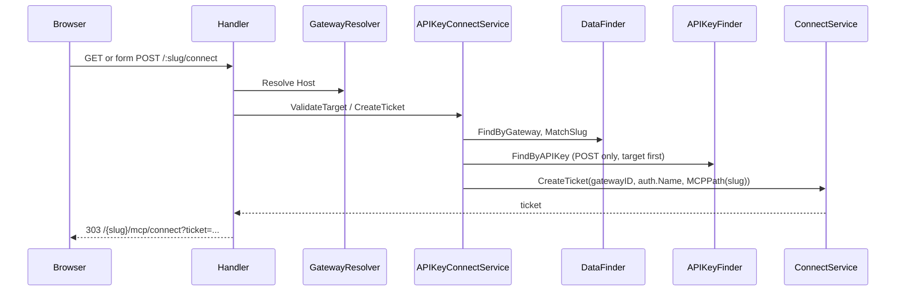

# Design: API-Key Self-Service Connect Endpoint

## Technical Approach

Add a separate browser adapter for `GET/POST /:slug/connect` and a focused OAuth app use case. The handler resolves `Host` with `SubdomainGatewayResolver(MCPBaseDomain)`, reads the route slug directly, parses only form-urlencoded input, and maps typed failures. The use case resolves the active MCP consumer before key lookup, enforces gateway/AuthID isolation, preserves `auth.Name` as `principalSub`, and delegates ticket creation to `ConnectService`.

## Architecture Decisions

| Option | Trade-off | Decision |
|---|---|---|
| New handler + `APIKeyConnectService` | More files; keeps HTTP and authorization separate | Chosen |
| Extend `ConnectHandler` | Smaller diff; mixes API-key business rules into provider consent | Rejected |
| Copy key into headers and reuse MCP middleware | Reuses runtime pipeline; violates body-only handling and increases leakage risk | Rejected |
| Refactor runtime principal resolution | Reduces future drift; expands a security-critical scope | Rejected |
| Host-only resolver using `MCPBaseDomain` | Requires local DI construction; rejects header/fallback routing | Chosen |
| No Origin/status checks | Smaller security contract | Chosen per RUN-1141; rate limiting remains RUN-1142 |

## Request, Error, and Data Flow



GET host/active-MCP-target misses return generic `404`. POST missing/invalid authorization facts return one generic `401`; malformed form is `400`, non-form media type `415`, and unexpected dependency/ticket errors `500`. All responses, including redirect and errors, are `no-store`.

## Interfaces / Contracts

```go
var ErrAPIKeyConnectUnauthorized = errors.New("oauth api-key connect: unauthorized")

type APIKeyConnectService interface {
	ValidateTarget(ctx context.Context, gatewayID ids.GatewayID, slug string) error
	CreateTicket(ctx context.Context, gatewayID ids.GatewayID, slug, rawKey string) (string, error)
}
```

`CreateTicket` repeats target resolution, then requires `Consumer.TypeMCP`, enabled `auth.TypeAPIKey`, identical gateway, and `auth.ID` in `Consumer.AuthIDs`. Expected misses wrap the sentinel; operational failures retain wrapped causes. The request DTO contains only `APIKey string 'form:"api_key"'`.

## Dependency Injection

`modules.MCP` provides `APIKeyConnectService` from the already exact-typed `APIKeyFinder`, `DataFinder`, and `ConnectService`. `modules.API` uses a factory to construct the handler with a local `NewSubdomainGatewayResolver(finder, cfg.Server.MCPBaseDomain)`; it must not register a second global `GatewayResolver`, which would collide with the `GatewayBaseDomain` provider. `server_mcp` injects the concrete handler into the router.

## File Changes

| File | Action | Purpose |
|---|---|---|
| `pkg/app/oauth/api_key_connect.go` | Create | Interface, sentinel, orchestration |
| `pkg/app/oauth/api_key_connect_test.go` | Create | Authorization matrix and call ordering |
| `pkg/app/oauth/mocks/oauth_api_key_connect_service_mock.go` | Create/generated | Handler mock |
| `pkg/api/handler/http/oauth/request/api_key_connect_request.go` | Create | One form DTO |
| `pkg/api/handler/http/oauth/api_key_connect_handler.go` | Create | Thin GET/POST adapter |
| `pkg/api/handler/http/oauth/api_key_connect_handler_test.go` | Create | Status, redirect, leakage tests |
| `pkg/api/handler/http/oauth/pages.go` | Modify | Password form and shared no-store rendering |
| `pkg/api/handler/http/oauth/pages_test.go` | Modify | Escaping, `autocomplete=off`, no value |
| `pkg/server/router/mcp_router.go` | Modify | Ordered routes before `/+/connect` |
| `pkg/server/router/mcp_router_test.go` | Create | Real Fiber precedence/regression dispatch |
| `pkg/container/modules/api.go` | Modify | Handler/resolver factory |
| `pkg/container/modules/mcp.go` | Modify | Use-case provider |
| `pkg/container/modules/server_mcp.go` | Modify | Router injection |

## Security and Testing

The key never enters headers, URLs, logs, template values, or errors. Tests cover valid flow; wrong host/slug/type/gateway/AuthID; inactive/disabled auth; malformed/media-type failures; exact `auth.Name`; exact `MCPPath`; no-store; secret absence; and OAuth2 route regression. Run generation, `gofmt/goimports`, vet, lint, focused tests, and race tests.

## Rollout, Rollback, and Budget

No migration or flag is required. Roll out with the MCP binary; rollback removes routes/providers/new files while existing OAuth2 remains intact. Review-budget risk is **High** because security matrices and dispatch tests likely exceed 400 changed lines; `sdd-tasks` owns the final forecast and should evaluate chained app/use-case and HTTP/router slices.

## Open Questions

None architecturally. The tasks phase must resolve the final PR slicing from its line forecast.
