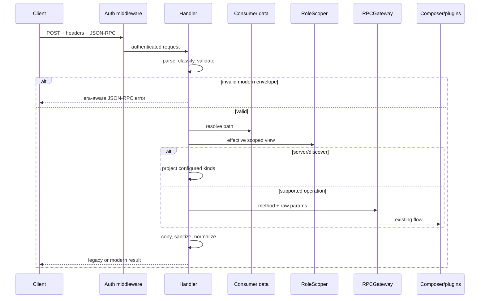

# Design: Dual-era northbound MCP protocol boundary

## Technical Approach

Keep `POST /{consumer_slug}/mcp` and the current composer contract. `Handler.Handle` becomes a transport-envelope pipeline: parse JSON-RPC, classify era, validate modern wire metadata, then resolve and role-scope the consumer. Legacy continues through its existing local methods, dispatcher, and writers. Modern `server/discover` is local; other supported methods use the unchanged `RPCGateway`, then a transport adapter adds modern-only fields. No new DI or application interface is introduced.

## Architecture Decisions

| Option | Trade-off | Decision |
|---|---|---|
| One envelope with era helpers | Central orchestration, no duplicated authorization/dispatch | Chosen |
| Separate complete handlers | Cleaner conceptual split, duplicated security plumbing | Rejected |
| Put modern types in composer | Reusable types, leaks HTTP-era concerns into app | Rejected |
| Local configured discovery | Deterministic and role-safe, not live availability | Chosen |
| Sanitize after serialization | Extra allocation, preserves cached/shared envelopes | Chosen |

Legacy precedence is fixed: `initialize`, then a known legacy header; otherwise any `2026-07-28` signal selects modern and missing counterparts fail closed. Unknown non-legacy versions return `-32022`. No modern signal remains legacy.

## Request and Data Flow

Authentication remains before parsing; parsing and modern validation precede consumer lookup, role scoping, rate limits, plugins, and composer. Modern metadata is request-local and never retained.

## Types and Contracts

- `protocolEra`, ordered supported-version slice, and `classifyEra(rpcRequest, protocolHeader)`.
- `modernMetadata` for required `_meta` protocol version and object-valued client capabilities.
- `protocolError` carrying JSON-RPC code, HTTP status, message, and optional data; helpers validate mirrored headers, required decoded name, Base64 sentinel, and absence of `Mcp-Param-*`.
- `normalizeModernResult(method, result, scopedConsumer)` builds a fresh JSON object with `resultType: "complete"` and `_meta["io.modelcontextprotocol/serverInfo"]`; non-object successful payloads become HTTP 500/`-32603`.
- Boundary errors: malformed JSON/invalid request/params and `-32020`/`-32022` use HTTP 400; modern unknown method uses HTTP 404/`-32601`; modern resource miss maps to HTTP 400/`-32602`; legacy application errors retain HTTP 200.
- Cache hints are `private`: `ttlMs=300000` for discover/list methods and `0` for `resources/read`. `Mcp-Session-Id` is ignored and never emitted.

`server/discover` returns versions newest-first, the fingerprinted server identity, and only configured role-visible `tools`, `resources`, or `prompts`: allowed kinds are `{}`, denied kinds are omitted, and upstreams are never probed. It emits a local discovery span with zero targets; pre-validation failures skip metrics and create no span.

For modern `tools/list`, marshal the gateway result, decode into a new JSON tree, recursively delete every `x-mcp-header`, then add modern fields. Never mutate `appmcp.Tool.payload`, composer results, or cached maps.

## File Changes

| File | Action | Responsibility |
|---|---|---|
| `pkg/api/handler/http/mcp/mcp_handler.go` | Modify | Reorder pipeline; era-specific local handling and writers |
| `pkg/api/handler/http/mcp/protocol_era.go` | Create | Versions and precedence classifier |
| `pkg/api/handler/http/mcp/modern_validation.go` | Create | Metadata/header/Base64 validation and protocol errors |
| `pkg/api/handler/http/mcp/modern_response.go` | Create | Copying normalizer, cache hints, schema sanitizer |
| `pkg/api/handler/http/mcp/server_discover.go` | Create | Scoped capability projection and local telemetry |
| `pkg/api/handler/http/mcp/mcp_handler_test.go` | Modify | Legacy regression, ordering, notification/session/405 integration |
| `pkg/api/handler/http/mcp/protocol_era_test.go` | Create | Table-driven precedence matrix |
| `pkg/api/handler/http/mcp/modern_validation_test.go` | Create | Header, metadata, sentinel, and no-dispatch matrix |
| `pkg/api/handler/http/mcp/modern_response_test.go` | Create | Normalization, hints, deep sanitization, immutability/race behavior |
| `pkg/api/handler/http/mcp/server_discover_test.go` | Create | Role surfaces, versions, identity, zero-target telemetry |

## Testing, Rollout, and Review Slices

Run focused `go test -race ./pkg/api/handler/http/mcp ./pkg/app/mcp`, then `go vet ./...` and `golangci-lint run`. Assertions are behavioral and table-driven; every validation failure proves zero role-scoper, limiter, plugin, and composer calls.

No migration or flag is required. Rollback reverts the boundary files together; legacy composer contracts remain untouched. Expected work exceeds 400 lines: use stacked reviews: (1) handler reorder + classifier/validator, (2) modern response/sanitization/cache semantics, (3) scoped discover/telemetry and integration matrix. Keep each slice below 400 changed lines and merge the complete chain against `origin/main`.

## Open Questions

None; the proposal closes all wire and rollout decisions.
