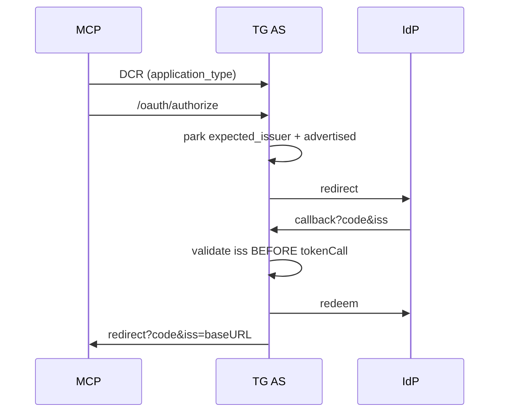

# Design: RUN-1106 OAuth harden (MCP 2026-07-28)

## Technical Approach

In-place RFC 9207 harden at existing seams (`pkg/app/oauth`, `pkg/infra/oauth`, HTTP handlers). No new package, kill-switch, or Redis key rewrite. One helper (`issuersEqual`: trim trailing `/` only). Maps to locked Approach 1 / `mcp-oauth-harden`. Spec may land in parallel.

## Architecture Decisions

| Decision | Options | Tradeoff | Choice |
|----------|---------|----------|--------|
| Placement | new `oauth/security` vs in-package helpers | Extra package vs ~one function | Unexported helpers in `pkg/app/oauth/issuer.go` |
| Missing `iss` | always-require vs advertised vs flag | Google break vs mix-up vs two behaviors | Reject mismatch always; reject missing only when AS advertised the param |
| DCR cache bind | Redis key suffix vs `RegisteredClient.Issuer` | Strands entries vs additive JSON | Keep `gateway\|registry`; stamp empty pre-1106 on next discover; mismatch → slog + re-register |
| Refresh vs mismatch | `EnsureClient` re-register vs `ErrNoRegisteredClient` | Background refresh mints unused DCR + kills vault grant | `RefreshAuth` does **not** re-register; returns `ErrNoRegisteredClient` so consent re-runs `EnsureClient` |
| `application_type` | omit vs southbound `web` + northbound infer | MCP clients are native; TG callback is HTTPS | Southbound DCR sends `web`; northbound accepts `web`\|`native`, infers from URI class, rejects inconsistent pairs |
| Audit | product events vs new bus vs slog | Scope creep | slog `oauth.issuer_mismatch` / `oauth.invalid_metadata` — never tokens/secrets/bodies |
| CIMD | runtime vs docs | Out of scope | Docs only; `/oauth/register` stays |

## Data Flow

Northbound (TG is AS + IdP client):



Southbound (TG is client):

```
Discover AS ──RFC8414 issuer check──► EnsureClient
  │ stamp empty Issuer │ mismatch → slog + DCR
  ▼
Start parks issuer+advertised on ConnectState
  ▼
Callback validate iss BEFORE ExchangeCode
```

## File Changes

| File | Action | Description |
|------|--------|-------------|
| `pkg/app/oauth/issuer.go` | Create | `issuersEqual`, `validateResponseISS`, `applicationTypeForURIs` |
| `pkg/app/oauth/issuer_test.go` | Create | Table tests: slash, mismatch, missing+advertised, URI type pairs |
| `pkg/app/oauth/ports.go` | Modify | `RegisteredClient.Issuer`; `UpstreamAuthServer.AuthorizationResponseIssParameterSupported` |
| `pkg/app/oauth/proxy_types.go` | Modify | Park issuer fields on `PendingAuthorization`; `iss` on `Callback`; optional `ApplicationType` |
| `pkg/app/oauth/proxy.go` | Modify | Park at Authorize; validate before `tokenCall`; set `iss=baseURL` on all `clientRedirect`s |
| `pkg/app/oauth/idp_transport.go` | Modify | `idpEndpoints` carries issuer+advertised; static URLs → advertised=false |
| `pkg/app/oauth/metadata.go` | Modify | Advertise iss param; validate fetched `issuer` before cache; northbound DCR type |
| `pkg/app/oauth/connect_types.go` | Modify | Park issuer fields on `ConnectState`; `iss` on `ConnectService.Callback` |
| `pkg/app/oauth/connect.go` | Modify | Park at Start; validate before `ExchangeCode` |
| `pkg/app/oauth/connect_registration.go` | Modify | `RefreshAuth`: empty stamp via `EnsureClient`; mismatch → slog + `ErrNoRegisteredClient` |
| `pkg/infra/oauth/dcr_registrar.go` | Modify | Validate AS `issuer` vs PRM AS URL; DCR `application_type=web`; bind/stamp/re-register |
| `pkg/infra/oauth/connect_store.go` | Modify | Persist additive `Issuer` (no key change) |
| `pkg/api/handler/http/oauth/callback_handler.go` | Modify | Pass `c.Query("iss")` |
| `pkg/api/handler/http/oauth/connect_handler.go` | Modify | Pass `c.Query("iss")` |
| `pkg/app/oauth/mocks/*` | Modify | `go generate` after interface change |
| `docs/mcp/oauth-harden.md` | Create | RFC 9207, bind, slog; **DCR stays; CIMD future** |
| `docs/mcp/google-workspace-oauth.md` | Modify | Manual IdPs omit `iss` |

Unchanged: vault `Credential`, Redis prefixes, `events.Event.Security`, CIMD routes.

## Interfaces / Contracts

```go
// validateResponseISS: mismatch always errors; missing errors iff advertised.
// issuersEqual: strings.TrimSuffix(a,"/") == strings.TrimSuffix(b,"/")
// applicationTypeForURIs: https→web; loopback/private-use→native; mixed URIs or web+cursor:// → invalid_client_metadata
```

Callback last arg `iss string`. Mix-up → `oauthErr("invalid_request", …)` **before** redeem. Invalid metadata → error, **do not cache**.

slog attrs: `expected_issuer`, `got_issuer`/`metadata_issuer`, `gateway_id`, `provider`/`key`. Never `client_secret`, tokens, codes, raw DCR body.

## Testing Strategy

| Layer | What | Approach |
|-------|------|----------|
| Unit | `issuersEqual`, RFC 9207 matrix, URI type inference | Table-driven `issuer_test.go` |
| Unit | AS advertises param; DCR type reject; `iss` on redirect; mix-up fails before token HTTP; Google omit-iss OK | `metadata_test.go`, `proxy_test.go`, `connect_test.go` |
| Unit | Stamp empty Issuer; mismatch re-registers; `RefreshAuth` mismatch → `ErrNoRegisteredClient`; metadata issuer fail-closed | `dcr_registrar_test.go`, `idp_transport_test.go` |
| Handler | Query `iss` forwarded; register `application_type`; existing Callback call-sites pass `iss ""` | `handlers_test.go`, `connect_handler_test.go` |
| E2E | Out of scope | Existing MCP tests unchanged |

## Migration / Rollout

No Redis migration. Additive JSON. First `EnsureClient` stamps empty `Issuer`. Reconnect only if upstream AS changed. Revert PR to roll back. Split tests/docs if PR exceeds 400 lines.

## Open Questions

- None blocking. Issuer compare is slash-only (no scheme rewrite) by design.
