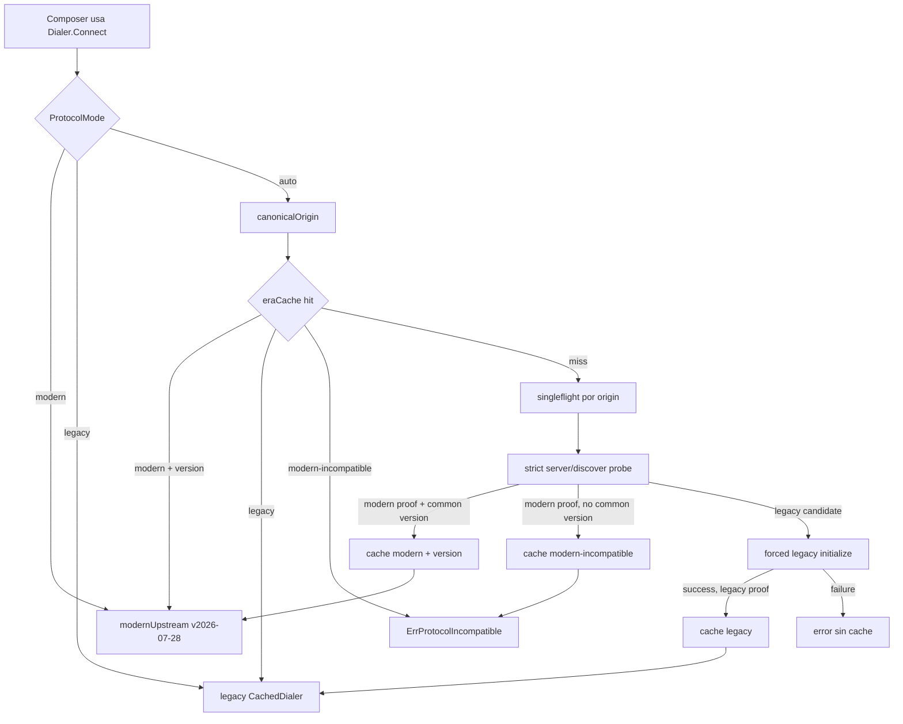
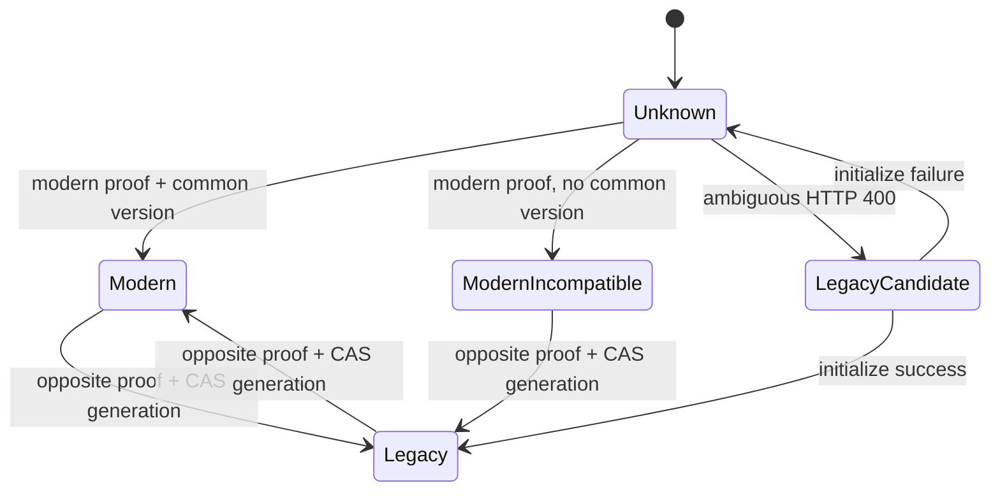
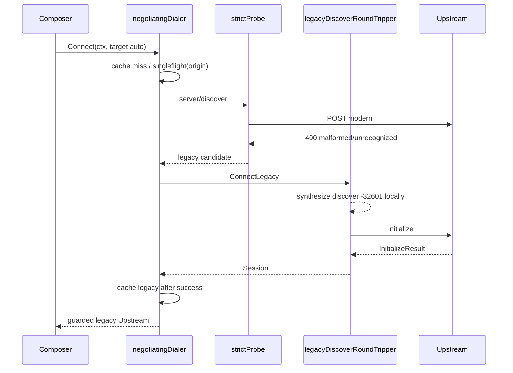
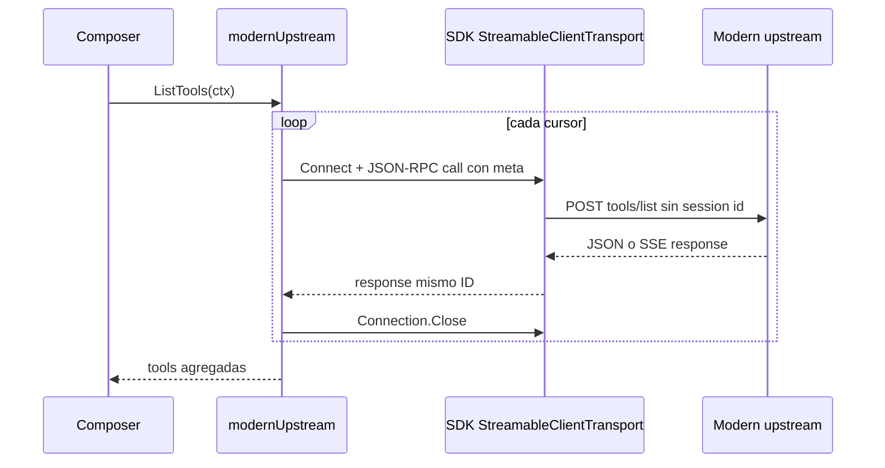

# Design: negociación de upstreams MCP modernos y legacy

## Contexto y decisión

TrustGate mantendrá los puertos `app/mcp.Dialer` y `app/mcp.Upstream` sin cambios de métodos. `Target` incorporará el modo de protocolo y la selección de era quedará dentro de `pkg/infra/mcp/client`, detrás de un nuevo `negotiatingDialer`.

La solución separa cuatro responsabilidades:

1. El dominio persiste y valida `protocol_mode`.
2. El negociador resuelve `auto|modern|legacy`, coordina la caché de era y selecciona adaptador.
3. El camino legacy conserva la conexión concreta de `StreamableClientTransport` y su caché actual, pero intercepta su HTTP para que `Client.Connect` no envíe `server/discover` al upstream.
4. `modernUpstream` ejecuta llamadas stateless sobre el `mcp.Connection` público del SDK v1.7.0.

No se modifica el protocolo northbound. RUN-1103 podrá resolver `server/discover` localmente sin acoplarse a este negociador southbound.

## Orden de entrega apilado

El orden desplegable es **Contrato → HTTP/probe → Legacy → Modern → Coordinación**. El SDK v1.7.0 solo puede aterrizar en el slice Legacy, junto con `legacyDiscoverRoundTripper`; así cada base previa conserva su wire y cada slice puede desplegarse sin depender del siguiente.

| Slice | Base lógica | Resultado autónomo |
|---|---|---|
| Contrato | `origin/main` | `protocol_mode` propagado con SDK v1.6.1 |
| HTTP/probe | Contrato | boundary HTTP seguro y probe estricto, todavía sin cambiar el wire legacy |
| Legacy | HTTP/probe | SDK v1.7.0 con discover interceptado localmente en HTTP y paridad de sesión |
| Modern | Legacy | adaptador stateless moderno, sin coordinación automática |
| Coordinación | Modern | selección `auto|modern|legacy`, caché de era, wiring y funcionales |

## Arquitectura



Los overrides son estrictos: `modern` selecciona el adaptador moderno con la versión moderna más reciente soportada por TrustGate y `legacy` selecciona el adaptador legacy. Ninguno consulta ni escribe la caché, prueba `server/discover` o hace fallback.

### Dependencias y ownership

```text
pkg/domain/registry
  MCPProtocolMode, MCPTarget normalize/validate
          |
pkg/app/mcp
  Target.ProtocolMode, Dialer y Upstream sin cambios de métodos
          |
pkg/infra/mcp/client
  negotiatingDialer
    -> eraCoordinator -> strictProbe -> shared HTTP transport
    -> CachedDialer -> ClientSession sobre StreamableClientTransport concreto
    -> modernUpstream -> SDK mcp.Connection
          |
pkg/container/modules/mcp.go
  construye identidad, transporte, adaptadores y expone app/mcp.Dialer
```

Tipos internos propuestos:

```go
type protocolEra uint8

const (
    eraModern protocolEra = iota + 1
    eraLegacy
    eraModernIncompatible
)

type eraEntry struct {
    era        protocolEra
    version    string
    generation uint64
}

type probeOutcome struct {
    kind       probeKind
    version    string
    credential string
}

type eraCoordinator struct {
    mu      sync.RWMutex
    entries map[string]eraEntry
    flight  singleflight.Group
    probe   protocolProbe
}

type protocolProbe interface {
    Probe(ctx context.Context, target appmcp.Target, origin string) (probeOutcome, error)
}

type legacyConnector interface {
    ConnectLegacy(ctx context.Context, target appmcp.Target) (appmcp.Upstream, error)
}
```

`eraEntry` no contiene TTL, secretos, headers, capacidades ni respuestas. Vive durante el proceso. `generation` permite compare-and-swap al corregir contradicciones sin que una llamada antigua elimine una decisión nueva.

## Modelo y propagación

En `pkg/domain/registry`:

```go
type MCPProtocolMode string

const (
    MCPProtocolModeAuto   MCPProtocolMode = "auto"
    MCPProtocolModeModern MCPProtocolMode = "modern"
    MCPProtocolModeLegacy MCPProtocolMode = "legacy"
)
```

`MCPTarget.ProtocolMode` usa `json:"protocol_mode,omitempty"`. `Normalize` convierte vacío en `auto`; `Validate` rechaza cualquier otro valor. El vacío sigue aceptándose al leer JSONB y snapshots antiguos. El negotiating dialer materializa siempre el modo efectivo antes de dispatch para que vacío y `auto` explícito tengan la misma identidad de sesión.

La request API usa `protocol_mode` dentro de `mcp_target`. Create permite vacío y el dominio aplica `auto`. Update conserva el modo anterior si el campo está vacío; un `"auto"` explícito sí lo sustituye. La respuesta siempre materializa el valor efectivo para evitar ambigüedad.

No hace falta migración: `mcp_target` ya se persiste como JSONB. Tampoco cambia `snapshot.proto`: cada registro se guarda en el campo JSON existente. Se añade una prueba de round-trip que demuestre `legacy|modern|auto` y que un snapshot antiguo sin campo se interpreta como `auto`. No se edita código generado.

`app/mcp.Target` incorpora `ProtocolMode registrydomain.MCPProtocolMode`. `StaticTarget` copia el valor efectivo desde `MCPTarget`. Los métodos de `Dialer` y `Upstream` permanecen estables.

El slice de contrato conserva `go-sdk v1.6.1` para no alterar el wire de `Client.Connect` antes de que exista el guard legacy. El upgrade a v1.7.0 se entrega atómicamente en Phase 3 junto con `legacyDiscoverRoundTripper`, después del probe estricto de Phase 2, de modo que `server/discover` nunca se envía desde el camino legacy actual.

## Origen canónico y HTTP

`canonicalOrigin(rawURL string) (string, error)`:

- exige URL absoluta `http` o `https`;
- rechaza `userinfo`, fragment, host vacío, puerto explícito vacío y puerto inválido;
- normaliza esquema y hostname a minúsculas;
- normaliza IPv6 con `net.ParseIP` y `net.JoinHostPort`;
- materializa puerto efectivo `80` o `443`;
- excluye path y query.

Ejemplos equivalentes:

```text
HTTPS://MCP.EXAMPLE.COM/a
https://mcp.example.com:443/b?x=1
=> https://mcp.example.com:443
```

Todo redirect se rechaza mediante `http.Client.CheckRedirect = http.ErrUseLastResponse`. Un 3xx es un error no clasificable y nunca provoca contacto con otro origen.

Se rechazan, sin distinguir mayúsculas, estos headers configurados o procedentes de auth:

```text
Host, Connection, Content-Length, Transfer-Encoding, Trailer,
Content-Type, Accept, User-Agent,
Mcp-Protocol-Version, Mcp-Session-Id, Last-Event-ID,
Mcp-Method, Mcp-Name y cualquier Mcp-Param-*
```

`Authorization` y headers de tenant no reservados siguen permitidos. La validación se repite sobre `Target.Headers` en infra para cubrir todas las fuentes de credenciales. Dos claves que colapsan al mismo nombre canónico, como `Authorization` y `authorization`, se rechazan de forma determinista antes de I/O.

El boundary autoritativo para endpoint y headers reservados es la construcción de conexión/probe en `pkg/infra/mcp/client`, antes de cualquier I/O. No se duplica esta política de transporte en dominio/API: hacerlo crearía dos listas de headers con riesgo de deriva. Tanto `Client.Connect` legacy como el probe validan endpoint y headers antes de contactar la red; los tests fijan ese comportamiento observable.

Como riesgo aceptado, no se impone HTTPS ni una denylist de direcciones privadas: TrustGate debe alcanzar upstreams internos/on-prem y HTTP local. La persistencia puede aceptar una configuración que después falle al conectar; el control de endpoint sigue siendo fail-closed en infraestructura antes de red para sintaxis, userinfo, fragment, authority y puertos inválidos.

Un único `*http.Transport` de proceso conserva pools y keep-alive. Cada target crea un `http.Client` ligero con un `RoundTripper` inmutable que clona la request e inyecta exclusivamente sus headers. El transporte compartido nunca almacena headers ni credenciales. El mismo cliente se usa en probe y adaptador, pero la caché de era solo guarda origen, era y versión.

## Probe automático exacto

El probe usa `POST` al endpoint configurado, sin redirects, timeout acotado por el contexto y body máximo de 64 KiB. Envía:

```http
Content-Type: application/json
Accept: application/json, text/event-stream
Mcp-Protocol-Version: 2026-07-28
Mcp-Method: server/discover
User-Agent: trustgate/<pkg/version.Version>
```

```json
{
  "jsonrpc": "2.0",
  "id": "trustgate-probe-1",
  "method": "server/discover",
  "params": {
    "_meta": {
      "io.modelcontextprotocol/protocolVersion": "2026-07-28",
      "io.modelcontextprotocol/clientInfo": {
        "name": "trustgate",
        "version": "<pkg/version.Version>"
      },
      "io.modelcontextprotocol/clientCapabilities": {}
    }
  }
}
```

Acepta una respuesta JSON o un único evento SSE `data:` cuyo JSON-RPC ID coincide. El parser normaliza los tres terminadores permitidos por SSE (`CRLF`, `LF`, `CR`) antes de separar líneas y eventos. Antes de rechazar un SSE por cardinalidad o estructura, parsea de forma acotada cada envelope `data` para detectar presencia top-level de `result`; si cualquiera la contiene, un HTTP 400 nunca habilita legacy. Rechaza batch, ID distinto, mensajes múltiples contradictorios, content type desconocido y overflow. El body nunca se registra.

TrustGate mantiene una lista explícita, de más nueva a más antigua, de versiones **modernas** que puede ejecutar stateless. Con SDK v1.7.0 empieza en:

```text
2026-07-28
```

`latestMutuallySupported` recorre esta lista, no ordena strings ni confía en el orden del servidor. Las versiones 2025/2024 soportadas por `ClientSession` pertenecen al adaptador legacy y no son candidatas al adaptador moderno.

Señales exclusivas:

- **Modern proof**: resultado `server/discover` válido, o HTTP 400 con JSON-RPC `-32020`, `-32021` o `-32022`.
- **Legacy candidate**: solo HTTP 400 vacío, malformado o con error no reconocido.
- **Legacy proof**: el candidate anterior seguido de `initialize` legacy exitoso.
- Headers, content type o `Mcp-Session-Id` aislados nunca prueban era.

Matriz:

| Respuesta | Acción | Caché |
|---|---|---|
| 2xx + discover válido + versión común | moderno | `modern+version` |
| 2xx inválido | error de protocolo | ninguna |
| 400 `-32020|-32021` | moderno con versión solicitada | `modern+version` |
| 400 `-32022` con versión común | reintentar discover exactamente una vez; el 2xx debe confirmar exactamente la versión reintentada | resultado del retry |
| 400 `-32022` sin común o repetido | incompatible, sin legacy | `modern-incompatible` |
| 400 vacío/malformed/no reconocido | intentar initialize forzado | `legacy` solo si initialize tiene éxito |
| 400 JSON-RPC válido con `result` | error de protocolo, sin legacy | ninguna |
| 401/403/404/405/429/3xx/5xx | propagar | ninguna |
| red/timeout/cancelación/overflow | propagar | ninguna |

Los errores de clasificación JSON-RPC se convierten en un error tipado local con categoría y mensaje controlados; conserva como máximo el código numérico y nunca `message`, `data` ni body del upstream. Los errores de transporte muestran solo categoría y origen canónico; la causa queda disponible mediante `Unwrap` para `errors.Is/As`, pero su texto —incluido `*url.Error`— no forma parte de `Error()`. Parseos de URL usan mensajes controlados sin causa textual ni input. Tras cerrar un body, una cancelación observada devuelve `ctx.Err()` directamente antes de considerar `readErr`. `modern-incompatible` devuelve un nuevo sentinel `appmcp.ErrProtocolIncompatible`.

El body se lee con un límite de 64 KiB más un byte y se cierra en éxito, overflow y error de lectura. En overflow no se drena: se cierra y se sacrifica la reutilización de esa conexión para no bloquearse ante un stream potencialmente infinito.

## Caché, singleflight y contradicción



La caché es por origen, sin expiración ni eviction. Su cardinalidad queda acotada por los orígenes configurados en registros, no por tráfico ni credenciales: operaciones debe mantener una única era por origen y un conjunto acotado de orígenes configurados. En miss, `singleflight.DoChan(origin, ...)` ejecuta un probe con contexto de trabajo `context.WithTimeout(context.WithoutCancel(caller), probeTimeout)`. Cada caller espera con `select` sobre su propio `ctx.Done()` y el canal, por lo que cancelar un waiter no cancela ni bloquea al resto. El trabajo compartido siempre termina por timeout y no deja goroutines propias.

El resultado incluye un SHA-256 completo e irreversible de los headers usados. Resultados clasificables se comparten y cachean por origen. Auth, `legacy_candidate` ambiguo y demás resultados no clasificables son credential-dependent y no se cachean; si un waiter tiene fingerprint distinto al del intento compartido, entra en un segundo `singleflight` por `origin + fingerprint`. Ese grupo vuelve a comprobar la caché de origen antes del probe y antes de publicar, usa trabajo desacoplado con timeout y permite cancelar cada waiter sin cancelar al líder. Callers con los mismos headers producen exactamente un retry concurrente; grupos de credenciales distintos pueden probar de forma independiente. Así un 400 ambiguo o 401 de un principal no contamina otros principales ni provoca que un follower moderno intente initialize legacy.

`guardedUpstream` envuelve solo decisiones `auto` y conserva `origin`, `generation` y un flag de renegociación. Cada operación mantiene un read lock durante la llamada para que el upstream observado no pueda cerrarse en uso. La confirmación se serializa por wrapper y usa `singleflight.DoChan` global por `origin + generation`; solo comparte resultados concluyentes. Si el resultado es inconcluso y el fingerprint del waiter difiere, un segundo grupo por `origin + generation + fingerprint SHA-256 completo` vuelve a confirmar con sus credenciales. Ambos grupos desacoplan el trabajo con timeout, permiten cancelación independiente y vuelven a leer la entrada antes y después para descartar errores obsoletos cuando otro caller ya corrigió la generación. `singleflight` elimina la key al completar; no se usa `Forget` ni un mapa manual de participantes.

Probe e initialize ocurren fuera del lock de estado. Un initialize usado como prueba legacy se cierra exactamente una vez; tras publicar una decisión concluyente cada wrapper construye su propio owner target-scoped, evitando compartir sesiones entre credenciales. El swap toma write lock, verifica generación y estado observados, instala el reemplazo y cierra el anterior fuera del lock exactamente una vez. `Close` es idempotente, espera operaciones/reconcile y cierra el current una vez.

Ante una señal candidata de era opuesta:

1. Confirma la era opuesta con su prueba exclusiva.
2. Hace CAS contra la generación observada.
3. Si gana, reemplaza la entrada; si pierde, usa la decisión ya publicada.
4. Renegocia como máximo una vez con resultado concluyente por upstream. Cancelación, deadline, fallo transitorio o confirmación inconclusa no consumen el guard; una llamada posterior puede adoptar la generación que el trabajo detached haya publicado.
5. Reintenta solo operaciones de lectura; nunca repite `tools/call`.
6. Una segunda contradicción falla y registra el evento, sin oscilar.

Antes de consumir el guard se releen coordinator y estado local. Si otro caller ya publicó/adoptó una generación nueva, se descarta cualquier error obsoleto y una lectura segura reintenta con el owner actual; un wrapper cerrado continúa devolviendo `ErrUnreachable`.

Overrides no participan en corrección de contradicciones.

## Adaptador moderno stateless

`modernUpstream` no crea `mcp.ClientSession`. Para cada página u operación:

1. Construye params públicos del SDK (`ListToolsParams`, `CallToolParams`, etc.) con `_meta` que contiene versión, identidad `trustgate` y capacidades vacías.
2. Crea `mcp.StreamableClientTransport` con el endpoint, el cliente HTTP aislado, `DisableStandaloneSSE: true` y `MaxRetries: -1`.
3. Llama a `Transport.Connect`, crea `jsonrpc.NewCall`, hace `Connection.Write` y lee hasta la response con el mismo ID.
4. Cierra `mcp.Connection` al terminar; no envía DELETE porque no existe session ID.

Esto reutiliza del SDK v1.7.0 la codificación HTTP, JSON/SSE, headers estándar y lifecycle de conexión, sin usar `ClientSession` ni copiar el transporte. El `http.Transport` subyacente conserva las conexiones TCP/TLS entre llamadas. Un `RoundTripper` moderno rechaza cualquier respuesta con `Mcp-Session-Id` antes de que llegue al SDK; así `Connection.Close` nunca puede inferir sesión ni emitir DELETE. Ese header aislado es una violación, no una prueba de era.

El mismo `RoundTripper` limita cada body de respuesta a 4 MiB post-descompresión, alineado con `mcp.DefaultMaxRequestBodyBytes`; el límite se aplica durante la lectura aunque no haya `Content-Length`, y el body se cierra al detectar overflow. Para HTTP 400/404, solo inspecciona requests y responses `application/json` válidas y normaliza a HTTP 200 una respuesta que sea un objeto único JSON-RPC 2.0 con ID string/número byte-y-tipo idéntico al call, `method` y `result` ausentes y `error` objeto con `code` int64 y `message` string presentes. La validación rechaza duplicados, malformed, batch, nulls y tipos incorrectos sin depender del decoder tolerante del SDK. Conserva y restaura el body para el SDK; al normalizar elimina framing/hop-by-hop conflictivo, `Content-Encoding` y `Content-MD5`, y fija `Content-Type`/`Content-Length`. `error.data` se conserva como dato upstream no confiable por compatibilidad y queda incluido en el límite total wire de 4 MiB, sin un segundo límite independiente. El comportamiento legacy no cambia.

Operaciones:

- `tools/list`, `prompts/list`, `resources/list` y `resources/templates/list` iteran `nextCursor` hasta vacío, detectan cursor repetido y aplican máximos defensivos de 100 páginas y 10.000 items agregados.
- `resources/read`, `prompts/get` y `tools/call` devuelven el `result` JSON-RPC original para conservar campos nuevos.
- Las listas se decodifican en tipos SDK y pasan por los mappers existentes para conservar payload, alias y toolkit.
- `SupportsResources` y `SupportsPrompts` no infieren ausencia. Si el probe del caller aportó capability positiva devuelve true; en cache hit usa estado desconocido y devuelve true para permitir la llamada. `-32601` se mapea a `ErrNotSupported`.
- `Close` es no-op.

Si el contexto se cancela, `Write/Read` cancelan el HTTP request mediante el contexto que el SDK propaga. El adaptador no emite una `notifications/cancelled` adicional: no está exigida por este contrato stateless y duplicaría la cancelación ya aplicada al I/O. No hay retry de mutaciones ni de errores HTTP/JSON-RPC.

No se emiten `initialize`, `notifications/initialized`, `Mcp-Session-Id`, standalone GET/SSE ni DELETE.

## Legacy estricto sin probe remoto

SDK v1.7.0 hace `server/discover` dentro de `Client.Connect` y `ClientSessionOptions` no expone `protocolVersion`. `ConnectLegacy` conserva el `StreamableClientTransport` y su conexión concreta, pero instala `legacyDiscoverRoundTripper` por fuera de `targetHeaderRoundTripper`:

- inspecciona mediante `GetBody`, sin consumir ni sustituir el body original, solo en `POST application/json`; lee como máximo 64 KiB + 1 byte;
- si el peek desborda 64 KiB, no intercepta y delega la request original intacta;
- intercepta únicamente un request JSON-RPC 2.0 válido cuyo método case-sensitive es `server/discover` y cuyo ID es número o string;
- devuelve localmente HTTP 200 `application/json` con `-32601 Method not found` y el JSON del ID original;
- antes de devolver la respuesta sintética cierra el request body original exactamente una vez;
- no llama al transporte target-scoped/compartido para discover;
- delega la request original sin mutación para cualquier otro método, verbo, content type, shape u overflow, y deja su cierre al transporte delegado;
- `Client.Connect` activa entonces su fallback legacy y el primer mensaje remoto es `initialize`.

No existe wrapper de `mcp.Connection`, pump ni goroutine adicional. Esto es necesario porque la conexión concreta implementa la interfaz privada `clientConnection.sessionUpdated`: tras `InitializeResult`, el SDK persiste la versión negociada y añade `MCP-Protocol-Version` a `notifications/initialized`, operaciones posteriores y al `DELETE` único de cierre.

Trade-off: se depende del comportamiento observable de fallback de `Client.Connect` v1.7.0. Tests de wire fijan que el servidor recibe `initialize` primero, nunca `server/discover`, que las llamadas posteriores llevan la versión legacy y que `Close` emite exactamente el teardown esperado.

La identidad de la caché de sesiones legacy es `origen canónico + fingerprint de URL canónica + ProtocolMode + PinKey + fingerprint de credencial`. El fingerprint de credencial usa el SHA-256 completo; el fingerprint de URL cubre path y query sin almacenar sus valores en claro. Cambiar endpoint, modo, pin o credencial crea una sesión distinta; el TTL idle sigue siendo 30 minutos. El cold connect de una identidad cacheable se agrupa con `singleflight` por esa clave completa: el trabajo usa timeout propio, los waiters cancelan de forma independiente y se relee la caché antes y después del dial. Sin `PinKey` no existe identidad compartible: cada `ConnectLegacy` mantiene ownership de una sesión independiente, aunque la decisión de era siga coordinándose por origen.

Alternativas rechazadas:

- fork/vendor del SDK: duplica mantenimiento y parches de seguridad;
- `go:linkname` o reflection sobre `protocolVersion`: depende de internals no soportados;
- reimplementar toda la sesión legacy: perdería paridad y recuperación existentes;
- dejar que `Client.Connect` pruebe modern en modo legacy: viola el override estricto.

## Observabilidad

Un evento por resolución:

```text
component=mcp_upstream_protocol
origin=https://host:443
mode=auto|modern|legacy
era=modern|legacy|modern_incompatible|unknown
source=override|cache|probe|contradiction
result=selected|incompatible|unclassified|failed
version=2026-07-28
latency_ms=<n>
```

No se registran path, query, bodies, error data, headers, fingerprints, credenciales, capacidades, metadata, session IDs ni tool arguments. Para errores se registra una categoría cerrada, no el error remoto completo. Las confirmaciones de contradicción emiten `source=contradiction` con `result=selected|incompatible|unclassified|failed`; una señal posterior al único reconcile permitido usa `result=failed,category=contradiction`.

## Compatibilidad con RUN-1103

La negociación aquí es solo southbound. `modernUpstream` crea metadata nueva desde identidad local y nunca copia metadata ni headers inbound. RUN-1103 podrá:

- responder `server/discover` northbound en el dispatcher local;
- negociar su propia versión northbound;
- reutilizar constantes de versión/metadata moviéndolas a un helper neutral si ambos cambios coinciden.

No llamará a `Dialer`, `eraCoordinator` ni al probe para responder discover northbound. El merge order entre RUN-1103 y RUN-1108 es indiferente; si ambos añaden constantes, se resuelve como refactor mecánico.

## Secuencias

### Auto con fallback legacy



### Modern stateless



## Cambios de ficheros previstos

| Fichero | Acción | Responsabilidad |
|---|---|---|
| `go.mod`, `go.sum` | modificar en Phase 3 | fijar `go-sdk v1.7.0` junto con el guard legacy |
| `pkg/domain/registry/mcp_target.go` | modificar | modo, default, validación y headers reservados configurables |
| `pkg/domain/registry/mcp_target_test.go` | modificar | default, valores inválidos, userinfo y headers |
| `pkg/app/mcp/protocol.go` | modificar | `Target.ProtocolMode`, sentinel incompatible; puertos estables |
| `pkg/app/mcp/target.go` | modificar | copiar modo efectivo |
| `pkg/app/mcp/target_test.go` | modificar | propagación y default |
| `pkg/app/registry/updater.go` | modificar | preservar modo omitido en update parcial |
| `pkg/app/registry/updater_test.go` | modificar | update de modo explícito/omitido |
| `pkg/api/handler/http/httpio/errors.go` | modificar | traducir target MCP inválido a HTTP 400 observable |
| `pkg/api/handler/http/registry/protocol_mode_handler_test.go` | crear | validar create/update 400 y payload estable |
| `pkg/api/handler/http/registry/request/create_registry_request.go` | modificar | request y validación |
| `pkg/api/handler/http/registry/request/update_registry_request.go` | modificar | request parcial |
| `pkg/api/handler/http/registry/request/protocol_mode_test.go` | crear | API 400/default/mapeo |
| `pkg/api/handler/http/registry/response/registry_response.go` | modificar | respuesta con modo efectivo |
| `pkg/api/handler/http/registry/response/registry_response_test.go` | modificar | serialización del modo |
| `pkg/infra/configsnapshot/codec_secret_test.go` | modificar | round-trip y compatibilidad snapshot antiguo |
| `pkg/infra/repository/registry/repository_test.go` | modificar | round-trip del JSONB real y compatibilidad sin campo |
| `pkg/infra/mcp/client/http_transport.go` | crear | origen, redirects, headers, aislamiento y body bounds |
| `pkg/infra/mcp/client/http_transport_test.go` | crear | canonicalización, redirect y no fuga |
| `pkg/infra/mcp/client/probe.go` | crear | probe, parser JSON/SSE, señales y versiones |
| `pkg/infra/mcp/client/probe_test.go` | crear | matriz completa del probe y límites |
| `pkg/infra/mcp/client/era.go` | crear | caché, singleflight, generaciones y contradicción |
| `pkg/infra/mcp/client/era_test.go` | crear | concurrencia, cancelación, auth y CAS bajo `-race` |
| `pkg/infra/mcp/client/negotiating_dialer.go` | crear | resolución de modo y `guardedUpstream` |
| `pkg/infra/mcp/client/negotiating_dialer_test.go` | crear | overrides, auto, retry único y no retry call |
| `pkg/infra/mcp/client/modern_upstream.go` | crear | llamadas stateless, paginación y cancelación |
| `pkg/infra/mcp/client/modern_upstream_test.go` | crear | métodos, wire invariants, errores y cursores |
| `pkg/infra/mcp/client/legacy_transport.go` | crear | supresión HTTP local de discover sin envolver la conexión SDK |
| `pkg/infra/mcp/client/legacy_transport_test.go` | crear | ID numérico/string, límite 64 KiB, ownership de body, status/content-type y delegación case-sensitive |
| `pkg/infra/mcp/client/client.go` | modificar | identidad inyectada y conexión legacy forzada |
| `pkg/infra/mcp/client/client_test.go` | modificar | paridad legacy con SDK v1.7.0 |
| `pkg/infra/mcp/client/cached_dialer.go` | modificar | exponer `ConnectLegacy`, conservar cache/retry |
| `pkg/infra/mcp/client/cached_dialer_test.go` | modificar | sin probe remoto, claves y retry de lecturas |
| `pkg/infra/mcp/client/protocol.go` | modificar | mapeo de incompatibilidad/HTTP/contradicción |
| `pkg/container/modules/mcp.go` | modificar | wiring del negociador, identidad y transporte compartido |
| `tests/functional/mcp_e2e_test.go` | modificar | API default/override y paridad end-to-end |

`codec.go`, `snapshot.proto` y `snapshot.pb.go` no cambian.

## Estrategia de pruebas

- Dominio/API: tabla de modos, default, update parcial, round-trip del codec JSONB real del repositorio, handler create/update 400 y snapshot antiguo/nuevo.
- Probe con `httptest.Server`: JSON/SSE, IDs, overflow, status matrix, los tres códigos modernos, retry único y selección de versión.
- Concurrencia: cien callers por origen, un único probe clasificable, cancelación independiente, auth no cacheada y CAS de contradicción; ejecutar con `go test -race`.
- Wire moderno: capturar todos los métodos/headers/bodies y afirmar ausencia de initialize, initialized, session ID, GET y DELETE.
- Semántica moderna: todas las operaciones, múltiples páginas, cursor cíclico, cancelación, error JSON-RPC y body futuro preservado.
- Legacy: afirmar que `server/discover` nunca llega al servidor, primer método remoto `initialize`, versión legacy en initialized/operaciones, un único DELETE de cierre, peek acotado y cierre exacto del body.
- CachedDialer: TTL 30m, identidad por origen+URL+modo+pin+credencial, refresh/retry solo de lecturas y cero retry de `tools/call`.
- Funcional: registros existentes sin modo siguen en auto; overrides modernos/legacy; aliases, toolkits, credenciales y fail modes no cambian.

Verificación final: `go test -race ./pkg/infra/mcp/client/... ./pkg/domain/registry/... ./pkg/app/mcp/...`, `make test-race`, `make lint` y `make test-functional` cuando Postgres esté disponible.

## Fallos y rollback

- Probe no clasificable: falla cerrado respecto a la era; no degrada a legacy ni cachea.
- Modern incompatible: se recuerda hasta reinicio para evitar tormenta y nunca hace fallback.
- Legacy initialize fallido: no cachea legacy.
- Contradicción: una sola renegociación con CAS; no oscila y no repite `tools/call`.
- Reinicio de proceso vacía decisiones de era y sesiones legacy.

Rollback operativo inmediato: configurar `protocol_mode: legacy` para endpoints afectados. Rollback de código: retirar el `negotiatingDialer` del wiring y volver a exponer `CachedDialer`; el campo JSON adicional es backward-compatible y puede permanecer. El rollout debe observar primero `source=probe,result=failed|unclassified` antes de aumentar tráfico.

## Slices apilados y presupuesto

1. **Contrato y propagación** sobre `origin/main`: modelo, API, update y tests JSONB/snapshot, manteniendo `go-sdk v1.6.1`. Forecast: 320–390 líneas.
2. **HTTP seguro y probe** sobre slice 1: origen, headers, redirects y clasificación estricta, todavía con `go-sdk v1.6.1`. Forecast: 420–560 líneas.
3. **Paridad legacy** sobre slice 2: bump atómico a `go-sdk v1.7.0`, guard local de discover, lifecycle y caché/retry existentes. Forecast: 320–430 líneas.
4. **Adaptador moderno** sobre slice 3: `modernUpstream` stateless y sus invariantes wire. Forecast: 390–520 líneas.
5. **Coordinación e integración** sobre slice 4: era cache/singleflight, contradicción, negotiating dialer, wiring y funcionales. Forecast: 560–760 líneas.

El slice 1 puede respetar el objetivo de 400. Los slices 2–5 pueden requerir `size:exception` al contar behavior tests y `-race`; cada excepción se justifica por mantener implementación e invariantes verificables en la misma unidad desplegable. El orden de bases no puede adelantar Modern al guard Legacy porque el bump de SDK aislado cambiaría el wire.

## Riesgos y gates

- El interceptor HTTP legacy depende del fallback observable de `Client.Connect` v1.7.0; su test de contrato bloquea upgrades incompatibles.
- El upgrade a v1.7.0 queda bloqueado hasta Phase 3 y debe aterrizar en el mismo slice que el guard legacy; actualizarlo antes volvería a cambiar el wire de `Client.Connect`.
- `mcp.Connection` es API orientada a autores de transportes y obliga a mantener un correlador pequeño por llamada; no se usan internals.
- La era es deliberadamente por origen. Si un mismo origen enruta eras diferentes por path o principal, la configuración debe usar override o separar origen, según spec.
- `modernUpstream` solo anuncia actualmente `2026-07-28`; una nueva versión moderna exige añadirla en orden y ampliar tests antes de seleccionarla.
- El total estimado supera ampliamente 400 líneas por la matriz de interoperabilidad y concurrencia; no hay blocker técnico, pero sí dos size exceptions previsibles.
