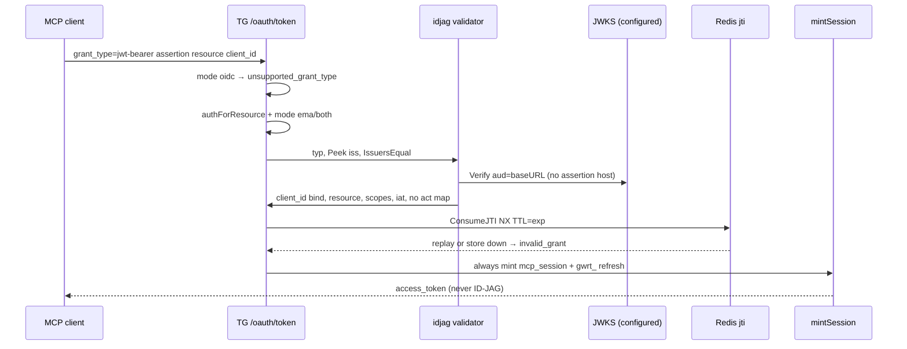

# Design: Enterprise-Managed Authorization (RUN-1112)

## Technical Approach

In-place jwt-bearer on existing `oauth2` Auth. No `TypeEMA`, no new package. ID-JAG (draft-04) vs **configured** issuer/JWKS; always `mintSession`. Approach 1 / `mcp-enterprise-managed-authorization`. Reuse RUN-1106 `IssuersEqual` + slog. Do not touch `Callback` / `validateResponseISS`. Spec may land in parallel.

## Architecture Decisions

| Decision | Options | Tradeoff | Choice |
|----------|---------|----------|--------|
| Placement | `TypeEMA` / `oauth/ema` / in-package | Fork vs one grant | Unexported `idjag.go` |
| Mode | global vs per-`OAuth2Config` | Blast vs per-IdP | `northbound_mode` empty/`oidc` (default), `ema`, `both` |
| Failed jwt-bearer | silent OIDC vs `invalid_grant` | Mix-up vs hard fail | `invalid_grant`; no fall-through |
| `ema` authorize | keep vs reject | Compat vs fail-closed | Reject authorize; keep refresh + in-flight codes |
| ID-JAG `aud` | `oauth2.audiences` vs `baseURL` | Session mix-up | `aud=baseURL`; session `aud` stays config |
| Verify path | `OAuth2TokenValidator` vs dedicated | Wrong aud + silent `oid` | Dedicated; `Verify` with `Audiences:[baseURL]` |
| Issuer | verifier exact vs `IssuersEqual` | Slash vs inbound change | Peek + `IssuersEqual`; Verify token `iss`; JWKS from **cfg** |
| Subject | `subjectOf`(`oid`) vs `iss`+`sub` | Vault key vs spec | `subject_claim` or `sub`; never silent `oid`; `authid` binds iss |
| Email | Subject vs claim vs ignore | Takeover vs no store | Session claim only; JIT `iss`+`sub`; never log |
| RoleScoper | sparse vs copy claims | Miss roles vs leak | Copy claims except `act`/`jti`/`client_id`; no `Actor` |
| Replay | none vs jti TTL | Replay vs Redis | `ConsumeJTI` `SET NX` `oauth:jti:{jti}` TTL=`exp`; fail closed |
| JWKS | assertion `iss` vs configured | SSRF vs pin | Configured https JWKS or discover **cfg.Issuer** |
| Advertise | always vs `ema`\|`both` | Cursor gap | jwt-bearer + EMA extension iff any resolved oauth2 is `ema`\|`both` |
| Audit | events vs slog | Scope | `oauth.ema.accept`/`deny` — ids only |

## Data Flow



`both` OIDC path unchanged. Failed assertion never becomes it.

## File Changes

| File | Action | Description |
|------|--------|-------------|
| `pkg/domain/auth/config.go` | Modify | `NorthboundMode`; validate `oidc`\|`ema`\|`both`; ema\|both require https JWKS or https issuer |
| `pkg/domain/auth/config_test.go` | Modify | Mode + https table tests |
| `pkg/app/oauth/idjag.go` | Create | typ, Peek+`IssuersEqual`, Verify(aud=baseURL), resource/scope/`client_id`/`iat`, slog |
| `pkg/app/oauth/idjag_test.go` | Create | typ/iss/aud/resource/scope/jti/alg/`oid`/act tables |
| `pkg/app/oauth/proxy_types.go` | Modify | `TokenRequest.Assertion`; `FlowStore.ConsumeJTI`; `CodeGrant.Claims` |
| `pkg/app/oauth/proxy.go` | Modify | jwt-bearer branch; `ema` Authorize reject; always mint; inject `OIDCVerifier` |
| `pkg/app/oauth/metadata.go` | Modify | grant + EMA extension when any auth is `ema`\|`both`; DCR grant_types |
| `pkg/api/handler/http/oauth/token_handler.go` | Modify | Read `assertion` |
| `pkg/infra/oauth/store.go` | Modify | `ConsumeJTI` `SET NX`; prefix `oauth:jti:` (additive) |
| `pkg/container/modules/api.go` | Modify | Pass existing `OIDCVerifier` into `NewAuthProxy` |
| `docs/mcp/enterprise-managed-authorization.md` | Create | IdP registers TG resource; client matrix (Cursor unconfirmed) |
| `docs/mcp/oauth-harden.md` | Modify | Point EMA at this change |

Unchanged: Google omit-iss, `Principal`, `auth_rules`, southbound, vault, inbound `subjectOf`.

## Interfaces / Contracts

```go
const (
    grantJWTBearer = "urn:ietf:params:oauth:grant-type:jwt-bearer"
    idJAGTyp       = "oauth-id-jag+jwt" // draft-04
    emaExtension   = "io.modelcontextprotocol/enterprise-managed-authorization"
)
// ConsumeJTI: SET NX; exists → invalid_grant; Redis err → invalid_grant
// Verify OIDCConfig{Issuer: tokenIss, Audiences: []string{baseURL}, JWKSURL: configured|discover(cfg.Issuer)}
```

Errors: `oidc` + jwt-bearer → `unsupported_grant_type`. Assertion fail → `invalid_grant`. Unknown form `client_id` → `invalid_client`. `ema` authorize → `access_denied`.

## Testing Strategy

| Layer | What | Approach |
|-------|------|----------|
| Unit | mode validate; typ/iss/aud/resource/scope/exp/nbf/iat/jti/HMAC/`oid`/act | `config_test.go`, `idjag_test.go` |
| Unit | `oidc` unsupported; `both` no downgrade; `ema` authorize reject + refresh OK; mint `token_use=mcp_session` | `proxy_test.go`, `metadata_test.go` |
| Infra | jti NX replay + Redis error deny | `store` tests |
| Handler | form `assertion` forwarded | `handlers_test.go` |
| E2E | Out of scope | Existing MCP tests; docs note Cursor unconfirmed |

## Migration / Rollout

No Redis rewrite. Default `oidc`. Rollout `oidc` → `both` → `ema`. Chain: (1) config+metadata (2) validator+jti+grant+mint (3) tests+docs+slog. Rollback: set `northbound_mode=oidc`; revert slices reverse-order.

## Open Questions

- None blocking. Email = claim + JIT (no account store). Mixed modes: advertise if **any** oauth2 is `ema`\|`both`; grant checks the **selected** auth.
